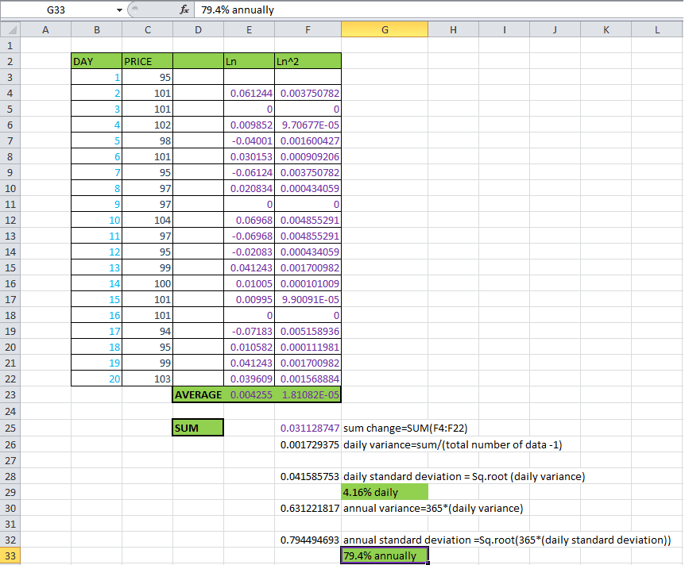

## Table of Contents

## What is historical volatility and why is it important?

Historical volatility is a measure of how much the price of a stock or other financial asset has moved up and down in the past. It looks at the changes in the price over a certain period, like a month or a year, and calculates how big those changes were. If the price moved a lot, the historical volatility is high. If the price stayed pretty steady, the historical volatility is low.

Understanding historical volatility is important because it helps investors and traders know how risky an investment might be. If a stock has high historical volatility, it means its price can change a lot in the future, which could be good or bad depending on what the investor wants. On the other hand, if a stock has low historical volatility, its price is likely to stay more stable, which might be better for someone who doesn't like taking big risks. By looking at historical volatility, people can make better decisions about which investments to choose based on their own comfort with risk.

## What data do I need to calculate historical volatility in Excel?

To calculate historical volatility in Excel, you need the historical price data of the asset you're looking at. This means you need a list of the prices of the stock or whatever you're studying, over time. Usually, you'd want daily closing prices, but you could use other time frames like weekly or monthly prices too. The more data you have, the better your calculation will be. So, if you're looking at a year's worth of data, you'd have around 252 daily prices for stocks, since there are roughly that many trading days in a year.

Once you have the price data, you'll also need to know the time frame over which you want to calculate the volatility. This could be daily, weekly, or any other period you choose. You'll use this time frame to figure out the returns, which are the percentage changes in price from one period to the next. With the returns calculated, you can then use Excel functions to find the standard deviation of these returns, which is what gives you the historical volatility. The standard deviation tells you how much the returns vary, and a higher standard deviation means higher volatility.

## How do I import stock price data into Excel?

To import stock price data into Excel, you can use the built-in feature called "Get & Transform Data" or "Power Query." First, open Excel and go to the "Data" tab. Click on "Get Data" and then choose "From Online Services" and select "From Microsoft Azure SQL Database" or "From Other Sources" depending on where your data is coming from. If you want to use a website like Yahoo Finance, you can select "From Web." Enter the URL of the stock price data page, and Excel will show you the data it can import. Choose the table with the stock prices, click "Load," and the data will appear in your Excel sheet.

Once the data is in Excel, you might need to clean it up a bit. This means making sure the dates and prices are in the right format and that you have all the data you need. You can use Excel's tools to sort the data by date, remove any unnecessary columns, and make sure everything looks right. After you've cleaned up the data, you're ready to start calculating the historical volatility using the steps we talked about before.

## What is the formula for calculating historical volatility?

To calculate historical volatility, you first need to find the daily returns of the stock. Daily returns are the percentage change in the stock's price from one day to the next. You do this by taking the natural logarithm (log) of the ratio of today's closing price to yesterday's closing price. So, if today's price is P_t and yesterday's price is P_(t-1), the return for today is log(P_t / P_(t-1)). You calculate this return for every day in your data set.

Next, you find the standard deviation of these daily returns. Standard deviation measures how spread out the numbers are. In Excel, you can use the STDEV function to do this. Once you have the standard deviation of the daily returns, you multiply it by the square root of the number of trading days in a year (usually 252 for stocks) to get the annualized historical volatility. This gives you a yearly measure of how much the stock's price has moved up and down in the past.

## How do I calculate daily returns in Excel?

To calculate daily returns in Excel, start by getting the closing prices of the stock for each day. You can find these prices online and put them into Excel. In a new column next to your prices, you'll calculate the daily return. The daily return is the percentage change from one day's closing price to the next day's closing price. To do this, take the natural logarithm (log) of today's price divided by yesterday's price. In Excel, you can use the LN function for the log. So, if today's price is in cell B2 and yesterday's price is in cell B1, the formula in the new column (let's say C2) would be =LN(B2/B1). Copy this formula down the column to calculate the return for every day.

Once you have all the daily returns calculated, you might see some numbers that are positive and some that are negative. Positive numbers mean the stock price went up that day, and negative numbers mean it went down. These returns are what you'll use to find the historical volatility. Just remember to make sure your data is in the right order, with the earliest date at the top and the latest date at the bottom, so you're always dividing the newer price by the older price.

## How do I use the LOG function to calculate logarithmic returns?

To calculate logarithmic returns in Excel, you need the daily closing prices of the stock. Let's say you have these prices in column B, starting from B1 for the first day's price and B2 for the second day's price. In a new column, say column C, you can calculate the logarithmic return for the second day by using the formula =LN(B2/B1). This formula takes the natural logarithm of the ratio of the second day's price to the first day's price. You can then copy this formula down the column to calculate the logarithmic return for each subsequent day.

Once you have all the logarithmic returns calculated, you'll see a series of numbers, some positive and some negative. Positive numbers mean the stock price went up on that day, and negative numbers mean it went down. These returns are important because they help you figure out the historical volatility of the stock. Just make sure your data is organized with the earliest date at the top and the latest date at the bottom, so you're always dividing the newer price by the older price when you use the LN function.

## What is the difference between simple and logarithmic returns?

Simple returns and logarithmic returns are two ways to measure how much a stock's price changes over time. Simple returns are calculated by taking the difference between the current price and the previous price, then dividing that by the previous price. For example, if a stock goes from $100 to $105, the simple return is (105 - 100) / 100 = 0.05 or 5%. Simple returns are easy to understand and work well for short periods, but they can be less accurate over longer periods because they don't account for compounding.

Logarithmic returns, on the other hand, use the natural logarithm to find the percentage change in price. You take the log of the ratio of the current price to the previous price. Using the same example, if a stock goes from $100 to $105, the logarithmic return is LN(105/100) = LN(1.05) ≈ 0.0488 or about 4.88%. Logarithmic returns are better for longer time periods because they can be added together across different time frames, making them easier to work with for calculating things like historical volatility. They also handle extreme price changes better, making them more stable for analysis.

## How do I apply the STDEV function to calculate standard deviation of returns?

To calculate the standard deviation of returns using the STDEV function in Excel, first make sure you have all your daily returns listed in a column. Let's say these returns are in column C, starting from C2 to the last row with data. To find the standard deviation, click on an empty cell where you want the result to appear, like D1. Then type in the formula =STDEV(C2:C последний_ряд), replacing "последний_ряд" with the number of the last row that has data. Press Enter, and Excel will show you the standard deviation of the returns in that cell.

The standard deviation tells you how much the returns vary from the average return. A higher standard deviation means the returns are spread out more, which means the stock's price is more volatile. A lower standard deviation means the returns are closer to the average, so the stock's price is more stable. This number is important because it helps you understand how risky the stock might be. Once you have the standard deviation of the daily returns, you can use it to find the annualized historical volatility by multiplying it by the square root of the number of trading days in a year, usually 252 for stocks.

## How do I annualize the volatility calculated from daily returns?

To annualize the volatility calculated from daily returns, you need to take the standard deviation of the daily returns and then multiply it by the square root of the number of trading days in a year. For stocks, we usually use 252 trading days in a year. So, if your standard deviation of daily returns is in cell D1, you would use the formula =D1*SQRT(252) in another cell to get the annualized volatility. This step makes the daily volatility number into a yearly one, which is easier to understand and compare with other stocks or investments.

The reason we use the square root of the number of trading days is because volatility scales with the square root of time. This means if you know the volatility over a shorter period, like a day, you can figure out what it would be over a longer period, like a year, by using this formula. Annualizing the volatility helps investors see how much a stock's price might move up and down over a whole year, which is important for understanding how risky it is.

## What are common time periods used for calculating historical volatility?

People often use different time periods to calculate historical volatility, depending on what they need. Some common time periods are 10 days, 30 days, 60 days, 90 days, and a full year. These periods help investors see how much a stock's price has moved up and down in the past. Shorter periods like 10 or 30 days are good for understanding recent changes, while longer periods like 90 days or a year give a bigger picture of the stock's behavior over time.

Choosing the right time period is important because it can change how risky a stock seems. If you look at a short period, the stock might seem more volatile because it focuses on recent big moves. But if you look at a longer period, the stock might seem less volatile because it averages out the ups and downs over time. So, it's good to use different time periods to get a full understanding of a stock's historical volatility.

## How can I automate the calculation of historical volatility using Excel VBA?

To automate the calculation of historical volatility in Excel using VBA, you'll first need to write a macro. Start by opening the Visual Basic Editor in Excel by pressing Alt + F11. Then, insert a new module and write a subroutine that does the following: it takes the stock prices from a specified range, calculates the daily logarithmic returns using the LN function, computes the standard deviation of these returns with the Application.WorksheetFunction.StDev function, and finally annualizes the volatility by multiplying the standard deviation by the square root of the number of trading days in a year (usually 252 for stocks). You can assign this macro to a button or run it manually whenever you need to update the volatility.

Once your macro is written, you can use it to quickly calculate historical volatility without doing all the steps by hand. Just make sure your stock price data is in the right format and in the correct range in your Excel sheet. The macro will do all the calculations automatically, saving you time and reducing the chance of making mistakes. This way, you can easily update the volatility whenever new price data comes in, helping you keep track of how risky the stock might be over time.

## How do I interpret and use historical volatility for investment decisions?

Historical volatility tells you how much a stock's price has moved up and down in the past. This is important because it helps you understand how risky the stock might be. If a stock has high historical volatility, it means its price can change a lot, which could be good if you like taking risks and want to make big profits. But it could also be bad if the price goes down a lot and you lose money. On the other hand, if a stock has low historical volatility, its price stays more stable, which might be better if you don't like taking big risks. By looking at historical volatility, you can decide if a stock fits your comfort level with risk.

When you use historical volatility to make investment decisions, you can compare it with other stocks or with the overall market. If a stock's historical volatility is higher than the market's, it might be riskier than average. This can help you decide if you want to buy it, sell it, or hold onto it. Also, you can use historical volatility to set expectations for how much a stock's price might change in the future. If you know a stock has been volatile in the past, you can prepare for bigger price swings and plan your investments accordingly. This way, historical volatility becomes a useful tool to help you make smarter choices about where to put your money.

## What is Understanding Financial Volatility?

Volatility reflects the degree of variation in an asset's price over a specified period. It is a critical measure in finance, often quantified as the standard deviation of returns. This statistical measure calculates the [dispersion](/wiki/dispersion-trading) of a set of values, indicating how much the return on an asset deviates from its average return. The formula for calculating this standard deviation $\sigma$ is:

$$

\sigma = \sqrt{\frac{1}{N-1} \sum_{i=1}^{N} (R_i - \bar{R})^2}
$$

where $R_i$ represents each individual return, $\bar{R}$ is the average return, and $N$ is the total number of returns.

Higher [volatility](/wiki/volatility-trading-strategies) denotes larger and more unpredictable price movements, presenting both opportunities for profit and risks of loss. Investors may seek to capitalize on these price swings when volatility is high, but the increased uncertainty also necessitates robust risk management strategies to protect against significant losses.

A key distinction in financial volatility lies between historical and implied volatility. Historical volatility is a backward-looking metric, calculated from past price data, and reflects the asset's actual past market fluctuations. It serves as a useful indicator of the asset's behavior and risk profile. In contrast, implied volatility is a forward-looking measure, inferred from the prices of options on the asset. It signifies the market's expectations of future volatility, helping traders assess potential future market movements and uncertainty.

Comprehending the differences between these types of volatility is essential for making informed investment decisions, as they offer unique insights into past performance and future expectations. Historical data provides a basis for assessing risk and opportunity, while implied volatility offers a glimpse into market sentiment and anticipated volatility.

## How do you calculate historical volatility in Excel?

To calculate historical volatility in Excel, one must follow a systematic approach using historical price data. This involves several key steps that harness Excel's computational capabilities for efficient financial analysis.

**Step 1: Collect Historical Closing Prices**

The first step involves gathering historical closing prices of the asset over a specific timeframe. This data can typically be extracted from financial databases or online finance portals. It is essential to maintain consistency in the timeframe, such as daily, weekly, or monthly data, depending on the analysis being conducted.

**Step 2: Calculate Daily Returns**

Once the historical prices are collected, the next step is to compute the daily returns. This is done using the formula:

$$
\text{Daily Return} = \left(\frac{\text{Today's Price}}{\text{Yesterday's Price}}\right) - 1
$$

In Excel, this can be implemented easily. Assuming your data starts from cell A2 downward with dates in column A and closing prices in column B, you would enter the following formula in cell C3 to calculate the daily return:

```excel
=(B3/B2) - 1
```

Drag this formula down the column to compute the daily returns for the entire dataset.

**Step 3: Calculate the Standard Deviation of Daily Returns**

Next, find the standard deviation of these daily returns to gauge the variability. In Excel, the `STDEV.S` function calculates the sample standard deviation:

```excel
=STDEV.S(C3:Cn)
```

Here, `Cn` represents the last cell of your daily returns data. This function gives an understanding of the asset's price movement variance.

**Step 4: Annualize the Standard Deviation**

Since financial markets usually evaluate volatility on an annual basis, the standard deviation obtained from daily returns should be annualized. The typical assumption is 252 trading days in a year due to weekends and holidays. The annualized volatility is expressed as:

$$
\text{Annualized Volatility} = \text{Standard Deviation} \times \sqrt{252}
$$

In Excel, if your standard deviation result is in cell D1, you would calculate the annualized volatility as follows:

```excel
=D1 * SQRT(252)
```

This final value represents the asset's historical volatility on an annual scale, providing insights into potential price fluctuations. By systematically calculating historical volatility, traders and analysts can better understand market dynamics and strategize accordingly.

## How can you calculate implied volatility using Excel tools?

Excel is a versatile tool capable of calculating implied volatility, an essential parameter in financial analysis and trading strategies. Implied volatility reflects the market's forecast of a stock's future volatility, often extracted using options pricing models like Black-Scholes. Here is how Excel can facilitate this complex calculation:

The Black-Scholes model is widely used to estimate implied volatility. It requires inputs such as the option's market price, the underlying asset's price, the strike price, time until expiration, risk-free [interest rate](/wiki/interest-rate-trading-strategies), and the dividend yield. The formula for the Black-Scholes option pricing model is:

$$
C = S_0N(d_1) - Xe^{-rt}N(d_2)
$$

where:
- $d_1 = \frac{\ln(S_0/X) + (r + \sigma^2/2)t}{\sigma\sqrt{t}}$
- $d_2 = d_1 - \sigma\sqrt{t}$

Here, $C$ is the call option price, $S_0$ is the current stock price, $X$ is the strike price, $r$ is the risk-free interest rate, $t$ is the time to expiration, and $\sigma$ is the volatility.

Using Excel's "Goal Seek" function, traders can estimate the implied volatility ($\sigma$). Goal Seek automates the process of finding the required level of volatility that equates the Black-Scholes theoretical price with the option's market price. This involves the following steps:

1. **Set Up the Black-Scholes Formula**: Input your initial estimates for the option parameters in Excel and set up a cell with the Black-Scholes formula to determine the theoretical price of an option.

2. **Implement Goal Seek**:
    - Navigate to the "Data" tab and select "What-If Analysis" > "Goal Seek".
    - Set the cell containing the Black-Scholes formula to match the actual market option price.
    - Specify the cell that contains the volatility ($\sigma$) as the variable to change.

3. **Execution**: Execute Goal Seek, and Excel will iterate to find the implied volatility that equates the model price with the market price.

By calculating implied volatility, you can derive insights into how the market perceives future volatility. This capability enhances strategic positioning, allowing traders to optimize decisions in volatile markets. Excel functions, in conjunction with models like Black-Scholes, provide an accessible yet powerful means to unlock valuable financial insights. For those interested in more advanced analysis, programming languages such as Python can further automate and refine this process by leveraging libraries like NumPy and SciPy for numerical techniques and optimization algorithms.

## References & Further Reading

For deeper insights into options pricing and volatility, consider works such as John C. Hull's "Options, Futures, and Other Derivatives". This comprehensive text covers essential concepts, theories, and models relating to derivatives and their role in financial markets, making it an indispensable resource for both students and professionals.

To gain practical experience with volatility calculations and harness the capabilities of Excel, several finance-focused platforms and tutorials offer step-by-step guides and practical exercises. Websites like Investopedia and Khan Academy provide foundational explanations and applications of these concepts. Furthermore, communities and forums such as Stack Exchange and financial subreddits can offer additional insights and peer support for problem-solving and optimization.

For a more hands-on approach, online Excel courses, particularly those available on platforms like Coursera and Udemy, deliver structured learning experiences that include video lectures and downloadable resources to practice financial data analysis and Excel functions. These can greatly assist in mastering the calculations of both historical and implied volatility, as covered in modules focusing on financial modeling and quantitative analysis.

Combining theoretical knowledge with practical application enhances understanding and proficiency in using Excel for volatility calculations, supporting robust financial analysis and decision-making in trading environments.

