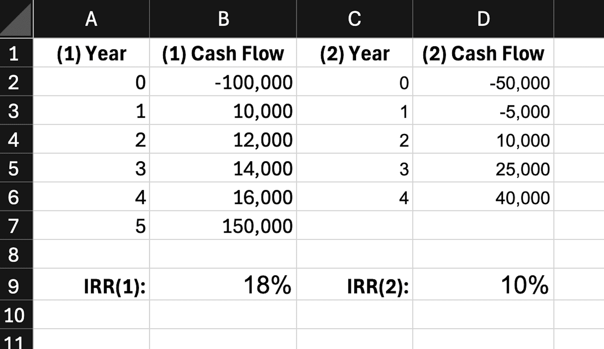

The Internal Rate of Return (IRR) is a pivotal financial metric extensively utilized to assess the potential profitability of investments. Serving as a gauge, IRR delineates the annualized expected yield or rate of return that a project or investment is anticipated to generate. When the IRR is greater than the cost of capital, it typically suggests a favorable investment opportunity.

Calculating IRR traditionally involved complex financial modeling, but modern spreadsheet software such as Google Sheets and Microsoft Excel has significantly simplified the process. Both platforms offer built-in functions to compute IRR, allowing users to effortlessly derive this metric by inputting a series of cash flows. The capability to quickly evaluate the IRR vastly enhances the financial analysis process, providing immediate insights into potential investment returns.



This article examines the utilization of the IRR within the financial sector, illustrating its computational methods in Google Sheets and Excel and its application in trading algorithms. Understanding and applying the IRR can significantly benefit individual investors and businesses alike, aiding in more informed decision-making regarding investment opportunities. The presentation of IRR results may guide strategic planning and optimize financial growth paths.

Furthermore, the IRR is not without its limitations. It assumes that all interim cash flows generated by an investment can be reinvested at the same rate, which is often not practical. To address these shortcomings, alternative measures like the Modified Internal Rate of Return (MIRR) and the Extended Internal Rate of Return (XIRR) offer more sophisticated approaches. MIRR incorporates different rates for financing and reinvestment, providing a more realistic profitability assessment. Similarly, XIRR handles irregular cash flow intervals, offering a flexible solution for real-world financial scenarios.

Ultimately, a thorough comprehension of IRR, alongside alternative metrics, empowers investors to construct a comprehensive toolkit for financial analysis, allowing for nuanced and strategic investment evaluations.

## Table of Contents

## Understanding IRR and Its Importance

The Internal Rate of Return (IRR) is a fundamental concept in financial analysis, representing the discount rate at which the Net Present Value (NPV) of all cash flows from a particular project equals zero. The formula for NPV is:

$$

NPV = \sum_{t=0}^{n} \frac{C_t}{(1 + r)^t} 
$$

where $C_t$ represents the net cash inflow during period $t$, $r$ is the discount rate (which is the IRR when NPV is zero), and $n$ is the total number of periods. When evaluating investments, the IRR offers a standardized percentage yield, making it easier to compare the potential profitability of various projects.

Despite its utility, the IRR assumption that earnings are reinvested at the same rate may not always represent real-world situations. This can lead to inaccuracies, particularly in scenarios with varying reinvestment rates. For instance, if the IRR of a project is 10%, it assumes that interim cash flows are reinvested at the same 10% rate, which might not be feasible in differing economic conditions.

Financial analysts recommend using IRR alongside other metrics, such as NPV, to obtain a more comprehensive understanding of an investment's potential. Unlike IRR, NPV provides the total value in monetary terms rather than a rate, giving a direct measure of added wealth. This combined approach helps in mitigating IRR’s limitations, providing a broader perspective for more informed decision-making. By evaluating multiple metrics, investors and businesses can better assess risk, cash flow timing, and financial performance over varying circumstances.

## Calculating IRR in Google Sheets and Excel

Both Google Sheets and Microsoft Excel provide built-in functions to calculate the Internal Rate of Return (IRR), streamlining the process for both individual investors and businesses. This metric is crucial for evaluating the profitability of investments by determining the rate at which the Net Present Value (NPV) of all cash flows from a project equals zero.

### Calculating IRR with Uniform Cash Flows

For investments with uniform, periodic cash flows, the IRR function can be employed in both Google Sheets and Excel. Here’s how you can calculate it:

1. **Enter Cash Flows**: Input your series of cash flows into consecutive cells in a column. Ensure that your initial investment is represented as a negative number (as it is an outflow), and subsequent inflows are positive.

2. **Apply the IRR Function**: Use the formula `=IRR(cashflow_range)`, substituting `cashflow_range` with the actual range of cells containing your cash flow data. This function will return the IRR based on those cash flows, assuming uniform intervals between them.

### Non-periodic Cash Flows: Using XIRR

When dealing with non-periodic cash flows, the XIRR function becomes necessary, as it accounts for the specific dates of each cash flow:

1. **List Cash Flows and Dates**: Enter your cash flows in a column and have corresponding dates for each cash flow in another column.

2. **Apply the XIRR Function**: Use the formula `=XIRR(cashflow_range, date_range)`, replacing `cashflow_range` with the cells containing the cash flows and `date_range` with the cells containing the respective dates. XIRR calculates the IRR by considering the exact timing of each cash flow, providing a more accurate reflection of investment returns over irregular periods.

### Accounting for Financing and Reinvestment Rates: Using MIRR

The Modified Internal Rate of Return (MIRR) addresses some limitations of the standard IRR by incorporating distinct finance and reinvestment rates:

1. **Enter Cash Flows**: As before, list the series of cash flows in a column.

2. **Determine Finance and Reinvestment Rates**: Decide on a finance rate (cost of funding) and a reinvestment rate (rate at which cash inflows are reinvested).

3. **Apply the MIRR Function**: Use the formula `=MIRR(cashflow_range, finance_rate, reinvest_rate)`. This function will compute the MIRR by separately addressing the costs of financing and expected reinvestment returns, offering a nuanced view of the investment's potential profitability.

In both Google Sheets and Excel, these functions provide powerful tools for analyzing investment opportunities and making informed financial decisions. However, it's crucial to understand the context and assumptions behind each function to accurately interpret the results.

## Practical Applications in Trading and Automated Investing

The Internal Rate of Return (IRR) is a versatile metric that holds significant potential for traders and investors, particularly in [algorithmic trading](/wiki/algorithmic-trading) and automated investing. By analyzing historical cash flow data, IRR can assist in evaluating the efficacy of various trading strategies. Automated trading systems, which rely on quantitative analysis, use IRR to identify and optimize the most profitable trading strategies by assessing the expected profitability of cash flows generated from trades. This approach enables traders to gauge the potential success of different strategies under dynamic market conditions.

When simulating trades, accurate cash flow projections are essential. Investors can model these cash flows to determine the IRR of a particular trade or strategy, providing a benchmark for profitability. For instance, if the calculated IRR of a trading strategy is higher than the trader's required rate of return, the strategy can be considered viable. Conversely, if the IRR falls below the benchmark, the strategy may require reevaluation or refinement.

In Python, calculating IRR for a series of cash flows can be efficiently achieved with libraries such as NumPy, which offers robust financial functions. Here is a basic example of how to compute IRR using Python and NumPy:

```python
import numpy as np

# Define cash flow series [initial investment, annual cash flows...]
cash_flows = [-10000, 2000, 3000, 4000, 5000, 6000]

# Calculate IRR
irr = np.irr(cash_flows)

# Output the result
print(f"The IRR of the trading strategy is: {irr:.2%}")
```

This code provides a straightforward method to calculate the IRR, allowing traders to incorporate this metric into their automated systems. By systematically applying IRR analysis, investors can sift through multiple strategies, selecting those that not only align with their financial goals but also hold the promise of generating sustainable returns. Furthermore, integrating IRR with other financial metrics can enhance the robustness of strategy evaluations, offering comprehensive insights into trading potential and financial performance.

## Limitations of IRR and Alternative Metrics

The Internal Rate of Return (IRR) is a popular metric for evaluating investment profitability but is not without its limitations. A primary limitation is the assumption that all future cash flows are reinvested at the IRR itself. While convenient, this assumption can overstate an investment's potential profitability, as achieving consistent reinvestment returns at the IRR is often unrealistic in dynamic financial markets. Additionally, this reinvestment assumption can bias IRR evaluations when comparing projects of varied scales or durations, potentially favoring smaller, high-return projects that might not be as sustainable or scalable.

To address these issues, financial analysts often turn to the Modified Internal Rate of Return (MIRR), which adjusts the IRR by separately considering financing costs and the reinvestment rate for future cash flows. MIRR provides a more nuanced view of project profitability, avoiding the simplistic reinvestment assumptions of IRR. The MIRR formula is:

$$
\text{MIRR} = \left( \frac{FV_{\text{positive cash flows}}}{PV_{\text{negative cash flows}}} \right)^{\frac{1}{n}} - 1
$$

where $FV_{\text{positive cash flows}}$ is the future value of positive cash flows, and $PV_{\text{negative cash flows}}$ is the present value of negative cash flows over the investment period $n$.

Another alternative metric is the Extended Internal Rate of Return (XIRR), which is particularly useful for investments with non-periodic cash flow schedules. Unlike the standard IRR, which assumes equal intervals between cash flows, XIRR accounts for the specific timing of each cash flow. This feature enables a more accurate reflection of investment performance in projects where cash flows are irregular, allowing for a precise comparison among investments with different cash flow timelines.

By integrating these alternative metrics, investors and analysts can obtain a comprehensive understanding of investment opportunities, moving beyond the basic IRR to evaluate the potential profitability with more precision and contextual awareness.

## Conclusion

The IRR functionality in Google Sheets and Excel is an essential asset in the toolkit of financial analysts and investors. It provides a quantitative measurement of an investment's potential profitability by evaluating the rate at which the net present value (NPV) of cash flows equals zero. This metric is significant for comparing diverse investment opportunities, allowing stakeholders to make decisions based on data-driven insights.

However, solely relying on IRR is insufficient for making comprehensive investment decisions. The utility of IRR is enhanced when used alongside other metrics such as the Net Present Value (NPV), Modified Internal Rate of Return (MIRR), and the Extended Internal Rate of Return (XIRR). These additional metrics help mitigate some limitations of IRR, such as its assumption of constant reinvestment rates and its inadequacy in handling variable cash flow schedules.

Investment decision-making is not only about numbers and tech but also involves qualitative evaluations that consider the broader economic context, market dynamics, and individual investment strategies. Therefore, while IRR provides a valuable foundation, it should not be the sole criterion for investment evaluation.

Excel and Google Sheets facilitate extensive financial modeling and analysis, offering tools like scenario analysis and sensitivity analysis to stress-test investment assumptions. Such capabilities enable investors to project various financial outcomes, assess risks, and develop strategies that align with their financial goals. Through detailed spreadsheet modeling, these platforms provide actionable insights that empower informed and strategic investment choices.

## FAQs

### Why is my IRR calculation not working in Excel or Google Sheets?

IRR calculations might not work in Excel or Google Sheets due to several reasons. One of the primary issues could be the incorrect entry of cash flows. Ensure your data range includes both negative and positive cash flows, as IRR cannot be calculated with values that do not cross zero. Another common issue is multiple or ambiguous rate of return solutions, which occur if the cash flow changes direction more than once. To resolve this, provide an initial guess within the IRR formula that guides the software towards finding the correct solution. For example, `=IRR(cashflow_range, guess)` where `guess` might be 0.1 (10%).

### How do I interpret the IRR results in terms of investment viability?

IRR represents the expected annual growth rate of an investment. When comparing IRR to a project’s required rate of return or cost of capital, it provides insights into investment viability. If the IRR exceeds the cost of capital, the project is typically considered viable as it promises returns above the minimum threshold necessary for it to be profitable. Conversely, if the IRR is lower, the project might not cover the necessary costs, indicating a potential rejection of the investment opportunity.

### What are common pitfalls when using IRR to evaluate investments?

A key pitfall of using IRR is its assumption that interim cash flows are reinvested at the same rate as the IRR itself. This can lead to unrealistic projections of profitability. Also, IRR can be misleading when comparing projects of different scales, as it does not consider the magnitude of investment. Additionally, for projects with non-conventional cash flow patterns, IRR could produce multiple values, making it complicated to derive a singular investment decision. To avoid these pitfalls, it is advisable to use IRR alongside other metrics like NPV, which incorporates the absolute value of cash flows.

### How can IRR be used effectively in conjunction with other financial metrics?

To effectively utilize IRR, it should be used alongside other financial metrics to provide a more comprehensive analysis. For instance, Net Present Value (NPV) complements IRR by considering the value of money over time and providing the absolute value of returns, which IRR alone cannot. Furthermore, Modified Internal Rate of Return (MIRR) can address IRR’s limitations by considering differing reinvestment rates. Together, IRR, NPV, and MIRR can offer a balanced view of an investment’s potential, enabling better decision-making.

### Are there scenarios where IRR is more appropriate than other metrics?

IRR is particularly useful in scenarios where a quick evaluation of an investment's efficiency or profitability is needed, especially when comparing multiple projects of similar size and duration. It provides a straightforward percentage return, simplifying the comparison process. For projects with stable and conventional cash flows, IRR gives clear insights. Additionally, it is appropriate in situations where project lifespans are indefinite, as IRR does not require a terminal value or end date for cash flows, unlike some other measures.

## References & Further Reading

[1]: ["Introduction to the Internal Rate of Return (IRR): Calculations & Applications."](https://www.investopedia.com/terms/i/irr.asp) CFA Institute.

[2]: Bodie, Z., Kane, A., & Marcus, A. J. (2014). ["Investments."](https://www.mheducation.com/highered/product/investments-bodie-kane/M9781264412662.html) McGraw-Hill Education.

[3]: Damodaran, A. (2012). ["Investment Valuation: Tools and Techniques for Determining the Value of Any Asset."](https://books.google.com/books/about/Investment_Valuation.html?id=5SRHAAAAQBAJ) Wiley Finance.

[4]: Brealey, R. A., Myers, S. C., & Allen, F. (2011). ["Principles of Corporate Finance."](https://www.mheducation.com/highered/product/Principles-of-Corporate-Finance-Brealey.html) McGraw-Hill/Irwin.

[5]: Fabozzi, F. J., & Peterson, P. P. (2003). ["Financial Management and Analysis."](https://books.google.com/books/about/Financial_Management_and_Analysis.html?id=NBeyfpHg1boC) Wiley.

[6]: ["Google Sheets Function List."](https://support.google.com/docs/table/25273?hl=en) Google Support. 

[7]: ["Excel Functions (by Category): Financial Functions."](https://support.microsoft.com/en-us/office/excel-functions-by-category-5f91f4e9-7b42-46d2-9bd1-63f26a86c0eb) Microsoft Support.