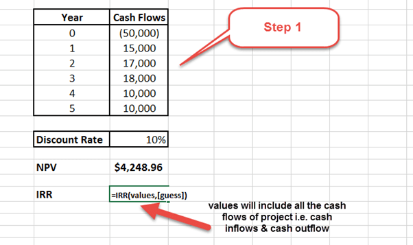

## Table of Contents

## What is the Internal Rate of Return (IRR) and why is it important?

The Internal Rate of Return (IRR) is a way to figure out how well an investment might do over time. It's like a special percentage that shows the average yearly profit you can expect from your investment. To find the IRR, you look at all the money you put in and all the money you get back, and then you calculate the rate that makes the total value of the investment equal to zero. It's a bit like trying to balance a scale, where the money going in and the money coming out need to be equal.

IRR is important because it helps you compare different investments easily. If you're trying to decide between putting your money into a new business or buying some stocks, you can use the IRR to see which one might give you a better return. A higher IRR means the investment could be more profitable. It's a useful tool for making smart choices about where to put your money, especially when you're looking at projects or investments that will last for several years.

## How can IRR be used in financial decision-making?

IRR is a helpful tool when you need to decide where to put your money. It tells you the average yearly profit you can expect from an investment. By comparing the IRR of different options, like buying a new machine for your business or investing in real estate, you can see which one might give you more money back over time. If one investment has a higher IRR than another, it usually means it's a better choice because it's expected to be more profitable.

However, IRR isn't perfect and shouldn't be the only thing you look at. Sometimes, an investment with a lower IRR might be safer or fit better with your overall plans. It's also important to think about how long you'll have your money tied up in the investment. If two investments have the same IRR, but one takes longer to pay off, you might prefer the one that gives you your money back sooner. So, while IRR is a great starting point for comparing investments, you should always consider other factors too.

## What are the basic steps to calculate IRR in Excel?

To calculate the Internal Rate of Return (IRR) in Excel, you start by listing all the cash flows of your investment in a column. The first number is usually the initial investment, which is negative because you're spending money. After that, you list all the money you expect to get back each year, which are positive numbers. Once you have all your cash flows entered, you use the IRR function. In an empty cell, type "=IRR(" and then select the range of cells that contain your cash flows. Close the parentheses and press Enter. Excel will then calculate the IRR for you.

Sometimes, Excel might not be able to find the IRR right away. If that happens, you can give it a guess to help it out. You do this by adding a second argument to the IRR function, like "=IRR(A1:A5, 0.1)" if you think the IRR might be around 10%. This can help Excel find the right answer. Remember, the IRR is the rate that makes the total value of your investment equal to zero, so it's a useful number to know when you're deciding where to put your money.

## What Excel function should I use to calculate IRR?

To calculate the Internal Rate of Return (IRR) in Excel, you need to use the IRR function. This function helps you figure out the average yearly profit from an investment. First, list all the cash flows of your investment in a column. The first number is usually the initial investment, which you write as a negative number because you're spending money. Then, add all the money you expect to get back each year, which are positive numbers. Once you have your cash flows entered, in an empty cell, type "=IRR(" and select the range of cells with your cash flows. Close the parentheses and hit Enter. Excel will then calculate the IRR for you.

Sometimes, Excel might have trouble finding the IRR right away. If that happens, you can help it by giving it a guess. You do this by adding another number to the IRR function, like "=IRR(A1:A5, 0.1)" if you think the IRR might be around 10%. This guess can help Excel find the right answer. Remember, the IRR is the rate that makes the total value of your investment equal to zero, so it's a useful number to know when deciding where to put your money.

## How do I set up my cash flow data in Excel for IRR calculation?

To set up your cash flow data in Excel for calculating the Internal Rate of Return (IRR), start by opening a new Excel spreadsheet. In the first column, list all the cash flows related to your investment. The first number should be the initial investment, which you enter as a negative number because it's money you're spending. For example, if you invest $10,000, you would enter -10000 in the first cell. After that, list all the money you expect to get back each year as positive numbers. For instance, if you expect to receive $3,000 at the end of the first year, enter 3000 in the next cell.

Once you have all your cash flows entered, make sure they are in a single column without any gaps. This makes it easier for Excel to calculate the IRR. If you have cash flows for several years, just keep adding them in the cells below, one for each year. For example, your column might look like this: -10000 in cell A1, 3000 in cell A2, 4000 in cell A3, and so on. After setting up your data, you can then use the IRR function in an empty cell to calculate the Internal Rate of Return.

## What are common errors to watch out for when calculating IRR in Excel?

When you're calculating the Internal Rate of Return (IRR) in Excel, one common mistake is not entering your cash flows correctly. Make sure the initial investment is a negative number because it's money you're spending, and all the money you get back should be positive numbers. If you mix up the signs or leave out a cash flow, your IRR calculation will be wrong. Also, be careful to enter all your cash flows in one column without any gaps. If there are empty cells in the middle, Excel might not calculate the IRR properly.

Another error to watch out for is when Excel can't find the IRR because the cash flows don't have a clear IRR solution. This can happen if your cash flows are unusual or if there are multiple IRRs. If you see an error message like "#NUM!", try giving Excel a guess by adding a second number to the IRR function, like "=IRR(A1:A5, 0.1)" if you think the IRR might be around 10%. This can help Excel find the right answer. Remember, the IRR is the rate that makes the total value of your investment equal to zero, so getting it right is important for making good financial decisions.

## How can I verify the accuracy of the IRR calculated in Excel?

To check if the IRR calculated in Excel is right, you can use another Excel function called NPV (Net Present Value). The IRR is the rate that makes the NPV of your cash flows equal to zero. So, if you take the IRR that Excel gives you and use it in the NPV function with your cash flows, the result should be very close to zero. For example, if your IRR is 10%, you can type "=NPV(0.1, A2:A5) + A1" in a cell, where A1 is your initial investment and A2:A5 are your future cash flows. If the result is close to zero, then your IRR is probably correct.

Another way to make sure your IRR is accurate is to use a financial calculator or another software program that calculates IRR. You can enter the same cash flows into the calculator or program and see if you get the same IRR as Excel. If the numbers match, you can feel more confident that your Excel calculation is right. Sometimes, small differences can happen because of how each tool rounds numbers, but if the IRRs are very different, you should double-check your cash flows in Excel to make sure they are entered correctly.

## What are the limitations of using Excel's IRR function?

One limitation of using Excel's IRR function is that it might not work correctly if your cash flows are unusual. For example, if you have a lot of ups and downs in your cash flows, or if you get money back at different times, Excel might struggle to find the right IRR. It could even give you an error message if it can't find a solution. Sometimes, there might be more than one IRR for the same set of cash flows, which can be confusing. If you run into these problems, you might need to give Excel a guess to help it find the right answer, but even then, it's not always guaranteed to work.

Another issue is that Excel's IRR function assumes you will reinvest any money you get back at the same rate as the IRR. This might not be realistic because you might not be able to find another investment with the same return. Also, the IRR doesn't tell you anything about how risky an investment might be. Two investments could have the same IRR, but one could be much riskier than the other. So, while the IRR is a useful tool, it's important to look at other things too, like how long your money will be tied up and how safe the investment is.

## How does Excel handle multiple IRRs for non-conventional cash flows?

When you have non-conventional cash flows, like money coming in and out at different times, Excel might find more than one IRR. This happens because the IRR is the rate that makes the total value of your investment equal to zero, and sometimes there can be more than one rate that does this. If Excel finds multiple IRRs, it will usually give you the first one it finds, but it won't tell you about the others. This can be confusing because you might not know if there's a better IRR out there.

To deal with this, you can use the IRR function with a guess to help Excel find a different IRR. For example, if you think there might be another IRR around 5%, you can type "=IRR(A1:A5, 0.05)" to see if Excel finds a different rate. But even with a guess, Excel might still miss some IRRs or give you an error if it can't find any solution at all. So, when you're working with tricky cash flows, it's a good idea to double-check your results with other tools or methods to make sure you're getting the full picture.

## Can I use Excel to calculate the Modified Internal Rate of Return (MIRR)? If so, how?

Yes, you can use Excel to calculate the Modified Internal Rate of Return (MIRR). To do this, you need to use the MIRR function. First, list all your cash flows in a column, starting with the initial investment as a negative number, followed by the money you expect to get back each year as positive numbers. Then, in an empty cell, type "=MIRR(" and select the range of cells with your cash flows. After that, you need to add two more numbers: the finance rate, which is the rate you pay to borrow money, and the reinvestment rate, which is the rate you can earn by reinvesting the money you get back. For example, if your finance rate is 5% and your reinvestment rate is 10%, you would type "=MIRR(A1:A5, 0.05, 0.1)". Press Enter, and Excel will give you the MIRR.

The MIRR is different from the regular IRR because it takes into account the cost of borrowing money and the rate at which you can reinvest your returns. This makes it a more realistic measure of an investment's profitability. The regular IRR assumes you can reinvest all your money at the same rate as the IRR, which might not be possible. By using the MIRR, you get a better idea of what your investment might really earn, considering both the cost of money and how you can use the money you get back.

## How can I automate IRR calculations for multiple projects in Excel?

To automate IRR calculations for multiple projects in Excel, start by setting up your data in a clear and organized way. List each project in a separate row, with the initial investment and all future cash flows for each project in columns next to it. Make sure to enter the initial investment as a negative number and all future cash flows as positive numbers. Then, in a new column, use the IRR function to calculate the IRR for each project. For example, if your first project's cash flows are in cells B2 to G2, you can type "=IRR(B2:G2)" in the cell next to it to get the IRR. Repeat this formula for all your projects, adjusting the cell references as needed.

After setting up the formulas, you can easily update the IRRs for all projects by changing the cash flow numbers. If you add new projects or update existing ones, the IRRs will automatically recalculate. This makes it simple to compare different projects and see which ones might give you the best return on your investment. Remember, if you run into any issues with the IRR function, like getting an error message, you might need to give Excel a guess by adding another number to the IRR function, like "=IRR(B2:G2, 0.1)" if you think the IRR might be around 10%. This can help Excel find the right answer for each project.

## What advanced techniques can I use in Excel to analyze IRR sensitivity to changes in cash flows?

To analyze how sensitive the Internal Rate of Return (IRR) is to changes in cash flows in Excel, you can use a technique called sensitivity analysis. This involves changing one or more cash flows to see how the IRR changes. You can do this by setting up a table where you list different possible values for a cash flow in one column and then use the IRR function next to each value to see what the IRR would be. For example, if you're not sure about the cash flow in year three, you can list different amounts for that year and see how the IRR changes. This helps you understand how much the IRR might go up or down if your cash flow predictions are off.

Another way to do sensitivity analysis is by using Excel's data table feature. This allows you to quickly see how the IRR changes with different cash flow scenarios without having to rewrite the IRR formula each time. To set this up, first, put your original cash flows and IRR calculation in one part of your spreadsheet. Then, create a data table where you list different values for the cash flow you want to test in one column. In the cell next to the first value, reference the cell with the original IRR calculation. Then, use the data table tool to fill in the rest of the table, showing you how the IRR changes with each different cash flow value. This gives you a clear picture of how sensitive your IRR is to changes in your cash flow predictions.

## What is the Understanding of Internal Rate of Return (IRR)?

The Internal Rate of Return (IRR) is a critical financial metric used to evaluate the profitability of potential investments. It represents the discount rate at which the net present value (NPV) of future cash flows from an investment equals zero. The IRR can be thought of as the break-even [interest rate](/wiki/interest-rate-trading-strategies), providing a means to assess the attractiveness of various projects or investments.

To calculate the IRR, financial analysts solve for the rate $r$ in the equation:

$$

\sum_{t=0}^{n} \frac{C_t}{(1+r)^t} = 0 
$$

where $C_t$ represents the cash flow at time $t$ and $n$ is the total number of time periods.

IRR serves as a pivotal tool in assessing investment profitability. By comparing the IRR to an entity's required rate of return or hurdle rate, investors can determine whether an investment is expected to generate a satisfactory return. If the IRR exceeds the required rate of return, the investment can be considered viable, as it promises to yield returns above the cost of capital.

Despite its utility, the IRR also has limitations and should not be the sole decision-making tool. One major shortcoming is that it assumes the reinvestment of interim cash flows at the same rate as the IRR, which might not be practical. Furthermore, projects with non-conventional cash flow patterns could result in multiple IRRs, making it challenging to draw clear conclusions. Therefore, while IRR is informative, it is often best used in conjunction with other financial metrics such as NPV, Modified Internal Rate of Return (MIRR), and Payback Period for a comprehensive investment evaluation.

## References & Further Reading

[1]: ["Algorithmic Trading: Winning Strategies and Their Rationale"](https://www.amazon.com/Algorithmic-Trading-Winning-Strategies-Rationale-ebook/dp/B00CY5HC0U) by Ernest P. Chan

[2]: ["Financial Modeling"](https://www.investopedia.com/terms/f/financialmodeling.asp) by Simon Benninga

[3]: ["Python for Finance: Analyze Big Financial Data"](https://books.google.com/books/about/Python_for_Finance.html?id=E93SBQAAQBAJ) by Yves Hilpisch

[4]: ["Quantitative Trading: How to Build Your Own Algorithmic Trading Business"](https://www.amazon.com/Quantitative-Trading-Build-Algorithmic-Business/dp/1119800064) by Ernest P. Chan

[5]: ["Advances in Financial Machine Learning"](https://www.amazon.com/Advances-Financial-Machine-Learning-Marcos/dp/1119482089) by Marcos Lopez de Prado