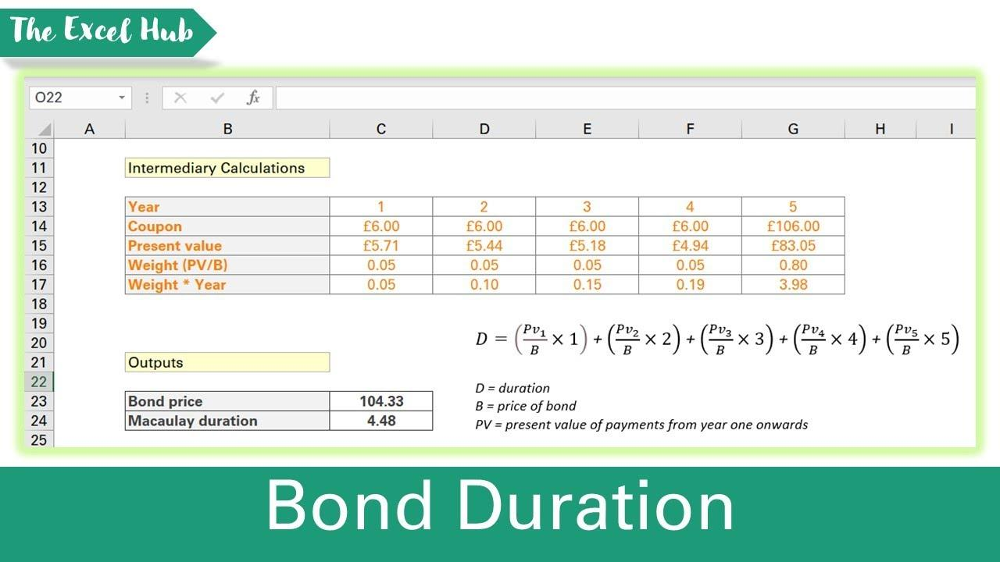

## Table of Contents

## What is Macaulay Duration and why is it important?

Macaulay Duration is a measure used in finance to understand how long it will take for the price of a bond to be repaid by its cash flows. It's named after Frederick Macaulay, who came up with the idea. Imagine you lend money to someone and they promise to pay you back over time. Macaulay Duration tells you the average time you have to wait to get all your money back, considering both the interest payments and the final repayment of the bond's face value.

This measure is important because it helps investors understand the risk of their bond investments. If a bond has a longer Macaulay Duration, it means the investor has to wait longer to get their money back, which can be riskier, especially if interest rates change. For example, if interest rates go up, the price of a bond with a longer duration will drop more than one with a shorter duration. By knowing the Macaulay Duration, investors can better manage their portfolios and make more informed decisions about which bonds to buy or sell.

## What are the prerequisites for calculating Macaulay Duration in Excel?

To calculate Macaulay Duration in Excel, you need to have some basic information about the bond. This includes the bond's coupon rate, which is the interest the bond pays, the bond's face value, which is the amount you get back when the bond matures, and the bond's yield to maturity, which is the total return you expect if you hold the bond until it matures. You also need to know the frequency of the coupon payments, like if they are paid yearly, semi-annually, or quarterly, and the time to maturity, which is how long until the bond pays back its face value.

Once you have this information, you can use Excel's built-in functions to help with the calculation. You'll need to set up a spreadsheet where you list out each coupon payment and the final face value payment, along with the time period for each payment. Then, you can use Excel formulas to calculate the present value of each cash flow and the weighted average time to receive these cash flows, which is the Macaulay Duration. It might sound complicated, but with the right setup, Excel makes it easier to do these calculations.

## How do you set up your Excel sheet to calculate Macaulay Duration?

To set up your Excel sheet for calculating Macaulay Duration, start by listing the bond's details at the top of your sheet. Include the face value, the coupon rate, the yield to maturity, the number of coupon payments per year, and the total number of periods until the bond matures. Below these details, create columns for the time periods, the cash flows, the present value of each cash flow, and the weighted time. The time periods column should start from 1 and go up to the total number of periods. The cash flows column should have the coupon payments for each period, with the final period including both the coupon payment and the face value.

Next, calculate the present value of each cash flow using Excel's PV function, which takes into account the yield to maturity and the timing of each payment. In the weighted time column, multiply the time period by the present value of the cash flow for that period. Finally, to find the Macaulay Duration, sum up all the values in the weighted time column and divide by the sum of all the present values of the cash flows. This gives you the average time it takes to get your money back, which is the Macaulay Duration.

## What formula is used to calculate Macaulay Duration?

The formula for calculating Macaulay Duration is a way to find out the average time it takes to get all your money back from a bond. You do this by adding up all the times each payment is made, but you need to make each time important based on how much money you get at that time. So, you multiply each time by the present value of the payment you get at that time. The present value means how much that future payment is worth today, considering the interest rate. After you've done that for all the payments, you add up all these "weighted times" and then divide by the total of all the present values of all the payments.

This formula looks like this: Macaulay Duration = (Σ(t * PV(CFt)) / ΣPV(CFt)), where t is the time period of each payment, PV(CFt) is the present value of the cash flow at time t, and Σ means you add up all the values. It's a bit like figuring out the average age of a group of people, but instead of people, you're dealing with money coming in at different times. This helps you understand how long you have to wait to get your money back, which is really useful for deciding if a bond is a good investment or not.

## How do you input bond cash flows and time periods into Excel?

To input bond cash flows and time periods into Excel, start by listing the bond's details at the top of your sheet. Include the face value, the coupon rate, the yield to maturity, the number of coupon payments per year, and the total number of periods until the bond matures. Below these details, create a table with columns for the time periods and the cash flows. The time periods column should start from 1 and go up to the total number of periods. For the cash flows column, enter the coupon payment for each period. Remember, the final period's cash flow should include both the coupon payment and the face value of the bond.

For example, if you have a bond with a $1,000 face value, a 5% annual coupon rate, paid semi-annually, and a yield to maturity of 6% that matures in 5 years, you would have 10 periods. In your Excel sheet, the time periods column would go from 1 to 10. The cash flows column would have $25 (which is half of the 5% coupon rate times the $1,000 face value) for periods 1 through 9, and $1,025 (the $25 coupon plus the $1,000 face value) for period 10. This setup helps you organize the data needed to calculate the Macaulay Duration and understand the bond's cash flow timing.

## How can you use Excel functions to automate the calculation of Macaulay Duration?

To automate the calculation of Macaulay Duration in Excel, start by setting up your sheet with the bond's details like face value, coupon rate, yield to maturity, and the number of periods. Then, create columns for time periods and cash flows. For each period, enter the time in one column and the cash flow in another. The cash flow is the coupon payment for each period, with the last period including the coupon and the face value. Next, use the PV function to calculate the present value of each cash flow. For example, if your cash flow is in cell B2, the time period in A2, and your yield to maturity in a cell like D1, you can use the formula `=PV(D1, A2, 0, -B2)` to find the present value of that cash flow.

After calculating the present values, you need to find the weighted times. Multiply each time period by its corresponding present value. This can be done with a simple formula like `=A2*C2` if your time period is in A2 and the present value in C2. Sum up all these weighted times and divide by the sum of all the present values to get the Macaulay Duration. You can use Excel's SUM function to add up the values in the columns. For example, if your weighted times are in column D and present values in column C, the Macaulay Duration can be calculated with `=SUM(D2:D11)/SUM(C2:C11)`. This way, Excel does all the hard work for you, making it easy to see how long it takes to get your money back from the bond.

## What are common mistakes to avoid when calculating Macaulay Duration in Excel?

When you're figuring out Macaulay Duration in Excel, one common mistake is getting the timing of the cash flows wrong. Remember, if your bond pays coupons yearly, you count each year as one period. But if it's semi-annual, you need to count each six months as a period. Also, don't forget to add the face value to the last coupon payment. If you mess up the timing or forget the face value, your numbers won't be right.

Another mistake to watch out for is using the wrong yield to maturity in your present value calculations. The yield to maturity is what you use to find out how much each future payment is worth today. If you use the wrong number, all your present values will be off, and so will your Macaulay Duration. So, always double-check that you're using the correct yield to maturity in your formulas.

## How does the frequency of coupon payments affect the calculation of Macaulay Duration?

The frequency of coupon payments plays a big role in calculating Macaulay Duration. This is because Macaulay Duration measures how long it takes to get all your money back from a bond, and the timing of those payments matters. If a bond pays coupons more often, like every six months instead of once a year, you get your money back a bit faster overall. This means the Macaulay Duration will be shorter for bonds with more frequent coupon payments because you're getting those payments sooner.

For example, if you have a bond that pays coupons every year and another that pays every six months, even if they have the same total coupon amount and face value, the one with semi-annual payments will have a shorter Macaulay Duration. This is because you're getting half the coupon payment every six months instead of waiting a whole year for the full amount. So, when you're figuring out Macaulay Duration, you need to pay close attention to how often the bond pays its coupons, as it can make a big difference in the final number.

## Can you adjust the Macaulay Duration calculation for different compounding frequencies in Excel?

Yes, you can adjust the Macaulay Duration calculation in Excel to account for different compounding frequencies. Compounding frequency refers to how often the interest on your bond is calculated and added to the bond's value. For example, if your bond compounds semi-annually, you need to adjust your calculations to reflect that the interest is added every six months instead of once a year. To do this in Excel, you'll need to change the number of periods and adjust the yield to maturity to match the compounding frequency. If your bond pays coupons semi-annually, you would double the number of periods and use the semi-annual yield to maturity in your present value calculations.

When setting up your Excel sheet, you'll list the bond's details like face value, coupon rate, and yield to maturity. Then, you create columns for time periods and cash flows. For a bond with semi-annual coupons, you'd list the time periods as 0.5, 1, 1.5, and so on, up to the bond's maturity. The cash flows would include the semi-annual coupon payments, with the last period including both the coupon and the face value. To calculate the present value of each cash flow, you'd use the semi-annual yield to maturity in the PV function. By doing this, you ensure that your Macaulay Duration calculation correctly reflects the timing of the bond's cash flows based on its compounding frequency.

## How do you verify the accuracy of your Macaulay Duration calculation in Excel?

To check if your Macaulay Duration calculation in Excel is right, you can use a few simple steps. First, make sure all your numbers are correct. Double-check the bond's face value, coupon rate, yield to maturity, and how often the coupons are paid. If any of these numbers are wrong, your Macaulay Duration will be off. Also, look at your formulas to make sure they're set up right. The present value of each cash flow should be calculated using the correct yield to maturity, and the weighted times should be the time period multiplied by the present value of the cash flow for that period.

Another way to verify your calculation is to compare it with a financial calculator or an online tool that calculates Macaulay Duration. If the numbers are close, you're probably on the right track. If they're very different, go back and check your work. Sometimes, small mistakes in setting up the time periods or forgetting to include the face value in the last period can cause big errors. By carefully reviewing your inputs and formulas, and comparing your results with other tools, you can feel confident that your Macaulay Duration calculation in Excel is accurate.

## What advanced Excel features can enhance the calculation of Macaulay Duration?

To make your Macaulay Duration calculation in Excel easier and more accurate, you can use some advanced features. One helpful tool is the 'Data Table' feature. This lets you quickly see how changing the yield to maturity or the coupon rate affects the Macaulay Duration. By setting up a data table, you can enter different values for these variables and Excel will show you the results without having to change your formulas each time. This can save you a lot of time and help you understand how sensitive your bond's duration is to changes in market conditions.

Another useful feature is 'Solver,' which can help you find the Macaulay Duration if you're not sure about some of the bond's details. Solver can adjust variables like the yield to maturity to match a target Macaulay Duration. This is really handy if you're trying to match a bond's duration to a specific investment goal. By using these advanced Excel tools, you can make your calculations more efficient and gain deeper insights into how different factors impact your bond's Macaulay Duration.

## How can Macaulay Duration be used in portfolio management and what Excel tools support this?

Macaulay Duration helps people who manage money to understand how long it will take to get their money back from bonds. It's like knowing how long you have to wait before you see all your money again. If you're managing a bunch of bonds, you want to know the average time it takes to get your money back from all of them together. This helps you see if your bond investments match up with your plans. For example, if you need your money back in 5 years, you'd pick bonds with a Macaulay Duration close to that time.

In Excel, you can use tools like Data Tables to see how changes in things like interest rates affect the Macaulay Duration of your bonds. This is really helpful because it lets you play around with different numbers without having to redo all your work. Another cool tool is Solver, which can help you find the right mix of bonds to get the Macaulay Duration you want. By using these tools, you can make smart choices about which bonds to buy or sell to keep your investment goals on track.

## What is Macaulay Duration and how is it understood?

Macaulay Duration is a fundamental concept in bond investment, serving as a measure of the weighted average time required to receive the cash flows from a bond. By calculating Macaulay Duration, investors gain insight into how a bond’s price sensitivity is influenced by changes in interest rates. The longer the duration, the more sensitive the bond is to interest rate fluctuations. This is because longer durations imply that most of the bond’s cash flows are received further in the future, making their present value more affected by changes in interest rates.

Macaulay Duration differs from modified duration in its approach. While modified duration directly incorporates yield changes to ascertain interest rate risk, Macaulay Duration focuses solely on time-weighted cash flows, without direct consideration of yield [volatility](/wiki/volatility-trading-strategies). Consequently, it is frequently used as a stepping stone before further adjusting for yield when determining modified duration.

The concept was introduced by economist Frederick Macaulay in 1938, providing a structured method to evaluate bond price interest rate risk. For example, the Macaulay Duration (D) can be mathematically represented using the formula:

$$

D = \frac{\sum_{t=1}^n \left( \frac{C_t}{(1+y)^t} \times t \right)}{\sum_{t=1}^n \frac{C_t}{(1+y)^t}} 
$$

In this equation, $C_t$ represents the cash flow in period $t$, $y$ is the yield to maturity, and $n$ is the total number of periods until maturity. The numerator calculates the sum of time-weighted present values, while the denominator sums the present values themselves.

Grasping Macaulay Duration empowers investors to tailor their bond portfolios effectively. By understanding the sensitivity of bonds to [interest rate](/wiki/interest-rate-trading-strategies) changes, investors can strategically select bonds that align with their risk preferences and expectations for future rate environments. This understanding aids in managing interest rate risk and enhancing portfolio returns over time.

## How do you perform a step-by-step calculation of Macaulay Duration in Excel?

To calculate Macaulay Duration in Microsoft Excel, follow these methodical steps to ensure precision and applicability in trading algorithms:

1. **Calculate the Present Value (PV) of Each Cash Flow**:  
   The PV of each cash flow can be determined using Excel’s PV function. This function requires the interest rate (yield per period), the period number, and the cash flow amount. The formula in Excel should look like this:
$$
   \text{PV} = \text{PV}(\text{rate}, \text{nper}, \text{pmt}, \text{[fv]}, \text{[type]})

$$
   Each cash flow is considered separately through this function, considering the bond's coupon payments and principal repayment.

2. **Determine the Weight of Each Cash Flow**:  
   Compute the weight by dividing the PV of each individual cash flow by the total present value of all cash flows. This is calculated as:
$$
   \text{Weight}_i = \frac{\text{PV}_i}{\sum \text{PV}}

$$
   where $\text{PV}_i$ is the present value of the $i^{th}$ cash flow, and $\sum \text{PV}$ is the total present value of all cash flows.

3. **Multiply Each Weight by Its Respective Time Period**:  
   For each cash flow, multiply its weight by the time period at which the cash flow occurs. This yields the weighted time for each cash flow:
$$
   \text{Weighted Time}_i = \text{Weight}_i \times \text{Time Period}_i

$$

4. **Sum the Weighted Periods to Obtain Macaulay Duration**:  
   To arrive at the Macaulay Duration, sum up all weighted times:
$$
   \text{Macaulay Duration} = \sum (\text{Weighted Time}_i)

$$
   This is reflected in Excel by summing all cells that contain the individual weighted times.

This procedure facilitates precise calculations, serving a crucial role in [algorithmic trading](/wiki/algorithmic-trading) by providing accurate measures of bond price sensitivity to interest rate changes. Proactively updating these calculations as market conditions evolve ensures robust and adaptable trading strategies.

## References & Further Reading

[1]: Fabozzi, F. J. (2007). ["Fixed Income Analysis."](https://books.google.com/books/about/Fixed_Income_Analysis.html?id=lujLawVLS3YC) Wiley.

[2]: Tuckman, B., & Serrat, A. (2011). ["Fixed Income Securities: Tools for Today's Markets."](https://www.amazon.com/Fixed-Income-Securities-Todays-Markets/dp/0470891696) Wiley.

[3]: Brigham, E. F., & Ehrhardt, M. C. (2013). ["Financial Management: Theory & Practice."](https://archive.org/details/financialmanagem0000brig_x8m8) Cengage Learning.

[4]: Bodie, Z., Kane, A., & Marcus, A. J. (2014). ["Investments."](https://www.mheducation.com/highered/product/Investments-Bodie.html) McGraw-Hill Education.

[5]: Hull, J. C. (2015). ["Options, Futures, and Other Derivatives."](https://www.semanticscholar.org/paper/Options%2C-Futures%2C-and-Other-Derivatives-Hull/89bdee500c8623864fc9eb7a471546aa713acc44) Pearson.