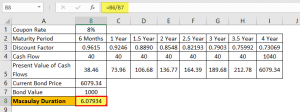

In the world of bond investment, understanding the dynamics of bond duration is crucial for both novice and seasoned investors. Duration is a crucial metric that captures how the price of a bond will change in response to interest rate fluctuations. This article focuses specifically on Macaulay Duration, an essential measure used to assess bond price sensitivity by calculating the weighted average time to receive a bond's cash flows. This concept plays a fundamental role in assessing interest rate risk and is indispensable for investment strategies focused on managing bond portfolios.

Macaulay Duration is named after economist Frederick Macaulay, who introduced it in 1938. It provides investors with insights that are particularly valuable for those employing algorithmic trading strategies, where precision and data-driven analysis are paramount. By understanding how to calculate this duration, investors can better anticipate changes in bond prices and strategically position their portfolios to optimize returns while managing risk.



This article will guide you through the straightforward process of calculating Macaulay Duration using Microsoft Excel. Excel's array of functions, particularly those for financial calculations, allows investors to perform detailed bond analysis with high accuracy. By leveraging these tools, investors can calculate duration efficiently, helping them to quickly adapt to market changes and refine their investment strategies. The insights into Macaulay Duration offered here are not only beneficial for manual analysis but also serve as a foundational component when developing algorithmic trading models, facilitating enhanced risk management and strategic planning. Understanding and applying Macaulay Duration through Excel provides a powerful advantage in navigating the complexities of bond investment.

## Table of Contents

## Understanding Macaulay Duration

Macaulay Duration is a fundamental concept in bond investment, serving as a measure of the weighted average time required to receive the cash flows from a bond. By calculating Macaulay Duration, investors gain insight into how a bond’s price sensitivity is influenced by changes in interest rates. The longer the duration, the more sensitive the bond is to interest rate fluctuations. This is because longer durations imply that most of the bond’s cash flows are received further in the future, making their present value more affected by changes in interest rates.

Macaulay Duration differs from modified duration in its approach. While modified duration directly incorporates yield changes to ascertain interest rate risk, Macaulay Duration focuses solely on time-weighted cash flows, without direct consideration of yield volatility. Consequently, it is frequently used as a stepping stone before further adjusting for yield when determining modified duration.

The concept was introduced by economist Frederick Macaulay in 1938, providing a structured method to evaluate bond price interest rate risk. For example, the Macaulay Duration (D) can be mathematically represented using the formula:

$$

D = \frac{\sum_{t=1}^n \left( \frac{C_t}{(1+y)^t} \times t \right)}{\sum_{t=1}^n \frac{C_t}{(1+y)^t}} 
$$

In this equation, $C_t$ represents the cash flow in period $t$, $y$ is the yield to maturity, and $n$ is the total number of periods until maturity. The numerator calculates the sum of time-weighted present values, while the denominator sums the present values themselves.

Grasping Macaulay Duration empowers investors to tailor their bond portfolios effectively. By understanding the sensitivity of bonds to [interest rate](/wiki/interest-rate-trading-strategies) changes, investors can strategically select bonds that align with their risk preferences and expectations for future rate environments. This understanding aids in managing interest rate risk and enhancing portfolio returns over time.

## Setting Up Excel for Duration Calculation

To effectively calculate Macaulay Duration in Excel, begin by methodically organizing your data. This organization is crucial for clarity and precision in analysis. Key inputs required for calculating Macaulay Duration are the coupon rate, yield, time to maturity, and face value of the bond. Arranging these data points in an Excel spreadsheet allows for systematic computation.

1. **Data Arrangement**: First, create columns for each key input. A typical layout might involve four columns labeled as follows:
   - **Column A**: Period (e.g., 1, 2, 3,..., N, where N is the time to maturity of the bond).
   - **Column B**: Cash Flow (sum of the coupon payment and the face value repayment at maturity).
   - **Column C**: Present Value (PV) of each cash flow.
   - **Column D**: Weighted Value (weight of each cash flow multiplied by its present value).

2. **Input Calculation**:
   - Calculate the **cash flow** in each period. For most bonds, this is the coupon payment in all periods except the final one, which also includes the bond's face value.
   - Use Excel’s `PV` function to compute the present value of each cash flow: 
     \[\text{PV} = \frac{\text{Cash Flow}_{\text{period}}}{(1 + \text{Yield})^{\text{Period}}}\]
   - Populate Column C with these present values. 

3. **Present Value Calculation**: 
   - The `PV` function in Excel can be used as follows: `=PV(rate, nper, pmt, [fv], [type])` where:
     - `rate` is the yield per period.
     - `nper` is the total number of periods.
     - `pmt` is the payment per period (coupon payment).
     - `[fv]` is the future value, or the face value of the bond.
     - `[type]` is optional and specifies when payments are due.

4. **Weighting and Spreadsheets Structuring**:
   - In Column D, compute the weight of each cash flow by dividing the present value of each cash flow by the sum of all present values. Multiply these weights by the corresponding period (Column A) to find the weighted values. 
   - Sum these weighted values to reach the Macaulay Duration, represented by the formula:
     \[\text{Macaulay Duration} = \frac{\sum (\text{Period} \times \text{PV of Cash Flow}_{\text{period}})}{\sum \text{PV of Cash Flow}_{\text{total}}}\]

A well-structured Excel spreadsheet allows for straightforward modification and recalculation as necessary, enabling investors to maintain current and accurate bond analyses. This efficiency is indispensable for accurate risk assessment and valuation in bond investment strategies.

## Step-by-Step Calculation of Macaulay Duration in Excel

To calculate Macaulay Duration in Microsoft Excel, follow these methodical steps to ensure precision and applicability in trading algorithms:

1. **Calculate the Present Value (PV) of Each Cash Flow**:  
   The PV of each cash flow can be determined using Excel’s PV function. This function requires the interest rate (yield per period), the period number, and the cash flow amount. The formula in Excel should look like this:
$$
   \text{PV} = \text{PV}(\text{rate}, \text{nper}, \text{pmt}, \text{[fv]}, \text{[type]})

$$
   Each cash flow is considered separately through this function, considering the bond's coupon payments and principal repayment.

2. **Determine the Weight of Each Cash Flow**:  
   Compute the weight by dividing the PV of each individual cash flow by the total present value of all cash flows. This is calculated as:
$$
   \text{Weight}_i = \frac{\text{PV}_i}{\sum \text{PV}}

$$
   where $\text{PV}_i$ is the present value of the $i^{th}$ cash flow, and $\sum \text{PV}$ is the total present value of all cash flows.

3. **Multiply Each Weight by Its Respective Time Period**:  
   For each cash flow, multiply its weight by the time period at which the cash flow occurs. This yields the weighted time for each cash flow:
$$
   \text{Weighted Time}_i = \text{Weight}_i \times \text{Time Period}_i

$$

4. **Sum the Weighted Periods to Obtain Macaulay Duration**:  
   To arrive at the Macaulay Duration, sum up all weighted times:
$$
   \text{Macaulay Duration} = \sum (\text{Weighted Time}_i)

$$
   This is reflected in Excel by summing all cells that contain the individual weighted times.

This procedure facilitates precise calculations, serving a crucial role in [algorithmic trading](/wiki/algorithmic-trading) by providing accurate measures of bond price sensitivity to interest rate changes. Proactively updating these calculations as market conditions evolve ensures robust and adaptable trading strategies.

## Importance of Macaulay Duration in Algorithmic Trading

Algorithmic trading is fundamentally dependent on the accuracy and timeliness of data inputs and calculations. Macaulay Duration is integral in shaping strategies focused on interest rate movements due to its role in measuring the sensitivity of bond prices to changes in interest rates. By analyzing Macaulay Duration, traders can ascertain the weighted average time it takes to receive a bond's cash flows, thus enabling them to predict how bond prices will react to interest rate fluctuations.

Within the context of Excel, investors benefit from the ease of updating and modifying their algorithmic models as market conditions change. Excel's versatility allows for quick recalculations, fostering adaptable and responsive trading strategies. By adjusting the inputs of coupon rates, yield, and time to maturity within Excel, investors can swiftly reinterpret Macaulay Duration, ensuring that their trading algorithms remain aligned with current market conditions. This capacity for rapid recalibration is crucial in mitigating risk and optimizing investment decisions, especially in volatile markets.

Moreover, understanding bond durations, in general, bolsters the development of strategies in algorithmic trading. Macaulay Duration provides a foundational perspective of bond price sensitivity, but when combined with other duration measures like modified duration, traders can achieve a more nuanced understanding of interest rate risk. This comprehensive view aids in constructing robust models that can efficiently balance rewards against potential risks.

In summary, Macaulay Duration is a critical tool in algorithmic trading, enhancing the trader's ability to forecast and respond to interest rate dynamics. Mastery of this metric allows for efficient risk management and informed decision-making, ultimately driving more effective investment outcomes.

## Advanced Applications and Considerations

Combining Macaulay Duration with other bond metrics can significantly deepen investors' insights into the bond market. For example, integrating it with modified duration—another key concept that adjusts Macaulay Duration to account for yield changes—enables investors to assess interest rate risk more thoroughly. Modified duration provides a linear approximation of how much a bond's price will change with a change in yield, thereby offering a more precise response measure for small interest rate shifts.

Excel can be configured to automate these calculations, enhancing efficiency and accuracy. By creating macros or scripts, you can automate the process of recalculating total portfolio duration whenever input data changes. For example, using Excel's VBA (Visual Basic for Applications), you could automate the recalculation of durations as follows:

```vba
Sub RecalculateDurations()
    Dim ws As Worksheet
    Set ws = ThisWorkbook.Sheets("Bonds")
    Dim lastRow As Long
    lastRow = ws.Cells(ws.Rows.Count, "A").End(xlUp).Row
    For i = 2 To lastRow
        ' Assuming column A for Face Value, B for Coupon Rate, C for Yield, D for Time to Maturity
        ws.Cells(i, "E").Value = CalculateMacaulayDuration(ws.Cells(i, "A"), ws.Cells(i, "B"), ws.Cells(i, "C"), ws.Cells(i, "D"))
        ws.Cells(i, "F").Value = CalculateModifiedDuration(ws.Cells(i, "E"), ws.Cells(i, "C"))
    Next i
End Sub
```

In real-world scenarios, understanding these metrics' interplay aids in stress testing a portfolio’s sensitivity against potential interest rate changes. Stress testing involves simulating various hypothetical scenarios such as sharp interest rate hikes or economic downturns to observe how these would impact a portfolio's duration and therefore its value.

Additionally, regular updates and scenario analyses are crucial for maintaining fidelity in algorithmic models, which rely on accurate, up-to-date input data to function optimally. By continuously integrating fresh market data and recalibrating bond durations accordingly, investors can adapt to market [volatility](/wiki/volatility-trading-strategies), ensuring their strategies remain robust and effective. This proactive approach helps in keeping the algorithms in sync with the ever-changing financial landscape, thus enabling better-informed trading decisions.

Understanding and applying both Macaulay and modified durations in this context can significantly enhance strategic bond management, offering a balanced view of risk and return in algorithmic trading environments.

## Conclusion

Mastering the calculation of Macaulay Duration in Microsoft Excel is essential for bond investors and traders who aim to understand the intricacies of bond price sensitivity in response to interest rate fluctuations. This metric provides a comprehensive view by quantifying the weighted average time until a bond's cash flows are received, allowing investors to anticipate and react to changes in yield environments effectively. 

Utilizing Excel for these calculations significantly enhances both efficiency and accuracy, offering a deep dive into potential risks and opportunities within bond portfolios. Excel functions facilitate the handling of vast datasets, enabling investors to perform complex calculations with speed and precision, thereby uncovering deeper analytical insights.

In the context of algorithmic trading, these well-documented calculations are invaluable for developing sophisticated strategies that revolve around interest rate movements. Accurate duration measurements allow algorithms to adjust positions dynamically, optimizing portfolio performance amid changing market conditions. The ability to quickly update and recalibrate these models using Excel maximizes the agility and robustness of trading strategies.

In financial markets that are constantly evolving, continual learning and adaptation are paramount. As new tools and methodologies emerge, staying informed and agile can mean the difference between success and failure. By mastering calculations such as Macaulay Duration, investors and traders remain well-equipped to navigate the complexities of the market, positioning themselves strategically in an uncertain financial environment.

## References & Further Reading

[1]: Fabozzi, F. J. (2007). ["Fixed Income Analysis."](https://books.google.com/books/about/Fixed_Income_Analysis.html?id=lujLawVLS3YC) Wiley.

[2]: Tuckman, B., & Serrat, A. (2011). ["Fixed Income Securities: Tools for Today's Markets."](https://www.amazon.com/Fixed-Income-Securities-Todays-Markets/dp/0470891696) Wiley.

[3]: Brigham, E. F., & Ehrhardt, M. C. (2013). ["Financial Management: Theory & Practice."](https://archive.org/details/financialmanagem0000brig_x8m8) Cengage Learning.

[4]: Bodie, Z., Kane, A., & Marcus, A. J. (2014). ["Investments."](https://www.mheducation.com/highered/product/Investments-Bodie.html) McGraw-Hill Education.

[5]: Hull, J. C. (2015). ["Options, Futures, and Other Derivatives."](https://www.semanticscholar.org/paper/Options%2C-Futures%2C-and-Other-Derivatives-Hull/89bdee500c8623864fc9eb7a471546aa713acc44) Pearson.