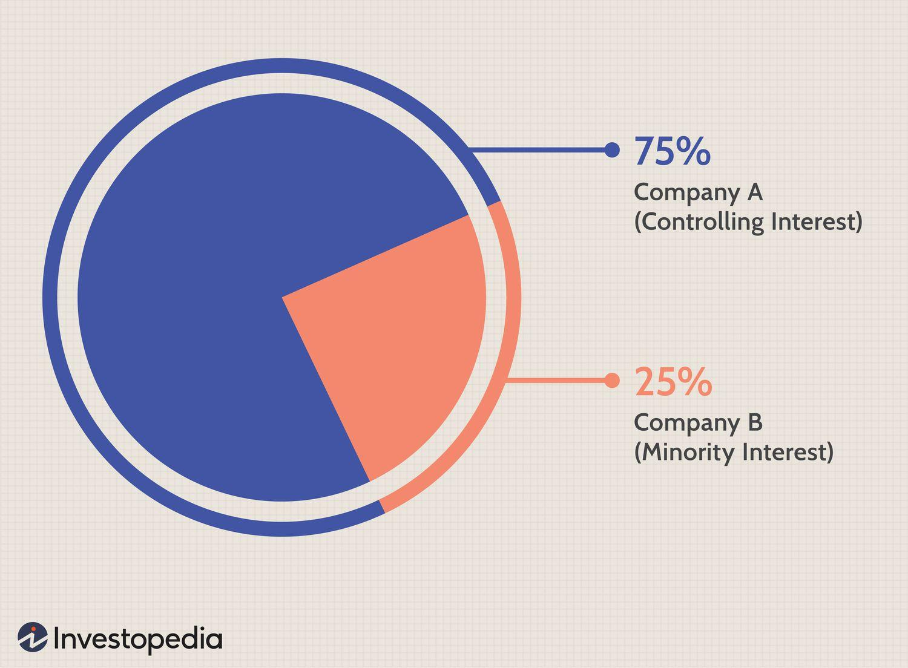

In today's rapidly evolving financial landscape, the complexities of accounting, minority interest, and financial calculations have become increasingly significant for both investors and financial professionals. With technological advancements continuously reshaping the investment sector, especially through algorithmic trading, understanding these concepts is crucial to making informed investment decisions and optimizing trading strategies.

Minority interest, often referred to as non-controlling interest, represents the proportion of a subsidiary that is not owned by the parent company. This financial component plays a vital role in the consolidation of financial statements, providing a clearer picture of a company's financial standing by accurately reflecting the economic interests of minority stakeholders. Proper accounting and reporting of minority interest, adhering to standards such as Generally Accepted Accounting Principles (GAAP) and International Financial Reporting Standards (IFRS), ensure transparency and reliability in financial documents.



Financial calculations form the backbone of algorithmic trading systems, allowing for the execution of trades with precision and speed. These calculations involve various components, including the assessment of minority interest, which can influence overall investment evaluations and decisions. Recognizing the interconnectedness of financial terms and their impact on automated trading is essential for professionals aiming to leverage algorithmic methodologies.

The exploration of minority interest, its accounting treatment, and its significance in financial calculations underscores the importance of these concepts in today’s financial ecosystem. As automated trading continues to gain traction, the integration of accurate financial data, including minority interest, is critical to achieving success in market operations. Understanding these elements allows investors to make data-driven decisions, reinforcing the relevancy of accounting fundamentals in modern trading environments.

## Table of Contents

## Understanding Minority Interest in Accounting

Minority interest, or non-controlling interest, represents the portion of a subsidiary's equity that is owned by shareholders other than the parent company. This usually involves ownership of less than 50% of the subsidiary's shares. Minority interest is essential in the preparation of consolidated financial statements because it acknowledges the reality that a parent company does not have full ownership of its subsidiaries.

In accounting, consolidated financial statements present the financial position and results of operations for a parent company and its subsidiaries as a single economic entity. Minority interest appears as a distinct line item within the equity section of the consolidated balance sheet, representing the equity attributable to minority shareholders. According to both Generally Accepted Accounting Principles (GAAP) and International Financial Reporting Standards (IFRS), minority interest is measured at either fair value or the proportionate share of the net assets of the subsidiary at the acquisition date.

The treatment of minority interest in the income statement involves attributing a portion of the subsidiary's net income to minority shareholders. This is typically displayed as a deduction from total consolidated net income, ensuring that only the income attributable to the parent company is reported as net income to the parent. For instance, if a subsidiary generates a net income of $1,000,000 and the minority interest constitutes 30%, then $300,000 would be attributed to minority shareholders, while the remaining $700,000 would be attributed to the parent company.

Both GAAP and IFRS require the disclosure of minority interest-related information, ensuring transparency in the financial standing and performance of consolidated entities. This includes disclosures about changes in the ownership interests in subsidiaries that do not result in loss of control, the allocation of total comprehensive income between the parent and non-controlling interest, and detailed reconciliations of equity attributable to minority interest.

In summary, minority interest is an important concept in accounting for corporate group structures. Accurately reporting minority interest according to established standards like GAAP and IFRS ensures the faithful representation of financial statements, providing clarity on the economic interests of both parent and minority shareholders in consolidated financial entities.

## Calculating Minority Interest: A Guide

Calculating minority interest, a crucial aspect of financial accounting, involves determining the portion of a subsidiary not owned by the parent company. This calculation is essential for accurately reflecting financial data on consolidated financial statements. Minority interest, or non-controlling interest, is typically reported under the equity section of the balance sheet, alongside the parent company's equity. Below is a step-by-step guide on how to compute minority interest and its placement in financial documents.

### Step-by-Step Calculation:

1. **Determine the Book Value of the Subsidiary:** 
   - Begin by identifying the subsidiary's total shareholders' equity from its financial statements. This figure represents the net assets attributable to both controlling and non-controlling interests.

2. **Identify the Minority Interest Percentage:**
   - This percentage is calculated based on the ownership stake of the minority shareholders. For example, if a parent company owns 70% of the subsidiary, then the minority interest percentage is 30%.

3. **Calculate the Minority Interest:**
   - The minority interest is determined by multiplying the subsidiary's total equity by the minority interest percentage.
$$
   \text{Minority Interest} = \text{Subsidiary Total Equity} \times \text{Minority Interest Percentage}

$$
   - For instance, if the subsidiary's total equity is $1,000,000 and the minority interest percentage is 30%, then the minority interest would be:
$$
   \text{Minority Interest} = 1,000,000 \times 0.30 = 300,000

$$

4. **Placement in Financial Statements:**
   - In the balance sheet, the minority interest is presented in the equity section, separate from the parent company’s equity. It ensures that the non-controlling interest's claim on the subsidiary's net assets is clearly depicted.
   - Additionally, minority interest affects the income statement. The consolidated net income is allocated between the parent company's shareholders and minority interest to reflect the earnings attributable to each group. The portion of net income attributable to minority interest is shown separately within the statement.

This method of accounting for minority interest is consistent with both Generally Accepted Accounting Principles (GAAP) and International Financial Reporting Standards (IFRS). Proper calculation and presentation of minority interest ensure the integrity and transparency of consolidated financial statements, aiding stakeholders in making informed decisions.

## The Role of Financial Calculation in Algorithmic Trading

Algorithmic trading necessitates meticulous financial calculations to ensure efficient trade execution and robust decision-making. These calculations form the backbone of algorithm-based trading systems, which rely on real-time data analysis and rapid response to market fluctuations.

One of the primary financial calculations used in [algorithmic trading](/wiki/algorithmic-trading) is the determination of moving averages. Moving averages help traders smooth out price data to identify trends over specific time periods. Simple Moving Averages (SMA) and Exponential Moving Averages (EMA) are the most common, with EMA giving more weight to recent prices, making it more responsive to new information. Calculating SMA involves averaging the closing prices over a defined period, while EMA applies a multiplier to give more significance to recent prices. Here’s a basic Python code snippet to calculate a simple moving average:

```python
def simple_moving_average(prices, window):
    return [sum(prices[i:i+window]) / window for i in range(len(prices) - window + 1)]
```

Additionally, financial calculations such as relative strength index (RSI) and Bollinger Bands are crucial in algorithmic trading strategies. RSI is a [momentum](/wiki/momentum) oscillator that evaluates the speed and change of price movements, usually computed over a 14-day period, and helps identify overbought or oversold conditions. Bollinger Bands, which involve calculating standard deviations, provide a graphical depiction of a stock's [volatility](/wiki/volatility-trading-strategies) and potential price action.

Another critical calculation is risk management, where algorithms are designed to limit exposure and manage trading capital efficiently. This involves calculating potential loss and setting stop-loss orders to protect investments. Value-at-Risk (VaR) is a common risk assessment tool, estimating the potential loss in value of a portfolio over a defined period for a given confidence interval.

Finally, financial calculations are essential for [backtesting](/wiki/backtesting) trading strategies. Backtesting involves applying an algorithmic trading strategy to historical data to evaluate its viability. This process requires accurate calculations to ensure that the historical performance of a strategy is indicative of its potential future success. By simulating trades against past data, traders can refine their algorithms to optimize performance before deploying them in live trading environments.

Through precise financial calculations, algorithmic trading systems can make informed, real-time trading decisions, reacting swiftly to market changes and optimizing trading strategies to maximize profitability while minimizing risk.

## Interplay Between Minority Interest and Algo Trading

Minority interest, also known as non-controlling interest, is a vital [factor](/wiki/factor-investing) in calculating and analyzing financial ratios like Enterprise Value (EV) within algorithmic trading strategies. Enterprise Value is a comprehensive measure of a company's total value, often used in financial analysis and valuation metrics within trading algorithms. The formula for EV is:

$$

EV = \text{Market Capitalization} + \text{Total Debt} - \text{Cash and Cash Equivalents} + \text{Minority Interest}
$$

Incorporating minority interest into EV calculations ensures an accurate representation of a company's valuation, which is crucial for algorithmic models aimed at executing trades based on market valuations.

Algorithmic trading strategies often depend on precise evaluations of company valuations to make informed trading decisions. Algorithms might assess stock valuations, detect undervalued or overvalued stocks, or implement [arbitrage](/wiki/arbitrage) strategies. The inclusion of minority interest in these calculations helps in achieving accuracy as it reflects the proportional value of companies' subsidiaries not fully owned by the parent company.

The process involves assessing the financial data of a company, including minority interest figures, and integrating this data into the algorithm's valuation models. Here, coding plays an important role in automating these calculations. A simple Python snippet to calculate Enterprise Value, considering minority interest, might look like this:

```python
def calculate_enterprise_value(market_cap, total_debt, cash_equivalents, minority_interest):
    # Calculate the enterprise value
    ev = market_cap + total_debt - cash_equivalents + minority_interest
    return ev

# Example usage
market_cap = 5000000000  # Example market capitalization in dollars
total_debt = 1000000000  # Example total debt in dollars
cash_equivalents = 500000000  # Example cash and cash equivalents in dollars
minority_interest = 200000000  # Example minority interest in dollars

enterprise_value = calculate_enterprise_value(market_cap, total_debt, cash_equivalents, minority_interest)
print(f"Enterprise Value: ${enterprise_value}")
```

In the context of algorithmic trading, understanding these dynamics allows for the development of more robust, reliable trading algorithms. By factoring in minority interest, algorithms can better evaluate the financial health and risks associated with potential investments. This precision is imperative for strategies that need to identify nuances in market valuations with minimal human intervention.

Furthermore, understanding how minority interest affects other financial ratios and metrics can lead to improved risk management strategies. By adjusting parameters in trading algorithms, traders can align with market movements more closely, ensuring timely responses to market fluctuations.

Overall, incorporating minority interest into financial calculations not only ensures accuracy in models but also enhances the ability of algorithms to perform sophisticated trading strategies, ultimately leading to better trading outcomes and risk assessments.

## Real-World Application: Case Studies

In recent years, several case studies have demonstrated how minority interest can significantly impact financial calculations and the performance of algorithmic trading strategies. These scenarios highlight the necessity of accurately incorporating minority interest into financial models to achieve precise trading outcomes.

### Case Study 1: Company A and Subsidiary B

In this case, Company A held a 60% stake in Subsidiary B, leaving a minority interest of 40% to other shareholders. The presence of this significant minority interest required precise calculation in the consolidation of financial statements. Algorithmic trading systems leveraged these consolidated statements to assess the overall financial health and market valuation of the parent company. 

One key aspect was the adjustment in the calculation of the Enterprise Value (EV), a critical metric in many trading algorithms. Typically, EV is calculated as follows:

$$
\text{Enterprise Value} = \text{Market Capitalization} + \text{Debt} - \text{Cash} + \text{Minority Interest}
$$

In this case, the inclusion of the 40% minority interest in Subsidiary B resulted in a substantial modification of the Enterprise Value. Algorithms that incorporated this adjusted EV were more effective in evaluating the parent company's true market position, leading to refined trading strategies and improved performance.

### Case Study 2: Global Tech Corporation

Global Tech Corporation (GTC) operated with several international subsidiaries, where minority interest varied between 10% and 45%. In one scenario, an algorithmic trading strategy targeting GTC's stock was initially underperforming. Upon review, it was discovered that the algorithm underestimated the effect of different minority interests from GTC's subsidiaries on consolidated net income and equity positions.

By revising the financial model, the algorithm accounted for these variations in minority interest, recalibrating essential financial ratios such as the Return on Equity (ROE) and Price to Earnings (P/E) ratio. This adjustment led to a more accurate assessment of GTC's intrinsic value, enhancing the algorithm's predictive power and execution efficiency.

### Case Study 3: Financial Sector Analytics

Within the financial sector, an investment firm applied an algorithmic strategy incorporating various metrics influenced by minority interest. The firm's algorithm considered adjusted financial ratios that factored in minority interests from joint ventures. Notably, by including minority interests in calculating the Debt-to-Equity ratio, the firm gained a better understanding of leverage levels and [liquidity](/wiki/liquidity-risk-premium) risk.

Python modeling was utilized to automate this adjustment process across multiple securities:

```python
def adjust_debt_to_equity(debt, equity, minority_interest):
    adjusted_equity = equity + minority_interest
    return debt / adjusted_equity

# Example usage
debt = 1_000_000
equity = 5_000_000
minority_interest = 500_000

dte_ratio = adjust_debt_to_equity(debt, equity, minority_interest)
print(f"Adjusted Debt-to-Equity Ratio: {dte_ratio:.2f}")
```

Incorporating such adjustments ensured that the firm's algorithmic models more accurately reflected true financial leverage, contributing to stronger trading performance and risk management.

These case studies underscore the importance of incorporating minority interest into financial models, offering significant value to algorithmic trading strategies. By recognizing the impact of minority interest, investors and trading systems can achieve greater precision in their market assessments and decision-making processes.

## Conclusion

Understanding the intricacies of minority interest and financial calculations is essential for both financial accounting and algorithmic trading. Minority interest, representing the ownership stake held by external shareholders in a subsidiary, must be accurately calculated and reported to ensure correct financial statements. This non-controlling interest affects financial metrics such as net income and shareholder equity, impacting the comprehensive financial outlook of the parent company.

Effective financial calculations, including those involving minority interest, allow investors and professionals to derive meaningful insights from financial statements. In the context of algorithmic trading, these calculations become foundational. Algorithmic trading relies on precise data inputs to execute trades based on evolving market conditions. By incorporating accurate minority interest data into automated trading models, investors can enhance the accuracy of financial metrics such as Enterprise Value (EV) and other ratios critical for making informed trading decisions.

The integration of minority interest calculations into algorithmic models aids in optimizing trading strategies, thus delivering better investment outcomes. It enables the algorithms to account for all variables affecting a company’s financial performance, leading to more reliable market evaluations. As such, a comprehensive understanding of these financial concepts empowers investors to leverage algorithmic systems' full capabilities, ensuring that their trading strategies are both data-driven and robust.

## FAQs on Minority Interest and Algo Trading

### What is the difference between minority interest and non-controlling interest?

Minority interest and non-controlling interest generally refer to the same concept in accounting, denoting an ownership stake in a subsidiary that is not controlled by the parent company. Both terms are used interchangeably in financial literature to describe the portion of equity in a subsidiary that is attributable to shareholders other than the parent company. This concept is crucial in the preparation of consolidated financial statements. Under both Generally Accepted Accounting Principles (GAAP) and International Financial Reporting Standards (IFRS), minority (or non-controlling) interest is represented in the consolidated balance sheet as a separate component of equity, reflecting the amount not owned by the parent company.

### How does minority interest affect enterprise value calculations?

Enterprise value (EV) is a measure of a company's total value, often used as a comprehensive alternative to market capitalization. The formula for enterprise value is given by:

$$
\text{EV} = \text{Market Capitalization} + \text{Total Debt} - \text{Cash and Cash Equivalents} + \text{Minority Interest}
$$

In this formula, minority interest must be added to the enterprise value calculation because it represents the portion of a subsidiary's book value that is claimable by minority shareholders. The inclusion of minority interest is essential to provide an accurate picture of a company's total economic value, accounting for the fact that part of the subsidiary’s equity is owed to external shareholders. This ensures that EV considers all the financial obligations and sources of equity across the entire corporate structure, including subsidiaries not wholly owned by the parent company.

### Why is accurate minority interest calculation important for algo trading?

Accurate calculation of minority interest is imperative for algorithmic trading for several reasons. Firstly, it impacts financial ratios and metrics that algorithms use to make trading decisions. For example, inaccurate minority interest figures can skew the enterprise value and related valuation metrics, leading to incorrect assessments of a company's financial health and market position. Algorithms depend heavily on exact input data to evaluate market conditions, execute trades, and manage portfolios efficiently.

Furthermore, incorrect calculation of minority interest can affect various ratios used in algorithmic strategies, such as Return on Equity (ROE) and Debt-to-Equity ratio. For example, a misrepresented equity portion due to incorrect minority interest could lead to unfounded conclusions about a company’s profitability or leverage. This may result in suboptimal trades, impacting the performance and profitability of algorithmic trading systems negatively.

Ensuring precision in minority interest figures allows investors and traders to build more robust models, better financial forecasts, and develop trading strategies that acknowledge the full spectrum of financial variables influencing market behaviors.

## References & Further Reading

[1]: Bergstra, J., Bardenet, R., Bengio, Y., & Kégl, B. (2011). ["Algorithms for Hyper-Parameter Optimization."](https://papers.nips.cc/paper/4443-algorithms-for-hyper-parameter-optimization) Advances in Neural Information Processing Systems 24.

[2]: ["Advances in Financial Machine Learning"](https://www.amazon.com/Advances-Financial-Machine-Learning-Marcos/dp/1119482089) by Marcos Lopez de Prado

[3]: ["Evidence-Based Technical Analysis: Applying the Scientific Method and Statistical Inference to Trading Signals"](https://www.amazon.com/Evidence-Based-Technical-Analysis-Scientific-Statistical/dp/0470008741) by David Aronson

[4]: ["Machine Learning for Algorithmic Trading"](https://github.com/stefan-jansen/machine-learning-for-trading) by Stefan Jansen

[5]: ["Financial Accounting with International Financial Reporting Standards"](https://www.wiley.com/en-us/Financial+Accounting+with+International+Financial+Reporting+Standards%2C+5th+Edition-p-9781119787051) by Jerry J. Weygandt, Paul D. Kimmel, and Donald E. Kieso

[6]: ["Quantitative Trading: How to Build Your Own Algorithmic Trading Business"](https://github.com/LucindaYa/quant-resources/blob/master/Quantitative%20Trading%20How%20to%20Build%20Your%20Own%20Algorithmic%20Trading%20Business.pdf) by Ernest P. Chan