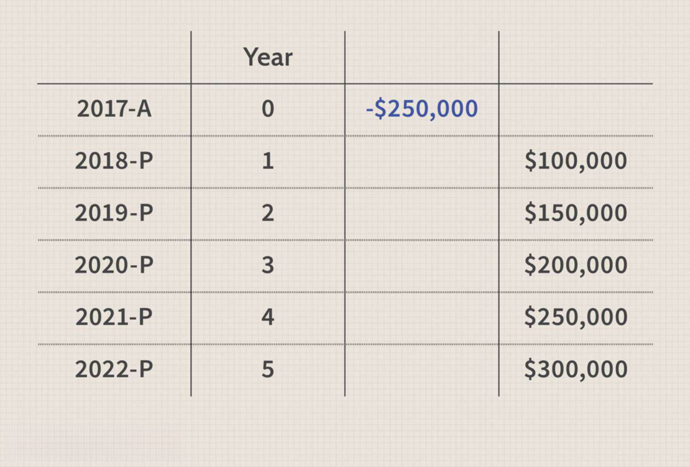

In the fast-paced world of finance, where data-driven decision-making is key, mastering tools like Excel becomes imperative for effective financial analysis and algorithmic trading. Financial professionals are continually seeking ways to enhance their investment evaluations, and one vital tool for assessing such opportunities definitively is the Net Present Value (NPV) calculation.

NPV stands out in its importance due to its ability to quantify an investment's value by considering the time value of money, thereby providing a more accurate measure of profitability. In this context, the XNPV function, an advanced feature of Excel, plays a critical role. Unlike the traditional NPV function that assumes regular time intervals between cash flows, XNPV allows users to account for cash flows that occur at irregular intervals, aligning with real-world scenarios more accurately.



This article delves into understanding the XNPV function's application in calculating NPV, targeting Excel users and finance professionals who are applying these methodologies within the scope of algorithmic trading. By mastering the nuances of Excel's robust functionalities like XNPV, you can evaluate the profitability of investments with greater precision, a crucial skill needed to stay competitive in financial markets where margins are often defined by the accuracy of such analyses. The insights provided here aim to empower you with the skills needed to leverage Excel for high-stakes investment appraisals and strategic financial decisions in algorithmic trading frameworks.

## Table of Contents

## Understanding Net Present Value (NPV)

Net Present Value (NPV) is a fundamental concept in finance that quantifies the value of an investment while incorporating the time value of money. It involves the process of discounting future cash flows back to their present value using a given discount rate. The central premise of NPV is to determine the current worth of an investment based on the projected inflows and outflows of funds across time.

The formula for calculating NPV is as follows:

$$

NPV = \sum \frac{C_t}{(1 + r)^t} 
$$

where $C_t$ is the net cash inflow during the period $t$, $r$ is the discount rate, and $t$ is the number of time periods.

Understanding the implications of NPV is crucial:

- **Positive NPV**: When the NPV of an investment is positive, it suggests that the forecasted earnings (or savings) exceed the anticipated costs, indicating the project is likely to be profitable. Such a scenario encourages investors to proceed with the investment, as it should enhance shareholder value.

- **Negative NPV**: Conversely, a negative NPV signals that the expected costs surpass potential gains, suggesting an unattractive investment. Investors might reconsider or reject such projects to avoid value erosion.

NPV serves as a vital tool for comparing multiple investment opportunities. It allows analysts to evaluate projects under uniform criteria, ensuring decisions are based on financial merit rather than arbitrary or qualitative factors. Beyond evaluation, NPV aids in strategic financial planning by offering insights into long-term investment profitability and risk, balancing both the cost of capital and the prospective returns.

Thus, mastering NPV calculations is essential for finance professionals, enabling them to make informed, data-driven decisions that align with organizational financial strategies and objectives.

## The Role of Excel in NPV Calculation

Excel provides robust functionalities that substantially ease complex financial computations, particularly in calculating Net Present Value (NPV). The NPV calculation in Excel is designed to determine the present value of a series of cash flows using a specified discount rate. This function is pivotal in financial analysis, enabling professionals to assess investment viability with enhanced precision and efficiency.

The basic NPV function in Excel requires a constant stream of cash flows over equal time intervals, discounting them using a fixed rate. The formula for calculating NPV is embedded in Excel as `=NPV(rate, value1, [value2], …)`, where "rate" is the discount rate, and "value1, value2, …" represent the series of cash flows. However, in practice, cash flows often occur at irregular intervals, a scenario where Excel's XNPV function proves its utility.

The XNPV function in Excel offers a more accurate computation method by considering the actual dates when cash flows occur. This function calculates NPV by taking into account the exact timing of each cash inflow and outflow, which is crucial for more precise financial analysis. The XNPV function syntax is `=XNPV(rate, cash_flows, dates)`. Here, "rate" is the discount rate, "cash_flows" is the range of cash flows, and "dates" corresponds to the series of dates for each cash flow. This approach ensures that each cash flow is discounted relative to its actual date, increasing the accuracy of the NPV calculation.

The capabilities of Excel extend well beyond simple functions, providing essential tools for managing large datasets, a critical requirement in modern financial analysis and [algorithmic trading](/wiki/algorithmic-trading). Excel's powerful data management functionalities—such as pivot tables, data sorting, and complex modeling—allow financial analysts to handle substantial volumes of data efficiently. This capacity is particularly advantageous in algorithmic trading, where data-driven decisions are pivotal for developing and [backtesting](/wiki/backtesting) trading strategies.

Moreover, Excel's flexibility is enhanced with the use of VBA (Visual Basic for Applications) for automation, enabling the creation of custom functions, macros, and sophisticated financial models tailored to specific analytical needs. These features make Excel an indispensable tool for finance professionals aiming to leverage data for insightful financial analysis and accurate NPV calculations.

## Step-by-Step Guide to Calculating NPV Using XNPV

To effectively calculate the Net Present Value (NPV) using the XNPV function in Excel, follow these detailed steps:

1. **Organize Projected Cash Flows**: Begin by compiling a comprehensive list of your expected cash inflows and outflows. Each cash flow should be associated with its corresponding date, as XNPV requires specific date inputs to account for the precise timing of cash flows. Ensure your cash flows are structured in a clear and accessible format, preferably in distinct columns for dates and amounts within your Excel worksheet.

2. **Determine the Discount Rate**: Select an appropriate discount rate that reflects both the cost of capital and the investment's risk profile. This rate is crucial as it influences the present value of future cash flows. A common approach is to use the weighted average cost of capital (WACC) or another rate that accurately represents the risk and opportunity cost of the investment.

3. **Utilize the XNPV Function**: The XNPV function in Excel is essential for calculating NPV when dealing with cash flows occurring at irregular intervals. The function syntax is as follows:

   ```
   XNPV(rate, values, dates)
   ```

   - `rate`: The discount rate for the investment.
   - `values`: An array of cash flows corresponding to the investment.
   - `dates`: An array of dates corresponding to each cash flow.

   For instance, consider the following Excel setup:
   ```
   A     B
   1   Date      Cash Flow
   2   2023-01-01 -500
   3   2023-06-01 200
   4   2024-01-01 300
   ```

   If the discount rate is 5%, the XNPV formula would be:
   ```
   =XNPV(0.05, B2:B4, A2:A4)
   ```

   This formula will calculate the net present value of these cash flows, considering the actual dates.

4. **Ensure Accurate Date and Cash Flow Alignment**: It's imperative that each date in your dataset accurately corresponds to its respective cash flow. Double-check your data for errors in date formatting, as inconsistencies could lead to incorrect calculations. Excel's default date format will suffice unless regional settings necessitate adjustments.

By following these steps, you can accurately calculate NPV using the XNPV function in Excel, ensuring that your analysis appropriately reflects the timing and risk of the cash flows involved. This precision in financial analysis is crucial for making informed investment decisions.

## Incorporating NPV Analysis into Algorithmic Trading

Net Present Value (NPV) analysis serves as a pivotal tool in evaluating algorithmic trading strategies, offering a comprehensive view of financial viability and potential returns. Incorporating NPV analysis into these strategies enhances decision-making by providing insights into long-term profitability.

Backtesting algorithmic strategies with NPV calculations allows traders to simulate performance under varying market conditions. By discounting projected cash flows from trading outcomes at an appropriate rate, traders can assess how future profits compare to initial investments. For instance, an algorithm designed for high-frequency trading may generate numerous small profits over time. Calculating the NPV of these profits accounts for the time value of money, providing an estimate of the strategy's overall effectiveness and sustainability.

To integrate NPV results into algorithmic inputs, Python can be effectively employed. Python's libraries, such as NumPy and Pandas, facilitate complex financial computations. Utilizing Python, traders can automate the calculation of NPV by applying functions that manage cash flow data and discount rates. Here is a simple illustration of how Python can be used to perform NPV calculations:

```python
import numpy as np

# Example cash flows and rate
cash_flows = [-1000, 100, 200, 300, 400, 500]
discount_rate = 0.1

# Calculate NPV
npv = np.npv(discount_rate, cash_flows)
print("The NPV of the strategy is:", npv)
```

This code snippet demonstrates how the `npv` function is used to efficiently calculate the net present value of a given series of cash flows.

Continuous refinement of trading algorithms based on NPV insights is essential to ensuring that they align with the trader's risk tolerance and investment objectives. By iteratively adjusting the model parameters and strategy based on NPV feedback, traders can optimize the algorithms to enhance performance and mitigate risks. Incorporating sensitivity analysis allows traders to evaluate how changes in market conditions or discount rates impact expected returns, facilitating informed decision-making.

In conclusion, embedding NPV analysis in algorithmic trading activities provides a valuable framework for assessing potential profitability and guiding strategy development. By leveraging tools like Python, traders can enhance their analytical capabilities, ensuring strategies are both robust and adaptable to the dynamic financial landscape.

## Common Mistakes and How to Avoid Them

Ensuring accurate cash flow inputs is crucial in calculating the Net Present Value (NPV) to avoid skewed results. When documenting cash flows, include all relevant inflows and outflows. This includes not only direct income and expenses but also indirect costs such as taxes, maintenance costs, or any potential operational expenses. Missing any of these can result in an inaccurate assessment of an investment's value.

Selecting an appropriate discount rate is another critical step. The discount rate should accurately reflect both the cost of capital and the risk profile associated with the investment. A common mistake is using a one-size-fits-all rate, which may lead to overestimating or underestimating the NPV. An investment with a higher risk should be assessed with a higher discount rate, as it indicates uncertainty in future cash flows. The discount rate can be determined based on the weighted average cost of capital (WACC) or by considering industry standards and economic conditions.

Consistency in time intervals between cash flows is essential. Standard NPV calculations assume periodic cash flows at regular intervals. However, when cash flows occur at irregular intervals, the XNPV function in Excel should be used. This function takes into account specific dates, providing a more accurate NPV calculation. Using the XNPV function in Excel can be achieved using the formula:

$$
\text{XNPV} = \sum \frac{C_i}{\left(1 + r\right)^{\frac{\text{Date}_i - \text{Date}_0}{365}}}
$$

where $C_i$ represents each cash flow, $r$ the discount rate, and $\text{Date}_i$ the date of the cash flow. Ensuring that the dates and amounts are accurately matched and formatted is necessary for correct outcomes.

Finally, validating NPV calculations through cross-verification with alternative tools is a prudent practice. Excel's robustness is generally reliable; however, verifying results using financial software like MATLAB or Python libraries such as NumPy or Pandas can further ensure accuracy. Implementing validation checks in Python might look like this:

```python
import numpy as np
from datetime import datetime

def xnpv(rate, cash_flows):
    return sum([cf / (1 + rate) ** ((date - cash_flows[0][0]).days / 365) for date, cf in cash_flows])

cash_flows = [(datetime(2023, 1, 1), -1000), (datetime(2024, 1, 1), 500), (datetime(2025, 7, 1), 700)]
rate = 0.1
print(f"The calculated XNPV is: {xnpv(rate, cash_flows):.2f}")
```

By carefully ensuring the accuracy of inputs, choosing the correct discount rate, employing appropriate functions like XNPV, and cross-verifying results, errors in NPV calculations can be effectively minimized, leading to better-informed investment decisions.

## Conclusion

Net Present Value (NPV) is a critical metric in finance, offering insightful assessments of investment potential and enabling the optimization of trading strategies. By discounting future cash flows to their present value using a specified discount rate, NPV provides a clear picture of an investment's worth. A positive NPV indicates that the projected earnings exceed the anticipated costs, making the investment attractive. Conversely, a negative NPV suggests potential losses.

Excel's advanced functionalities, such as the NPV and XNPV functions, play a crucial role in financial analysis. The NPV function is ideal for cash flows at regular intervals, while XNPV caters to irregular intervals, thereby ensuring greater precision. This accuracy is vital for financial professionals who rely on detailed analysis to make informed decisions. By allowing for the accurate calculation of NPV, Excel helps in assessing investment opportunities effectively, thus facilitating better-aligned financial strategies with organizational goals.

In the ever-evolving financial markets, continuous learning and adaptation are essential. With new investment opportunities and tools emerging regularly, maintaining a competitive edge requires a commitment to ongoing education and skill enhancement. Algorithmic trading, which leverages NPV analysis, demands continuous refinement to align strategies with risk tolerance and investment objectives effectively.

Mastering Excel tools for NPV calculations is integral to developing profitable financial strategies. Proficiency in these tools enables professionals to evaluate investments efficiently, empowering them with the knowledge to drive strategic financial planning and optimize trading strategies. Thus, Excel remains an indispensable ally in the toolkit of finance professionals striving for precision and profitability in their analyses.

## References & Further Reading

Investopedia offers a comprehensive overview of Net Present Value (NPV), a key financial metric used to assess the value of an investment by discounting future cash flows to their present value. Understanding the NPV formula is foundational for comparing investment opportunities and implementing strategic financial decisions. Further details are available at [Investopedia - Net Present Value (NPV) and Formula](https://www.investopedia.com/terms/n/npv.asp).

ExcelDemy provides an in-depth comparison between Excel's NPV and XNPV functions with practical examples. The guide explains how the XNPV function, unlike the traditional NPV function, takes into account specific cash flow dates, thus offering higher accuracy for scenarios involving irregular intervals. For more information, visit [ExcelDemy - Excel XNPV vs NPV: A Comparison with Examples](https://www.exceldemy.com/excel-xnpv-vs-npv/).

Initial Return's tutorial on calculating NPV in Excel is a helpful resource for finance professionals seeking step-by-step guidance. It details the process of organizing cash flows, selecting appropriate discount rates, and ensuring accurate NPV computations using Excel functionalities. To explore this further, refer to [Initial Return - How to calculate NPV in Excel?](https://www.initialreturn.com/how-to-calculate-npv-in-excel).

For those looking to deepen their understanding of financial modeling and algorithmic trading, numerous courses and materials are available. These resources often cover advanced Excel techniques, programming languages such as Python for financial analysis, and strategies for incorporating NPV analysis into trading algorithms. Engaging with these materials can enhance one's ability to develop robust financial strategies and maintain a competitive edge in dynamic markets.

