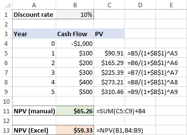

## Table of Contents

## What is Net Present Value (NPV) and why is it important?

Net Present Value, or NPV, is a way to figure out how much a project or investment is worth today. It does this by adding up all the money you expect to get from the project in the future, but it adjusts those future amounts to today's value. This adjustment is important because money today is worth more than the same amount of money in the future. To calculate NPV, you use a discount rate, which is like an interest rate, to bring all future cash flows back to what they're worth right now. If the NPV is positive, it means the investment should make more money than it costs, which is good.

NPV is important because it helps people and businesses make smart choices about where to put their money. By using NPV, you can compare different projects or investments to see which one will give you the most value. It's especially useful for long-term projects where the money comes in over many years. If you're deciding between starting a new business, buying new equipment, or investing in something else, NPV can show you which option will be the best use of your money. This way, you can avoid projects that might look good but won't actually add value when you consider the time value of money.

## How does the XNPV function in Excel differ from the regular NPV function?

The XNPV function in Excel is a bit different from the regular NPV function because it lets you use exact dates for when money comes in or goes out. With the regular NPV function, you assume that all the cash flows happen at equal times, like every year or every month. But in real life, money might come in or go out at different times. That's where XNPV comes in handy because it takes these different dates into account, making it more accurate for projects with irregular cash flows.

The regular NPV function works well if you have a project where the timing of cash flows is predictable and regular. For example, if you're getting payments every month or every year, the regular NPV can handle that easily. But if your project has cash flows that happen at random times, like getting money from a project in the middle of a month or having different intervals between payments, the XNPV function will give you a more precise calculation. So, XNPV is better for projects where the timing of cash flows is not so regular.

## What are the basic steps to calculate NPV using XNPV in Excel?

To calculate NPV using the XNPV function in Excel, start by listing all the cash flows for your project in a column. Make sure to include the initial investment as a negative number at the beginning. Next to each cash flow, write down the exact date when it happens. This is important because XNPV needs these dates to work right. Then, choose a discount rate that you'll use to figure out the present value of the cash flows. This rate is like an [interest rate](/wiki/interest-rate-trading-strategies) that shows how much you value money now compared to money in the future.

Once you have your cash flows, dates, and discount rate ready, you can use the XNPV function. Click on an empty cell where you want the NPV to show up. Type in the XNPV function, which looks like this: `=XNPV(discount_rate, cash_flows, dates)`. In this formula, `discount_rate` is the rate you chose, `cash_flows` is the range of cells with your cash flows, and `dates` is the range of cells with the dates. After you enter the formula and press Enter, Excel will calculate the NPV for you. If the result is positive, it means your project is expected to make more money than it costs, which is a good sign.

## How do you input cash flows and dates into the XNPV function?

To use the XNPV function in Excel, you first need to list your cash flows and their dates in two separate columns. Start by putting the initial investment as a negative number at the top of the cash flow column. Then, add all the future cash flows below it, making sure each one is in its own cell. Next to each cash flow, write the date when that money comes in or goes out. It's important to use actual dates, like "1/1/2023" or "2023-01-01", so Excel knows exactly when each cash flow happens.

Once you have your cash flows and dates ready, you can use the XNPV function. Click on an empty cell where you want the NPV to show up. Type in the XNPV function like this: `=XNPV(discount_rate, cash_flows, dates)`. Here, `discount_rate` is the number you choose for how much you value money now compared to later. `cash_flows` is the range of cells where you listed your cash flows, and `dates` is the range of cells with the dates. After you enter the formula and press Enter, Excel will calculate the NPV for you. If it's positive, it means your project should make more money than it costs.

## What is the significance of the discount rate in XNPV calculations?

The discount rate in XNPV calculations is super important because it helps figure out how much money you'll get in the future is worth right now. Think of it like an interest rate. If you have a high discount rate, it means you think money now is way more valuable than money later, so future cash flows get smaller when you bring them back to today's value. If the discount rate is low, it means you don't mind waiting for your money as much, so future cash flows don't shrink as much when you calculate their present value.

Choosing the right discount rate can make a big difference in whether a project looks good or not. If you use a high discount rate, projects with cash flows far in the future might not look as good because their value today gets reduced a lot. On the other hand, if you use a low discount rate, those same projects might look better because their future money doesn't lose as much value when you bring it back to now. So, [picking](/wiki/asset-class-picking) the right discount rate helps you see if a project is really worth doing based on how you value money over time.

## Can you explain how to handle irregular cash flows with XNPV?

When you have cash flows that come in at different times, XNPV is really useful. With the regular NPV function, you have to assume that all the money comes in at regular times, like every month or every year. But with XNPV, you can use the exact dates when the money comes in or goes out. This means you can handle cash flows that are all over the place, like getting money in the middle of a month or having different lengths of time between payments. All you need to do is list each cash flow and the date it happens in two separate columns in Excel.

Once you have your cash flows and dates listed, you can use the XNPV function to figure out the Net Present Value. You'll need to pick a discount rate, which is like an interest rate that shows how much you value money now compared to money later. Then, you put the discount rate, the range of cells with the cash flows, and the range of cells with the dates into the XNPV formula. Excel will do the math for you and give you the NPV. This way, you get a more accurate picture of whether your project is a good idea, even if the money doesn't come in at regular times.

## How do you interpret the results of an XNPV calculation?

When you use the XNPV function in Excel to calculate the Net Present Value of a project, the result tells you if the project is worth doing. If the XNPV is positive, it means the project is expected to make more money than it costs. This is good news because it shows that the project should add value to your business or investment. On the other hand, if the XNPV is negative, it means the project will probably lose money overall, so it might not be a good idea to go ahead with it.

The size of the XNPV also matters. A bigger positive number means the project could be really good for making money. But if the positive number is small, the project might still be worth doing, but it won't add as much value. If you're comparing different projects, the one with the highest positive XNPV is usually the best choice because it should give you the most value for your money.

## What are common errors to avoid when using XNPV in Excel?

When using XNPV in Excel, a common mistake is not using the right dates for each cash flow. XNPV needs exact dates to work correctly, so if you use the wrong dates or don't use dates at all, your calculation will be off. Make sure each cash flow has a date next to it in the same row, and that the dates are in a format Excel can understand, like "1/1/2023" or "2023-01-01".

Another error to watch out for is picking the wrong discount rate. The discount rate is important because it shows how much you value money now compared to money later. If you use a rate that's too high or too low, it can make your project look better or worse than it really is. Think carefully about what discount rate makes sense for your project before you use it in the XNPV formula.

Lastly, be careful with how you enter your cash flows. The first cash flow should be the initial investment, and it should be a negative number because it's money going out. If you forget to make it negative, or if you mix up the order of your cash flows, your XNPV calculation won't be right. Always double-check your numbers and their order to make sure you're getting an accurate result.

## How can XNPV be used for investment decision-making?

XNPV helps you decide if an investment is a good idea by figuring out its value today. When you use XNPV, you look at all the money you expect to get from the investment in the future and adjust it to what it's worth right now. If the XNPV is positive, it means the investment will probably make more money than it costs, which is good. But if it's negative, the investment might lose money, so it's probably not worth doing. By using XNPV, you can compare different investments to see which one will give you the most value.

When you're choosing between different investments, XNPV is really helpful because it takes into account when the money comes in or goes out. This is important because sometimes investments have money coming in at different times, not just every month or every year. XNPV lets you use the exact dates for these cash flows, so you get a more accurate picture of the investment's value. This way, you can make smarter choices about where to put your money, picking the investments that will add the most value to your business or personal finances.

## What are some advanced tips for optimizing XNPV calculations in large datasets?

When you're working with a lot of data in Excel, using XNPV can take a while to calculate. To make it faster, try using Excel's built-in features like data tables or pivot tables to organize your cash flows and dates. This helps you see all your data at once and makes it easier to spot any mistakes. Also, if you have a lot of cash flows, you might want to break them down into smaller groups and calculate the XNPV for each group separately before adding them up. This can help your computer work faster because it's dealing with smaller chunks of data at a time.

Another tip is to use named ranges for your cash flows and dates. Instead of typing out the cell ranges every time you use the XNPV function, you can give them names like "CashFlows" and "Dates." This makes your formulas easier to read and less likely to have errors. If you're using the same discount rate for many calculations, you can also name that cell, so you only have to change it in one place if it needs to be updated. By keeping your data organized and using these tricks, you can make your XNPV calculations more accurate and quicker, even with big datasets.

## How does XNPV handle different currencies and inflation in financial analysis?

When you use XNPV for financial analysis, it doesn't automatically handle different currencies or inflation. If your project involves money in different currencies, you need to convert all the cash flows to one currency before you use XNPV. You can do this by using the exchange rates at the time each cash flow happens. Once all the cash flows are in the same currency, you can then use XNPV to figure out the project's value. This way, you make sure that you're comparing apples to apples, and your XNPV calculation will be accurate.

For inflation, XNPV doesn't adjust for it on its own. But you can still take inflation into account by adjusting your cash flows before you use XNPV. You can do this by using an inflation rate to increase the future cash flows to what they would be worth in today's money. After you've adjusted for inflation, you can then use XNPV with a real discount rate, which is a discount rate that doesn't include inflation. This way, you get a more accurate picture of your project's value, considering how inflation might affect the money you get in the future.

## Can you compare XNPV with other financial functions in Excel like IRR and MIRR?

XNPV, IRR, and MIRR are all useful financial functions in Excel, but they do different things. XNPV calculates the Net Present Value of a project by taking the cash flows and the exact dates they happen, then using a discount rate to figure out what they're worth today. It's great for projects where money comes in at different times. IRR, or Internal Rate of Return, finds the discount rate that makes the NPV of a project equal to zero. It tells you the rate of return you can expect from a project, which helps you see if it's a good investment. But IRR assumes that cash flows happen at regular times, so it's not as good for projects with irregular cash flows.

MIRR, or Modified Internal Rate of Return, is kind of like IRR but fixes some of its problems. MIRR uses a finance rate for money you put into the project and a reinvestment rate for money you get back from it. This gives you a more realistic idea of the project's return because it doesn't assume you can reinvest all your money at the same high rate that IRR does. Like IRR, MIRR assumes cash flows happen at regular times, so it's not as good as XNPV for projects with cash flows at different times. Each of these functions helps you make smart choices about investments, but XNPV is the best one to use when you need to consider the exact timing of cash flows.

## What is Understanding Net Present Value (NPV)?

Net Present Value (NPV) is a fundamental concept in finance that quantifies the value of an investment while incorporating the time value of money. It involves the process of discounting future cash flows back to their present value using a given discount rate. The central premise of NPV is to determine the current worth of an investment based on the projected inflows and outflows of funds across time.

The formula for calculating NPV is as follows:

$$

NPV = \sum \frac{C_t}{(1 + r)^t} 
$$

where $C_t$ is the net cash inflow during the period $t$, $r$ is the discount rate, and $t$ is the number of time periods.

Understanding the implications of NPV is crucial:

- **Positive NPV**: When the NPV of an investment is positive, it suggests that the forecasted earnings (or savings) exceed the anticipated costs, indicating the project is likely to be profitable. Such a scenario encourages investors to proceed with the investment, as it should enhance shareholder value.

- **Negative NPV**: Conversely, a negative NPV signals that the expected costs surpass potential gains, suggesting an unattractive investment. Investors might reconsider or reject such projects to avoid value erosion.

NPV serves as a vital tool for comparing multiple investment opportunities. It allows analysts to evaluate projects under uniform criteria, ensuring decisions are based on financial merit rather than arbitrary or qualitative factors. Beyond evaluation, NPV aids in strategic financial planning by offering insights into long-term investment profitability and risk, balancing both the cost of capital and the prospective returns.

Thus, mastering NPV calculations is essential for finance professionals, enabling them to make informed, data-driven decisions that align with organizational financial strategies and objectives.

## What are common mistakes and how can they be avoided?

Ensuring accurate cash flow inputs is crucial in calculating the Net Present Value (NPV) to avoid skewed results. When documenting cash flows, include all relevant inflows and outflows. This includes not only direct income and expenses but also indirect costs such as taxes, maintenance costs, or any potential operational expenses. Missing any of these can result in an inaccurate assessment of an investment's value.

Selecting an appropriate discount rate is another critical step. The discount rate should accurately reflect both the cost of capital and the risk profile associated with the investment. A common mistake is using a one-size-fits-all rate, which may lead to overestimating or underestimating the NPV. An investment with a higher risk should be assessed with a higher discount rate, as it indicates uncertainty in future cash flows. The discount rate can be determined based on the weighted average cost of capital (WACC) or by considering industry standards and economic conditions.

Consistency in time intervals between cash flows is essential. Standard NPV calculations assume periodic cash flows at regular intervals. However, when cash flows occur at irregular intervals, the XNPV function in Excel should be used. This function takes into account specific dates, providing a more accurate NPV calculation. Using the XNPV function in Excel can be achieved using the formula:

$$
\text{XNPV} = \sum \frac{C_i}{\left(1 + r\right)^{\frac{\text{Date}_i - \text{Date}_0}{365}}}
$$

where $C_i$ represents each cash flow, $r$ the discount rate, and $\text{Date}_i$ the date of the cash flow. Ensuring that the dates and amounts are accurately matched and formatted is necessary for correct outcomes.

Finally, validating NPV calculations through cross-verification with alternative tools is a prudent practice. Excel's robustness is generally reliable; however, verifying results using financial software like MATLAB or Python libraries such as NumPy or Pandas can further ensure accuracy. Implementing validation checks in Python might look like this:

```python
import numpy as np
from datetime import datetime

def xnpv(rate, cash_flows):
    return sum([cf / (1 + rate) ** ((date - cash_flows[0][0]).days / 365) for date, cf in cash_flows])

cash_flows = [(datetime(2023, 1, 1), -1000), (datetime(2024, 1, 1), 500), (datetime(2025, 7, 1), 700)]
rate = 0.1
print(f"The calculated XNPV is: {xnpv(rate, cash_flows):.2f}")
```

By carefully ensuring the accuracy of inputs, choosing the correct discount rate, employing appropriate functions like XNPV, and cross-verifying results, errors in NPV calculations can be effectively minimized, leading to better-informed investment decisions.

## References & Further Reading

Investopedia offers a comprehensive overview of Net Present Value (NPV), a key financial metric used to assess the value of an investment by discounting future cash flows to their present value. Understanding the NPV formula is foundational for comparing investment opportunities and implementing strategic financial decisions. Further details are available at [Investopedia - Net Present Value (NPV) and Formula](https://www.investopedia.com/terms/n/npv.asp).

ExcelDemy provides an in-depth comparison between Excel's NPV and XNPV functions with practical examples. The guide explains how the XNPV function, unlike the traditional NPV function, takes into account specific cash flow dates, thus offering higher accuracy for scenarios involving irregular intervals. For more information, visit [ExcelDemy - Excel XNPV vs NPV: A Comparison with Examples](https://www.exceldemy.com/excel-xnpv-vs-npv/).

Initial Return's tutorial on calculating NPV in Excel is a helpful resource for finance professionals seeking step-by-step guidance. It details the process of organizing cash flows, selecting appropriate discount rates, and ensuring accurate NPV computations using Excel functionalities. To explore this further, refer to [Initial Return - How to calculate NPV in Excel?](https://www.initialreturn.com/how-to-calculate-npv-in-excel).

For those looking to deepen their understanding of financial modeling and [algorithmic trading](/wiki/algorithmic-trading), numerous courses and materials are available. These resources often cover advanced Excel techniques, programming languages such as Python for financial analysis, and strategies for incorporating NPV analysis into trading algorithms. Engaging with these materials can enhance one's ability to develop robust financial strategies and maintain a competitive edge in dynamic markets.

