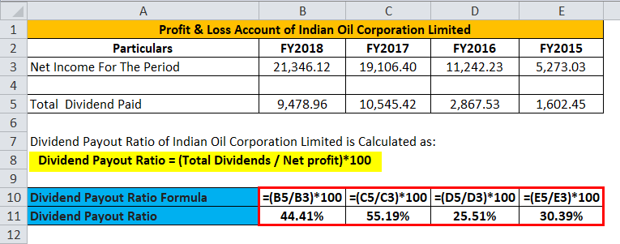

## Table of Contents

## What is the payout ratio and why is it important?

The payout ratio is a financial term that shows how much of a company's earnings it pays out to shareholders as dividends. It is calculated by dividing the total dividends paid by the company's net income. For example, if a company earns $100 and pays out $30 in dividends, the payout ratio is 30%.

This ratio is important because it helps investors understand how a company manages its profits. A high payout ratio might mean the company is giving most of its earnings back to shareholders, which could be good for people looking for dividend income. But it could also mean the company has fewer funds to reinvest in growth or to save for future challenges. On the other hand, a low payout ratio might suggest the company is keeping more earnings to invest in future growth, which could be good for investors looking for long-term value. By looking at the payout ratio, investors can make better decisions about where to put their money.

## How do you calculate the payout ratio manually?

To calculate the payout ratio manually, you need to know two things: the total dividends the company paid out and the company's net income. Both of these numbers can be found in the company's financial statements. The payout ratio is found by dividing the total dividends by the net income. For example, if a company paid out $50 in dividends and had a net income of $200, you would divide $50 by $200 to get a payout ratio of 0.25, or 25%.

Understanding the payout ratio is helpful for investors because it shows how much of the company's earnings are being given back to shareholders as dividends. If the payout ratio is high, it means the company is giving a large part of its earnings to shareholders, which might be good for people who want regular income from their investments. But it could also mean the company has less money to grow or to handle future problems. If the payout ratio is low, it means the company is keeping more of its earnings, which might be good for people who want the company to grow and increase in value over time.

## What data do you need to calculate the payout ratio in Excel?

To calculate the payout ratio in Excel, you need two pieces of data: the total dividends paid by the company and the company's net income. You can find these numbers in the company's financial statements, like the income statement or the statement of cash flows. In Excel, you'll put the total dividends in one cell and the net income in another cell.

Once you have these numbers in Excel, you can calculate the payout ratio by dividing the total dividends by the net income. For example, if you put the total dividends in cell A1 and the net income in cell B1, you can use the formula `=A1/B1` in another cell to get the payout ratio. This will give you a number that shows what part of the company's earnings is being paid out as dividends.

## How do you set up your Excel sheet to input the necessary data for the payout ratio calculation?

To set up your Excel sheet for calculating the payout ratio, start by opening a new Excel workbook. In the first row, label cell A1 as "Total Dividends" and cell B1 as "Net Income." These labels help you remember what data goes where. Next, in cell A2, enter the total amount of dividends the company paid out. This number can be found in the company's financial statements. In cell B2, enter the company's net income, which you can also find in the financial statements.

Once you have entered the data, you can calculate the payout ratio. In cell C1, label it as "Payout Ratio." In cell C2, use the formula `=A2/B2` to calculate the payout ratio. This formula divides the total dividends by the net income, giving you the payout ratio as a decimal. You can format cell C2 to show the result as a percentage if you prefer, by clicking on the cell, going to the 'Home' tab, and selecting the percentage format from the 'Number' group. This setup makes it easy to see how much of the company's earnings are being paid out as dividends.

## What is the formula to calculate the payout ratio in Excel?

To calculate the payout ratio in Excel, you need two numbers: the total dividends the company paid out and the company's net income. You can find these numbers in the company's financial statements. In Excel, put the total dividends in one cell, like A2, and the net income in another cell, like B2. 

Then, to find the payout ratio, you use a simple formula. In a new cell, like C2, type `=A2/B2`. This formula divides the total dividends by the net income, giving you the payout ratio as a decimal. If you want to see it as a percentage, you can format the cell to show the result as a percent.

## How do you apply the payout ratio formula across multiple entries in Excel?

To apply the payout ratio formula across multiple entries in Excel, start by setting up your spreadsheet. In the first row, label column A as "Total Dividends," column B as "Net Income," and column C as "Payout Ratio." Enter the total dividends for each company in column A, starting from cell A2 downwards, and the net income for each company in column B, starting from cell B2 downwards. 

Once your data is entered, you can use the payout ratio formula across all entries. In cell C2, type the formula `=A2/B2` to calculate the payout ratio for the first entry. To apply this formula to all other entries, simply click on the bottom right corner of cell C2 and drag the fill handle down as far as needed. This will copy the formula to the other cells in column C, automatically calculating the payout ratio for each row based on the corresponding values in columns A and B.

## Can you explain how to use conditional formatting in Excel to highlight different payout ratio levels?

To use conditional formatting in Excel to highlight different payout ratio levels, first make sure your payout ratios are in a column, like column C. Click on the first cell with a payout ratio, then drag to select all the cells with payout ratios. Go to the 'Home' tab and find the 'Conditional Formatting' button. Click it, then choose 'New Rule.' In the new window, pick 'Format only cells that contain,' then set the rule to highlight cells based on their value. For example, you could set it to highlight cells in red if the payout ratio is over 75%, which might mean the company is paying out a lot of its earnings.

After setting the first rule, you can add more rules to highlight other levels of payout ratios. Click 'New Rule' again and set another rule, like highlighting cells in yellow if the payout ratio is between 50% and 75%. This could show companies that are paying out a good amount but still keeping some earnings. You can keep adding rules to highlight different ranges, like green for payout ratios below 50%, which might mean the company is keeping more of its earnings for growth. Once you have all your rules set, click 'OK' to see the cells change color based on their payout ratio levels.

## How do you interpret the results of the payout ratio calculation in Excel?

When you look at the payout ratio numbers in Excel, you're seeing how much of a company's earnings are being given back to shareholders as dividends. If the payout ratio is high, like over 75%, it means the company is giving most of its money to shareholders. This might be good if you want regular income from your investments. But it could also mean the company doesn't have much money left to grow or to handle future problems. If the payout ratio is low, like under 50%, it means the company is keeping more of its earnings. This might be good if you want the company to grow and increase in value over time.

Using conditional formatting in Excel can help you see these payout ratios more easily. If you set up rules to highlight different levels of payout ratios with colors, you can quickly spot which companies are paying out a lot of their earnings and which ones are keeping more for growth. For example, red might show companies with very high payout ratios, yellow could show those with medium payout ratios, and green might highlight companies with low payout ratios. This visual aid makes it easier to understand and compare the financial strategies of different companies at a glance.

## What are common errors to watch out for when calculating the payout ratio in Excel?

When calculating the payout ratio in Excel, one common mistake is entering the wrong numbers. If you mix up the total dividends and the net income, your payout ratio will be wrong. Make sure you put the total dividends in one cell and the net income in another cell correctly. Another error to watch out for is using the wrong formula. The payout ratio is calculated by dividing the total dividends by the net income, so your formula should be something like `=A2/B2` if you have the total dividends in cell A2 and the net income in cell B2. If you use a different formula, like multiplying instead of dividing, your payout ratio will be incorrect.

Another thing to be careful about is formatting errors. Sometimes, the payout ratio might show up as a decimal, like 0.5, instead of a percentage, like 50%. To fix this, you can format the cell to show the number as a percentage. Also, if you're using conditional formatting to highlight different payout ratio levels, make sure your rules are set up correctly. If the rules are wrong, the colors might not match the payout ratios, which can make it hard to understand the data. By being careful with these common errors, you can make sure your payout ratio calculations in Excel are accurate and easy to understand.

## How can you automate the payout ratio calculation process in Excel using macros?

To automate the payout ratio calculation in Excel using macros, you first need to open the Visual Basic for Applications (VBA) editor. You can do this by pressing Alt + F11 on your keyboard. Once you're in the VBA editor, insert a new module by clicking 'Insert' and then 'Module.' In this module, you'll write a simple macro that takes the total dividends and net income from specific cells, calculates the payout ratio, and puts the result in another cell. For example, your macro might look like this: `Sub CalculatePayoutRatio() Range("C2").Value = Range("A2").Value / Range("B2").Value End Sub`. This macro tells Excel to divide the value in cell A2 (total dividends) by the value in cell B2 (net income) and put the result in cell C2 (payout ratio).

After writing the macro, you can run it by going back to Excel, pressing Alt + F8, selecting your macro from the list, and clicking 'Run.' This will automatically calculate the payout ratio for the data in cells A2 and B2. If you want to apply this calculation to multiple rows of data, you can modify the macro to loop through each row. For example, you could use a loop like this: `Sub CalculatePayoutRatios() Dim i As Integer For i = 2 To 100 Range("C" & i).Value = Range("A" & i).Value / Range("B" & i).Value Next i End Sub`. This macro will calculate the payout ratio for rows 2 through 100. By using macros, you can save time and make sure your calculations are always done the same way, reducing the chance of errors.

## How do you compare the payout ratio over different time periods in Excel?

To compare the payout ratio over different time periods in Excel, you first need to set up your spreadsheet with columns for each time period, like years or quarters. Label the first column as "Year" or "Quarter," and then have columns for "Total Dividends," "Net Income," and "Payout Ratio" for each period. Enter the data for each time period in the rows below these headers. For example, if you're comparing yearly data, you might have rows for 2020, 2021, and 2022. Once your data is entered, use the formula `=Total Dividends/Net Income` in the "Payout Ratio" column for each period to calculate the payout ratio. This will give you a clear view of how the payout ratio changes over time.

After calculating the payout ratios for each period, you can use Excel's charting tools to visualize the changes. Select the "Year" or "Quarter" column and the corresponding "Payout Ratio" column, then go to the 'Insert' tab and choose a line chart or bar chart to show the trend over time. This chart will help you see if the payout ratio is increasing, decreasing, or staying the same. By looking at these changes, you can understand how the company's dividend policy is evolving and make better investment decisions based on this information.

## What advanced Excel functions can enhance the analysis of payout ratios?

To enhance the analysis of payout ratios in Excel, you can use the `IF` function to categorize payout ratios into different levels, like high, medium, or low. For example, you could use a formula like `=IF(C2>0.75, "High", IF(C2>0.5, "Medium", "Low"))` to label the payout ratio in cell C2. This helps you quickly see how the company's dividend policy compares to others. You can also use the `VLOOKUP` function to pull in additional data, like industry averages, to compare your company's payout ratio against its peers. For instance, if you have a table with industry data, you could use `=VLOOKUP(A2, IndustryData, 2, FALSE)` to find the industry average payout ratio for the year in cell A2.

Another useful function is `AVERAGE` to calculate the average payout ratio over several years, which can show you the company's long-term dividend policy. You could use `=AVERAGE(C2:C10)` to find the average payout ratio from cells C2 to C10. The `TREND` function can help you forecast future payout ratios based on historical data. For example, `=TREND(C2:C10, A2:A10, A11)` could predict the payout ratio for the next year based on the years in cells A2 to A10. These advanced functions make it easier to analyze and understand payout ratios, helping you make better investment decisions.

## What is the Payout Ratio and How Does it Help in Understanding Financial Ratios?

The payout ratio is a crucial financial metric used to evaluate the proportion of earnings a company distributes to its shareholders in the form of dividends. It reflects how much profit a company returns to shareholders, offering insights into its dividend policy and overall financial health. Understanding the payout ratio is essential for investors and shareholders as it helps in assessing the sustainability of dividend payments and the potential for future income.

**Definition and Formula**

The payout ratio is calculated using the formula:

$$
\text{Payout Ratio} = \frac{\text{Dividends Per Share}}{\text{Earnings Per Share (EPS)}}
$$

Where:
- *Dividends Per Share (DPS)* is the total dividends paid out over a period divided by the number of outstanding shares.
- *Earnings Per Share (EPS)* is the portion of a company's profit allocated to each outstanding share of common stock, derived by dividing the net income by the average number of outstanding shares during a specific period.

**Importance of the Payout Ratio**

For shareholders and investors, the payout ratio serves as an indicator of a company’s dividend policy and financial performance. A high payout ratio might suggest that a company is returning most of its income back to shareholders, which could be attractive for income-focused investors. However, it could also imply that the company has less capital available for growth and expansion, posing a risk if earnings decline. Conversely, a low payout ratio might indicate that a company is reinvesting its earnings into business operations, potentially leading to future growth and increased share value.

**Insights into Dividend Policies**

Examining the payout ratio can provide valuable insights into a company's approach to dividends:

1. **Stable and Conservative Payouts:** Companies with a steady payout ratio, especially in the range of 30% to 50%, often exhibit a balanced approach, offering both shareholder returns and reinvestment in growth.

2. **Aggressive Payouts:** A payout ratio exceeding 75% might signal a generous dividend policy, which could be unsustainable if not backed by steady earnings. It is crucial for investors to assess whether such payouts stem from consistent profit generation or one-time earnings.

3. **Retention and Reinvestment:** A very low or zero payout ratio may indicate that a company chooses to retain earnings for reinvestment, which might be appealing to growth investors. For example, tech companies often reinvest profits to maintain competitive edges and innovate, leading to less emphasis on immediate dividend distribution.

In essence, the payout ratio helps investors determine whether a company's dividend policy aligns with their investment strategy and risk tolerance, while also providing insights into the company's operational priorities and financial stability.

## How do you calculate the Payout Ratio in Excel?

To calculate the payout ratio in Excel, one must accurately determine both the Dividends Per Share (DPS) and the Earnings Per Share (EPS). The payout ratio is a vital metric in financial analysis, serving to illustrate what portion of earnings a company distributes as dividends to its shareholders. Here’s a step-by-step guide on accomplishing this calculation using Excel.

### Step-by-Step Guide

#### 1. Calculating Dividends Per Share (DPS)

Dividends Per Share can be calculated by dividing the total dividends paid by the number of outstanding shares. Here is a systematic approach to achieve this in Excel:

- **Step 1:** Gather data on total dividends paid by the company in a given period (usually available in the company’s financial statements).
- **Step 2:** Identify the total number of shares outstanding. This information can also be retrieved from financial statements or stock market databases.

  Assuming you have these data points:

  - Total Dividends: located in cell B2
  - Outstanding Shares: located in cell B3

  Insert the following formula in cell B4 to calculate DPS:

  ```excel
  =B2/B3
  ```

#### 2. Calculating Earnings Per Share (EPS)

Earnings Per Share can be derived by dividing the net income available to common shareholders by the weighted average number of shares outstanding during the period.

- **Step 1:** Obtain the net income figure, which reflects the company's profit. This figure is typically found in the income statement.
- **Step 2:** Use the same number of shares outstanding as used for DPS, unless a weighted average calculation is required.

  Assuming:

  - Net Income: located in cell C2
  - Outstanding Shares: located previously in cell B3

  Insert the following formula in cell C3 to calculate EPS:

  ```excel
  =C2/B3
  ```

#### 3. Determining the Payout Ratio

The payout ratio is computed using the formula: 

$$
\text{Payout Ratio} = \frac{\text{Dividends Per Share (DPS)}}{\text{Earnings Per Share (EPS)}}
$$

Using the calculations from the previous steps:

- **Step:** With DPS in cell B4 and EPS in cell C3, calculate the payout ratio by entering the following formula into cell D2:

  ```excel
  =B4/C3
  ```

### Final Note

An accurate computation of the payout ratio provides insight into how a company balances rewarding shareholders via dividends versus reinvesting profits to fuel growth. By using Excel for these calculations, financial analysts can quickly process data and explore different scenarios, aiding informed decision-making.

## How can you implement a basic trading strategy in Excel?

A moving average crossover strategy is a popular trading approach that uses two moving averages to generate buy and sell signals. This strategy can be effectively implemented in Excel using its built-in functions to analyze historical price data.

### Coding a Simple Moving Average Crossover Strategy Using Excel Formulas

To implement a moving average crossover strategy in Excel, you'll need historical price data, such as closing prices, for the asset you wish to trade. Begin by organizing your data in a spreadsheet with dates in one column and corresponding closing prices in the next column.

#### Calculating Moving Averages

Assume column A contains dates and column B contains closing prices. You can calculate the short-term moving average (e.g., 20-day) in column C and the long-term moving average (e.g., 50-day) in column D.

1. **Short-term Moving Average**:
   - In cell C21, enter the formula to calculate the average of the last 20 days:
$$
     =\text{AVERAGE}(B2:B21)

$$
   - Drag the fill handle from C21 downwards to apply this formula to subsequent cells.

2. **Long-term Moving Average**:
   - In cell D51, enter the formula for the 50-day moving average:
$$
     =\text{AVERAGE}(B2:B51)

$$
   - Similarly, drag the fill handle from D51 downwards.

### Generating Trade Signals

To identify buy and sell signals, compare the short-term moving average with the long-term moving average:

- Create a new column, E, titled "Signal".
- In cell E51, enter the following formula to generate trading signals:
$$
  =\text{IF}(C51 > D51, \, "Buy", \, \text{IF}(C51 < D51, \, "Sell", \, "Hold"))

$$
- Drag the fill handle downwards in column E to propagate the formula.

### Evaluating Strategy Performance

To assess the performance of this strategy, track hypothetical gains or losses in a new column, F:

1. **Initializing Capital and Position**:
   - In cell F51, set it to an initial capital amount, say $10,000.
   - Create two more columns, G for "Position" and H for "Cash".

2. **Simulating Strategy Performance**:
   - In cell G52, use logic to update the position based on the signal:
$$
     =\text{IF}(E52 = "Buy", \, F51/B52, \, \text{IF}(E52 = "Sell", \, 0, \, G51))

$$
   - In cell H52, update cash:
$$
     =\text{IF}(E52 = "Buy", \, 0, \, \text{IF}(E52 = "Sell", \, G51 \times B52, \, H51))

$$
   - The portfolio value at each step can then be calculated as:
$$
     =G52 \times B52 + H52

$$

By dragging the formulas through the relevant cells and observing the ending portfolio value, traders can determine the effectiveness of the strategy. Modifications, such as adjusting moving average periods or incorporating transaction costs, can refine the strategy further. Through Excel, even beginners can start exploring the mechanics of [algorithmic trading](/wiki/algorithmic-trading) with this structured approach.

## References & Further Reading

[1]: Bergstra, J., Bardenet, R., Bengio, Y., & Kégl, B. (2011). ["Algorithms for Hyper-Parameter Optimization."](https://dl.acm.org/doi/10.5555/2986459.2986743) Advances in Neural Information Processing Systems 24.

[2]: ["Advances in Financial Machine Learning"](https://www.amazon.com/Advances-Financial-Machine-Learning-Marcos/dp/1119482089) by Marcos Lopez de Prado

[3]: ["Evidence-Based Technical Analysis: Applying the Scientific Method and Statistical Inference to Trading Signals"](https://www.amazon.com/Evidence-Based-Technical-Analysis-Scientific-Statistical/dp/0470008741) by David Aronson

[4]: ["Machine Learning for Algorithmic Trading"](https://github.com/stefan-jansen/machine-learning-for-trading) by Stefan Jansen

[5]: ["Quantitative Trading: How to Build Your Own Algorithmic Trading Business"](https://www.amazon.com/Quantitative-Trading-Build-Algorithmic-Business/dp/1119800064) by Ernest P. Chan