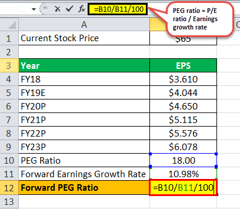

In the dynamic world of financial markets, understanding stock valuation is crucial for investors looking to make informed decisions. Investors employ various metrics to assess stock value, with the Price-to-Earnings (P/E) ratio and the Price/Earnings-to-Growth (PEG) ratio being particularly significant. The P/E ratio is calculated by dividing the market value per share by the earnings per share (EPS):

$$
\text{P/E Ratio} = \frac{\text{Market Value per Share}}{\text{Earnings per Share}}
$$



This ratio provides insights into what the market is willing to pay for a company's earnings, reflecting growth expectations and profitability. However, while the P/E ratio offers a snapshot of valuation relative to earnings, it does not consider future growth prospects. To address this, the PEG ratio incorporates expected earnings growth:

$$
\text{PEG Ratio} = \frac{\text{P/E Ratio}}{\text{Earnings Growth Rate}}
$$

These indicators help investors assess whether a stock is fairly valued, overvalued, or undervalued based on earnings performance and growth forecasts. A PEG of 1 suggests a fair valuation with respect to growth, while values below or above 1 indicate potential under or overvaluation.

Algorithmic trading has further enhanced the use of these metrics by automating complex trading processes. Algorithms can execute trades based on predefined rules that include P/E and PEG ratios, allowing for quick responses to market changes and reducing emotional biases in trading decisions. This article explores the importance of P/E and PEG ratios and their integration into algorithmic trading strategies, highlighting their role in advancing investment practices in the financial markets.

## Table of Contents

## Understanding the P/E Ratio

The Price-to-Earnings (P/E) ratio is a fundamental metric in financial analysis used to determine a stock's valuation. Defined as the ratio of a company's current share price to its earnings per share (EPS), the P/E ratio provides insight into what investors are willing to pay today for a dollar of earnings. The formula can be expressed as:

$$
\text{P/E Ratio} = \frac{\text{Market Value per Share}}{\text{Earnings per Share (EPS)}}
$$

This ratio reflects the market's expectations of a company's growth and profitability. Typically, a higher P/E ratio suggests that investors anticipate future growth and are willing to pay a premium for it. For example, companies in sectors with high growth potential, such as technology, often have elevated P/E ratios due to optimistic future earnings expectations.

Conversely, a lower P/E ratio may indicate that a stock is undervalued or that the company has limited growth prospects. However, it could also suggest other issues such as declining market confidence in the firm's future performance. Therefore, caution is warranted as a low P/E may not always signal a buying opportunity.

Additionally, the P/E ratio serves as a useful tool for comparing companies within the same industry. Since firms in the same sector experience similar economic conditions, comparing their P/E ratios can highlight potential investment opportunities or risks. However, it's essential to consider that the P/E ratio does not account for future earnings growth, making it important to complement this analysis with other metrics, such as the PEG ratio, for a more comprehensive view.

Overall, while the P/E ratio is instrumental in assessing stock pricing, it should ideally be used alongside other financial indicators to make well-informed investment decisions.

## Exploring the PEG Ratio

The Price/Earnings-to-Growth (PEG) ratio is a valuable metric for investors seeking a deeper understanding of stock valuation by incorporating future earnings growth, addressing the limitation of the traditional Price-to-Earnings (P/E) ratio. Unlike the P/E ratio, which only considers current earnings, the PEG ratio provides insights into how the market values a stock in relation to its expected growth, offering a more comprehensive perspective on its value.

The PEG ratio is calculated by dividing the P/E ratio by the expected earnings growth rate:

$$
\text{PEG Ratio} = \frac{\text{Price-to-Earnings (P/E) Ratio}}{\text{Earnings Growth Rate}}
$$

This formula illustrates how the PEG ratio balances a company's market valuation against its growth prospects, potentially revealing discrepancies between market pricing and growth potential.

Interpreting the PEG ratio aids investors in evaluating stock valuations beyond mere earnings figures. A PEG ratio of 1 signifies a stock is fairly valued, indicating that the market price is proportional to the company's earnings growth. A PEG ratio below 1 may suggest undervaluation, implying the stock is priced low relative to its growth potential. Conversely, a PEG ratio above 1 could indicate overvaluation, suggesting the stock price surpasses its growth expectations.

The PEG ratio is especially beneficial for analyzing companies within high-growth industries. In such sectors, traditional metrics like the P/E ratio may fail to capture the aggressive growth trajectories. By integrating growth forecasts, the PEG ratio presents a nuanced approach, helping investors identify stocks that may be undervalued despite high P/E ratios due to their robust growth prospects.

Incorporating the PEG ratio into investment strategies necessitates careful consideration of growth estimates, which can be speculative and reliant on accurate projections. Therefore, while the PEG ratio provides a more rounded view of a company's valuation, investors are advised to use it alongside other financial metrics and analyses to form a broader investment strategy.

## Limitations and Comparisons

Both the Price-to-Earnings (P/E) and Price/Earnings-to-Growth (PEG) ratios are influential tools in stock valuation, but they are not without their limitations. Understanding these limitations is crucial for investors seeking to make informed decisions.

The P/E ratio is a popular metric, easily understood and widely used. Calculated by dividing the market value per share by the earnings per share (EPS), the formula is:

$$
\text{P/E Ratio} = \frac{\text{Market Value per Share}}{\text{Earnings per Share (EPS)}}
$$

Despite its simplicity, the P/E ratio does not account for the future growth potential of a company. This omission can lead to an overvaluation or undervaluation of stocks, as it solely reflects current earnings without considering growth prospects. Consequently, high P/E ratios can be misinterpreted as overvaluation when they may, in fact, indicate expected future growth.

Conversely, the PEG ratio provides a corrective by incorporating growth expectations into valuation. Its formula is:

$$
\text{PEG Ratio} = \frac{\text{P/E Ratio}}{\text{Growth Rate of Earnings}}
$$

While the PEG ratio offers a more comprehensive perspective by integrating growth forecasts, its accuracy hinges on the reliability of these forecasts. Earnings growth projections can be speculative and subject to rapid change based on market conditions, industry trends, or macroeconomic factors. This uncertainty may result in misleading valuations if anticipated growth does not materialize.

Both ratios are often used simplistically, which can be misleading. Using these metrics in isolation may lead investors to overlook other significant financial indicators or qualitative factors affecting a company’s performance. Thus, these ratios should be a part of a broader analytical framework, alongside other financial metrics and qualitative evaluations.

Industry-specific context is vital when employing these ratios for comparisons. Companies within the same sector may exhibit different growth trajectories due to varying baseline valuations and market dynamics. For instance, technology firms, typically characterized by higher growth rates, may have higher P/E ratios than utilities companies, reflecting divergent market expectations. Therefore, cross-industry comparisons using P/E and PEG ratios should be approached cautiously to ensure accurate valuation assessments.

In practice, investors must remember these metrics are contingent on both historical performance and projected future performance, both of which can be fraught with uncertainties. Careful consideration and comprehensive analysis, possibly incorporating quantitative models or [algorithmic trading](/wiki/algorithmic-trading) systems, can enhance the reliability of investment decisions based on these ratios.

## Incorporating Algorithmic Trading

Algorithmic trading, often referred to as algo-trading, has significantly transformed the landscape of modern finance by employing advanced algorithms to execute trades at speeds and frequencies that are impossible for human traders. These algorithms rely on a combination of quantitative models and massive data analysis, facilitating swift and objective trading decisions. Key valuation metrics such as the Price-to-Earnings (P/E) ratio and the Price/Earnings-to-Growth (PEG) ratio are integral to this process, allowing algorithms to evaluate and compare stocks efficiently, thus capitalizing on emerging market opportunities.

By utilizing real-time data analysis, algorithms can identify market opportunities faster than traditional manual methods. For example, these systems can monitor stock prices, trading volumes, and other market signals to determine optimal entry and [exit](/wiki/exit-strategy) points for trades. The automation inherent in algorithmic trading also significantly reduces emotional biases, which can cloud human judgment, thereby ensuring a more disciplined and consistent investment strategy. 

Algorithmic trading is not limited to institutional investors; the democratization of fintech tools has enabled retail investors to access sophisticated algorithms. This broader access has increased market participation and allowed individual investors to leverage the same technologies used by large investment firms. Fintech platforms offer a range of customizable algorithmic trading tools that cater to various trading strategies, from simple moving average crossovers to complex statistical [arbitrage](/wiki/arbitrage) models.

An illustration of a basic algorithmic trading strategy using P/E and PEG ratios in Python could involve setting specific buy and sell thresholds based on these ratios:

```python
import pandas as pd

# Define thresholds
PE_threshold = 15
PEG_threshold = 1.0

# Assume 'data' is a DataFrame containing stock information with columns: 'Ticker', 'PE_Ratio', 'PEG_Ratio', etc.
def trading_decision(data):
    # Filter stocks within defined thresholds
    buy_signals = data[(data['PE_Ratio'] < PE_threshold) & (data['PEG_Ratio'] < PEG_threshold)]
    sell_signals = data[(data['PE_Ratio'] > PE_threshold) & (data['PEG_Ratio'] > PEG_threshold)]
    return buy_signals, sell_signals

# Example usage
stock_data = pd.DataFrame({
    'Ticker': ['AAPL', 'GOOGL', 'MSFT'],
    'PE_Ratio': [12, 18, 14],
    'PEG_Ratio': [0.9, 1.2, 0.8]
})

buy, sell = trading_decision(stock_data)
print("Buy signals:", buy)
print("Sell signals:", sell)
```

This code demonstrates a straightforward approach to generating buy and sell signals based on predefined P/E and PEG thresholds. While simplistic, such models can be expanded with more complex criteria and integrated into larger algorithmic frameworks to enhance decision-making precision.

Algorithmic trading's reliance on quantitative analysis and real-time data processing marks a pivotal shift in how trades are executed and portfolios are managed. With advancements in technology and increasing data availability, the scope and effectiveness of algorithmic trading continue to grow, making it a staple in modern financial markets.

## Real-World Applications and Case Studies

Investment firms have increasingly integrated algorithmic trading strategies that make use of the Price-to-Earnings (P/E) and the Price/Earnings-to-Growth (PEG) ratios, recognizing their potential in identifying viable investment opportunities. These ratios serve a significant role in distinguishing stocks with favorable growth to market price ratios, providing a quantitative approach to stock selection.

Case studies in the financial sector highlight the efficacy of targeting stocks with PEG ratios below a set threshold. A PEG ratio below 1 typically suggests that a stock may be undervalued relative to its expected growth. Investment algorithms can systematically scan for such opportunities, rapidly filtering through vast datasets to uncover stocks that conventional methods may overlook. By emphasizing stocks with a lower PEG, investment firms are able to construct portfolios that are poised for potential uplift, as the valuation suggests room for appreciation given the projected earnings growth.

Algorithmic strategies significantly enhance portfolio performance, notably by reducing human biases that can impede decision-making. These algorithms process real-time data to identify and capitalize on fleeting market opportunities swiftly. For example, an algorithm might be programmed to execute a buy order for stocks with a P/E ratio below the industry median and a PEG ratio below 1, optimizing entry points without the emotional interference typical of human traders.

To further refine strategy efficacy, firms employ [backtesting](/wiki/backtesting), a process that uses historical data to simulate the performance of trading strategies. This is crucial in assessing how strategies would perform in different market conditions, allowing for risk management and optimization of returns. Python, with its robust data analysis libraries such as Pandas and NumPy, is often used to implement backtesting. For instance:

```python
import pandas as pd
import numpy as np

# Assuming 'historical_data' is a DataFrame with historical stock prices, P/E and PEG ratios
def backtest_strategy(historical_data):
    # Example strategy: buy when PEG < 1 and P/E is in the lower quartile
    buy_signals = (historical_data['PEG'] < 1) & (historical_data['P/E'] < historical_data['P/E'].quantile(0.25))

    # Calculate returns
    historical_data['Returns'] = historical_data['Close'].pct_change()
    strategy_returns = historical_data['Returns'][buy_signals].sum()

    return strategy_returns

# Example usage
historical_data = pd.DataFrame({'Close': [...], 'P/E': [...], 'PEG': [...]})
returns = backtest_strategy(historical_data)
print(f"Total Strategy Returns: {returns}")
```

Through such algorithmic interventions and historical analysis, investment firms can develop strategies that are not only statistically sound but are also robust against market [volatility](/wiki/volatility-trading-strategies). These advancements underscore the importance of quantitative metrics like P/E and PEG, transforming them into pivotal tools within algorithm-driven trading paradigms.

## Conclusion

P/E and PEG ratios are vital tools for evaluating stock value, offering investors insights into market prices relative to a company's earnings and growth prospects. The P/E ratio, calculated as the market value per share divided by earnings per share, provides a straightforward metric for assessing how a stock is valued based on earnings. Meanwhile, the PEG ratio refines this evaluation by incorporating expected earnings growth, providing a broader perspective and addressing potential limitations of the P/E ratio.

Algorithmic trading has significantly advanced the practical application of these metrics. By automating trading processes, algorithms can analyze vast amounts of data swiftly and execute trades based on pre-defined rules or models. This automation reduces human error and emotion-driven decisions, resulting in more disciplined and efficient investment strategies. Algorithms incorporating P/E and PEG ratios can react to market changes in real time, capitalizing on opportunities that might be missed in manual trading settings.

Despite their usefulness, both P/E and PEG ratios have inherent limitations. P/E ratios might not fully account for future growth potential, while the accuracy of PEG ratios relies on growth forecasts, which can be uncertain. Therefore, these metrics should be part of a comprehensive analysis framework that considers multiple factors and comparisons within industry contexts.

In conclusion, mastering these ratios and employing algorithmic trading strategies can significantly enhance an investor's ability to make informed and successful investment decisions in today's complex markets. A well-rounded approach, leveraging both traditional metrics and modern trading technologies, can optimize returns and manage risk effectively.

## References & Further Reading

[1]: 'Security Analysis' by Benjamin Graham and David Dodd  
This book is a foundational text in the field of value investing, providing deep insights into financial statement analysis and the concept of intrinsic value. Graham and Dodd introduce important concepts like the margin of safety, which is critical for making informed investment decisions based on a company's earnings and financial health.

[2]: 'The Intelligent Investor' by Benjamin Graham  
Often regarded as the definitive book on value investing, 'The Intelligent Investor' offers timeless principles for achieving investment success. Graham emphasizes the importance of analyzing a company's long-term prospects and its stock valuation, which are fundamental considerations when using the P/E and PEG ratios for investment evaluation.

[3]: 'Common Stocks and Uncommon Profits' by Philip Fisher  
Philip Fisher's book highlights qualitative factors in investment analysis, such as a company's management and competitive advantage, that can complement quantitative metrics like the P/E and PEG ratios. Understanding these qualitative aspects can provide a more comprehensive view of a stock's potential.

[4]: 'Valuation: Measuring and Managing the Value of Companies' by McKinsey & Company Inc.  
This guide offers modern techniques for valuing companies, which are essential for interpreting metrics like the P/E and PEG ratios. It details the nuances of discount rates, cash flow models, and growth assumptions, critical for investors aiming to measure company performance accurately.

[5]: 'Algorithmic Trading and DMA: An Introduction to Direct Access Trading Strategies' by Barry Johnson  
Johnson's work is an introductory resource on the mechanisms of algorithmic trading, elaborating on how these systems use indicators like P/E and PEG ratios for rapid decision-making. The book explains the integration of technical and [fundamental analysis](/wiki/fundamental-analysis) within algorithmic trading strategies to enhance market efficiency.

[6]: 'High-Frequency Trading: A Practical Guide to Algorithmic Strategies and Trading Systems' by Irene Aldridge  
Aldridge’s book explores the technical and strategic aspects of high-frequency trading, which benefits from the incorporation of key finance metrics. This guide demonstrates how the application of stock valuation ratios within algorithmic systems can improve trade execution and market responses, thus making it a valuable reference for those interested in the intersection of finance and technology.

