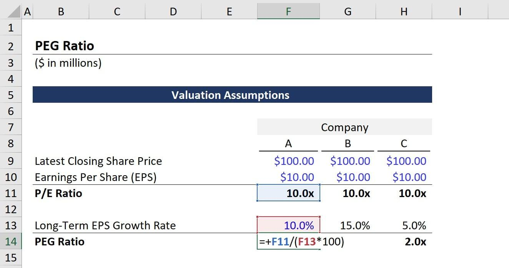

## Table of Contents

## What is the Price-to-Earnings (P/E) ratio?

The Price-to-Earnings (P/E) ratio is a way to figure out how much people are willing to pay for a company's earnings. It's calculated by dividing the current stock price by the company's earnings per share (EPS). The P/E ratio helps investors see if a stock is a good buy. A high P/E ratio might mean that people expect the company to grow a lot in the future. A low P/E ratio might mean the company is not expected to grow much or might be undervalued.

Using the P/E ratio can help investors compare different companies. For example, if one company has a P/E ratio of 15 and another has a P/E ratio of 30, the second company's stock is more expensive relative to its earnings. However, it's important to compare companies in the same industry because P/E ratios can vary a lot between different sectors. Also, the P/E ratio is just one tool among many that investors use to make decisions about buying or selling stocks.

## How do you calculate the P/E ratio?

To calculate the P/E ratio, you need two numbers: the current stock price and the earnings per share (EPS). The stock price is how much one share of the company costs right now. You can find this easily on any financial website or stock market app. The EPS is how much money the company made for each share over the last year. You can usually find this in the company's financial reports or on financial news websites. Once you have these two numbers, you divide the stock price by the EPS. The result is the P/E ratio.

For example, if a company's stock is trading at $50 per share and its EPS is $2, the P/E ratio would be $50 divided by $2, which equals 25. This means investors are willing to pay $25 for every $1 of the company's earnings. The P/E ratio helps investors understand if a stock might be a good buy. A high P/E ratio can mean people expect the company to grow a lot in the future, while a low P/E ratio might mean the company is not expected to grow much or could be undervalued.

## What does a high P/E ratio indicate about a company?

A high P/E ratio means that people are willing to pay a lot of money for the company's earnings. This usually happens when investors think the company will do really well in the future. They believe the company will make more money, so they are happy to pay more for the stock now. For example, if a company has a P/E ratio of 50, it means investors are willing to pay $50 for every $1 of earnings, which shows they have high hopes for the company's growth.

However, a high P/E ratio can also mean the stock might be too expensive. If the company doesn't grow as much as people expect, the stock price could go down. It's important for investors to look at other things too, like how the company is doing compared to others in the same industry. A high P/E ratio is not a guarantee of future success, but it does show what investors think about the company's future.

## What does a low P/E ratio suggest about a company's stock?

A low P/E ratio means that the stock price is low compared to the company's earnings. This can suggest that the stock might be a good deal because investors are not paying much for each dollar of earnings. For example, if a company has a P/E ratio of 10, it means investors are only willing to pay $10 for every $1 of earnings, which could mean the stock is undervalued.

However, a low P/E ratio can also mean that people don't think the company will grow much in the future. If investors don't have high hopes for the company, they won't be willing to pay a lot for the stock. It's important for investors to look at other information too, like how the company is doing compared to others in the same industry, to make a good decision about whether to buy the stock.

## What is the Price/Earnings to Growth (PEG) ratio?

The Price/Earnings to Growth (PEG) ratio is a way to see if a stock's price is a good deal when you think about how fast the company is growing. It takes the P/E ratio and divides it by the company's expected earnings growth rate. This helps investors figure out if a stock is worth the price, even if it has a high P/E ratio. If a company is growing quickly, a higher P/E ratio might be okay because the company's earnings are expected to go up a lot in the future.

For example, if a company has a P/E ratio of 20 and its earnings are expected to grow by 10% each year, the PEG ratio would be 20 divided by 10, which equals 2. A PEG ratio of less than 1 is often seen as a sign that the stock might be a good buy because the price is low compared to how fast the company is growing. But, like the P/E ratio, the PEG ratio is just one tool. Investors should use it along with other information to make smart choices about buying or selling stocks.

## How is the PEG ratio calculated?

The PEG ratio is calculated by dividing the P/E ratio by the company's expected earnings growth rate. The P/E ratio is found by dividing the current stock price by the earnings per share (EPS). The expected earnings growth rate is usually given as a percentage and can be found in financial reports or analyst forecasts.

For example, if a company has a P/E ratio of 15 and its earnings are expected to grow by 5% each year, the PEG ratio would be 15 divided by 5, which equals 3. A PEG ratio of less than 1 is often seen as a good sign because it means the stock price is low compared to how fast the company is growing. But, the PEG ratio is just one tool, and investors should use it along with other information to make smart choices about buying or selling stocks.

## Why is the PEG ratio considered a better valuation metric than the P/E ratio alone?

The PEG ratio is considered better than the P/E ratio alone because it takes into account the company's growth. The P/E ratio just tells you how much people are willing to pay for the company's earnings right now. But the PEG ratio adds in how fast the company is expected to grow in the future. This helps investors see if a stock is a good buy even if it has a high P/E ratio. If a company is growing quickly, a higher P/E ratio might be okay because the company's earnings are expected to go up a lot.

Using the PEG ratio can help investors make smarter choices. For example, if two companies have the same P/E ratio but one is growing faster, the PEG ratio will show that the faster-growing company might be a better buy. A PEG ratio of less than 1 is often seen as a good sign because it means the stock price is low compared to how fast the company is growing. But, the PEG ratio is just one tool, and it's important to use it along with other information to make smart choices about buying or selling stocks.

## How can the PEG ratio be used to compare companies within the same industry?

The PEG ratio helps investors compare companies within the same industry by showing how much they are paying for growth. If two companies have the same P/E ratio but one is growing faster, the PEG ratio will be lower for the faster-growing company. This means the faster-growing company might be a better buy because investors are paying less for each unit of growth. For example, if Company A and Company B both have a P/E ratio of 20, but Company A is expected to grow earnings by 10% each year and Company B by 5%, Company A's PEG ratio would be 2 and Company B's would be 4. Investors might see Company A as a better value because its PEG ratio is lower.

However, the PEG ratio is not perfect and should be used with other information. Things like the company's debt, how it's doing compared to others in the industry, and what's happening in the economy can all affect whether a stock is a good buy. The PEG ratio can help investors see which companies might be undervalued or overvalued based on their growth, but it's just one piece of the puzzle. By looking at the PEG ratio along with other metrics, investors can make smarter choices about which stocks to buy or sell.

## What are the limitations of using the P/E and PEG ratios for stock valuation?

Using the P/E and PEG ratios for stock valuation has some limitations. One big problem is that these ratios rely on predictions about the future. The P/E ratio uses the company's past earnings, but the PEG ratio uses guesses about how fast the company will grow. If these guesses are wrong, the ratios won't help much. Also, different industries have different normal P/E and PEG ratios. A P/E ratio that's high for one industry might be normal for another. This makes it hard to compare companies in different industries just by looking at their P/E or PEG ratios.

Another limitation is that the P/E and PEG ratios don't tell the whole story about a company. They don't show things like how much debt the company has, or if it's facing big challenges or opportunities. For example, a company might have a low P/E ratio because it's struggling, not because it's a good deal. And the PEG ratio can be tricky because it's hard to predict growth accurately. Companies can grow faster or slower than expected, which can make the PEG ratio less useful. So, while the P/E and PEG ratios can be helpful, investors need to look at other information too to make smart choices about buying or selling stocks.

## How do different accounting practices affect the P/E and PEG ratios?

Different accounting practices can change how a company's earnings look, which can affect the P/E and PEG ratios. For example, if a company uses one way to count its earnings and another company uses a different way, their P/E ratios might not be fair to compare. One company might seem to have higher earnings because of how it counts things like depreciation or how it handles inventory. This can make its P/E ratio look lower, even if the companies are similar in other ways.

Also, the PEG ratio can be affected by these accounting differences because it uses the P/E ratio and the expected growth rate. If the earnings numbers are different because of accounting practices, the PEG ratio can be off too. Investors need to be careful when they compare companies using these ratios. They should look at how the companies do their accounting to make sure they're comparing apples to apples, not apples to oranges.

## What advanced techniques can be used to refine P/E and PEG ratio calculations?

To make P/E and PEG ratios more useful, investors can use something called normalized earnings. This means looking at the company's earnings over several years instead of just one year. By doing this, you can get a better idea of what the company usually earns, without being thrown off by one really good or really bad year. Another way to refine these ratios is by using forward P/E ratios, which use predictions about next year's earnings instead of last year's. This can be helpful because it gives you a better idea of what might happen in the future, but it also depends on how accurate those predictions are.

Investors can also adjust the P/E and PEG ratios for things like the company's debt or how much money it has in the bank. A company with a lot of debt might have a lower P/E ratio, but that doesn't mean it's a good buy if the debt is a big problem. By looking at other numbers along with the P/E and PEG ratios, you can get a fuller picture of the company's health. This can help you make smarter choices about buying or selling stocks, but it's still important to remember that no single number can tell you everything you need to know about a company.

## How can investors use P/E and PEG ratios in conjunction with other financial metrics for a comprehensive analysis?

Investors can use P/E and PEG ratios along with other financial metrics to get a full picture of a company's value and future growth. For example, they might look at the company's debt-to-equity ratio to see how much debt the company has compared to its equity. A high debt-to-equity ratio can mean the company is risky, even if its P/E and PEG ratios look good. They can also check the company's return on equity (ROE), which shows how well the company is using its money to make more money. A high ROE can be a sign that the company is doing well, making the P/E and PEG ratios more meaningful.

Another important metric is the price-to-book (P/B) ratio, which compares the stock price to the company's book value. This can help investors see if the stock is a good deal compared to what the company owns. By combining these metrics with P/E and PEG ratios, investors can see if a company's stock is priced right and if it has good growth prospects. But it's important to remember that no single number tells the whole story. Using all these metrics together helps investors make smarter choices about buying or selling stocks.

## What is the P/E Ratio and how do we understand it?

The Price-to-Earnings (P/E) ratio is a fundamental metric in financial analysis used to determine a stock's valuation. Defined as the ratio of a company's current share price to its earnings per share (EPS), the P/E ratio provides insight into what investors are willing to pay today for a dollar of earnings. The formula can be expressed as:

$$
\text{P/E Ratio} = \frac{\text{Market Value per Share}}{\text{Earnings per Share (EPS)}}
$$

This ratio reflects the market's expectations of a company's growth and profitability. Typically, a higher P/E ratio suggests that investors anticipate future growth and are willing to pay a premium for it. For example, companies in sectors with high growth potential, such as technology, often have elevated P/E ratios due to optimistic future earnings expectations.

Conversely, a lower P/E ratio may indicate that a stock is undervalued or that the company has limited growth prospects. However, it could also suggest other issues such as declining market confidence in the firm's future performance. Therefore, caution is warranted as a low P/E may not always signal a buying opportunity.

Additionally, the P/E ratio serves as a useful tool for comparing companies within the same industry. Since firms in the same sector experience similar economic conditions, comparing their P/E ratios can highlight potential investment opportunities or risks. However, it's essential to consider that the P/E ratio does not account for future earnings growth, making it important to complement this analysis with other metrics, such as the PEG ratio, for a more comprehensive view.

Overall, while the P/E ratio is instrumental in assessing stock pricing, it should ideally be used alongside other financial indicators to make well-informed investment decisions.

## What is the PEG Ratio and how can it be explored?

The Price/Earnings-to-Growth (PEG) ratio is a valuable metric for investors seeking a deeper understanding of stock valuation by incorporating future earnings growth, addressing the limitation of the traditional Price-to-Earnings (P/E) ratio. Unlike the P/E ratio, which only considers current earnings, the PEG ratio provides insights into how the market values a stock in relation to its expected growth, offering a more comprehensive perspective on its value.

The PEG ratio is calculated by dividing the P/E ratio by the expected earnings growth rate:

$$
\text{PEG Ratio} = \frac{\text{Price-to-Earnings (P/E) Ratio}}{\text{Earnings Growth Rate}}
$$

This formula illustrates how the PEG ratio balances a company's market valuation against its growth prospects, potentially revealing discrepancies between market pricing and growth potential.

Interpreting the PEG ratio aids investors in evaluating stock valuations beyond mere earnings figures. A PEG ratio of 1 signifies a stock is fairly valued, indicating that the market price is proportional to the company's earnings growth. A PEG ratio below 1 may suggest undervaluation, implying the stock is priced low relative to its growth potential. Conversely, a PEG ratio above 1 could indicate overvaluation, suggesting the stock price surpasses its growth expectations.

The PEG ratio is especially beneficial for analyzing companies within high-growth industries. In such sectors, traditional metrics like the P/E ratio may fail to capture the aggressive growth trajectories. By integrating growth forecasts, the PEG ratio presents a nuanced approach, helping investors identify stocks that may be undervalued despite high P/E ratios due to their robust growth prospects.

Incorporating the PEG ratio into investment strategies necessitates careful consideration of growth estimates, which can be speculative and reliant on accurate projections. Therefore, while the PEG ratio provides a more rounded view of a company's valuation, investors are advised to use it alongside other financial metrics and analyses to form a broader investment strategy.

## What are the limitations and how do they compare?

Both the Price-to-Earnings (P/E) and Price/Earnings-to-Growth (PEG) ratios are influential tools in stock valuation, but they are not without their limitations. Understanding these limitations is crucial for investors seeking to make informed decisions.

The P/E ratio is a popular metric, easily understood and widely used. Calculated by dividing the market value per share by the earnings per share (EPS), the formula is:

$$
\text{P/E Ratio} = \frac{\text{Market Value per Share}}{\text{Earnings per Share (EPS)}}
$$

Despite its simplicity, the P/E ratio does not account for the future growth potential of a company. This omission can lead to an overvaluation or undervaluation of stocks, as it solely reflects current earnings without considering growth prospects. Consequently, high P/E ratios can be misinterpreted as overvaluation when they may, in fact, indicate expected future growth.

Conversely, the PEG ratio provides a corrective by incorporating growth expectations into valuation. Its formula is:

$$
\text{PEG Ratio} = \frac{\text{P/E Ratio}}{\text{Growth Rate of Earnings}}
$$

While the PEG ratio offers a more comprehensive perspective by integrating growth forecasts, its accuracy hinges on the reliability of these forecasts. Earnings growth projections can be speculative and subject to rapid change based on market conditions, industry trends, or macroeconomic factors. This uncertainty may result in misleading valuations if anticipated growth does not materialize.

Both ratios are often used simplistically, which can be misleading. Using these metrics in isolation may lead investors to overlook other significant financial indicators or qualitative factors affecting a company’s performance. Thus, these ratios should be a part of a broader analytical framework, alongside other financial metrics and qualitative evaluations.

Industry-specific context is vital when employing these ratios for comparisons. Companies within the same sector may exhibit different growth trajectories due to varying baseline valuations and market dynamics. For instance, technology firms, typically characterized by higher growth rates, may have higher P/E ratios than utilities companies, reflecting divergent market expectations. Therefore, cross-industry comparisons using P/E and PEG ratios should be approached cautiously to ensure accurate valuation assessments.

In practice, investors must remember these metrics are contingent on both historical performance and projected future performance, both of which can be fraught with uncertainties. Careful consideration and comprehensive analysis, possibly incorporating quantitative models or [algorithmic trading](/wiki/algorithmic-trading) systems, can enhance the reliability of investment decisions based on these ratios.

## References & Further Reading

[1]: 'Security Analysis' by Benjamin Graham and David Dodd  
This book is a foundational text in the field of value investing, providing deep insights into financial statement analysis and the concept of intrinsic value. Graham and Dodd introduce important concepts like the margin of safety, which is critical for making informed investment decisions based on a company's earnings and financial health.

[2]: 'The Intelligent Investor' by Benjamin Graham  
Often regarded as the definitive book on value investing, 'The Intelligent Investor' offers timeless principles for achieving investment success. Graham emphasizes the importance of analyzing a company's long-term prospects and its stock valuation, which are fundamental considerations when using the P/E and PEG ratios for investment evaluation.

[3]: 'Common Stocks and Uncommon Profits' by Philip Fisher  
Philip Fisher's book highlights qualitative factors in investment analysis, such as a company's management and competitive advantage, that can complement quantitative metrics like the P/E and PEG ratios. Understanding these qualitative aspects can provide a more comprehensive view of a stock's potential.

[4]: 'Valuation: Measuring and Managing the Value of Companies' by McKinsey & Company Inc.  
This guide offers modern techniques for valuing companies, which are essential for interpreting metrics like the P/E and PEG ratios. It details the nuances of discount rates, cash flow models, and growth assumptions, critical for investors aiming to measure company performance accurately.

[5]: 'Algorithmic Trading and DMA: An Introduction to Direct Access Trading Strategies' by Barry Johnson  
Johnson's work is an introductory resource on the mechanisms of algorithmic trading, elaborating on how these systems use indicators like P/E and PEG ratios for rapid decision-making. The book explains the integration of technical and [fundamental analysis](/wiki/fundamental-analysis) within algorithmic trading strategies to enhance market efficiency.

[6]: 'High-Frequency Trading: A Practical Guide to Algorithmic Strategies and Trading Systems' by Irene Aldridge  
Aldridge’s book explores the technical and strategic aspects of high-frequency trading, which benefits from the incorporation of key finance metrics. This guide demonstrates how the application of stock valuation ratios within algorithmic systems can improve trade execution and market responses, thus making it a valuable reference for those interested in the intersection of finance and technology.

