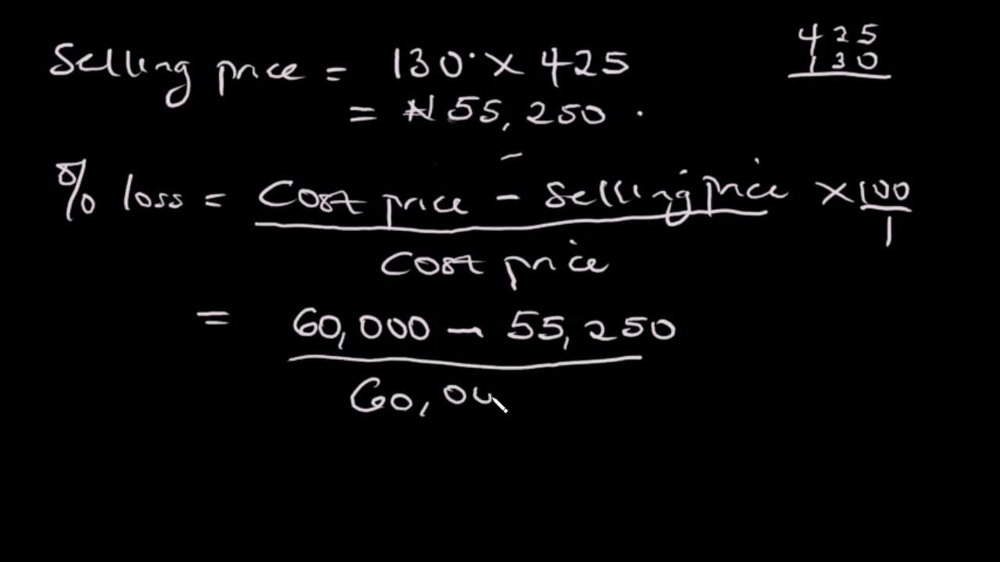

Percentage gains and losses are fundamental concepts in the domain of investment, serving as critical indicators of performance over time. These metrics provide a way to quantify the changes in the value of an investment relative to its original value, allowing investors to assess the profitability or loss incurred. Unlike absolute changes, which only show the numerical increase or decrease in value, percentage changes contextualize these figures, making them more meaningful and comparable across different investments.

Calculating the percentage change involves a straightforward formula: 



$$
\text{Percentage Change} = \left(\frac{\text{Final Value} - \text{Initial Value}}{\text{Initial Value}}\right) \times 100
$$

This calculation allows investors to evaluate performance in a standardized manner, regardless of the size or type of the investment. Whether dealing with stocks, real estate, or any other financial asset, this method helps in determining the efficiency of an investment by highlighting the proportionate change in value.

Algorithmic trading has emerged as a revolutionary approach in financial markets, leveraging advanced computational techniques to optimize investment strategies. By automating decision-making processes, algorithms can execute trades at speeds and frequencies that human traders cannot achieve. This aspect of trading is particularly relevant when managing complex portfolios, where the consistent and accurate calculation of percentage gains or losses is crucial. Algorithms can manage vast datasets, continuously calculating these metrics, and adjusting strategies accordingly to maximize returns or minimize risks. 

The reliability of percentage change as an indicator of investment success stems from its capacity to offer a clear, unbiased measurement of performance. It allows investors to compare varied portfolios and market opportunities, facilitating informed investment decisions. Moreover, when integrated with algorithmic trading, percentage change calculations underpin strategies focused on optimizing performance and adapting to market conditions dynamically.

In summary, understanding percentage gains and losses is vital for evaluating investment performance, with algorithmic trading providing sophisticated methods to enhance these evaluations. Together, they empower investors to achieve greater accuracy and efficacy in their investment strategies.

## Table of Contents

## Understanding Percentage Gain and Loss

Percentage gain and loss are crucial concepts in the investment domain, providing a standardized measure to evaluate how an investment has performed relative to its original value. Understanding these concepts helps investors assess the effectiveness of their investment strategies and make more informed decisions.

Percentage gain in investment indicates the increase in value of a financial asset over time, relative to its initial value. Conversely, percentage loss represents the decrease in an investment's value. These measures are essential because they provide a normalized view of investment performance, making it easier to compare across different assets and timeframes.

The formula for calculating percentage gain or loss is given by:

$$
\text{Percentage Gain/Loss} = \left(\frac{\text{Ending Value} - \text{Beginning Value}}{\text{Beginning Value}}\right) \times 100
$$

This formula computes the relative change in the value of an asset, expressing it as a percentage of its original value. By quantifying changes in percentage terms, investors can effectively track the performance of their investments over time and across varying market conditions.

Consider an example where an investor purchases a stock at $100 and, over time, its price increases to $150. The percentage gain can be calculated as follows:

$$
\text{Percentage Gain} = \left(\frac{150 - 100}{100}\right) \times 100 = 50\%
$$

In a scenario where the same stock's price decreases from $100 to $70, the percentage loss calculation would be:

$$
\text{Percentage Loss} = \left(\frac{70 - 100}{100}\right) \times 100 = -30\%
$$

These calculations illuminate not only the absolute gain or loss but how significant these changes are in relation to the initial investment. This standardized measurement is particularly useful for comparing the performance of different investments, regardless of their size or market value.

Overall, percentage gain and loss calculations provide foundational insights into how investments perform over time, serving as a reliable indicator of investment success and the effectiveness of trading strategies.

## Significance of Percentage Gain or Loss in Investment

Percentage metrics provide a comprehensive view of investment performance by offering a relative measure of gains or losses. Unlike absolute metrics, which may only reveal the numerical change in value, percentage changes contextualize investment performance by considering the initial value, thus ensuring relevance across different scales of investment.

Percentage metrics facilitate the comparison of various investments, regardless of their individual sizes or market values. For instance, an absolute gain of $500 on a $5,000 investment represents a 10% increase, while the same absolute gain on a $50,000 investment reflects a mere 1% increase. This relativity allows investors to compare performance across different assets on an equal footing. By calculating the change as a percentage, investors can identify which investments have yielded higher returns relative to their initial cost, thus making informed decisions about where to allocate resources.

To calculate the percentage gain or loss, the following formula is typically employed:

$$
\text{Percentage Change} = \left( \frac{\text{Final Value} - \text{Initial Value}}{\text{Initial Value}} \right) \times 100
$$

This formula helps in deriving a clear and standardized metric for assessing and comparing investment outcomes.

Percentage metrics also play a crucial role in evaluating risk and profitability. The [volatility](/wiki/volatility-trading-strategies) of an investment — its tendency to fluctuate in value — is often expressed as a percentage, reflecting the range within which returns can vary. For example, a stock with a historical volatility of 5% is generally considered less risky than one with a 20% volatility. Moreover, profitability assessments rely heavily on percentage changes as they offer insights into the growth or decline potential of an asset in relation to its cost.

When assessing risk, one might employ metrics like the Sharpe Ratio, which considers both the percentage return of an investment and its volatility. This ratio helps investors understand the risk-adjusted return, allowing for better risk management strategies. In the context of profitability, percentage metrics assist in determining profit margins, both at the level of individual investments and aggregated portfolios, providing a clear indication of financial health and performance.

In summary, percentage metrics enhance understanding by offering a standardized way to measure, compare, and manage investment performance, risk, and profitability, thereby serving as indispensable tools for investor decision-making and strategy development.

## Algorithmic Trading: Overview and Importance

Algorithmic trading, also known as algo trading or automated trading, refers to the use of computer algorithms to execute trades in financial markets. These algorithms are designed to [carry](/wiki/carry-trading) out specific trading instructions, such as timing, price, and [volume](/wiki/volume-trading-strategy), with minimal human intervention. This approach has transformed modern finance by enhancing the speed and efficiency of trade executions and by allowing traders to handle larger volumes of data more effectively. 

The primary function of [algorithmic trading](/wiki/algorithmic-trading) in contemporary finance is to optimize trading strategies through automation, thereby reducing transaction costs, mitigating the impact of human errors, and leveraging opportunities across diverse markets and asset classes. Algorithms can operate based on pre-defined criteria, such as market conditions and trading signals, ensuring consistency in trading strategies and reducing emotional decision-making.

Key strategies employed in algorithmic trading include [trend following](/wiki/trend-following) and mean reversion. Trend following strategies attempt to capitalize on long-term market movements by identifying and joining existing market trends. These strategies are often implemented using techniques such as moving averages, where an algorithm trades based on the comparison of short-term and long-term moving averages. For example, a simple moving average crossover strategy might initiate a buy signal when a short-term moving average crosses above a long-term moving average, indicating a potential uptrend.

Mean reversion strategies, on the other hand, are based on the assumption that prices will eventually move back to their historical average. This strategy involves identifying when an asset is overbought or oversold and placing trades that anticipate a return to the mean. Algorithms deploying mean reversion strategies often use indicators such as Bollinger Bands or the Relative Strength Index (RSI) to signal potential reversals.

The role of algorithms in improving investment decision-making is significant. They can process large datasets swiftly, enabling traders to analyze complex market trends and execute trades at optimal times. By employing [machine learning](/wiki/machine-learning) and [artificial intelligence](/wiki/ai-artificial-intelligence) technologies, algorithms can adapt and refine their strategies in real-time, reacting to market changes more promptly than human traders. This capability not only enhances the accuracy of trading predictions but also allows for the continuous evaluation of risk and reward, optimizing portfolio performance.

Moreover, algorithms facilitate [backtesting](/wiki/backtesting), a process whereby historical data is used to test trading strategies to determine their viability before deploying them in live markets. This enables traders to evaluate the potential effectiveness of different strategies under various market conditions, contributing to more informed investment decisions. As algorithmic trading continues to evolve, it plays a pivotal role in shaping the landscape of modern financial markets, offering enhanced precision, scalability, and sophistication in executing trading strategies.

## Calculating Percentage Gain/Loss with Algorithms

Calculating percentage gain or loss is fundamental to evaluating investment performance, providing a standardized method to assess returns relative to initial investment costs. Algorithms can significantly simplify and automate these calculations, enhancing accuracy and efficiency, especially when dealing with vast financial datasets.

### Step-by-Step Guide on Using Algorithms

1. **Data Collection**: First, gather historical pricing data for the investment in question. This data typically includes the opening, closing, high, and low prices for specific time intervals, such as daily or hourly.

2. **Initial and Final Prices**: Identify the initial purchase price and subsequent selling price for the investment. For example, if analyzing a stock's performance over a year, the initial price might be the stock's price at the beginning of the year, and the final price might be at the year's end.

3. **Calculation Formula**:
   The basic formula for calculating percentage gain/loss is:
$$
   \text{Percentage Gain/Loss} = \left(\frac{\text{Final Price} - \text{Initial Price}}{\text{Initial Price}}\right) \times 100

$$

   This formula can be implemented in Python to automate the calculation over various datasets. Below is a simple Python script to carry out this process:

   ```python
   def calculate_percentage_change(initial_price, final_price):
       return ((final_price - initial_price) / initial_price) * 100

   # Example usage:
   initial_price = 100
   final_price = 150
   percentage_change = calculate_percentage_change(initial_price, final_price)
   print(f"Percentage Change: {percentage_change}%")
   ```

4. **Implementation of Algorithmic Tools**: Numerous algorithmic tools can assist with these calculations by providing frameworks for handling large datasets and performing complex analytical tasks. Tools like Python’s Pandas library or specialized financial packages enable efficient processing of financial data.

### Examples of Algorithmic Tools

- **Pandas Library**: An open-source data analysis and manipulation tool for Python. It provides data structures for fast data processing, ideal for financial calculations.

- **NumPy**: Used for numerical calculations; its array-oriented calculations enable efficient data handling, particularly beneficial in computing percentage changes for multiple datasets simultaneously.

### Integration into Algorithmic Strategies

The automation of percentage gain/loss calculations is a foundational aspect of broader algorithmic trading strategies. These calculations can be integrated with other financial models to trigger buy or sell signals based on predefined criteria. For example, an algorithm could be programmed to execute trades if the percentage gain exceeds a certain threshold, indicating potential profit-taking.

Algorithmic trading systems often incorporate other statistical tools and machine learning models to enhance decision-making processes, combining historical price data analysis, sentiment analysis, and predictive modeling to refine trading strategies further. As these systems adapt to real-time financial market movements, the incorporation of automated percentage gain/loss calculations remains a central element in maximizing investment returns while minimizing risk.

## Examples of Investment Calculations

In evaluating the performance of investments, understanding percentage gains and losses is imperative. This section provides case studies that illustrate these concepts, considering the intricacies of fees and dividends to enhance accuracy in real-world applications.

### Case Studies

#### Stock Example: Apple Inc. (AAPL)

Consider an investment in Apple Inc. (AAPL). On January 1st, an investor purchases 100 shares at $150 each. By December 31st, the price increases to $180. During the year, Apple pays dividends totaling $3 per share. To calculate the total percentage gain, both the price change and the dividends need consideration.

**Step 1: Calculate Price Gain**

Price gain per share = Final price - Initial price = $180 - $150 = $30

**Step 2: Calculate Dividend Gain**

Dividend gain per share = $3

**Step 3: Total Gain Per Share**

Total gain per share = Price gain + Dividend gain = $30 + $3 = $33

**Step 4: Percentage Gain**

Percentage gain = $\left(\frac{\text{Total gain per share}}{\text{Initial price}}\right) \times 100$

Percentage gain = $\left(\frac{33}{150}\right) \times 100 \approx 22\%$

#### Index Example: S&P 500

An investor decides to invest in the S&P 500 index. Suppose on January 1st, the index is at 3,000 points and it rises to 3,300 points by the year's end. The index yields a dividend equivalent of 2% annually. To compute the percentage gain:

**Step 1: Calculate Price Gain**

Price gain = Final value - Initial value = 3,300 - 3,000 = 300 points

**Step 2: Calculate Dividend Yield Gain**

Dividend yield gain = 2% of Initial value = 0.02 x 3,000 = 60 points

**Step 3: Total Gain**

Total gain = Price gain + Dividend yield gain = 300 + 60 = 360 points

**Step 4: Percentage Gain**

Percentage gain = $\left(\frac{\text{Total gain}}{\text{Initial value}}\right) \times 100$

Percentage gain = $\left(\frac{360}{3,000}\right) \times 100 = 12\%$

### Incorporating Fees

For a more comprehensive analysis, the impact of transaction fees must be included. Assume a 1% fee on the initial investment.

In the Apple Inc. example, the transaction fee for purchasing 100 shares at $150 each with a 1% fee is:

Transaction fee = 1% of (100 shares x $150/share) = $150

Adjusting the gain calculation:

Net initial investment = Total initial investment - Transaction fee = 15,000 - 150 = 14,850

Recalculate percentage gain considering the reduced initial investment:

Percentage gain = $\left(\frac{33 \times 100}{14,850}\right) \times 100 \approx 22.25\%$

### Interpreting Results

The results emphasize that while percentage gains offer clarity in evaluating investment outcomes, accurate decision-making requires integrating various facets like transaction costs and additional earnings like dividends. Investors should ensure comprehensive evaluations to maximize returns and mitigate unforeseen expenses, thereby promoting informed and strategic trading decisions.

## Critical Metrics in Algorithmic Trading Performance

In evaluating algorithmic trading performance, a comprehensive understanding of several critical metrics is essential. Among these, the Sharpe Ratio, Maximum Drawdown, and Win Rate stand out as pivotal in forming a holistic view of an algorithm's efficiency and risk-adjusted returns.

The Sharpe Ratio is a widely used measure that evaluates the risk-adjusted return of an investment. It compares the excess return of an investment to its standard deviation, which quantifies its volatility. Mathematically, it is expressed as:

$$
\text{Sharpe Ratio} = \frac{R_a - R_f}{\sigma_a}
$$

where $R_a$ is the average return of the investment, $R_f$ is the risk-free rate, and $\sigma_a$ is the standard deviation of the investment returns. A higher Sharpe Ratio indicates more attractive risk-adjusted returns, which helps investors discern how well an investment compensates them for the risk taken.

Maximum Drawdown represents the largest peak-to-trough decline in the value of an investment during a specific period. It provides insight into potential losses and risks, alerting investors to the worst-case scenarios of drawdowns that they might face. This is critical for assessing an algorithm's resilience and its ability to recover from substantial losses.

The Win Rate metric indicates the success rate of trades executed by an algorithm by calculating the proportion of profitable trades against the total number of trades. While a high Win Rate is desirable, it's important to consider it alongside other metrics as it does not account for the magnitude of gains or losses.

These metrics complement percentage gain or loss calculations by providing a more nuanced understanding of an investment's risk and reward profile. While percentage change gives a straightforward view of profit or loss, it lacks depth in portraying risk exposure and volatility, which the Sharpe Ratio, Maximum Drawdown, and Win Rate aptly address.

In evaluating algorithmic trading performance, these metrics serve as invaluable tools. They allow investors to assess not just how much an investment has gained or lost, but also how consistently and sustainably these outcomes were achieved. This comprehensive approach is instrumental in optimizing trading strategies and ensuring that decisions are aligned with risk tolerance and investment goals.

## Factors Affecting Investment Gain/Loss Calculations

Investment gain and loss calculations are inherently sensitive to a variety of factors, with market conditions and transaction costs playing significant roles. Firstly, market conditions, influenced by economic indicators, geopolitical events, and investor sentiment, can cause significant volatility in asset prices. This volatility can lead to acute changes in the percentage gain or loss of an investment, thus requiring robust methodologies to assess performance accurately over different time frames. 

Transaction costs, including brokerage fees and taxes, also impact net investment returns. These costs reduce the effective gain or increase the effective loss, thus influencing the overall performance measurement. For algorithmic traders, high-frequency strategies may lead to accumulated transaction costs that substantially affect profitability.

In algorithmic trading, risks such as model overfitting, latency issues, and data inaccuracies challenge investment evaluation. These issues can skew percentage gain/loss calculations, leading to misguided conclusions. Model overfitting, where algorithms are too finely tuned to historical data, can yield misleadingly optimistic results that do not replicate in real market conditions. Latency, the delay between receiving data and executing trades, can also cause slippage, where trades are executed at less favorable prices than anticipated.

To mitigate these challenges and enhance calculation accuracy, several strategies can be employed. Robust backtesting practices, using out-of-sample data, help ensure that algorithms perform well on unseen market scenarios. It is also crucial to account for transaction costs and slippage in backtesting to ensure realistic performance estimates. Utilizing real-time data feeds with minimal latency helps minimize slippage and execution risk.

Moreover, employing machine learning techniques to refine algorithmic models can help adapt to changing market conditions, reducing the risk of model obsolescence. Standardizing risk management protocols, like setting stop-loss and take-profit levels, also protects against extreme market movements, limiting potential losses. 

Incorporating these strategies aids in recalibrating investment gain and loss assessments, allowing for more accurate and reliable performance evaluations in volatile and complex trading environments.

## Conclusion

Percentage gains and losses are integral to evaluating investment performance. They provide a standardized measure that allows investors to assess the profitability and risk associated with their investment portfolios. By offering a consistent scale, percentage changes enable a straightforward comparison between various investment vehicles, irrespective of their initial value.

Algorithmic trading plays a crucial role in optimizing the calculations of percentage gains and losses. Through the use of complex algorithms, traders can automate the process of calculating these metrics, enhancing the speed and accuracy of their analysis. Algorithms facilitate the continuous monitoring of market conditions and the rapid execution of trades, thus ensuring that investors can capitalize on market opportunities as they arise. Furthermore, algorithmic trading supports sophisticated strategies that leverage percentage change calculations, enabling investors to make data-driven decisions that enhance portfolio performance.

Investors are encouraged to integrate the methods of calculating percentage gains and losses along with leveraging algorithmic trading into their strategies. By doing so, they can achieve greater accuracy in their assessments and improve their overall investment performance. The adoption of these techniques not only simplifies the evaluation process but also equips investors with the tools needed to navigate complex market landscapes effectively, leading to informed and strategic investment choices.

## References & Further Reading

[1]: Bergstra, J., Bardenet, R., Bengio, Y., & Kégl, B. (2011). ["Algorithms for Hyper-Parameter Optimization."](https://papers.nips.cc/paper/4443-algorithms-for-hyper-parameter-optimization) Advances in Neural Information Processing Systems 24.

[2]: ["Advances in Financial Machine Learning"](https://www.amazon.com/Advances-Financial-Machine-Learning-Marcos/dp/1119482089) by Marcos Lopez de Prado

[3]: ["Evidence-Based Technical Analysis: Applying the Scientific Method and Statistical Inference to Trading Signals"](https://www.amazon.com/Evidence-Based-Technical-Analysis-Scientific-Statistical/dp/0470008741) by David Aronson

[4]: ["Machine Learning for Algorithmic Trading"](https://github.com/PacktPublishing/Machine-Learning-for-Algorithmic-Trading-Second-Edition) by Stefan Jansen

[5]: ["Quantitative Trading: How to Build Your Own Algorithmic Trading Business"](https://www.amazon.com/Quantitative-Trading-Build-Algorithmic-Business/dp/1119800064) by Ernest P. Chan