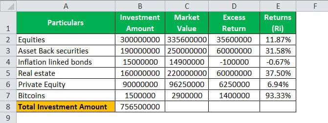

## Table of Contents

## What is a portfolio in the context of investments?

A portfolio in the context of investments is like a collection of different things you own that can grow in value over time. These things can be stocks, bonds, real estate, or even cash. Imagine it as a basket where you put all your investment eggs. The goal is to pick a mix of investments that will help you reach your financial goals, whether that's saving for retirement, buying a house, or something else.

The key to a good portfolio is diversification. This means not putting all your money into just one type of investment. By spreading your money across different kinds of investments, you can reduce the risk of losing a lot of money if one investment does poorly. For example, if you only invest in one company's stock and that company does badly, you could lose a lot. But if you have stocks from different companies, bonds, and maybe some real estate, a problem with one won't hurt your whole portfolio as much.

## How do you calculate the return on a single investment?

To calculate the return on a single investment, you need to know how much money you made or lost from that investment. Start by finding out the difference between what you sold the investment for and what you originally paid for it. This difference is called the profit or loss. If you sold it for more than you paid, you made a profit. If you sold it for less, you had a loss. 

Next, to find the return as a percentage, you divide the profit or loss by the original amount you invested, and then multiply by 100 to turn it into a percentage. For example, if you bought a stock for $100 and sold it for $120, your profit is $20. You would divide $20 by $100 to get 0.2, and then multiply by 100 to get a 20% return. If you sold it for $80 instead, you would have a $20 loss, and your return would be -20%. This simple calculation helps you understand how well your investment did.

## What are the different types of returns one can expect from a portfolio?

When you have a portfolio, you can expect different types of returns. One type is capital gains, which is when the value of your investments goes up. For example, if you buy a stock for $50 and later sell it for $75, the $25 difference is your capital gain. Another type of return is dividends, which are payments companies give to shareholders from their profits. If you own stocks that pay dividends, you get regular payments just for holding onto those stocks.

Another return you might see is interest, especially if you have bonds or savings accounts in your portfolio. Interest is what you earn for lending your money to someone else, like a government or a bank. For example, if you buy a bond that pays 5% interest annually, you'll get 5% of the bond's value each year. Lastly, there's also something called total return, which is a combination of all these types of returns. It includes any capital gains, dividends, and interest you earn from your investments over a period of time. Total return gives you a complete picture of how well your portfolio is doing.

## How do you calculate the total return of a portfolio?

To calculate the total return of a portfolio, you need to add up all the money you made from it. This includes any increase in the value of your investments, which is called capital gains, plus any dividends or interest you received. Start by figuring out the value of your portfolio at the end of the period you're looking at, and subtract the value at the beginning. This difference is your capital gain or loss. Then, add any dividends or interest you got during that time. The sum of these gives you your total return in dollars.

Once you have the total return in dollars, you can turn it into a percentage to see how well your portfolio did. To do this, divide your total return by the starting value of your portfolio, then multiply by 100. For example, if your portfolio was worth $10,000 at the start and grew to $11,000, and you also got $200 in dividends, your total return would be $1,200. Divide $1,200 by $10,000 to get 0.12, then multiply by 100 to find your total return was 12%. This percentage helps you compare how your portfolio did over different time periods or against other investments.

## What is the difference between simple and compound returns?

Simple return is easy to understand. It's what you get when you look at how much your investment grew over a certain time, without considering any reinvestments. For example, if you put $100 into a savings account that gives you 5% interest every year, a simple return means you'll get $5 at the end of the year, and that's it. If you keep the money in for another year, you'll get another $5, but you won't earn interest on the interest you got before.

Compound return is a bit trickier but can help your money grow faster. With compound return, you earn interest not just on your original investment, but also on the interest you've already earned. Using the same example, if you leave your $100 in the account for two years with a 5% annual compound interest, after the first year you'll have $105. In the second year, you'll earn 5% interest on $105, which is $5.25, making your total $110.25. Over time, this compounding effect can make a big difference in how much your investment grows.

## How do you account for dividends and interest in portfolio return calculations?

When you're figuring out the total return of your portfolio, you need to include any dividends and interest you've received. Dividends are payments you get from owning stocks, and interest is what you earn from things like bonds or savings accounts. To calculate the total return, first find out how much your investments have grown in value, which is called capital gains. Then, add the dividends and interest you've received during the time you're looking at. For example, if your portfolio's value went up by $1,000 and you also got $200 in dividends and $100 in interest, your total return in dollars would be $1,300.

Once you have the total return in dollars, you can turn it into a percentage to see how well your portfolio did. To do this, take your total return and divide it by the starting value of your portfolio, then multiply by 100. Using the example from above, if your portfolio started at $10,000, your total return of $1,300 divided by $10,000 is 0.13. Multiply that by 100, and you get a 13% total return. This percentage helps you see how your investments are doing, including all the money you've made from capital gains, dividends, and interest.

## What is the importance of time weighting in calculating portfolio returns?

Time weighting is important when calculating portfolio returns because it helps you see how well your investments are doing, no matter when you add or take out money. Imagine you put more money into your portfolio at different times. Without time weighting, it would be hard to tell if your returns are because your investments did well or just because you added more money. Time weighting makes sure your returns are fair and accurate by looking at how your investments performed over specific periods.

For example, if you add money to your portfolio halfway through the year, time weighting splits the year into two parts. It calculates the return for the first half separately from the second half. This way, the return you get at the end of the year shows how your investments did over time, not just how much money you added or took out. By using time weighting, you get a clear picture of your portfolio's performance, which helps you make better decisions about your investments.

## How do you calculate the risk-adjusted return of a portfolio?

Calculating the risk-adjusted return of a portfolio helps you understand how much return you're getting for the risk you're taking. One common way to do this is by using the Sharpe Ratio. To calculate the Sharpe Ratio, you first find the average return of your portfolio over a period of time. Then, you subtract the risk-free rate, which is what you could earn from a safe investment like a U.S. Treasury bond. After that, you divide this difference by the standard deviation of your portfolio's returns, which measures how much your returns go up and down. A higher Sharpe Ratio means you're getting more return for the risk you're taking.

Another way to calculate risk-adjusted return is by using the Sortino Ratio. This is similar to the Sharpe Ratio, but it focuses only on the downside risk, or the risk of losing money. To calculate the Sortino Ratio, you start with the average return of your portfolio minus the risk-free rate, just like with the Sharpe Ratio. But instead of dividing by the standard deviation, you divide by the downside deviation, which only looks at the returns that are below a certain target or the average return. The Sortino Ratio is useful if you're more worried about losing money than about the overall ups and downs of your portfolio. Both the Sharpe Ratio and the Sortino Ratio help you see if the extra risk you're taking is worth the extra return you're getting.

## What are the common benchmarks used to evaluate portfolio performance?

When you want to see how well your investments are doing, you often compare them to something called a benchmark. A common benchmark is the S&P 500, which is a group of 500 big companies in the U.S. If your portfolio does better than the S&P 500, it means your investments are doing great compared to a lot of other people's. Another benchmark you might use is the Dow Jones Industrial Average, which looks at 30 big companies. These benchmarks give you a way to see if your investments are keeping up with or beating the market.

Another type of benchmark is something called a bond index, like the Bloomberg Barclays U.S. Aggregate Bond Index. This helps you see how your bonds are doing compared to other bonds out there. If you have a mix of stocks and bonds, you might use a blended benchmark, like a 60/40 mix of the S&P 500 and the bond index. This helps you see how your whole portfolio is doing, not just one part of it. By comparing your portfolio to these benchmarks, you can tell if you're on the right track or if you need to make some changes.

## How do you use the Sharpe Ratio to assess portfolio performance?

The Sharpe Ratio helps you see how well your investments are doing by looking at the return you get for the risk you take. To figure it out, you start by finding the average return of your portfolio over a certain time. Then, you take away the return you would get from a safe investment, like a U.S. Treasury bond, which is called the risk-free rate. After that, you divide this difference by the standard deviation of your portfolio's returns. The standard deviation tells you how much your returns go up and down. A higher Sharpe Ratio means you're getting more return for the risk you're taking, which is good.

For example, if your portfolio's average return was 10% and the risk-free rate was 2%, the difference would be 8%. If the standard deviation of your portfolio's returns was 15%, you would divide 8% by 15% to get a Sharpe Ratio of about 0.53. This number tells you that for every unit of risk you took, you got a return of 0.53 above the risk-free rate. If another portfolio had a Sharpe Ratio of 0.7, it would be doing better because it's getting more return for the same amount of risk. By comparing the Sharpe Ratios of different portfolios or against a benchmark, you can see which ones are performing better when you consider the risk involved.

## What advanced statistical methods can be used to forecast portfolio returns?

One advanced way to forecast portfolio returns is by using something called Monte Carlo simulations. This method uses a computer to run many different scenarios of how your investments might do in the future. It takes into account things like how much your investments might go up or down, and how often they might change. By running thousands of these scenarios, Monte Carlo simulations can give you a good idea of the range of possible returns for your portfolio. This helps you see not just one possible future, but many, which can be really useful for planning.

Another method is called regression analysis. This is a way to look at past data and see how different things, like interest rates or the stock market, might affect your portfolio's returns. By understanding these relationships, you can make better guesses about what might happen in the future. For example, if you see that your portfolio tends to do well when the economy is growing, you might expect it to do well if you think the economy will grow in the future. Regression analysis helps you use past patterns to make smarter predictions about your investments.

## How do multi-factor models enhance the analysis of portfolio returns?

Multi-[factor](/wiki/factor-investing) models help you understand what makes your portfolio go up or down by looking at different things that can affect it. These models look at things like how the whole market is doing, how big or small companies are doing, and even how much risk you're taking. By breaking down your returns into these different pieces, you can see which factors are helping your portfolio and which ones might be hurting it. This can be really useful if you want to make your portfolio do better, because you can focus on the factors that matter most.

For example, if you find out that your portfolio does well when small companies do well, you might want to put more money into small company stocks. Or if you see that your portfolio loses money when interest rates go up, you might want to change it so it's less affected by interest rates. Multi-factor models give you a detailed picture of what's going on with your investments, which can help you make smarter choices about where to put your money.

## What is Understanding Investment Returns?

Investment returns are a critical aspect of financial assessments, serving as a measure of the profitability of investments. They represent the gain or loss on an investment over a specified period and are essential for making informed investment decisions and evaluating the success of financial strategies.

Investment returns can be categorized into two main types: single investment returns and portfolio returns. Single investment returns focus on the performance of an individual asset, assessing how much an investor gains or loses relative to the initial investment. Portfolio returns, on the other hand, evaluate the collective performance of a group of investments, taking into account the interplay between different assets and their contributions to the overall portfolio performance.

Several key metrics are utilized for evaluating investment returns. Among them, Return on Investment (ROI) is a straightforward measure and is calculated as follows:

$$
\text{ROI} = \left(\frac{\text{Current Value of Investment} - \text{Cost of Investment}}{\text{Cost of Investment}}\right) \times 100
$$

ROI provides a percentage indicating how much return is generated on an investment relative to its cost.

Time-Weighted Return (TWR) is another crucial metric, particularly for evaluating portfolio performance over multiple periods. It eliminates the effects of cash flows into or out of the portfolio, providing a uniform measure of the investment manager's ability to generate returns. TWR is calculated by breaking down the return into periods and linking them through compounding.

Money-Weighted Return (MWR), or Internal Rate of Return (IRR), accounts for the size and timing of cash flows. It provides a return rate that equates the net present value of cash inflows with cash outflows. MWR is particularly useful for investments with significant interim cash flows, where the timing of those flows can affect the value of returns.

Dividends, interest, and fees significantly impact investment outcomes. Dividends and interest provide additional income streams, enhancing the overall return on investment. However, management and transaction fees can reduce net returns, emphasizing the need for investors to account for these costs when evaluating investment performance. Adjusting returns for these factors involves calculating net returns by subtracting total fees from the gross return and adding any dividends or interest received.

In summary, understanding investment returns involves recognizing their role in financial assessments, distinguishing between single and portfolio returns, utilizing key metrics like ROI, TWR, and MWR, and considering the effects of dividends, interest, and fees. These elements are vital for assessing investment effectiveness and making informed decisions.

## What are the financial calculations involved in portfolio management?

Accurate financial calculations are critical for effective portfolio management, as they provide a means to evaluate the performance of both individual investments and entire portfolios. Effective assessment of investment strategies relies heavily on calculating the returns of these financial assets.

### Calculation of Returns

For a single investment, the return is typically calculated using the formula:

$$
R = \frac{V_f - V_i + D}{V_i}
$$

where $R$ is the return, $V_f$ is the final value of the investment, $V_i$ is the initial value, and $D$ represents dividends received during the period. The inclusion of dividends in the calculation is essential, as they are a part of the total returns.

When it comes to a diversified portfolio, the process involves calculating the weighted average of the returns of the individual assets:

$$
R_p = \sum_{i=1}^{n} w_i \cdot R_i
$$

where $R_p$ is the portfolio return, $w_i$ represents the weight of each asset in the portfolio, and $R_i$ is the return of each asset. This approach considers the asset allocation strategy, reflecting both the proportion of each asset and its individual performance.

### Importance of Accurate Calculations

Accurate financial calculations play a crucial role in analyzing the effectiveness of an investment strategy. They assist investors in understanding whether their investments are meeting the expected benchmarks and help to pinpoint areas that may require adjustments. Inaccurate calculations could lead to flawed performance assessments and misguided investment decisions, ultimately affecting financial outcomes.

### Time-Weighted Returns (TWR) and Money-Weighted Returns (MWR)

Time-weighted returns (TWR) and money-weighted returns (MWR) are two key measures used to evaluate investment performance while accounting for cash flows during the investment period.

**Time-Weighted Returns (TWR):** 
TWR is a method that measures compound growth rate of an investment portfolio by neutralizing the impact of cash flows. It is calculated by breaking down the investment period into sub-periods based on cash flows, calculating the return for each sub-period, and then linking these returns together. The formula is:

$$
TWR = \prod_{i=1}^{n} (1 + R_i) - 1
$$

where $R_i$ is the return for each sub-period. This methodology is beneficial when comparing investment managers, as it reflects their performance regardless of cash flow timing.

**Money-Weighted Returns (MWR):**
MWR, also known as the internal rate of return (IRR), accounts for the size and timing of cash flows. It solves for the discount rate that equates the present value of cash inflows with the initial investment. The formula involves solving:

$$
0 = \sum_{t=0}^{n} \frac{CF_t}{(1 + MWR)^t}
$$

where $CF_t$ is the cash flow at time $t$. MWR provides a realistic measure of an investor's experience, reflecting the effect of timing on investment performance.

### Accounting for Dividends, Fees, and Taxes

In financial calculations, incorporating variables such as dividends, management fees, and tax considerations is vital. Dividends directly contribute to investment returns, while fees can significantly reduce net gains. Taxes on capital gains and dividends can further affect net returns. Ignoring these variables can lead to a distorted view of an investment's true performance.

By mastering these calculations, investors and portfolio managers can make more informed decisions, leading to enhanced investment strategies and better financial outcomes. Accurate financial assessments enable adaptations to changing circumstances, ensuring that investment strategies remain effective and aligned with financial goals.

## What is Algorithmic Trading and how are Financial Calculations involved?

Algorithmic trading, a method of executing trades using pre-programmed instructions and automated trading systems, has transformed modern investment practices. This technique leverages powerful computing capabilities to process vast amounts of data, identify trading opportunities, and execute trades with remarkable speed and precision. Algorithmic trading's impact on modern investment practices is profound, offering increased market efficiency, reduced transaction costs, and enhanced [liquidity](/wiki/liquidity-risk-premium).

Integrating real-time market data into algorithmic systems significantly enhances portfolio performance. Real-time data allows algorithms to react swiftly to market changes, capitalizing on short-lived opportunities and optimizing trade execution. This high-speed decision-making is particularly important in highly volatile markets, where market conditions can change rapidly. For instance, high-frequency trading ([HFT](/wiki/high-frequency-trading-strategies)) strategies rely heavily on real-time data integration to execute trades in milliseconds, gaining an edge over competitors who may not have access to the same level of timeliness.

Expected return calculations play a crucial role in [algorithmic trading](/wiki/algorithmic-trading) strategies, serving as a cornerstone for decision-making processes. These calculations estimate the potential profits or losses of a trading strategy based on historical data and current market conditions. By assessing the likelihood of various outcomes, algorithms can be programmed to execute trades that align with the investor's risk tolerance and return objectives. The formula for expected return, $E(R)$, is typically expressed as:

$$
E(R) = \sum (p_i \times r_i)
$$

where $p_i$ represents the probability of each outcome, and $r_i$ denotes the return associated with each outcome. Accurate expected return calculations allow algorithms to prioritize trades that offer favorable risk-return profiles.

Technology and data analytics are integral to optimizing trading algorithms, facilitating the creation, testing, and refinement of complex trading models. Machine learning and [artificial intelligence](/wiki/ai-artificial-intelligence) techniques further augment this process by enabling the identification of patterns and trends in historical data that may not be apparent through traditional analysis. These technological advancements empower traders to build and deploy adaptive algorithms capable of responding to evolving market conditions. Python, with its extensive libraries such as NumPy, pandas, and scikit-learn, is widely used for developing and refining algorithmic trading strategies due to its versatility and ease of integration with data analysis pipelines.

For example, a basic Python script to compute expected returns might look like this:

```python
import numpy as np

# Probabilities of outcomes
probabilities = np.array([0.25, 0.50, 0.25])

# Associated returns
returns = np.array([0.10, 0.05, -0.02])

# Calculating expected return
expected_return = np.sum(probabilities * returns)
print(f"Expected Return: {expected_return:.2f}")
```

Overall, algorithmic trading, bolstered by the integration of real-time data and advanced analytics, represents a significant advancement in investment practices. It enables investors to achieve greater precision, efficiency, and adaptability in a complex and fast-paced financial environment.

## References & Further Reading

[1]: Bergstra, J., Bardenet, R., Bengio, Y., & Kégl, B. (2011). ["Algorithms for Hyper-Parameter Optimization."](https://papers.nips.cc/paper/4443-algorithms-for-hyper-parameter-optimization) Advances in Neural Information Processing Systems 24.

[2]: ["Advances in Financial Machine Learning"](https://www.amazon.com/Advances-Financial-Machine-Learning-Marcos/dp/1119482089) by Marcos Lopez de Prado

[3]: ["Evidence-Based Technical Analysis: Applying the Scientific Method and Statistical Inference to Trading Signals"](https://www.amazon.com/Evidence-Based-Technical-Analysis-Scientific-Statistical/dp/0470008741) by David Aronson

[4]: ["Machine Learning for Algorithmic Trading"](https://github.com/stefan-jansen/machine-learning-for-trading) by Stefan Jansen

[5]: ["Quantitative Trading: How to Build Your Own Algorithmic Trading Business"](https://www.amazon.com/Quantitative-Trading-Build-Algorithmic-Business/dp/1119800064) by Ernest P. Chan