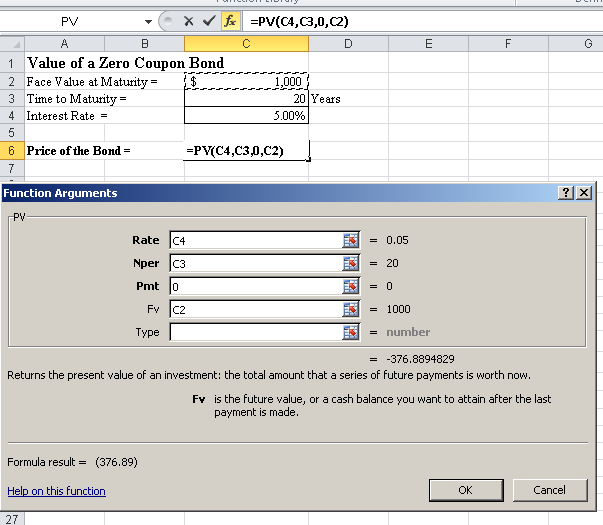

Bond valuation plays a crucial role in the financial market by helping investors determine the fair price of a bond, which is essential for making informed investment decisions. It involves assessing the present value of a bond’s future cash flows, including periodic coupon payments and the face value at maturity. This valuation is fundamental to investors as it provides insights into the bond's potential returns, enabling them to compare it with other investment opportunities.

Understanding bond present value is vital for investors as it involves discounting the bond's future cash flows to the present using an appropriate discount rate, often linked to current interest rates. The formula for calculating the present value (PV) of a bond is:



$$
PV = \sum \left(\frac{C}{(1+r)^t}\right) + \frac{F}{(1+r)^n}
$$

where $C$ is the coupon payment, $r$ is the discount rate, $t$ is the period, $n$ is the number of periods, and $F$ is the face value of the bond. This present value calculation is crucial for determining whether a bond is priced appropriately in the market.

Excel has become an indispensable tool for investors, simplifying complex bond calculations and analyses. With built-in financial functions such as PV, NPV, and YIELD, Excel allows investors to efficiently perform bond valuations, compare yields, and analyze interest rate impacts. This ease of use makes it accessible for a wide range of market participants, from individual investors to large financial institutions.

Algorithmic trading, which relies heavily on mathematical models and high-speed, automated executions, is significantly influenced by bond valuation. Accurate bond pricing models feed into algorithms that drive trading decisions, ensuring that they capitalize on pricing discrepancies and market inefficiencies. As algorithmic trading grows in prominence, the precision of bond valuation models becomes even more crucial, impacting the design and success of these trading strategies.

The article will further explore key terms and concepts related to bond valuation, including interest rates, yield to maturity, and the factors affecting bond prices. It will also discuss the integration of Excel in bond analysis and the implications of bond valuation in algorithmic trading, providing a comprehensive overview of how these elements interact within the financial market.

## Table of Contents

## Understanding Bond Valuation

Bond valuation is a financial practice used to determine the fair value of a bond based on expected future cash flows, which include periodic coupon payments and the repayment of the face value at maturity. The main goal of bond valuation is to assess whether a bond is priced appropriately in the market, to facilitate informed investment decisions.

The valuation of bonds is influenced by several critical factors, with interest rates and the bond's maturity period being the most prominent. Interest rates have an inverse relationship with bond prices: when interest rates rise, bond prices typically fall, and vice versa. This is because the future cash flows from the bond, which are fixed, become less attractive compared to the new bonds issued at higher rates. Maturity also plays a crucial role, as bonds with longer maturities are more sensitive to changes in interest rates, a phenomenon known as [interest rate](/wiki/interest-rate-trading-strategies) risk.

The impact of bond valuation on investment decisions is substantial. Investors use bond valuation to determine the yield, assess the risk, and decide the timing and scale of investment in bonds. A well-valued bond portfolio can hedge against interest rate risks and align with an investor’s financial goals.

Several models and methods are commonly used for bond valuation. The most basic model is the Present Value approach, where the price of a bond is calculated by discounting the expected cash flows to their present value using a discount rate, typically the market interest rate. The formula for the present value $PV$ of a bond is:

$$
PV = \sum \left(\frac{C}{(1 + r)^t}\right) + \frac{F}{(1 + r)^n}
$$

where $C$ is the coupon payment, $r$ is the discount rate, $t$ is the period, $F$ is the face value of the bond, and $n$ is the number of periods until maturity.

Additional methods include the Yield to Maturity (YTM) calculation, which estimates the total return anticipated on a bond if the bond is held until it matures. YTM is essentially the internal rate of return (IRR) of a bond. Another approach is the Current Yield, which focuses on the annual income relative to the current price of the bond, calculated as:

$$
\text{Current Yield} = \frac{\text{Annual Coupon Payment}}{\text{Market Price of the Bond}}
$$

Sophisticated models like the Duration and Convexity concepts are employed to assess a bond's sensitivity to changes in interest rates. Duration measures the weighted average time until a bond’s cash flows are received and is used to estimate the bond's price change as interest rates vary. Convexity accounts for the curvature in the relationship between bond prices and interest rates, providing a more accurate estimation for larger interest rate changes.

In conclusion, understanding the valuation of bonds is vital for investors aiming to make sound financial decisions. By analyzing the intricate dynamics of interest rates, maturity, and employing robust valuation models, investors can navigate the bond markets more effectively.

## The Importance of Bond Present Value

Bond present value is a fundamental concept in bond valuation, representing the current worth of a bond's future cash flows. The importance of bond present value lies in its ability to provide investors with a tool to assess whether a bond is a worthwhile investment today, given its future payment promises. The calculation of bond present value is crucial as it incorporates several key factors such as interest rates and maturity, helping investors determine the fair price they should be willing to pay for a bond.

The formula to calculate the present value of a bond is given by:

$$
PV = \sum_{t=1}^{n} \frac{C}{(1+r)^t} + \frac{F}{(1+r)^n}
$$

where $PV$ is the present value of the bond, $C$ is the coupon payment, $r$ is the discount rate (or required yield), $n$ is the number of periods until maturity, and $F$ is the face value of the bond. This formula helps in breaking down the bond's valuation process into its periodic cash flows, discounted back to their present value.

In bond valuation, the present value serves as a benchmark to measure the bond's attractiveness relative to its market price. If the calculated present value exceeds the bond's current market price, the bond may be considered undervalued and thus a potentially profitable investment.

The relationship between present value and yield is inversely proportional. As a bond's yield increases, the present value decreases, assuming all other factors remain constant. This inverse relationship highlights the investor's required return and reflects the time value of money principle, where future cash flows are less valuable in present terms when discounted at higher rates.

Interest rates have a direct impact on bond present value due to their influence on discount rates and yields. When interest rates rise, the required yield or discount rate also typically increases, leading to a decrease in present value. This causes bond prices to fall, as future cash flows are discounted at a higher rate. Conversely, when interest rates fall, present value rises, and bond prices generally increase.

Understanding the importance of present value in bond valuation is critical for making informed investment decisions. By calculating present value, investors can gauge the bond's potential return adjusted for time and interest rate expectations, enabling them to better navigate the financial markets.

## Calculating Bond Valuation Using Excel

Excel is a powerful tool for calculating bond valuation, providing functions and features that streamline the evaluation process for investors. This section outlines the relevant Excel functions and offers a step-by-step guide to setting up a bond valuation spreadsheet, including calculations such as Yield to Maturity (YTM) and current yield. Additionally, it provides tips and tricks for optimizing bond analysis within Excel.

### Overview of Excel Functions and Tools for Bond Valuation

Excel offers several functions and tools that are particularly useful for bond valuation. Key functions include:

- **PV (Present Value):** Calculates the present value of a bond based on constant periodic payments and a constant interest rate.
- **FV (Future Value):** Determines the future value of an investment based on periodic, constant payments and interest.
- **RATE:** Computes the interest rate per period of an annuity.
- **NPER:** Determines the number of periods for an investment based on periodic, constant payments and interest.
- **PMT:** Calculates the payment for a loan based on constant payments and a constant interest rate.
- **YIELD:** Determines the bond yield using the bond's settlement date, maturity date, annual coupon rate, and face value.
- **PRICE:** Computes the price per $100 face value of a bond.

These functions allow investors to perform critical calculations necessary for bond valuation and investment decision-making.

### Step-by-Step Guide for Setting Up a Bond Valuation Spreadsheet

1. **Input Data:**
   - Create labeled columns for inputs: Settlement Date, Maturity Date, Coupon Rate, Face Value, and Market Price.

2. **Calculate Current Yield:**
   - Use the formula:
$$
     \text{Current Yield} = \frac{\text{Annual Coupon Payment}}{\text{Market Price}}

$$
   - Example formula in Excel: `= (CouponRate * FaceValue) / MarketPrice`

3. **Yield to Maturity (YTM) Calculation:**
   - Use the `YIELD` function:
$$
     \text{YTM} = \text{YIELD}(\text{Settlement Date}, \text{Maturity Date}, \text{Coupon Rate}, \text{Market Price}, \text{Redemption}, \text{Frequency})

$$
   - Example formula in Excel: `=YIELD(A1, B1, C1, D1, 100, 2)`, where A1 through D1 cells contain the respective bond data.

4. **Calculate Present Value of Bond:**
   - Use the `PV` function to compute the present value of bond cash flows. The formula is:
$$
     \text{PV} = \sum_{t=1}^{n} \frac{C}{(1 + r)^t} + \frac{F}{(1 + r)^n}

$$
     Where $C$ is the coupon payment, $F$ is the face value, $r$ is the discount rate, and $n$ is the number of periods.
   - Example formula in Excel: `=PV(Rate, Nper, Pmt, [Fv], [Type])`

### Example Calculations: Yield to Maturity and Current Yield

- **Yield to Maturity (using YIELD function):**
  - Suppose you have a bond with a 5% coupon rate, market price of $950, face value of $1,000, with five years to maturity and semi-annual coupons. The Excel formula would be:
    ```excel
    =YIELD("2023-01-01", "2028-01-01", 0.05, 950, 1000, 2)
    ```

- **Current Yield:**
  - If the annual coupon payment is $50, and the market price of the bond is $950, the current yield would be:
    ```excel
    = 50 / 950
    ```

### Tips and Tricks for Optimizing Bond Analysis in Excel

- **Use Named Ranges:** Define names for cells or arrays of cells to make formulas easier to read and understand.
- **Data Validation:** Implement data validation techniques to ensure only valid data is entered within the cells.
- **Conditional Formatting:** Apply conditional formatting to quickly identify key metrics and potential investment opportunities.
- **Macro Usage:** Develop macros for repetitive tasks to save time and reduce errors.

Excel's comprehensive functionalities make it an indispensable tool for bond valuation, enabling investors to perform insightful analysis and make informed decisions efficiently.

## Algorithmic Trading and Bond Valuation

Algorithmic trading represents a revolution in financial markets, leveraging complex algorithms to execute trades at speeds and frequencies that far exceed human capabilities. Introduced in the late 20th century, [algorithmic trading](/wiki/algorithmic-trading) has grown to dominate modern finance due to its efficiency, precision, and ability to process vast amounts of data in real time. This has allowed traders to capitalize on fleeting market opportunities, which would otherwise go unnoticed.

Bond valuation plays a crucial role in shaping trading algorithms and strategies. Bonds, as fixed-income securities, provide a predictable stream of income and are often considered a safer investment compared to equities. Accurate valuation of bonds is essential as it informs various trading strategies employed by algorithmic traders. It aids in determining whether a bond is overvalued or undervalued, influencing buy or sell decisions.

Key factors such as interest rates, maturity, and credit risk are embedded in algorithms to assess the fair value of a bond. For instance, the relationship between a bond’s price and interest rates is inversely proportional; a rise in interest rates typically leads to a decrease in bond prices and vice versa. Algorithms are designed to account for these dynamics, enabling traders to optimize portfolio performance under varying market conditions.

Successful integration of bond valuation in algorithmic trading can be seen in several case studies. One such example is the rise of quantitative hedge funds that utilize bond pricing models to exploit [arbitrage](/wiki/arbitrage) opportunities between different fixed-income securities. By employing sophisticated algorithms, these funds can identify discrepancies in bond prices across various markets and execute trades almost instantaneously, yielding significant returns.

In another scenario, investment banks have adopted algorithmic trading strategies that incorporate real-time bond valuation to manage large-scale bond portfolios. These strategies involve the continuous evaluation of bond prices, taking into account macroeconomic indicators and monetary policies to adjust holdings and mitigate risks effectively.

Looking ahead, the future of bond valuation in algorithmic trading appears promising. Advancements in [machine learning](/wiki/machine-learning) and [artificial intelligence](/wiki/ai-artificial-intelligence) continue to enhance the accuracy and speed of bond valuation processes. These technologies allow for the development of more nuanced models that can better predict bond price movements and adapt to complex market behaviors.

Moreover, the increasing availability of big data provides an opportunity to refine these algorithms further. By harnessing large datasets, traders can pinpoint trends and anomalies that were previously undetectable, leading to more informed trading decisions and improved risk management strategies.

In conclusion, bond valuation remains a pivotal element of algorithmic trading, influencing both the formulation and execution of sophisticated trading strategies. As technology evolves, the integration of advanced analytical tools and comprehensive datasets promises to enhance the effectiveness of bond valuation, solidifying its role in shaping the future landscape of financial markets.

## Conclusion

Bond valuation remains a cornerstone in financial markets, providing investors with insights into the intrinsic value of bonds. Understanding bond valuation is crucial because it directly affects investment decisions by quantifying what a bond is worth today based on its future cash flows. The present value of these cash flows, heavily influenced by factors such as interest rates and maturity, determines a bond's profitability and attractiveness to investors.

Excel has emerged as a transformative tool, significantly streamlining the complex calculations involved in bond valuation. With its robust functions, such as PV (Present Value) and YIELD, Excel allows investors to efficiently calculate the current value of future bond payments. This capability is vital for performing sensitive analysis, where small changes in interest rates or other variables can drastically impact valuation outcomes. Excel's ability to handle large datasets and perform iterative calculations also enhances its utility in modeling various investment scenarios, thereby aiding in informed decision-making.

In the context of algorithmic trading, bond valuation plays a pivotal role in shaping trading algorithms and strategies. Algorithms rely on precise bond valuations to execute trades that capitalize on market inefficiencies or anticipate market movements. Accurate valuation models are integral to these strategies, enabling traders to optimize their portfolios and enhance returns. As trading systems evolve and become more sophisticated, the integration of reliable bond valuation mechanisms will continue to be essential in maintaining competitive advantage.

The landscape of bond investment strategies is continually evolving, driven by advancements in technology and financial modeling. As new valuation methodologies and data analytics tools emerge, investors are better equipped to navigate the complexities of the bond market. The interplay between technology and finance, exemplified by the use of Excel and algorithmic trading, underscores the dynamic nature of bond investing. By leveraging these tools and insights, investors can enhance their strategic approaches, adapting to changing market conditions and ultimately achieving better outcomes in their financial pursuits.

## References & Further Reading

[1]: Fabozzi, F. J. (2000). ["Bond Markets, Analysis, and Strategies."](https://books.google.com/books/about/Bond_Markets_Analysis_and_Strategies_ten.html?id=bQpNEAAAQBAJ) Prentice Hall.

[2]: Malkiel, B. G. (2015). ["A Random Walk Down Wall Street: The Time-Tested Strategy for Successful Investing."](https://www.academia.edu/10850809/A_Random_Walk_Down_Wall_Street_The_Time_Tested_Strategy_for_Successful_Investing) W. W. Norton & Company.

[3]: Hull, J. C. (2018). ["Options, Futures, and Other Derivatives."](https://www.semanticscholar.org/paper/Options%2C-Futures%2C-and-Other-Derivatives-Hull/89bdee500c8623864fc9eb7a471546aa713acc44) Pearson.

[4]: Choudhry, M. (2010). ["An Introduction to Bond Markets."](https://onlinelibrary.wiley.com/doi/book/10.1002/9781118371961) Wiley.

[5]: Thau, A. (2010). ["The Bond Book: Everything Investors Need to Know About Treasuries, Municipals, GNMAs, Corporates, Zeros, Bond Funds, Money Market Funds, and More."](https://www.amazon.com/Bond-Book-Everything-Treasuries-Municipals/dp/0071358625) McGraw-Hill Education.

[6]: Tuckman, B., & Serrat, A. (2012). ["Fixed Income Securities: Tools for Today's Markets."](https://www.amazon.com/Fixed-Income-Securities-Todays-Markets/dp/0470891696) Wiley. 

[7]: ["Financial Modeling with Excel"](https://www.wallstreetprep.com/knowledge/financial-modeling/) by Corporate Finance Institute. 

[8]: ["Algorithmic Trading and DMA: An Introduction to Direct Access Trading on the Markets"](https://www.semanticscholar.org/paper/Algorithmic-trading-%26-DMA-%3A-an-introduction-to-Johnson/aa5de1ab883d5e23b6651faa7c1807586d688e4b) by Barry Johnson