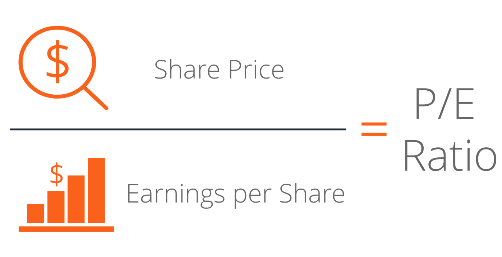

The Price-to-Earnings (P/E) ratio is a foundational metric in financial analysis and investment, primarily used to evaluate the valuation of stocks. It is calculated by dividing the market price per share of a stock by its earnings per share (EPS). This ratio provides investors with a quick assessment of what the market is willing to pay for a company's earnings, offering insights into its valuation relative to its peers or historical performance. 

In this article, we examine the significance of the P/E ratio, focusing specifically on its application in algorithmic trading. Algorithmic trading, which employs complex algorithms and high-speed data analytics to facilitate automatic trading decisions, heavily relies on quantitative metrics like the P/E ratio. Understanding the P/E ratio's role in this context is crucial for investors aiming to refine their trading strategies and enhance decision-making processes.



Our discussion will encompass the fundamental concept of the P/E ratio, explore various types such as trailing and forward P/E, and emphasize their relevance in stock valuation. Furthermore, we consider how the P/E ratio is integrated into algorithmic trading, enabling more efficient and strategic stock selections. By the conclusion of this article, readers will gain a comprehensive understanding of the P/E ratio's broad implications in both traditional financial analysis and modern algorithmic trading environments.

## Table of Contents

## Understanding the Price-to-Earnings Ratio

The Price-to-Earnings (P/E) ratio is a financial metric that provides a snapshot of a company's valuation. By comparing a company's market price per share to its earnings per share (EPS), the P/E ratio gives investors an indicator of how much investors are willing to pay today for a dollar of the company's earnings, both past and future. Mathematically, the P/E ratio is expressed as:

$$
\text{P/E Ratio} = \frac{\text{Market Price per Share}}{\text{Earnings per Share (EPS)}}
$$

This ratio is significant because it reflects market sentiment about the company's growth potential and profitability. A high P/E ratio often suggests that investors expect high future earnings and are willing to pay a premium for the stock. This can sometimes indicate overvaluation, particularly if the underlying earnings are not expected to grow significantly. Conversely, a low P/E ratio might suggest that the stock is undervalued or that the company is experiencing difficulties, leading to diminished growth expectations.

Understanding these dynamics is essential for investors. A thorough analysis often reveals insights into investor sentiment and market expectations regarding a company's future performance. For instance, a company with a high P/E ratio in comparison to its industry peers might be priced that way due to anticipated future growth, whether through innovation, market expansion, or improved operational efficiency. 

However, it's important to recognize that the P/E ratio alone cannot provide a complete picture of a company's potential. External factors, such as macroeconomic conditions, industry-specific trends, and the company's strategic direction, can also influence earnings projections. Therefore, while the P/E ratio is a valuable tool for making investment decisions, it should be integrated with additional financial metrics to ensure a balanced evaluation.

## Types of P/E Ratios and Their Significance

Several variations of the Price-to-Earnings (P/E) ratio are instrumental in analyzing a company's financial health, each offering unique insights tailored to different investment strategies and economic foresight.

The **Trailing P/E** ratio is calculated using a company's earnings over the past 12 months. Formally, it is expressed as:

$$
\text{Trailing P/E} = \frac{\text{Current Share Price}}{\text{Earnings per Share (EPS) over the last 12 months}}
$$

This ratio is beneficial for evaluating historical performance and provides a snapshot of how the company has fared recently in generating earnings relative to its share price. Trailing P/E is grounded in actual figures, making it a reliable source for quantifying past financial health. However, it does not account for future earnings potential and can be skewed by extraordinary earnings events or accounting adjustments within the period.

The **Forward P/E** ratio, conversely, is premised on forecasted earnings. It is defined as:

$$
\text{Forward P/E} = \frac{\text{Current Share Price}}{\text{Forecasted EPS}}
$$

Forward P/E offers a prospective view, crucial for companies anticipated to experience growth, whether through emerging sectors or new product lines. By focusing on potential earnings, investors can assess future profitability potential, making Forward P/E a valuable tool for growth-oriented investment strategies. However, forward earnings estimates, often derived from analyst projections, can be inherently speculative and subject to revision, thus posing a risk of inaccuracy.

The **Cyclically Adjusted Price-to-Earnings (CAPE) Ratio**, also known as the Shiller P/E ratio, provides insights into long-term valuation by averaging earnings over the past ten years and adjusting for inflation. The formula for CAPE is:

$$
\text{CAPE} = \frac{\text{Current Share Price}}{\text{Average Inflation-adjusted EPS over the last 10 years}}
$$

CAPE offers an expanded temporal lens, helping investors recognize cycles and distinguish between short-term fluctuations and genuine growth. This holistic view aids in mitigating the impact of one-off events or temporary economic downturns on earnings. Nevertheless, while CAPE is effective for long-term valuation, it may not cater to short-term market dynamics or the rapidly changing business environments typical of high-growth industries.

Each P/E ratio variant—Trailing, Forward, and CAPE—offers distinct insights, necessitating their application in different investment contexts. While each type inherently possesses distinct benefits and limitations, collectively they equip investors with a comprehensive toolkit for evaluating a company's financial prospects across diverse temporal horizons. By understanding these nuances, investors can more precisely tailor their use of P/E ratios to align with specific investment philosophies and market conditions.

## The Role of P/E Ratios in Stock Valuation

The Price-to-Earnings (P/E) ratio holds significant importance in stock valuation, primarily by providing a straightforward mechanism to evaluate whether a stock is correctly valued compared to others in the same industry. By dividing a company's current share price by its earnings per share, investors gauge the market's expectations about a company's growth prospects relative to its earnings ability. A higher P/E ratio can suggest that investors expect higher earnings growth in the future, while a lower P/E might indicate potential undervaluation or lower expected growth.

One vital aspect of the P/E ratio is its use in identifying whether a stock is overvalued or undervalued. This assessment is based on how the market price compares to its earnings. For instance, a stock with a considerably higher P/E ratio than its industry average might be perceived as overvalued, implying that the market price might not be sustainable if earnings do not meet expectations. Conversely, a stock with a lower P/E ratio might be undervalued, presenting potential investment opportunities if the company's fundamentals are sound.

The P/E ratio's efficacy as a valuation tool is influenced by sector-specific norms. Different industries exhibit varying average P/E ratios due to their distinct growth rates and inherent risks. For example, high-growth industries like technology often have higher average P/E ratios than more stable sectors like utilities. This variance mandates that investors consider industry-specific benchmarks when evaluating a stock's P/E ratio to avoid misleading conclusions.

To achieve a more comprehensive stock analysis, investors tend to use the P/E ratio alongside other financial metrics. Ratios like Price/Earnings to Growth (PEG) and Return on Equity (ROE) complement the P/E ratio, providing additional context about a company's growth prospects and financial health. This multifaceted approach ensures a more robust evaluation by addressing the limitations of using a single metric.

Furthermore, comparing P/E ratios among similar companies can highlight potential investment opportunities. Discrepancies in market valuation become apparent, allowing investors to identify stocks that may be undervalued relative to their peers. Such comparisons can reveal insights about investor sentiment and various market dynamics affecting stock valuation.

In conclusion, the P/E ratio is a pivotal element in stock valuation, enabling investors to compare companies systematically. By considering sector-specific variations and using the P/E ratio in conjunction with other financial metrics, investors can uncover discrepancies that highlight potential investment opportunities, ultimately contributing to more informed decision-making in the stock market.

## Incorporating P/E Ratios into Algorithmic Trading

Algorithmic trading leverages the power of computer algorithms to execute trades, utilizing quantitative metrics like the Price-to-Earnings (P/E) ratio to inform decision-making processes. The integration of P/E ratios into algorithmic systems automates stock selection, allowing for enhanced speed, efficiency, and precision in trading operations.

To effectively incorporate P/E ratios into an [algorithmic trading](/wiki/algorithmic-trading) strategy, it is essential to develop algorithms capable of rapidly analyzing large datasets. This capability allows for real-time assessment and adjustments based on up-to-date P/E ratios. By systematically scanning the market using predefined criteria, algorithms can identify potentially undervalued stocks with favorable P/E ratios, thus providing opportunities to capitalize on market inefficiencies.

For instance, Python, a widely used programming language in algorithmic trading, offers libraries such as `pandas` and `NumPy` to handle data manipulation and `SciPy` for advanced mathematical computations. Consider the following Python snippet for a simple P/E ratio-based stock screening:

```python
import pandas as pd

# Sample data: stock prices and earnings per share (EPS)
data = {'Stock': ['A', 'B', 'C'],
        'Price': [150, 200, 250],
        'EPS': [5, 8, 10]}

# Create a DataFrame
df = pd.DataFrame(data)

# Calculate P/E ratio
df['P/E Ratio'] = df['Price'] / df['EPS']

# Filter stocks with P/E ratio below a threshold (e.g., 20)
filtered_stocks = df[df['P/E Ratio'] < 20]

print(filtered_stocks)
```

This basic script calculates the P/E ratio for each stock and filters those with a P/E ratio below a specified threshold, identifying stocks that may be undervalued relative to their market peers.

However, relying solely on the P/E ratio has limitations. While it provides a snapshot of a company's valuation, it must be complemented by additional financial metrics to ensure a comprehensive analysis. Metrics such as the Price/Earnings to Growth (PEG) ratio, Return on Equity (ROE), and dynamic market factors should be integrated to refine the accuracy and robustness of the algorithmic trading strategy.

By incorporating a multifaceted approach, algorithms can be programmed to weigh different metrics, balancing the P/E ratio against other considerations to generate a more holistic view of potential investments. This practice not only enhances trading speed and accuracy but also reduces the risk associated with overreliance on a single metric.

In summary, the application of P/E ratios in algorithmic trading streamlines the stock selection process, but it necessitates a balanced integration with other data points to optimize trading outcomes effectively.

## Case Study: Using P/E Ratios in an Algorithmic Trading Strategy

This case study presents a hypothetical algorithmic trading strategy where the Price-to-Earnings (P/E) ratio plays a pivotal role in stock selection. Here, we outline the process from data collection to performance analysis, highlighting how the P/E ratio can be integrated into a systematic investment framework using algorithmic techniques.

### Data Collection

Effective algorithmic trading requires comprehensive data collection. For a P/E ratio-driven strategy, gathering precise and up-to-date financial data is essential:

1. **Stock Prices**: Collect real-time stock prices from reliable market data providers. This data forms the basis for calculating the market price per share.

2. **Earnings Per Share (EPS)**: Obtain the most recent EPS figures from company financials to ensure accurate P/E calculations. This involves sourcing quarterly or annual earnings reports from either company filings or financial news services.

3. **Sector Information**: Aggregate sector and industry classification data. This assists in setting appropriate benchmarks specific to each sector, crucial for comparative analysis.

### Screening Process

The screening process involves filtering stocks based on their P/E ratios relative to sector averages. The methodology follows these steps:

1. **Calculate P/E Ratios**: Utilize the formula:
$$
   \text{P/E Ratio} = \frac{\text{Market Price per Share}}{\text{Earnings per Share (EPS)}}

$$
   Use the collected data to compute the P/E ratios for each stock under consideration.

2. **Sector Average P/E**: Determine the average P/E ratio for each sector to identify typical performance levels.

3. **Filter Stocks**: Select stocks with P/E ratios below the calculated sector average. A lower P/E ratio suggests potential undervaluation, indicating possible buying opportunities.

### Execution

Implementation of trading strategies is facilitated by leveraging trading APIs. The following steps outline the execution phase:

1. **Algorithmic Trading Platform**: Utilize platforms such as Interactive Brokers or Alpaca that support API-based trading to automate order placements.

2. **Trading Algorithms**: Develop algorithms in Python to execute trades. Sample code might involve:

   ```python
   def place_trade(stock_symbol, target_price, api_client):
       if get_current_price(stock_symbol) < target_price:
           api_client.place_order(symbol=stock_symbol, side='buy', quantity=100)
   ```

3. **Systematic Investment**: The trading algorithm monitors market prices continuously, executing trades based on pre-defined P/E ratio thresholds and triggers.

### Performance Analysis

To evaluate the strategy's efficacy, comprehensive performance analysis is conducted:

1. **Benchmarking**: Compare returns against major indices like the S&P 500 or sector-specific indices to ascertain relative performance.

2. **Strengths and Weaknesses**: Analyze the strategy's success in detecting undervalued stocks and the resultant impact on portfolio returns.

3. **Adjustments**: Refine the algorithm by incorporating additional metrics or adjusting thresholds based on performance outcomes, aiming for optimization and risk mitigation.

This case study underscores the integration of P/E ratios into algorithmic trading, demonstrating its potential to enhance systematic investment strategies. By methodically collecting data, executing trades based on quantitative metrics, and performing rigorous performance evaluations, investors can systematically exploit market inefficiencies.

## Pros and Cons of Relying on the P/E Ratio Alone

The Price-to-Earnings (P/E) ratio is highly regarded for its simplicity and widespread utility in evaluating stocks. Investors and analysts appreciate its straightforward calculation, which involves dividing a company's market price per share by its earnings per share (EPS):

$$
\text{P/E Ratio} = \frac{\text{Market Price per Share}}{\text{Earnings per Share}}
$$

This formula provides a quick snapshot of how much the market is willing to pay for a company's earnings, offering a relative measure for comparing companies. However, relying solely on the P/E ratio poses certain limitations.

One significant limitation of the P/E ratio is that it does not account for industry-specific differences or a company's future growth prospects. Different industries have varying average P/E ratios due to distinct growth rates, risk levels, and economic factors influencing each sector. For example, technology companies often display higher P/E ratios due to expected rapid growth, while utility companies may exhibit lower ratios reflecting more stable, consistent earnings. Therefore, using the P/E ratio in isolation can lead to misleading conclusions if industry benchmarks are not considered.

To enhance the analysis and provide a more comprehensive financial evaluation, it is advisable to complement the P/E ratio with other metrics. The PEG ratio (Price/Earnings to Growth) incorporates expected earnings growth, offering a more rounded view of a stock's potential:

$$
\text{PEG Ratio} = \frac{\text{P/E Ratio}}{\text{Earnings Growth Rate}}
$$

Another useful metric is the Return on Equity (ROE), which measures a company's profitability relative to shareholder's equity, providing insight into financial efficiency and performance.

A balanced approach that integrates multiple financial metrics, including the P/E ratio, PEG ratio, and ROE, yields a more nuanced assessment of a company's value. This mitigates the risks of overreliance on a single metric, helping investors make more informed decisions by considering an array of factors that influence a company's financial health and market valuation. By employing a comprehensive set of indicators, investors can better navigate market complexities and enhance their investment strategies.

## Conclusion

The P/E ratio remains a pivotal tool for stock valuation and algorithmic trading, offering investors a straightforward method for gauging company value. Its utility lies in its simplicity and ability to provide a quick reference for comparing potential investment opportunities. However, its limitations underscore the need for a comprehensive analytical approach that incorporates a variety of financial metrics. The P/E ratio, while valuable, does not account for factors like differing industry growth rates or a company's future profitability prospects. Therefore, integrating additional data points such as the PEG ratio or return on equity can yield a more nuanced evaluation.

Algorithmic trading systems have significantly benefited from including P/E ratios in their decision-making processes. By leveraging computational power, these systems execute trades with precision and speed, exploiting market inefficiencies more effectively than manual methods. The automation of stock selection based on P/E ratios enables traders to handle large datasets and react in real-time to market changes. However, to maximize the effectiveness of algorithmic strategies, investors must incorporate a diverse array of financial indicators into their models. 

The evolving landscape of financial markets demands that investors continually refine their strategies. Ongoing education, coupled with the adoption of advanced analytic methods, is crucial for effectively navigating these dynamics. Investors should remain open to exploring innovative methodologies while maintaining a critical understanding of foundational metrics like the P/E ratio. This balanced approach will enhance their ability to generate potential gains and manage risks in an increasingly complex market environment.

## References & Further Reading

Damodaran, A. (2012). *Investment Valuation: Tools and Techniques for Determining the Value of Any Asset*. This book is an essential resource for investors and financial analysts aiming to understand various valuation methods extensively, including the P/E ratio's role in assessing an asset's worth. 

Graham, B., & Dodd, D. (2009). *Security Analysis: Sixth Edition*. A foundational text in value investing, this book discusses the significance of financial metrics, including the P/E ratio, in evaluating securities.

Lopez de Prado, M. (2018). *Advances in Financial Machine Learning*. Focused on quantitative approaches to finance, this book provides insight into how algorithmic trading systems can incorporate financial metrics such as the P/E ratio for improved decision-making.

The CFA Institute offers comprehensive resources on financial analysis and valuation ratios. These materials are invaluable for professionals seeking authoritative guidance on employing the P/E ratio and other financial metrics in investment decisions.

Investopedia provides detailed articles on P/E ratios and their role in stock evaluation. As a widely used educational platform, it offers accessible explanations and examples of how P/E ratios can be applied in various investment scenarios.