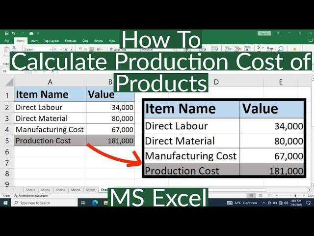

## Table of Contents

## What are the basic components of production costs?

Production costs are the total expenses a company incurs to create its products or services. These costs can be broken down into three main categories: raw materials, labor, and overhead. Raw materials are the basic goods used in manufacturing, like steel for cars or fabric for clothing. Labor costs include the wages paid to workers who are directly involved in making the product. Overhead costs are all the other expenses that are not directly tied to making the product, like rent for the factory, utilities, and equipment maintenance.

Each of these components plays a crucial role in determining the overall cost of production. Raw materials can vary in price based on market conditions, which can affect the total cost. Labor costs can also fluctuate, depending on the skill level of the workers and the wages they are paid. Overhead costs, while sometimes less visible, can add up quickly and impact the final price of the product. Understanding and managing these costs is essential for a business to remain profitable and competitive in the market.

## How do you set up an Excel spreadsheet to track production costs?

To set up an Excel spreadsheet for tracking production costs, start by opening a new Excel workbook. In the first row, label the columns with the main categories of production costs: 'Date', 'Raw Materials', 'Labor', and 'Overhead'. You can add more columns for specific items within these categories if needed, like 'Steel' under 'Raw Materials' or 'Factory Rent' under 'Overhead'. Each subsequent row will represent a different day or period where you enter the costs for that time.

Once your columns are set up, you can start entering data. For example, under 'Date', you might put '01/01/2023', and then fill in the costs for that day in the other columns. At the bottom of each column, use Excel's SUM function to automatically calculate the total costs for each category. For instance, in the cell below the last entry in the 'Raw Materials' column, you would enter '=SUM(B2:B100)' if your data goes from row 2 to row 100. This setup helps you keep track of your production costs easily and see where your money is going.

## What formulas can be used in Excel to calculate total production costs?

To calculate total production costs in Excel, you can use the SUM function. This function adds up all the numbers in a range of cells. For example, if you have entered the costs for raw materials in column B, labor costs in column C, and overhead costs in column D, you can find the total for each category by using the SUM function. In the cell below the last entry in column B, you would type '=SUM(B2:B100)' to add up all the numbers from row 2 to row 100. Do the same for columns C and D.

After you have the totals for each category, you can then calculate the total production cost by adding these three totals together. You can do this by using another SUM function or by simply adding the three cells together. For example, if the total for raw materials is in cell B101, labor in C101, and overhead in D101, you can find the total production cost by typing '=SUM(B101:D101)' in a new cell, or by typing '=B101+C101+D101'. This gives you a clear picture of your total production costs.

## How can you categorize different types of production costs in Excel?

To categorize different types of production costs in Excel, you can use columns to separate the main categories like raw materials, labor, and overhead. Under each main category, you can add more columns for specific items. For example, under raw materials, you might have columns for steel, fabric, and other materials you use. For labor, you could have columns for different types of workers like machine operators, assembly line workers, and supervisors. Overhead costs could be broken down into rent, utilities, and equipment maintenance.

After setting up your columns, you can start entering the costs for each category and sub-category. This way, you can see how much you are spending on each type of cost. At the bottom of each column, you can use the SUM function to add up the costs. For example, to find the total cost of steel, you would use '=SUM(C2:C100)' if your data is in column C from row 2 to row 100. This helps you keep track of your costs and see where your money is going.

## What are the common mistakes to avoid when calculating production costs in Excel?

One common mistake when calculating production costs in Excel is not updating the data regularly. If you don't enter the latest costs, your totals will be wrong. This can lead to bad decisions because you're not working with the most current information. Another mistake is mixing up different types of costs. For example, putting labor costs in the raw materials column can mess up your totals and make it hard to see where your money is really going.

Another error to avoid is not using formulas correctly. If you type in the totals manually instead of using the SUM function, you might make mistakes. Also, if you don't double-check your formulas, you could end up with wrong numbers. It's important to make sure your formulas are right and that they update automatically when you add new data. This helps keep your production cost calculations accurate and useful.

## How do you use Excel to analyze the impact of variable costs on total production costs?

To analyze the impact of variable costs on total production costs in Excel, you can set up your spreadsheet to track these costs separately. Start by creating columns for different types of variable costs, like raw materials and labor. As you enter the costs each day or week, you can use the SUM function to add up these costs over time. This will give you a clear picture of how much your variable costs are adding up to. You can then compare these totals to your total production costs to see how much of your total costs are coming from variable costs.

Once you have your data set up, you can use Excel's charting tools to make graphs that show how variable costs are affecting your total production costs. For example, you can create a line graph that shows the trend of variable costs over time and another line for total production costs. This visual representation can help you see if your variable costs are going up or down and how that's affecting your overall costs. By understanding this relationship, you can make better decisions about managing your costs and keeping your business profitable.

## Can Excel help in forecasting future production costs, and if so, how?

Yes, Excel can help you forecast future production costs by using historical data and some simple formulas. You can start by entering your past production costs into Excel, breaking them down into categories like raw materials, labor, and overhead. Once you have this data, you can use Excel's functions like AVERAGE, TREND, or FORECAST to predict future costs. For example, if you want to forecast next month's raw material costs, you can use the FORECAST function to look at the past few months' data and predict what the cost might be.

To make your forecast more accurate, you can also create charts and graphs in Excel. These visual tools can help you see patterns and trends in your costs over time. For instance, you might notice that your labor costs go up during certain months of the year. By spotting these trends, you can adjust your forecasts to be more accurate. Using Excel this way helps you plan better and make sure your business stays on budget.

## How do you integrate data from different departments into one Excel sheet for cost analysis?

To integrate data from different departments into one Excel sheet for cost analysis, start by setting up your Excel workbook with separate sheets for each department. For example, you might have one sheet for the production department, another for the sales department, and another for the finance department. In each sheet, enter the relevant cost data for that department, like raw materials costs for production or sales commissions for sales. Make sure to label your columns clearly so you know what each number represents.

Once you have all the departmental data entered, you can use Excel's functions to bring this data together into a single summary sheet. Create a new sheet called 'Summary' or 'Total Costs'. Use formulas like '=Production!B2' to pull data from the production sheet into your summary sheet. Do the same for the other departments. Then, use the SUM function to add up all the costs from each department to get your total production costs. This way, you can see all your costs in one place and analyze them easily.

## What advanced Excel functions can be used to optimize production cost calculations?

To optimize production cost calculations in Excel, you can use the VLOOKUP function. This function helps you find and pull specific data from a large table. For example, if you have a list of raw materials and their prices in one sheet, you can use VLOOKUP to automatically find the price of a material when you enter its name in your cost calculation sheet. This saves time and reduces errors because you don't have to manually look up and enter prices. Another useful function is INDEX and MATCH, which work together to find data in a table based on multiple criteria. This can be helpful if you need to pull costs based on different factors like date, department, or type of cost.

Another advanced function you can use is PIVOT TABLE. Pivot tables let you quickly summarize and analyze large amounts of data. For instance, you can create a pivot table to see how much you're spending on different types of costs across various departments. This helps you spot trends and make better decisions about where to cut costs or where to invest more. Finally, the IF function can be used to set up conditional calculations. For example, you can use IF to calculate overtime pay only if an employee works more than 40 hours a week. Using these functions together can make your production cost calculations more accurate and efficient.

## How can you use Excel's pivot tables to summarize and report on production costs?

To use Excel's pivot tables for summarizing and reporting on production costs, start by entering all your cost data into an Excel sheet. This should include columns for different types of costs like raw materials, labor, and overhead, as well as any other relevant details like dates or departments. Once your data is ready, go to the 'Insert' tab and click on 'PivotTable'. Choose where you want the pivot table to be placed, either in a new sheet or in the current one. In the pivot table fields, drag the columns you want to analyze into the 'Row Labels', 'Column Labels', 'Values', and 'Report Filter' areas. For example, you might drag 'Cost Type' to 'Row Labels' and 'Amount' to 'Values' to see the total costs for each type of cost.

After setting up your pivot table, you can start to see patterns and trends in your production costs. You can easily change what data is shown by dragging different fields into the pivot table. For instance, if you want to see costs by department, just drag 'Department' into 'Row Labels'. You can also use the 'Report Filter' to focus on specific time periods or types of costs. Pivot tables let you quickly sum up your costs and see where your money is going, making it easier to report on your production costs and make informed decisions about managing them.

## What are the best practices for maintaining and updating production cost data in Excel?

Keeping your production cost data up to date in Excel is important for making good decisions. The best way to do this is by updating your data regularly. Make it a habit to enter new costs every day or week, depending on your needs. This helps make sure your totals are always correct. Also, always double-check your numbers before you add them to the sheet. Mistakes can mess up your totals and lead to wrong decisions. If you find a mistake, fix it right away to keep your data accurate.

Another good practice is to keep your Excel sheet organized. Use clear labels for your columns and rows so you know what each number means. This makes it easier to find and update your data. You can also use formulas like SUM to add up your costs automatically. This way, when you enter new data, your totals update by themselves. It's also a good idea to save backups of your Excel file. This way, if something goes wrong, you can go back to an earlier version and not lose all your work. Keeping your data organized and backed up helps you manage your production costs better.

## How can Excel be used to perform a break-even analysis for production costs?

To do a break-even analysis for production costs in Excel, you first need to know your fixed costs, variable costs, and the price you sell your product for. Fixed costs are things like rent that don't change no matter how much you produce. Variable costs, like raw materials, go up when you make more stuff. In Excel, you can set up a sheet with columns for these costs and the selling price. Use formulas to figure out your total costs and total revenue. The break-even point is when your total revenue equals your total costs. You can find this by dividing your fixed costs by the difference between the selling price and the variable cost per unit.

Once you have your data in Excel, you can use the 'Goal Seek' tool to find your break-even point quickly. Go to the 'Data' tab and click on 'What-If Analysis', then choose 'Goal Seek'. Set the cell with your total profit to zero, and tell Excel to change the cell with the number of units you need to sell. Excel will then calculate how many units you need to sell to break even. This helps you see how many products you need to make and sell to cover all your costs and start making a profit.

## What are some Excel formulas and templates for managing production costs?

Templates available on platforms such as Exceltable.com and Eloquens.com provide traders with pre-designed solutions that facilitate the process of inputting trading variables and calculating production costs efficiently. These templates are particularly useful as they allow traders to systematically account for a wide range of input variables and dynamically compute associated costs.

Excel formulas play a crucial role in this cost analysis process by enabling the integration of various data points like the frequency of trades, asset prices, and levels of risk tolerance. For instance, formulas like `=SUM(A1:A10)` can be utilized to aggregate costs over a given period, while `=AVERAGE(B1:B10)` offers insights into the average costs associated with trades. Logical functions such as `=IF` and `=AND` allow traders to implement conditional cost adjustments based on specific market conditions or trading thresholds.

Custom Excel templates, tailored to individual trading strategies, ensure the consideration of all relevant costs, providing traders with a comprehensive view of their expenditure structure. This thorough approach facilitates a more accurate assessment of the profitability and sustainability of trading strategies. For example, traders can develop models that compute the cost per trade using a formula like:

$$
\text{Cost per trade} = \frac{\text{Total costs}}{\text{Number of trades}}
$$

Additionally, cumulative cost analysis can be performed over designated time periods to track the progression of expenses. By employing more complex formulas, traders can also conduct break-even analyses to determine the minimum level of performance required to cover trading costs. A sample formula for a break-even analysis may be structured as follows:

$$
\text{Break-even point} = \frac{\text{Fixed Costs}}{\text{Selling Price per unit} - \text{Variable Cost per unit}}
$$

Such detailed models allow for real-time adjustments and provide traders with the flexibility to adapt their strategies as market conditions change. By utilizing Excel's advanced functionalities and templates, traders can obtain crucial insights into their trading operations, ultimately leading to more informed decision-making and improved financial performance.

## References & Further Reading

[1]: Bergstra, J., Bardenet, R., Bengio, Y., & Kégl, B. (2011). ["Algorithms for Hyper-Parameter Optimization."](https://dl.acm.org/doi/10.5555/2986459.2986743) Advances in Neural Information Processing Systems 24.

[2]: ["Advances in Financial Machine Learning"](https://www.amazon.com/Advances-Financial-Machine-Learning-Marcos/dp/1119482089) by Marcos Lopez de Prado

[3]: ["Evidence-Based Technical Analysis: Applying the Scientific Method and Statistical Inference to Trading Signals"](https://www.amazon.com/Evidence-Based-Technical-Analysis-Scientific-Statistical/dp/0470008741) by David Aronson

[4]: ["Machine Learning for Algorithmic Trading"](https://github.com/stefan-jansen/machine-learning-for-trading) by Stefan Jansen

[5]: ["Quantitative Trading: How to Build Your Own Algorithmic Trading Business"](https://www.amazon.com/Quantitative-Trading-Build-Algorithmic-Business/dp/1119800064) by Ernest P. Chan