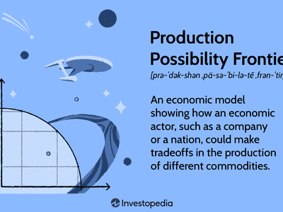

The Production Possibility Frontier (PPF) is a fundamental concept in economics, serving as a graphical representation of the trade-offs and opportunity costs associated with resource allocation. A PPF chart typically illustrates the maximum feasible amounts of two goods or services that a nation or business can produce, given their resource constraints. The curve demonstrates how producing more of one good inevitably reduces the production capability of another, highlighting the concept of opportunity cost. Understanding and accurately modeling the PPF is essential for economists and policy-makers seeking to make informed decisions about resource allocation and economic policy.

In today's digital age, modern tools like Microsoft Excel significantly simplify the process of calculating and visualizing the PPF. Utilizing Excel allows for the creation of dynamic and interactive PPF graphs, facilitating ease of analysis for both economists and businesses. These graphs help dissect complex economic models and inform crucial decision-making processes in an accessible and understandable manner.

This article aims to offer a comprehensive guide on calculating the Production Possibility Frontier using Excel, while also highlighting its practical relevance across economic models and algorithmic trading. The synergy between PPF analysis and Excel not only aids in visual comprehension but also enhances productivity and strategic insight within various industries. For instance, businesses and economic analysts can leverage this knowledge to predict market behaviors, plan resource allocation efficiently, and optimize production strategies.

By mastering the application of PPF in Excel, individuals and organizations can unlock a powerful tool for improving strategic planning and decision-making. This capability is particularly beneficial in fields such as business planning, academic research, and sophisticated trading environments where data-driven decisions are paramount.

## Table of Contents

## Understanding the Production Possibility Frontier

The Production Possibility Frontier (PPF) is a fundamental concept in economics that represents the maximum feasible outputs of two goods or services an economy can produce, given a fixed amount of resources. It is a graphical representation of the trade-offs involved in allocating resources between these two outputs, highlighting the opportunity costs associated with such decisions.

Opportunity cost is a critical aspect of the PPF, referring to the value of the foregone alternative when choosing one option over another. In the context of the PPF, opportunity cost is depicted as the slope of the curve. As you move along the PPF from one point to another, producing more of one good typically requires producing less of the other, making the opportunity cost of increased production evident. 

The significance of the PPF lies in its ability to demonstrate efficient resource allocation and identify the limits of economic growth. A point on the curve represents an efficient allocation of resources, where any shift to produce more of one good would lead to producing less of another. Points inside the curve indicate inefficiencies, where resources are not fully utilized. Conversely, points outside the curve are unattainable with the current resources, suggesting that growth is required to reach these levels.

A typical PPF is concave to the origin, reflecting increasing opportunity costs as the production of one good expands. This shape arises from the reality that resources are not perfect substitutes for each other; reallocating them between different goods often results in less proportional gains due to factors such as specialization and different resource suitability.

A visual representation of the PPF involves plotting two goods on the X and Y axes of a graph. The curve itself shows the maximum output possibilities for both goods. For instance, consider an economy that can produce either cars or computers. The PPF would curve outwards, showing all possible combinations of these two goods that can be produced using all available resources efficiently. 

In this graph, each point along the PPF illustrates a different allocation of resources between the two goods. If the economy is producing at a point on the PPF, it is operating efficiently, and any movement to increase the output of one product will come at the cost of reduced output of the other due to the opportunity cost.

Understanding the PPF is crucial for economists and policymakers when assessing the most efficient ways to utilize resources, setting production targets, and formulating policies that can lead to economic growth within the constraints of available resources. Additionally, changes in the PPF over time can signify advancements in technology or an increase in resources, both of which can shift the frontier outward and pave the way for economic growth.

## Calculating the Production Possibility Frontier in Excel

Calculating the Production Possibility Frontier (PPF) in Excel involves a clear and methodical approach that benefits from Excel's powerful data manipulation and visualization capabilities. Here's a detailed guide:

### Step-by-Step Guide for Setting Up Data

1. **Identify Two Goods or Services**: First, determine the two goods or services you want to analyze. The PPF will represent the trade-offs between these two.

2. **Define Resource Constraints**: Specify the limits on resources that affect the production of these goods. This could include labor hours, raw materials, or financial budget.

3. **Populate Data in Excel**: Open a new Excel spreadsheet. Input different combinations of quantities for the two goods that utilize your resource constraints efficiently. For example:
   - Column A: Quantity of Good X
   - Column B: Corresponding quantity of Good Y

4. **Calculating Points on the PPF**: To calculate feasible production points, ensure that the data reflects possible combinations that fully utilize the resources. Each row represents a different allocation scenario.

### Creating PPF Graphs with Excel’s Chart Wizard

1. **Highlight the Data**: Select the data range for the two goods you want to plot.

2. **Insert an XY (Scatter) Chart**: 
   - Go to the 'Insert' tab.
   - Choose 'Scatter' from the Chart options, and then 'Scatter with Straight Lines' to connect the data points, illustrating the trade-offs.

3. **Customize the PPF Graph**:
   - Right-click on the chart to format data series, ensuring that the points are smoothly connected, visually representing the PPF curve.

### Importance of Labeling Axes and Ensuring Data Accuracy

1. **Label Axes**: Clearly label the X-axis and Y-axis to reflect the two goods or services being plotted. For example, 'Quantity of Good X' and 'Quantity of Good Y'.

2. **Data Accuracy**: Double-check input data for accuracy. Any error in the data will result in misleading insights. Ensure that each data point on the graph represents an efficient use of resources, i.e., being on the PPF rather than inside the curve, which indicates underutilization of resources.

### Modeling Economic Scenarios Using Excel’s Capabilities

1. **Sensitivity Analysis**: Use Excel’s data tables to conduct sensitivity analysis by altering resource constraints and observing shifts in the PPF curve.

2. **What-if Analysis**: Leverage Excel's 'Scenario Manager' or 'Solver' tool to experiment with different economic scenarios, such as increasing resources or improving technology which could shift the PPF outward.

3. **Visualization Enhancements**: Utilize Excel's chart formatting options to enhance the presentation of the PPF, such as adding trendlines, changing chart colors, and using data labels to mark key points.

Excel's flexibility allows for complex modeling and visualization of the Production Possibility Frontier, enabling insights into efficient resource allocation, trade-offs, and opportunity costs. Through these steps, economists and businesses can effectively harness Excel to represent and analyze economic scenarios, making it a valuable tool for decision-making.

## Applying PPF Graphs in Economic Models

Economists utilize the Production Possibility Frontier (PPF) to understand and predict economic behaviors by illustrating trade-offs between two goods or services. This model assesses how resources can be efficiently allocated to maximize production while considering opportunity costs. The PPF graph serves as an essential tool for visualizing these trade-offs, enabling economists to analyze various scenarios and make informed predictions.

In macroeconomic models, the integration of PPF is crucial for achieving efficient resource utilization. By mapping out different production possibilities, economists can identify optimal combinations of goods and services that an economy can produce given its limited resources. The curve's position and shape provide insights into an economy's productive capacity and potential growth paths. When resources are used efficiently, production occurs on the PPF curve, indicating that any movement along the curve involves a trade-off, highlighting opportunity costs.

The PPF is also crucial for analyzing the impacts of economic growth and technological advancements. Economic growth can shift the PPF outward, indicating that an economy can produce more of both goods, thus increasing potential output. Technological advancements can similarly expand the PPF by improving productivity. For example, if new technology enhances the production process of one good, it could allow an economy to produce more of both goods without requiring additional resources. This shift is represented graphically as an outward movement of the PPF.

The PPF is closely related to concepts like economic efficiency and scarcity. Economic efficiency is achieved when resources are allocated in a way that maximizes production output, represented by any point on the PPF. Points inside the PPF demonstrate inefficiency, as more of one or both goods could be produced without sacrificing the other. Scarcity is inherent in the concept of the PPF, as it acknowledges limited resources and the need to make choices about their allocation. The PPF visually represents the scarcity and necessitates trade-offs, embodying the economic challenges of deciding how best to meet society's needs.

## PPF and Algorithmic Trading

The Production Possibility Frontier (PPF) serves as a crucial tool in economic modeling and offers significant utility in [algorithmic trading](/wiki/algorithmic-trading). By visualizing trade-offs and opportunity costs associated with resource allocation, the PPF framework provides valuable insights for risk management and asset allocation in trading algorithms.

### Informing Risk Management and Asset Allocation

In algorithmic trading, risk management is paramount. The PPF helps by providing a graphical representation of potential outcomes based on different resource allocations. By examining the PPF, traders can identify efficient portfolios and assess opportunity costs associated with reallocating assets. This information can be crucial in determining the risk-reward balance within a trading algorithm. For example, if we consider two financial assets as the axes on a PPF graph, the curve can help illustrate the maximum possible outputs of combined investments based on resources at hand. 

### Case Studies: PPF-Derived Insights in Trading Models

Several trading firms have successfully integrated PPF-derived insights into their models. For instance, a quantitative [hedge fund](/wiki/hedge-fund-trading-strategies) may utilize PPF concepts to evaluate the trade-offs between investing in traditional stock markets versus emerging [cryptocurrency](/wiki/cryptocurrency) markets. By analyzing historical data and projecting potential returns, the PPF can aid in identifying marginal rates of substitution between different asset classes, effectively guiding investment decisions that align with the firm's strategic goals. 

Moreover, algorithmic trading strategies can incorporate PPF principles to optimize asset allocation strategies dynamically. For instance, algorithmic models can simulate different economic scenarios and utilize PPF graphs to foresee potential market shifts and allocate assets accordingly, ensuring a robust response to fluctuating market conditions.

### Future Prospects of PPF in Trading Strategies

Looking ahead, the application of PPF in algorithmic trading continues to hold promising potential. Advances in technology and data analytics will allow for more sophisticated integrations where PPF concepts enhance adaptive trading strategies and decision-making. The ability to compute and analyze big data efficiently means that even more complex economic scenarios can be modeled, allowing for improved forecasting of market conditions. 

As [machine learning](/wiki/machine-learning) and [artificial intelligence](/wiki/ai-artificial-intelligence) technologies evolve, the intersection of these fields with PPF can lead to the development of advanced trading algorithms that not only optimize resource allocation but also adapt swiftly to evolving economic landscapes, maximizing returns while minimizing risks.

In conclusion, the application of the Production Possibility Frontier in algorithmic trading presents a powerful approach to understanding and navigating the complexities of financial markets, paving the way for more strategic and informed trading decisions.

## Conclusion

The Production Possibility Frontier (PPF) remains a cornerstone of economic analysis and decision-making, offering insightful perspectives into the allocation of limited resources. By clearly showcasing trade-offs, opportunity costs, and the potential for economic efficiency, the PPF serves as a valuable tool for both theoretical and practical applications. Its utility extends beyond the confines of academic study, influencing economic policy, business strategies, and various financial practices.

Incorporating Excel capabilities to construct and interpret PPF graphs enhances the practicality of this concept. Excel serves as an accessible platform for visualizing and manipulating economic models, making it an indispensable tool for analysts, economists, and business professionals. By harnessing Excel's functionality, users can compile data, utilize chart wizards to develop precise PPF graphs, and effectively label axes to ensure clarity and accuracy. This process not only aids in a deeper comprehension of economic dynamics but also improves the applicability of economic theories in real-world contexts.

The integration of PPF knowledge into diverse fields showcases its adaptability and relevance. In economics, it aids in understanding resource productivity and growth limits. In business, the PPF provides insights into strategic planning, helping firms optimize operations within their constraining resources. Similarly, within trading, PPF-derived insights can enhance algorithmic models by informing risk management and asset allocation strategies.

For individuals interested in advancing their strategic decision-making abilities, embracing the practical creation and analysis of PPFs using Excel is highly recommended. Engaging with this process allows for a better appreciation of economic concepts and the development of skills that can translate into various professional domains. Therefore, readers are encouraged to actively use Excel to craft and evaluate PPFs, transforming theoretical knowledge into actionable insights that can inform vital strategic decisions across multiple sectors.

## References & Further Reading

[1]: Frank, R. H., & Bernanke, B. S. (2007). ["Principles of Economics."](https://archive.org/details/isbn_9780073336732) McGraw-Hill Education.

[2]: Acemoglu, D., Laibson, D., & List, J. A. (2015). ["Microeconomics."](https://www.amazon.com/Microeconomics-Global-Daron-Acemoglu/dp/129241488X) Pearson.

[3]: Samuelson, P. A., & Nordhaus, W. D. (2009). ["Economics."](https://archive.org/details/economics0000samu) McGraw-Hill Education.

[4]: Sloman, J., & Wride, A. (2009). ["Economics."](https://books.google.com/books/about/Economics.html?id=tyK9UZ_I6SsC) Prentice Hall.

[5]: Sullivan, A., & Sheffrin, S. M. (2003). ["Economics: Principles in Action."](https://books.google.com/books/about/Economics_Principles_in_Action_2nd_Editi.html?id=vPxAHAAACAAJ) Pearson Prentice Hall.

[6]: Varian, H. R. (2014). ["Intermediate Microeconomics: A Modern Approach."](https://archive.org/details/intermediatemicr0000vari_z9edo2) W. W. Norton & Company.

[7]: Chiang, A. C., & Wainwright, K. (2005). ["Fundamental Methods of Mathematical Economics."](https://www.academia.edu/38703783/_Alpha_C_Chiang_Kevin_Wainwright_Fundamental_Methods_of_Mathematical_Economics) McGraw-Hill Education.