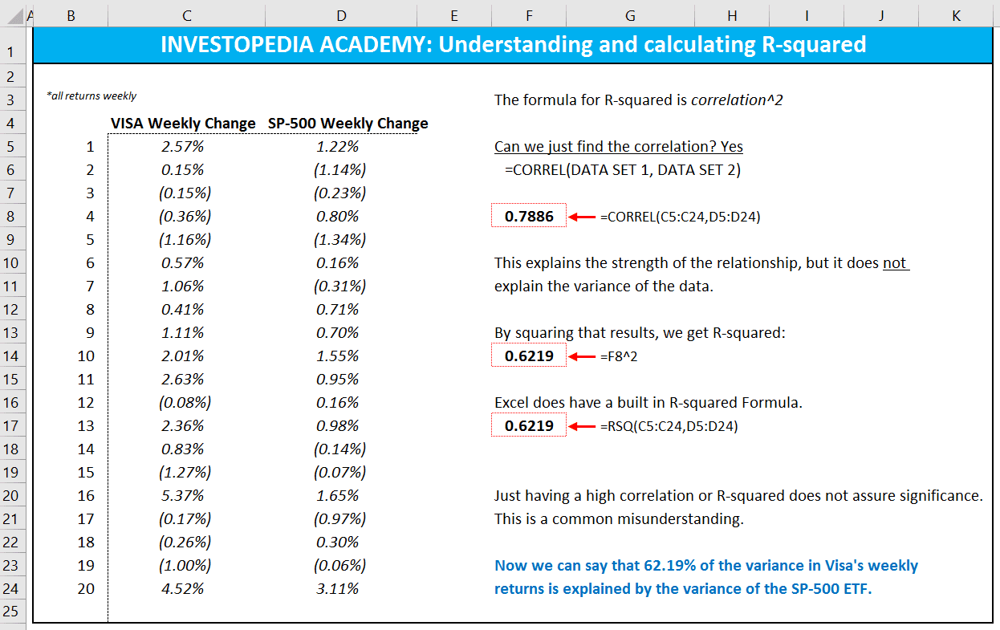

Algorithmic trading, also known as algo trading, refers to the use of computer algorithms to execute trades in the financial markets. These algorithms can process vast amounts of data at high speed, enabling traders to capitalize on market inefficiencies and make informed decisions with minimal human intervention. The growing reliance on algorithmic trading systems is transforming the financial landscape, offering increased efficiency, reduced transaction costs, and improved execution speeds.

In the context of algorithmic trading, Excel has emerged as a powerful tool for financial data analysis and model construction. Its user-friendly interface, combined with its robust computational capabilities, makes it a valuable asset for analyzing large datasets, creating custom models, and automating repetitive tasks. Excel is equipped with a variety of built-in functions and add-ins that simplify statistical analysis, including regression analysis, which is fundamental to algo trading.

R-Squared, or the coefficient of determination, is a crucial statistical measure used to evaluate the goodness-of-fit of a regression model. It quantifies the proportion of variance in the dependent variable that is predictable from the independent variable(s). An R-Squared value of 1 indicates a perfect fit, while a value of 0 suggests no explanatory power. This metric helps traders assess the effectiveness of models in capturing market trends and making accurate predictions, which is particularly pertinent in developing and refining algo trading strategies.

In Excel, R-Squared can be calculated using regression functions that facilitate the analysis of historical price data to identify patterns and relationships. With tools like LINEST and RSQ, Excel allows users to compute R-Squared values seamlessly within their financial models. By leveraging these capabilities, traders can evaluate the fit of their predictive models, leading to more robust and adaptive trading strategies.

This article aims to explore the integration of R-Squared within Excel for developing algorithmic trading models. Readers will gain insights into the significance of R-Squared in statistical models, understand its implications for trading strategies, and learn practical steps for calculating and applying R-Squared in Excel. Through detailed examples and guidance, this article will provide a comprehensive view of how Excel can be harnessed to enhance algorithmic trading efforts, while encouraging further exploration of advanced statistical measures and tools.

## Table of Contents

## Understanding R-Squared in Statistics

R-Squared, also known as the coefficient of determination, is a statistical measure that represents the proportion of the variance for a dependent variable that can be explained by one or more independent variables in a regression model. Its value ranges from 0 to 1, where a value of 0 indicates that the independent variables do not explain any of the variance in the dependent variable, while a value of 1 indicates that the independent variables perfectly explain all the variance.

The significance of R-Squared lies in its ability to quantify how well a regression model fits the observed data. In essence, a higher R-Squared value suggests that the model accounts for a larger portion of the variance, signaling a stronger relationship between the dependent and independent variables.

Mathematically, R-Squared is calculated using the formula:

$$
R^2 = 1 - \frac{\text{SS}_\text{res}}{\text{SS}_\text{tot}}
$$

where $\text{SS}_\text{res}$ is the sum of squares of residuals (the difference between observed and predicted values) and $\text{SS}_\text{tot}$ is the total sum of squares (the variance of the dependent variable around its mean). 

An important distinction must be made between R-Squared and Adjusted R-Squared. While R-Squared measures how well the independent variables explain the variance in the dependent variable, it does not account for the number of variables in the model. This is where Adjusted R-Squared is beneficial, as it adjusts the R-Squared value based on the number of predictors in the model, providing a more accurate measure when there are multiple independent variables. The Adjusted R-Squared is calculated as:

$$
\text{Adjusted } R^2 = 1 - \left( \frac{(1-R^2)(n-1)}{n-k-1} \right)
$$

where $n$ is the number of observations, and $k$ is the number of independent variables.

R-Squared is commonly employed in various statistical models across different fields. In finance, for example, it is used to determine how well a particular stock's returns can be explained by the market index returns in a linear regression model. In economics, R-Squared can help assess how well macroeconomic indicators explain variations in GDP growth rates. Additionally, in biology, it can be used to explore relationships between different biological variables and predict outcomes. Each application underscores the utility of R-Squared as a measure of explanatory power in predictive modeling.

## The Importance of R-Squared in Trading Models

R-Squared, a statistical measure widely used in evaluating trading models, serves as a significant indicator of how well a model fits the given data. It measures the proportion of variance in the dependent variable that is predictable from the independent variable(s). In the context of trading models, a high R-Squared value suggests that a substantial portion of the variability in asset returns can be accounted for by the model's predictive factors. This is particularly valuable in [algorithmic trading](/wiki/algorithmic-trading), where predicting market movements accurately can lead to profitable trades. 

To understand its application, consider a trading strategy that predicts stock returns based on historical price data and other financial indicators. A higher R-Squared value in the resultant regression model indicates that the independent variables successfully explain a significant part of the variation in stock returns, thereby suggesting the model's effectiveness at capturing market trends.

Despite its utility, relying solely on R-Squared carries potential pitfalls. Firstly, a high R-Squared does not necessarily imply causation or suitability of the model for out-of-sample predictions. It merely suggests a good fit to the historical data, which might not hold in future data due to market [volatility](/wiki/volatility-trading-strategies) or changing economic conditions. Moreover, R-Squared does not account for the number of predictors in the model. This can lead to overfitting, where the model performs well on training data but fails when subjected to new, unseen data. Adjusted R-Squared can be used to mitigate this risk, as it adjusts the statistic based on the number of explanatory variables, penalizing the addition of unnecessary predictors.

Additionally, R-Squared should not be viewed in isolation. It is crucial to use it alongside other metrics such as the F-statistic, p-values, and mean squared error to gain a comprehensive understanding of the model's performance. These supplementary [statistics](/wiki/bayesian-statistics) help validate whether the relationships identified by the model are statistically significant and provide a more rounded view of model reliability.

In summary, while R-Squared is an essential tool for evaluating the fit quality of trading models, its limitations should not be overlooked. Its integration with other performance metrics offers a more robust framework for developing and assessing trading strategies.

## Leveraging Excel for Algo Trading

Excel is a powerful tool commonly used for financial data analysis and algorithmic trading. Its accessibility and versatility make it a preferred choice for traders and analysts who need to manipulate data, build models, and perform statistical analyses without requiring advanced programming skills.

### Advantages of Using Excel for Financial Data Analysis

Excel provides a user-friendly interface that allows users to easily import, organize, and analyze large datasets. Its built-in functions and formulas facilitate various types of statistical analyses, including regressions and time series analyses, which are crucial for developing and evaluating trading models. Additionally, Excel's ability to create dynamic charts and graphs helps users visualize trends and relationships within financial data, aiding in better decision-making.

### Excel’s Built-in Functions and Tools

Excel offers a rich set of built-in functions specifically designed for statistical analysis. For algorithmic trading, functions such as `LINEST`, `RSQ`, and `CORREL` are particularly useful. The `LINEST` function calculates various statistics for linear regression models, including coefficients and standard errors. The `RSQ` function, on the other hand, computes the R-Squared value directly, which is essential for assessing the goodness-of-fit of a regression model. These tools enable users to evaluate how well their trading models explain the variability in historical price data, a critical step in model validation.

### Ease of Data Manipulation and Model Building

Excel's intuitive interface allows users to quickly manipulate data through features like pivot tables, sorting, and filtering. Users can build complex trading models by linking different sheets and cells, making updates easy and minimizing errors. The use of Excel’s conditional formatting can help highlight significant trends or outliers, providing insights at a glance. Moreover, features like solver and data tables enable users to perform optimization and sensitivity analyses, which are vital for refining trading strategies.

### Limitations Compared to Specialized Trading Platforms

Despite its advantages, Excel does have limitations. One of the main constraints is its capacity; handling extremely large datasets can be cumbersome, and performance might degrade as the [volume](/wiki/volume-trading-strategy) of data increases. Specialized trading platforms and programming environments, like MATLAB, R, or Python, offer more robust capabilities for [backtesting](/wiki/backtesting) and implementing complex algorithms. These platforms can handle larger datasets more efficiently and offer a broader range of statistical and [machine learning](/wiki/machine-learning) libraries for developing sophisticated models.

Furthermore, Excel lacks native support for real-time data processing, a feature that is critical in high-frequency trading environments. Although plugins and add-ons can extend its functionality, these solutions might not match the seamless integration offered by dedicated trading platforms.

In summary, while Excel is an excellent tool for initial model development and exploratory data analysis, it is essential to consider its limitations when dealing with more complex trading strategies or large-scale data processing needs. For traders and analysts, leveraging Excel's capabilities while being mindful of its constraints can lead to the effective development of algorithmic trading models.

## Calculating R-Squared in Excel for Trading Models

To calculate R-Squared in Excel for trading models, one must first understand the layout of data and the processes involved in performing a regression analysis within Excel. The process involves structuring the dataset, inputting it into Excel, and utilizing Excel's built-in functions to derive the R-Squared value.

### Step-by-Step Guide

#### Inputting Data and Structuring a Regression Model

1. **Prepare Your Data**: Organize the historical price data in two columns in Excel. For instance, in a trading model, use Column A for the independent variable (e.g., time or another influencing factor such as a market index) and Column B for the dependent variable (e.g., stock prices or returns).

2. **Select the Data**: Highlight the data you wish to analyze. Include headers if necessary, as they help in identifying the variables during analysis.

3. **Open the Data Analysis Toolpak**: Excel's Data Analysis Toolpak must be activated to perform regression analysis. If not already available, enable it by going to `File > Options > Add-ins` and select `Excel Add-ins`. Check `Analysis Toolpak` and click `OK`.

4. **Perform Regression Analysis**:
   - Go to `Data > Data Analysis`.
   - Choose `Regression` from the list of analysis tools and click `OK`.
   - Define the `Input Y Range` (dependent variable) and `Input X Range` (independent variable).
   - Specify the `Output Range` where you’d like the results to be displayed.
   - Click `OK` to generate the regression output.

#### Practical Example of Calculating R-Squared

Imagine you're evaluating the relationship between an index's performance and a specific stock's return. Once the regression analysis is complete, Excel will provide output statistics including the R-Squared value, which represents the proportion of the variability of the dependent variable (stock returns) explained by the independent variable (index performance).

#### Using Excel Formulas for R-Squared

1. **LINEST Function**: Excel's `LINEST` function can compute the statistics for a line by inputting arrays of data.
   - Syntax: `=LINEST(known_y's, known_x's, const, stats)`
   - Example: To compute R-Squared, use `=INDEX(LINEST(B2:B11, A2:A11, TRUE, TRUE), 3, 1)`
     - `B2:B11` is the range of your dependent variable data.
     - `A2:A11` is the range of your independent variable data.
     - The output provides several results, with R-Squared typically being in the third position of the resulting array.

2. **RSQ Function**: For a direct computation, use the `RSQ` function.
   - Syntax: `=RSQ(known_y's, known_x's)`
   - Example: `=RSQ(B2:B11, A2:A11)`
   - This function provides a straightforward calculation of R-Squared between two data sets, ideal for quick assessments.

By using these methods, Excel allows for diverse statistical evaluations, providing traders with accessible tools for validating their trading models' effectiveness. Whether through a full regression analysis or more focused formula use, traders can leverage Excel to understand how much of the variance in their target financial performance metrics is accounted for by their predictors.

## Practical Example: Applying R-Squared in an Algo Trading Strategy

To develop an algorithmic trading strategy using Excel and apply R-Squared analysis, follow these steps:

### Step 1: Setting Up the Model
Begin by defining the parameters of your trading strategy. For this example, we will use a simple linear regression model to predict the future prices of a stock based on historical price data. The model will include:
- **Dependent Variable (Y):** Future stock price
- **Independent Variable (X):** Historical stock price

### Step 2: Inputting Data
Collect historical stock price data, which can often be downloaded from financial websites or obtained from your brokerage. Input this data into Excel in two columns: one for dates and another for stock prices.

| Date       | Historical Price |
|------------|------------------|
| 2023-01-01 | 150              |
| 2023-01-02 | 152              |
| 2023-01-03 | 148              |
| ...        | ...              |

### Step 3: Structuring the Regression Model
Use Excel’s built-in features to structure a linear regression model. Select your data range and utilize Excel’s “Data Analysis” toolpack. If not enabled, you can install it via Excel’s Add-Ins options.

1. Go to **Data** > **Data Analysis** > **Regression**.
2. Set your **Y Range** to the future stock prices and **X Range** to the historical prices.
3. Ensure that you check the box for **Labels** if your data includes headers.
4. Specify the output range where you would like Excel to place the regression analysis results.

### Step 4: Calculating R-Squared
After running the regression, the output will include several statistics, one of which is R-Squared. This value represents the proportion of variance in the dependent variable that is predictable from the independent variable. The R-Squared value is crucial for evaluating the accuracy and effectiveness of your model.

### Step 5: Reviewing the Results
Suppose the R-Squared value comes out to be 0.85. This implies that 85% of the variability in future stock prices can be explained by historical prices using the current model. A higher R-Squared generally indicates a better fit, meaning your model can make more accurate predictions.

### Step 6: Implications for the Strategy
While a high R-Squared is a positive indicator, it's essential to consider its limitations:
- A very high R-Squared might suggest overfitting, especially if additional independent variables cause excessive complexity.
- It's crucial to validate the model using a separate validation dataset to ensure its predictive power on unseen data.

### Additional Steps (if necessary):
For a more detailed analysis, you can use Excel functions like `LINEST` or `RSQ` to compute R-Squared values directly through formulas:
- Use `=RSQ(known_ys, known_xs)` to find the R-Squared of your data range.
- Use `=LINEST(known_ys, known_xs, TRUE, TRUE)` for more advanced outputs like coefficients and intercepts.

Incorporating this rigorous analysis into your algorithmic trading strategy provides quantitative backing, giving more confidence to engage in financial markets effectively. Using Excel for this analysis demonstrates its capacity as a powerful tool for building and evaluating trading models efficiently.

## Limitations and Considerations

When using R-Squared in trading models, it is essential to acknowledge its limitations and avoid common misconceptions. R-Squared, while valuable in assessing how well a model explains variations in the dependent variable, is not an all-encompassing measure of model accuracy or predictive power.

One of the primary limitations of R-Squared is its potential to overstate the goodness-of-fit in the presence of high multicollinearity among independent variables. In statistical models, a high R-Squared value can sometimes arise simply from the addition of more explanatory variables, irrespective of their actual relevance to the predictive power of the model. This phenomenon often leads to a common misconception that a high R-Squared inherently implies a model is robust and reliable. However, it is crucial to remember that R-Squared does not account for the number of predictors in the model or their significance.

To address these limitations, analysts are encouraged to complement R-Squared with other statistical measures and diagnostic tools. Metrics such as Adjusted R-Squared, which adjusts for the number of predictors in the model, offer a more nuanced view by penalizing excessive variables that do not contribute meaningful information. Additionally, the use of statistical tests such as the F-test or p-values for individual coefficients can aid in determining the significance of predictors.

Moreover, it is vital to consider external factors and market conditions when applying R-Squared in trading models. Financial markets are influenced by a myriad of external variables, including macroeconomic indicators, geopolitical events, and sudden market shifts. These factors can impact model performance in ways that R-Squared alone cannot capture. As such, relying solely on R-Squared without considering these conditions might lead to misleading conclusions and suboptimal trading strategies.

In conclusion, while R-Squared is a useful tool in gauging the fit of a trading model, it should be employed alongside other statistical measures and under careful consideration of external conditions to enhance the robustness and reliability of trading strategies.

## Conclusion and Future Outlook

In this article, we have explored the utility of Excel and the significance of R-Squared in the development of trading strategies. By leveraging Excel's robust features, traders can efficiently analyze financial data and construct models that predict market behaviors effectively. R-Squared, as a statistical measure, offers insights into the reliability of these models, indicating how well the model explains the variability of the response data.

The application of R-Squared is invaluable when assessing the performance and accuracy of trading models. It enables traders to discern the proportion of variance explained by the independent variables in a regression model, signifying the model's fit. However, it is crucial to remember that while a high R-Squared value suggests a good fit, relying solely on this measure can be misleading. Complementary metrics and a thorough understanding of the market conditions are essential for robust analysis.

Looking forward, the future potential of analytics in algorithmic trading appears boundless. As computational power continues to grow and data becomes increasingly accessible, traders will benefit from more sophisticated analytical techniques and tools. The integration of advanced statistical measures, machine learning algorithms, and big data analytics has the potential to enhance predictive accuracy and efficiency, paving the way for more strategic and data-driven trading approaches.

Traders and analysts are encouraged to continue exploring these advanced measures and tools to remain competitive in the evolving financial markets. Sharing experiences and insights can foster a collaborative environment where innovative strategies are developed and validated. As the landscape of algorithmic trading evolves, the continuous learning and adaptation of new methodologies will be critical to success.

## References & Further Reading

[1]: ["Algorithms for Hyper-Parameter Optimization"](https://dl.acm.org/doi/10.5555/2986459.2986743) by Bergstra, J., Bardenet, R., Bengio, Y., & Kégl, B. Advances in Neural Information Processing Systems 24.

[2]: ["Advances in Financial Machine Learning"](https://www.amazon.com/Advances-Financial-Machine-Learning-Marcos/dp/1119482089) by Marcos Lopez de Prado.

[3]: Aronson, D. (2007). ["Evidence-Based Technical Analysis: Applying the Scientific Method and Statistical Inference to Trading Signals"](https://www.amazon.com/Evidence-Based-Technical-Analysis-Scientific-Statistical/dp/0470008741).

[4]: Jansen, S. (2018). ["Machine Learning for Algorithmic Trading: Predictive models to extract signals from market and alternative data for systematic trading strategies using Python"](https://www.amazon.com/Machine-Learning-Algorithmic-Trading-alternative/dp/1839217715).

[5]: Chan, E. P. (2009). ["Quantitative Trading: How to Build Your Own Algorithmic Trading Business"](https://github.com/ftvision/quant_trading_echan_book).

[6]: ["Excel 2016 for Financial Analysis"](https://www.investopedia.com/ask/answers/052115/how-do-i-perform-financial-analysis-using-excel.asp) (Online Course) by Henry George.