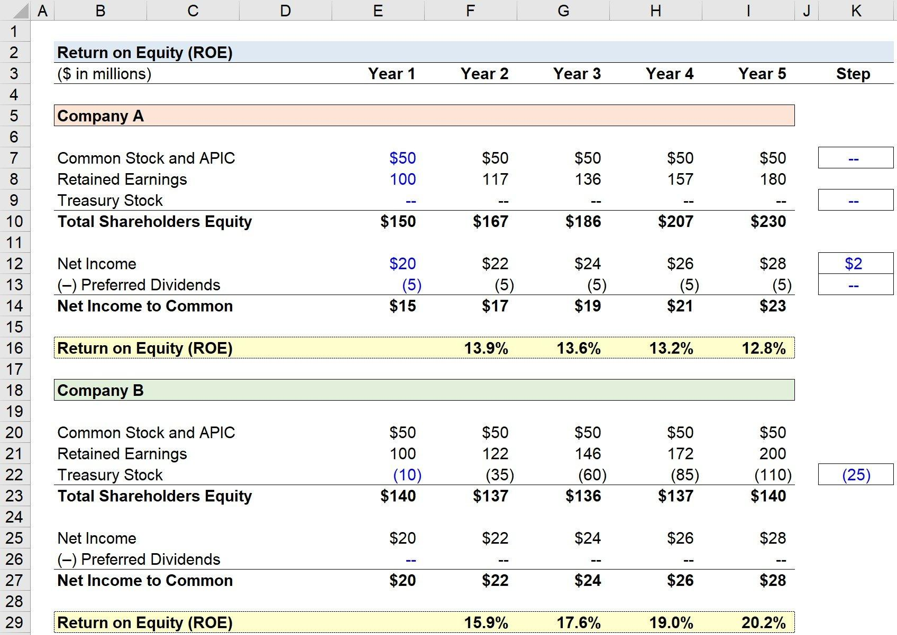

## Table of Contents

## What is Return on Equity (ROE) and why is it important?

Return on Equity (ROE) is a financial ratio that shows how well a company uses the money invested by its shareholders to make a profit. It is calculated by dividing the company's net income by the shareholders' equity. In simple terms, ROE tells you how much profit a company generates with the money shareholders have put into it. A higher ROE means the company is using the shareholders' money more effectively to grow and make profits.

ROE is important because it helps investors see how efficiently a company is managing their investments. If a company has a high ROE, it means it's good at turning shareholder money into profit, which can make it a more attractive investment. On the other hand, a low ROE might mean the company isn't using the shareholders' money well, which could be a red flag for investors. By looking at ROE, investors can compare different companies and decide where to put their money for the best return.

## How do you calculate Return on Equity using the basic formula?

Return on Equity, or ROE, is a way to see how well a company is using the money its shareholders have invested. To calculate ROE, you take the company's net income, which is the profit after all expenses are paid, and divide it by the shareholders' equity. Shareholders' equity is the total amount of money that shareholders have put into the company, plus any profits that have been kept in the business instead of being paid out as dividends.

The formula looks like this: ROE = Net Income / Shareholders' Equity. For example, if a company has a net income of $10 million and shareholders' equity of $50 million, the ROE would be $10 million divided by $50 million, which equals 0.20 or 20%. This means the company is making 20 cents of profit for every dollar of shareholders' equity. It's a simple but powerful way to see how well a company is performing for its investors.

## What data do you need to calculate ROE in Excel?

To calculate Return on Equity (ROE) in Excel, you need two pieces of data: the company's net income and its shareholders' equity. Net income is the profit the company makes after all expenses are paid. You can find this number on the company's income statement. Shareholders' equity is the total amount of money that shareholders have invested in the company, plus any profits that have been kept in the business. This number is on the company's balance sheet.

Once you have these two numbers, you can use Excel to calculate ROE. In one cell, enter the net income. In another cell, enter the shareholders' equity. Then, in a third cell, you can use the formula to divide the net income by the shareholders' equity. For example, if the net income is in cell A1 and the shareholders' equity is in cell B1, you would type "=A1/B1" in the third cell to get the ROE. This simple calculation will give you the ROE as a decimal, which you can then convert to a percentage by multiplying by 100.

## How do you set up an Excel spreadsheet to calculate ROE?

To set up an Excel spreadsheet to calculate Return on Equity (ROE), start by opening a new Excel workbook. In the first row, label the cells to keep things organized. In cell A1, type "Net Income," and in cell B1, type "Shareholders' Equity." These labels help you remember what data goes where. Next, in cell A2, enter the net income number you found on the company's income statement. In cell B2, enter the shareholders' equity number from the company's balance sheet. Make sure these numbers are correct because they are important for the calculation.

Now, to calculate the ROE, go to cell C1 and type "ROE." In cell C2, you'll use a simple formula to find the ROE. Type "=A2/B2" into cell C2. This formula tells Excel to divide the net income in cell A2 by the shareholders' equity in cell B2. Once you hit enter, Excel will show you the ROE as a decimal. To see it as a percentage, you can format cell C2 to display as a percentage or multiply the result by 100. This setup makes it easy to see how well the company is using the money from its shareholders to make a profit.

## Can you explain the step-by-step process of entering data into Excel for ROE calculation?

To set up an Excel spreadsheet for calculating Return on Equity (ROE), start by opening a new Excel workbook. In the first row, label your columns to keep things organized. In cell A1, type "Net Income," and in cell B1, type "Shareholders' Equity." These labels help you remember where to put your data. Next, in cell A2, enter the net income number you found on the company's income statement. This is the profit the company makes after all expenses are paid. In cell B2, enter the shareholders' equity number from the company's balance sheet. Shareholders' equity is the total amount of money that shareholders have invested in the company, plus any profits that have been kept in the business. Make sure these numbers are correct because they are important for the calculation.

Now, to calculate the ROE, go to cell C1 and type "ROE." In cell C2, you'll use a simple formula to find the ROE. Type "=A2/B2" into cell C2. This formula tells Excel to divide the net income in cell A2 by the shareholders' equity in cell B2. Once you hit enter, Excel will show you the ROE as a decimal. To see it as a percentage, you can format cell C2 to display as a percentage or multiply the result by 100. This setup makes it easy to see how well the company is using the money from its shareholders to make a profit.

## How do you use Excel functions to automate ROE calculations?

To automate ROE calculations in Excel, you can set up your spreadsheet so that it automatically calculates the ROE whenever you enter new data. Start by labeling cell A1 as "Net Income" and cell B1 as "Shareholders' Equity." In cell A2, you'll enter the net income number from the company's income statement, which is the profit after all expenses are paid. In cell B2, enter the shareholders' equity number from the balance sheet, which is the total amount of money shareholders have invested plus any retained profits. Then, in cell C1, label it as "ROE." In cell C2, type the formula "=A2/B2" to calculate the ROE. This formula divides the net income by the shareholders' equity, giving you the ROE as a decimal.

Once you have this set up, Excel will automatically recalculate the ROE whenever you update the numbers in cells A2 or B2. This means you can easily track changes in ROE over time by simply entering new data into those cells. If you want to see the ROE as a percentage, you can format cell C2 to display as a percentage or multiply the result by 100. This simple setup helps you quickly see how well a company is using its shareholders' money to make a profit, and it saves you time by automating the calculation process.

## What are common errors to avoid when calculating ROE in Excel?

When calculating Return on Equity (ROE) in Excel, one common mistake is using the wrong numbers. Make sure you enter the correct net income and shareholders' equity. Net income is the profit after all expenses, and you find it on the income statement. Shareholders' equity is what shareholders have invested plus any profits kept in the business, and you find it on the balance sheet. If you mix up these numbers or use outdated figures, your ROE calculation will be wrong.

Another error to watch out for is not formatting the ROE result correctly. When you divide net income by shareholders' equity, you get a decimal. To see it as a percentage, you need to either format the cell to show a percentage or multiply the result by 100. If you forget to do this, you might think the ROE is much smaller than it really is. Also, be careful with cell references in your formula. If you type "=A2/B2" but the data is actually in cells A3 and B3, your calculation will be off. Double-check your formulas to make sure they point to the right cells.

## How can you compare ROE across different companies using Excel?

To compare the Return on Equity (ROE) across different companies using Excel, start by setting up a spreadsheet with columns for each company. Label the first row with the company names, and below that, create rows for "Net Income" and "Shareholders' Equity." Enter the net income and shareholders' equity numbers for each company in their respective columns. Then, in a new row labeled "ROE," use the formula "=Net Income cell / Shareholders' Equity cell" for each company. For example, if Company A's net income is in cell A2 and shareholders' equity is in cell A3, you would type "=A2/A3" in the ROE cell for Company A. Do this for all companies to get their ROE values.

Once you have the ROE for each company, you can easily compare them by looking at the numbers in the ROE row. You can also use Excel's sorting and filtering features to organize the data. For example, you can sort the ROE values from highest to lowest to quickly see which company is using its shareholders' money most effectively. If you want to make the comparison even clearer, you can create a chart or graph. Select the ROE data, go to the "Insert" tab, and choose a bar or column chart to visually compare the ROEs of different companies. This way, you can see at a glance which companies are performing better in terms of ROE.

## What advanced Excel features can enhance ROE analysis?

To make your Return on Equity (ROE) analysis better in Excel, you can use some advanced features. One helpful tool is conditional formatting. This lets you color-code your ROE numbers so you can see at a glance which companies are doing well and which ones are not. For example, you can set it up so that high ROEs show up in green and low ones in red. This makes it easier to spot trends and compare different companies quickly. Another useful feature is data validation, which helps you enter the right numbers. You can set rules so that only certain types of numbers can be put into the cells for net income and shareholders' equity. This way, you avoid mistakes and make sure your ROE calculations are correct.

Another advanced feature that can improve your ROE analysis is using pivot tables. Pivot tables let you organize and summarize your data in different ways. You can use them to group ROE data by industry, time period, or any other category you want. This helps you see patterns and compare ROE across different groups easily. Also, you can use Excel's data analysis tools, like trendlines and regression analysis, to look at how ROE changes over time or how it relates to other financial measures. These tools give you a deeper understanding of what's driving the ROE numbers and help you make better investment decisions.

## How do you interpret ROE results in Excel to make financial decisions?

When you look at the ROE numbers in Excel, you can see how well different companies are using the money their shareholders have put in to make a profit. A high ROE means the company is doing a good job turning that money into more money. For example, if Company A has an ROE of 20% and Company B has an ROE of 10%, Company A is using its shareholders' money more effectively. You can use this information to decide which company might be a better investment. If you want to grow your money, you might choose to invest in the company with the higher ROE.

To make smart financial decisions, you should also think about other things besides just the ROE numbers. For instance, look at how the ROE has changed over time. If a company's ROE is going up, it might be getting better at making profits. But if it's going down, there might be problems. Also, compare the ROE to what's normal for the industry. A company might have a high ROE, but if everyone else in the industry has an even higher ROE, it might not be as good as it looks. By putting all these pieces together, you can make better choices about where to put your money.

## Can you demonstrate how to create a dynamic ROE dashboard in Excel?

To create a dynamic ROE dashboard in Excel, start by organizing your data. In the first row, label columns with company names, and below that, add rows for "Net Income" and "Shareholders' Equity." Enter the numbers for each company in their columns. Then, in a new row labeled "ROE," use the formula "=Net Income cell / Shareholders' Equity cell" for each company. For example, if Company A's net income is in cell A2 and shareholders' equity is in cell A3, type "=A2/A3" in the ROE cell for Company A. Do this for all companies to get their ROE values. Once you have the ROE for each company, you can use Excel's features to make your dashboard more useful.

To make your dashboard dynamic and easy to understand, use conditional formatting to color-code the ROE numbers. Set it up so high ROEs show in green and low ones in red. This helps you see at a glance which companies are doing well. You can also add a chart by selecting the ROE data, going to the "Insert" tab, and choosing a bar or column chart. This chart will update automatically when you change the data, making it easy to compare ROEs visually. Lastly, consider using a pivot table to group and summarize your data by industry or time period. This way, you can quickly see trends and make better financial decisions based on the latest ROE numbers.

## What are the limitations of using Excel for ROE analysis and how can they be mitigated?

Using Excel for ROE analysis can have some problems. One issue is that if you have a lot of data, Excel can get slow and hard to manage. It's also easy to make mistakes when you're entering numbers or using formulas. If you don't keep your data up to date, your ROE calculations might not be accurate. Another problem is that Excel doesn't always make it easy to see big trends or patterns in your data, especially if you're looking at a lot of companies over a long time.

To make these problems better, you can use some tricks. First, keep your Excel files organized and use data validation to make sure you're entering the right numbers. You can also use pivot tables and charts to help you see trends more clearly. If you have a lot of data, you might want to think about using more powerful software that can handle big datasets better. But if you stick with Excel, just make sure to double-check your work and update your data regularly to keep your ROE analysis accurate and helpful.

## What is Return on Equity (ROE) and how can it be understood?

Return on Equity (ROE) is a fundamental financial metric that quantifies a company's profitability in relation to its equity capital. It provides insight into how effectively management is using shareholders' funds to generate earnings. The formula for calculating ROE is:

$$
\text{ROE} = \frac{\text{Net Income}}{\text{Shareholders' Equity}}
$$

Here, Net Income refers to the profits a company earns over a specific period, typically displayed at the bottom of the income statement. Shareholders' Equity, found on the balance sheet, represents the net value of a company and is the difference between total assets and total liabilities. It includes retained earnings and any additional paid-in capital.

Both components—Net Income and Shareholders' Equity—are crucial in determining ROE. Net Income indicates profitability after all expenses, taxes, and interest have been deducted, providing a comprehensive measure of a company's profit-capacity. Meanwhile, Shareholders' Equity represents the owners' claim after debts are settled, embodying the capital invested by shareholders plus any retained earnings.

A company's ROE is not intrinsically indicative of performance unless it is compared with industry benchmarks. Industry averages provide a contextual baseline, enabling analysts and investors to evaluate whether a company generates satisfactory returns relative to its peers. A ROE significantly above the industry average may signal superior management efficiency and competitive advantage, whereas a below-average ROE might suggest potential issues in leveraging equity effectively.

However, it is important to consider the variability across industries. Capital-intensive industries may naturally exhibit lower ROEs compared to those with lower capital requirements. Therefore, assessing a company's ROE in conjunction with its industry context empowers stakeholders to make informed evaluations of financial performance.

In essence, ROE serves as a valuable tool in financial analysis to gauge the prowess of management in rewarding investors with adequate returns on their equity investments. It encapsulates the efficiency of a company in capital utilization, making it a pivotal aspect of investment screening and performance comparison.

## What is the importance of ROE in financial analysis?

Return on Equity (ROE) serves as a pivotal metric in financial analysis by evaluating how efficiently a company utilizes its equity capital to generate profits. ROE is calculated by dividing the Net Income by the Shareholders' Equity, represented by the formula:

$$
\text{ROE} = \frac{\text{Net Income}}{\text{Shareholders' Equity}}
$$

A high ROE indicates that a company is effectively using its resources to generate earnings. This efficiency suggests that the company has robust management practices and a strong business model, making it potentially attractive to investors. High ROE figures often signify that a company can provide superior returns on investments, which can drive stock prices upward and enhance shareholder value over time.

However, it is crucial for investors to be cautious of the methods a company uses to achieve a high ROE. A common approach is the increased use of debt. By taking on more debt, a company can enhance its net income and achieve a higher ROE without increasing equity capital. While this leverage can significantly boost returns, it also introduces higher financial risk. A company heavily reliant on debt may face challenges in downturns, as obligations may become difficult to meet, leading to financial distress.

Moreover, ROE helps identify high-performance stocks by highlighting companies that outperform their competitors in terms of profitability and operational efficiency. Investors frequently compare a company’s ROE to industry averages to ascertain whether it possesses a competitive advantage. A consistently high ROE relative to industry peers often indicates effective business strategies and sound management decisions.

While assessing ROE as an indicator of financial performance, it is advisable to complement it with other financial metrics. This comprehensive approach provides a more nuanced view of a company's financial health, mitigating the risk of overlooking potential vulnerabilities masked by a high ROE. Integrating ROE with ratios such as Return on Assets (ROA) and Return on Investment (ROI) ensures a well-rounded financial evaluation crucial for making informed investment decisions.

## What are Advanced ROE Analysis Techniques?

DuPont Analysis is a powerful framework employed to decompose Return on Equity (ROE) into three fundamental components: profit margin, asset turnover, and financial leverage. This dissection offers a deeper understanding of a company's financial performance by analyzing how efficiently it generates profit from its revenues, how effectively it uses its assets, and how much leverage it employs. The classic DuPont formula can be expressed as:

$$
\text{ROE} = \text{Profit Margin} \times \text{Asset Turnover} \times \text{Equity Multiplier}
$$

Where:
- **Profit Margin** is calculated as Net Income divided by Revenue, indicating the percentage of revenue that translates into profit.
- **Asset Turnover** is defined as Revenue divided by Total Assets, reflecting the efficiency with which a company uses its assets to generate sales.
- **Equity Multiplier** is Total Assets divided by Shareholders' Equity, representing the degree of financial leverage being used.

### Impact of Financial Leverage and Operational Efficiency

Financial leverage plays a dual role in affecting ROE. On one hand, it can amplify returns on equity due to the increased asset base that a company controls with borrowed funds. However, excessive leverage can increase financial risk, potentially leading to diminished returns in adverse conditions. Hence, an ideal balance is critical.

Operational efficiency, mirrored by the profit margin and asset turnover in the DuPont model, is pivotal as well. A higher profit margin indicates better control over costs and pricing strategies, while a superior asset turnover ratio suggests effective utilization of assets to generate revenue. Both contribute positively towards a robust ROE without the added risks associate with high financial leverage.

### Advanced Techniques: Regression Analysis and Machine Learning

Sophisticated methods, including regression analysis and [machine learning](/wiki/machine-learning), enhance ROE prediction capabilities. Regression analysis enables the identification of trends and relationships between variables affecting ROE, providing insights into which factors are most influential and should be prioritized.

Machine learning techniques offer predictive power by analyzing vast datasets to uncover patterns and correlations that might not be evident through traditional means. Algorithms such as random forests, support vector machines, and neural networks can augment the analysis by providing more accurate ROE forecasts. Below is a basic Python example using linear regression to predict ROE:

```python
import pandas as pd
from sklearn.model_selection import train_test_split
from sklearn.linear_model import LinearRegression
from sklearn.metrics import mean_squared_error

# Example dataset
data = pd.DataFrame({
    'Profit Margin': [0.10, 0.12, 0.11, 0.09, 0.13],
    'Asset Turnover': [1.5, 1.6, 1.7, 1.4, 1.8],
    'Equity Multiplier': [2.0, 2.5, 2.0, 2.3, 2.1],
    'ROE': [0.30, 0.35, 0.32, 0.29, 0.35]
})

# Independent variables
X = data[['Profit Margin', 'Asset Turnover', 'Equity Multiplier']]
# Dependent variable
y = data['ROE']

# Split the data
X_train, X_test, y_train, y_test = train_test_split(X, y, test_size=0.2, random_state=42)

# Initialize and fit the model
model = LinearRegression()
model.fit(X_train, y_train)

# Make predictions
predictions = model.predict(X_test)

# Evaluate the model
mse = mean_squared_error(y_test, predictions)
print(f'Mean Squared Error: {mse}')
```

This script demonstrates a simple use of linear regression to predict a company's Return on Equity using its profit margin, asset turnover, and equity multiplier. The effectiveness of such advanced analytical techniques underscores their increasingly integral role in modern financial analysis and strategic decision-making.

## References & Further Reading

1. Brigham, E. F., & Houston, J. F. (2016). *Fundamentals of Financial Management*. This textbook provides foundational knowledge on financial management, including detailed sections on ratios like ROE (Return on Equity) and their role in financial analysis.

2. Khan, M. Y., & Jain, P. K. (2015). *Financial Management: Text, Problems and Cases.* This book offers a comprehensive look at financial metrics, with practical examples that enhance the understanding of ROE and its applications in corporate financial practices.

3. Damodaran, A. (2012). *Investment Valuation: Tools and Techniques for Determining the Value of Any Asset*. This resource dives into valuation techniques with an emphasis on financial ratios such as ROE, offering insights into their application in investment decisions and comparisons across industries.

4. Petersen, C. V., & Plenborg, T. (2012). *Financial Statement Analysis: Valuation, Credit Analysis, Executive Compensation.* This book discusses how to analyze financial statements and interpret ROE in the context of a company’s overall financial health.

5. Berk, J., & DeMarzo, P. (2020). *Corporate Finance*. A detailed exploration of corporate finance principles, including analysis of financial ratios like ROE and their impact on shareholder value.

6. Morningstar. (n.d.). *Understanding Financial Ratios.* [Link](https://www.morningstar.com). Morningstar provides practical guides and articles on using financial ratios such as ROE to evaluate investment opportunities.

7. Thomas, S. R. (2021). *Rethinking the Role of ROE in Investment Strategy*. *Journal of Financial Perspectives*, 9(3), 55-73. This article discusses contemporary approaches to ROE and critiques traditional methodologies in financial analysis and investment strategy.

8. Brealey, R. A., Myers, S. C., & Allen, F. (2020). *Principles of Corporate Finance*. This classic text offers insights into the calculation, interpretation, and utilization of ROE within broader corporate finance strategies.

9. Financial Times Lexicon. (n.d.). *Return on Equity (ROE)*. [Link](https://www.ft.com/lexicon). The Financial Times provides definitions and descriptions of key financial terms, including ROE, with explanations relevant to both new and seasoned investors.

10. Graham, B., & Dodd, D. L. (2009). *Security Analysis*. A seminal text in investing that addresses the evaluation of companies using ROE and other key performance indicators to assess long-term value and performance.

