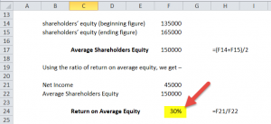

Return on Equity (ROE) is a financial metric that evaluates a company's ability to generate profits from the shareholders' equity invested in the business. Mathematically, it is expressed as the ratio of Net Income to Shareholders' Equity. This formula assesses how effectively a company's management is using the equity capital to generate earnings. 

ROE is a critical metric in financial analysis due to its capacity to measure profitability and management efficiency. A high ROE indicates that the company is proficient in transforming equity investments into net income, reflecting both strong financial performance and competent management. Conversely, a low ROE might suggest inefficiencies or underlying financial issues.



In algorithmic trading, ROE plays a significant role by serving as a quantitative measure to screen and select high-performing stocks. Trading algorithms leverage ROE to identify companies that efficiently utilize equity capital, potentially enhancing portfolio returns. By integrating ROE with other financial metrics, algorithms can refine stock selection and enhance trading strategies, adapting swiftly to market changes. As algorithmic trading continues to evolve, ROE's ability to highlight profitable companies makes it an invaluable tool for traders seeking to optimize their investment strategies.

## Table of Contents

## Understanding Return on Equity (ROE)

Return on Equity (ROE) is a fundamental financial metric that quantifies a company's profitability in relation to its equity capital. It provides insight into how effectively management is using shareholders' funds to generate earnings. The formula for calculating ROE is:

$$
\text{ROE} = \frac{\text{Net Income}}{\text{Shareholders' Equity}}
$$

Here, Net Income refers to the profits a company earns over a specific period, typically displayed at the bottom of the income statement. Shareholders' Equity, found on the balance sheet, represents the net value of a company and is the difference between total assets and total liabilities. It includes retained earnings and any additional paid-in capital.

Both components—Net Income and Shareholders' Equity—are crucial in determining ROE. Net Income indicates profitability after all expenses, taxes, and interest have been deducted, providing a comprehensive measure of a company's profit-capacity. Meanwhile, Shareholders' Equity represents the owners' claim after debts are settled, embodying the capital invested by shareholders plus any retained earnings.

A company's ROE is not intrinsically indicative of performance unless it is compared with industry benchmarks. Industry averages provide a contextual baseline, enabling analysts and investors to evaluate whether a company generates satisfactory returns relative to its peers. A ROE significantly above the industry average may signal superior management efficiency and competitive advantage, whereas a below-average ROE might suggest potential issues in leveraging equity effectively.

However, it is important to consider the variability across industries. Capital-intensive industries may naturally exhibit lower ROEs compared to those with lower capital requirements. Therefore, assessing a company's ROE in conjunction with its industry context empowers stakeholders to make informed evaluations of financial performance.

In essence, ROE serves as a valuable tool in financial analysis to gauge the prowess of management in rewarding investors with adequate returns on their equity investments. It encapsulates the efficiency of a company in capital utilization, making it a pivotal aspect of investment screening and performance comparison.

## Calculating ROE: Step-by-Step Guide in Excel

To calculate the Return on Equity (ROE) in Excel, follow these detailed steps to set up your spreadsheet, utilizing example data and formulas while addressing common challenges encountered during the process.

### Step-by-Step Guide

1. **Set Up Your Spreadsheet:**
   - Open a new Excel worksheet.
   - In the first row, label the columns as follows: "Year", "Net Income", "Shareholders' Equity", and "ROE".

2. **Input Example Data:**
   - In the subsequent rows, enter your data. For example:
     - Year: 2022
     - Net Income: 100,000 (in cell B2)
     - Shareholders' Equity: 500,000 (in cell C2)

3. **Calculate ROE:**
   - In the next column (D2), enter the formula to calculate ROE:
     ```
     = B2 / C2
     ```
   - This formula divides Net Income by Shareholders' Equity to yield the ROE for the year 2022. 

4. **Formatting Results:**
   - Format the ROE cell (D2) as a percentage for better readability. Do this by right-clicking the cell, selecting "Format Cells," choosing "Percentage," and setting decimal places as needed.

5. **Copy Formulas for Additional Data:**
   - If you have additional data for subsequent years, copy the formula from D2 to the cells below (D3, D4, etc.) to calculate ROE for those years.

### Common Challenges and Solutions

- **Negative ROE:**
  - If you get a negative ROE, it might indicate a net loss or negative shareholder equity. Investigate the cause by analyzing financial statements for any anomalous figures.

- **Unstable ROE:**
  - Variability in ROE might be caused by fluctuating net income or equity. To address this, consider averaging ROE over a few years for a more stable perspective.

- **Handling Zero Equity:**
  - If Shareholders' Equity is zero, Excel will return a division error. To handle this, use an IFERROR function:
    ```
    = IFERROR(B2 / C2, "Undefined")
    ```
  - This formula returns "Undefined" when equity is zero, preventing Excel from displaying #DIV/0! errors.

By following these steps, you can effectively set up and calculate ROE in Excel. This setup provides a clear financial snapshot, aiding in the assessment of a company's profitability over time.

## Importance of ROE in Financial Analysis

Return on Equity (ROE) serves as a pivotal metric in financial analysis by evaluating how efficiently a company utilizes its equity capital to generate profits. ROE is calculated by dividing the Net Income by the Shareholders' Equity, represented by the formula:

$$
\text{ROE} = \frac{\text{Net Income}}{\text{Shareholders' Equity}}
$$

A high ROE indicates that a company is effectively using its resources to generate earnings. This efficiency suggests that the company has robust management practices and a strong business model, making it potentially attractive to investors. High ROE figures often signify that a company can provide superior returns on investments, which can drive stock prices upward and enhance shareholder value over time.

However, it is crucial for investors to be cautious of the methods a company uses to achieve a high ROE. A common approach is the increased use of debt. By taking on more debt, a company can enhance its net income and achieve a higher ROE without increasing equity capital. While this leverage can significantly boost returns, it also introduces higher financial risk. A company heavily reliant on debt may face challenges in downturns, as obligations may become difficult to meet, leading to financial distress.

Moreover, ROE helps identify high-performance stocks by highlighting companies that outperform their competitors in terms of profitability and operational efficiency. Investors frequently compare a company’s ROE to industry averages to ascertain whether it possesses a competitive advantage. A consistently high ROE relative to industry peers often indicates effective business strategies and sound management decisions.

While assessing ROE as an indicator of financial performance, it is advisable to complement it with other financial metrics. This comprehensive approach provides a more nuanced view of a company's financial health, mitigating the risk of overlooking potential vulnerabilities masked by a high ROE. Integrating ROE with ratios such as Return on Assets (ROA) and Return on Investment (ROI) ensures a well-rounded financial evaluation crucial for making informed investment decisions.

## ROE in Algorithmic Trading

Return on Equity (ROE) is a fundamental metric within [algorithmic trading](/wiki/algorithmic-trading) strategies due to its ability to signify a company's efficiency in generating profits from shareholders' equity. In the context of algorithmic trading, traders leverage ROE to make data-driven decisions by automating the process of stock selection based on specific financial criteria. By incorporating ROE into quantitative models, traders can screen for potentially high-performing stocks, thereby maximizing profitability.

Algorithmic trading strategies often use ROE as a key variable in screening algorithms. A basic Python implementation for stock screening using ROE might involve fetching financial data from APIs, such as Yahoo Finance, and then filtering stocks based on threshold ROE values. Here's an example script demonstrating this process:

```python
import yfinance as yf  # For more datasets, visit: https://paperswithbacktest.com/datasets

def get_stock_data(ticker):
    stock = yf.Ticker(ticker)
    financial_data = stock.financials
    return financial_data

def calculate_roe(financial_data):
    net_income = financial_data.loc['Net Income']
    shareholders_equity = financial_data.loc['Total Stockholder Equity']
    roe = net_income / shareholders_equity
    return roe

def screen_stocks(stock_list, roe_threshold):
    screened_stocks = []
    for ticker in stock_list:
        data = get_stock_data(ticker)
        roe = calculate_roe(data)
        if roe > roe_threshold:
            screened_stocks.append(ticker)
    return screened_stocks

# Example usage
stocks = ['AAPL', 'MSFT', 'GOOGL']
roe_threshold = 0.15
high_roe_stocks = screen_stocks(stocks, roe_threshold)
print("Stocks with high ROE:", high_roe_stocks)
```

This script defines functions to retrieve financial data, calculate the ROE, and select stocks that meet the desired ROE threshold. By using such automation, the algorithm can efficiently identify potentially lucrative investment opportunities.

Integrating ROE with other financial ratios, such as Price-to-Earnings (P/E) and Debt-to-Equity (D/E), significantly enhances the robustness of algorithmic strategies. Combining multiple financial metrics allows for a more comprehensive analysis of a company’s financial health and potential growth. For example, a stock with a high ROE and a low P/E ratio might indicate an undervalued company with strong profit-generating capacity. Additionally, the D/E ratio provides insights into how much debt a company is utilizing to finance its assets, which can affect ROE.

By evaluating multiple factors, traders can mitigate risks associated with over-reliance on a single financial metric, thus refining their stock selection process. Algorithmic trading systems can further analyze large datasets, leading to patterns and insights that may not be immediately apparent through manual methods. Consequently, the integration of ROE with other ratios aids in developing a more nuanced investment approach, enhancing decision-making processes in algorithmic trading.

## Advanced ROE Analysis Techniques

DuPont Analysis is a powerful framework employed to decompose Return on Equity (ROE) into three fundamental components: profit margin, asset turnover, and financial leverage. This dissection offers a deeper understanding of a company's financial performance by analyzing how efficiently it generates profit from its revenues, how effectively it uses its assets, and how much leverage it employs. The classic DuPont formula can be expressed as:

$$
\text{ROE} = \text{Profit Margin} \times \text{Asset Turnover} \times \text{Equity Multiplier}
$$

Where:
- **Profit Margin** is calculated as Net Income divided by Revenue, indicating the percentage of revenue that translates into profit.
- **Asset Turnover** is defined as Revenue divided by Total Assets, reflecting the efficiency with which a company uses its assets to generate sales.
- **Equity Multiplier** is Total Assets divided by Shareholders' Equity, representing the degree of financial leverage being used.

### Impact of Financial Leverage and Operational Efficiency

Financial leverage plays a dual role in affecting ROE. On one hand, it can amplify returns on equity due to the increased asset base that a company controls with borrowed funds. However, excessive leverage can increase financial risk, potentially leading to diminished returns in adverse conditions. Hence, an ideal balance is critical.

Operational efficiency, mirrored by the profit margin and asset turnover in the DuPont model, is pivotal as well. A higher profit margin indicates better control over costs and pricing strategies, while a superior asset turnover ratio suggests effective utilization of assets to generate revenue. Both contribute positively towards a robust ROE without the added risks associate with high financial leverage.

### Advanced Techniques: Regression Analysis and Machine Learning

Sophisticated methods, including regression analysis and [machine learning](/wiki/machine-learning), enhance ROE prediction capabilities. Regression analysis enables the identification of trends and relationships between variables affecting ROE, providing insights into which factors are most influential and should be prioritized.

Machine learning techniques offer predictive power by analyzing vast datasets to uncover patterns and correlations that might not be evident through traditional means. Algorithms such as random forests, support vector machines, and neural networks can augment the analysis by providing more accurate ROE forecasts. Below is a basic Python example using linear regression to predict ROE:

```python
import pandas as pd
from sklearn.model_selection import train_test_split
from sklearn.linear_model import LinearRegression
from sklearn.metrics import mean_squared_error

# Example dataset
data = pd.DataFrame({
    'Profit Margin': [0.10, 0.12, 0.11, 0.09, 0.13],
    'Asset Turnover': [1.5, 1.6, 1.7, 1.4, 1.8],
    'Equity Multiplier': [2.0, 2.5, 2.0, 2.3, 2.1],
    'ROE': [0.30, 0.35, 0.32, 0.29, 0.35]
})

# Independent variables
X = data[['Profit Margin', 'Asset Turnover', 'Equity Multiplier']]
# Dependent variable
y = data['ROE']

# Split the data
X_train, X_test, y_train, y_test = train_test_split(X, y, test_size=0.2, random_state=42)

# Initialize and fit the model
model = LinearRegression()
model.fit(X_train, y_train)

# Make predictions
predictions = model.predict(X_test)

# Evaluate the model
mse = mean_squared_error(y_test, predictions)
print(f'Mean Squared Error: {mse}')
```

This script demonstrates a simple use of linear regression to predict a company's Return on Equity using its profit margin, asset turnover, and equity multiplier. The effectiveness of such advanced analytical techniques underscores their increasingly integral role in modern financial analysis and strategic decision-making.

## Challenges and Limitations of ROE

Return on Equity (ROE) is a critical metric for evaluating the financial performance of a company. However, certain factors can distort ROE, leading to potentially misleading interpretations.

The impact of share buybacks on ROE is significant. When a firm repurchases its shares, the number of outstanding shares decreases, effectively reducing the shareholders' equity. As a result, even if net income remains constant, ROE can increase, giving a false impression of heightened profitability or efficient management. For instance, a company with declining profits might resort to share buybacks to artificially inflate its ROE.

Financial leverage also plays a crucial role in affecting ROE. Companies can enhance their ROE by increasing leverage, primarily through borrowing. By doing so, they augment their net income without additional equity capital. This scenario raises the ROE, but it also elevates financial risk. In cases where a company overextends its leverage, the potential for loan defaults can jeopardize its financial stability, again leading to a deceptively high ROE.

A significant limitation of ROE is its inability to capture comprehensive financial health. ROE solely focuses on equity efficiency without accounting for debt levels, [liquidity](/wiki/liquidity-risk-premium) issues, or cash flow quality. For instance, a company may boast a high ROE but suffer liquidity constraints or declining revenue trends, aspects that ROE does not reveal.

To avoid misinterpretations due to misleading ROE figures, investors should consider complementary financial metrics, such as Debt-to-Equity ratio, Return on Assets (ROA), and cash flow statements. These metrics provide a more rounded view of a company's financial condition. Engaging in a holistic analysis that includes industry average comparisons and historical performance reviews mitigates the risks associated with relying solely on ROE.

Ultimately, understanding these nuances ensures that investors and analysts use ROE as part of a broader financial analysis toolkit, thus preventing over-reliance on this single metric.

## Conclusion

Return on Equity (ROE) remains a central figure in financial analysis, offering insights into a company's profitability and the efficiency with which its management utilizes equity. Calculating ROE is straightforward, involving the division of net income by shareholders' equity. This metric provides investors with a snapshot of how effectively a company generates profit from its equity base. Its significance transcends simplistic evaluations, serving as a benchmark for comparing against industry averages and identifying companies that excel in leveraging their equity capital.

However, relying solely on ROE can paint an incomplete picture of a company's financial health. For instance, a high ROE could indicate robust management practices and successful business operations, but it may also result from an increased reliance on debt, which introduces financial risk. Thus, integrating ROE with other financial ratios and metrics is essential for a well-rounded investment analysis. Such combinations help detect potential red flags and form a more comprehensive understanding of corporate performance.

The adaptability of ROE finds relevance in evolving financial strategies, making it an indispensable tool for both traditional investors and algorithmic traders. By embedding ROE in algorithmic models, traders can automate and enhance their decision-making processes. Continuous learning about ROE, its applications, and associated metrics is crucial for adapting to the dynamic landscape of financial markets. As financial analysis and technology continue to evolve, so should the strategies that harness the insights provided by ROE. Understanding its complexities and limitations ensures that its use remains effective and insightful.

## References & Further Reading

1. Brigham, E. F., & Houston, J. F. (2016). *Fundamentals of Financial Management*. This textbook provides foundational knowledge on financial management, including detailed sections on ratios like ROE (Return on Equity) and their role in financial analysis.

2. Khan, M. Y., & Jain, P. K. (2015). *Financial Management: Text, Problems and Cases.* This book offers a comprehensive look at financial metrics, with practical examples that enhance the understanding of ROE and its applications in corporate financial practices.

3. Damodaran, A. (2012). *Investment Valuation: Tools and Techniques for Determining the Value of Any Asset*. This resource dives into valuation techniques with an emphasis on financial ratios such as ROE, offering insights into their application in investment decisions and comparisons across industries.

4. Petersen, C. V., & Plenborg, T. (2012). *Financial Statement Analysis: Valuation, Credit Analysis, Executive Compensation.* This book discusses how to analyze financial statements and interpret ROE in the context of a company’s overall financial health.

5. Berk, J., & DeMarzo, P. (2020). *Corporate Finance*. A detailed exploration of corporate finance principles, including analysis of financial ratios like ROE and their impact on shareholder value.

6. Morningstar. (n.d.). *Understanding Financial Ratios.* [Link](https://www.morningstar.com). Morningstar provides practical guides and articles on using financial ratios such as ROE to evaluate investment opportunities.

7. Thomas, S. R. (2021). *Rethinking the Role of ROE in Investment Strategy*. *Journal of Financial Perspectives*, 9(3), 55-73. This article discusses contemporary approaches to ROE and critiques traditional methodologies in financial analysis and investment strategy.

8. Brealey, R. A., Myers, S. C., & Allen, F. (2020). *Principles of Corporate Finance*. This classic text offers insights into the calculation, interpretation, and utilization of ROE within broader corporate finance strategies.

9. Financial Times Lexicon. (n.d.). *Return on Equity (ROE)*. [Link](https://www.ft.com/lexicon). The Financial Times provides definitions and descriptions of key financial terms, including ROE, with explanations relevant to both new and seasoned investors.

10. Graham, B., & Dodd, D. L. (2009). *Security Analysis*. A seminal text in investing that addresses the evaluation of companies using ROE and other key performance indicators to assess long-term value and performance.

