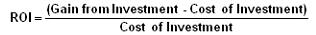

Real estate investing has long been a cornerstone for those seeking to build and sustain wealth. It offers a tangible asset that appreciates over time while generating potential income through leasing or resale. The allure of investing in property is bolstered by the historically stable and lucrative returns it provides compared to other asset classes such as stocks and bonds. The real estate market, driven by location, property type, and market trends, provides diverse opportunities—from residential homes to commercial properties—each with unique risk-reward profiles.

A critical aspect of real estate investing is understanding the Return on Investment (ROI). ROI essentially measures the profitability of an investment, allowing investors to evaluate performance relative to the cost. Key metrics used in calculating real estate ROI include cash-on-cash return, which measures the annual income generated by a property relative to the amount of mortgage paid each year, and the capitalization (cap) rate, which compares a property's net operating income to its purchase price. These calculations enable investors to make informed decisions, optimizing their portfolios for maximum profitability.



Technology has begun to significantly impact real estate investment strategies, particularly through the advent of algorithmic trading. Historically associated with financial markets, algorithmic trading leverages computer algorithms to analyze large datasets and automate trading processes. In the context of real estate, these algorithms can process vast amounts of data—from market trends and economic indicators to property-specific information—facilitating more efficient decision-making and portfolio management.

The integration of algorithmic trading in real estate is transforming investment returns by offering a data-driven approach to identifying profitable opportunities. By employing machine learning and artificial intelligence, investors can predict market movements and optimize property acquisitions and disposals. This technological advancement allows for improved risk management and a potential increase in ROI, as algorithms can continuously learn and adapt to market changes.

In conclusion, real estate investing offers a promising avenue for wealth accumulation, underpinned by its solid ROI metrics. With the infusion of algorithmic trading, the landscape of property investment is being reshaped, providing a technological edge that enhances strategic decision-making and maximizes returns.

## Table of Contents

## Understanding Real Estate Investing

Real estate investing involves purchasing, owning, managing, renting, or selling properties for profit. It is considered a key strategy for wealth building due to its potential for generating rental income and appreciating property values. Investors can choose from various types of properties, primarily divided into residential and commercial categories.

### Types of Properties

**Residential Properties:** These include single-family homes, multi-family units, apartments, and vacation homes. Residential real estate is typically aimed at individuals or families who need a place to live.

**Commercial Properties:** These encompass office buildings, retail spaces, warehouses, and industrial properties. They are used for business purposes and usually leased out to companies, often resulting in longer lease terms than residential properties.

### Pros and Cons of Residential Versus Commercial Real Estate Investments

**Residential Real Estate:**

- *Pros:*
  - Generally easier to acquire and manage compared to commercial properties.
  - Strong market demand due to necessity for housing, providing a stable rental income.
  - Easier to finance as loans for residential properties are often more accessible.

- *Cons:*
  - Dependent on the local housing market, which can be volatile.
  - Typically shorter lease terms, leading to potentially higher tenant turnover.
  - Lower income potential per unit compared to commercial properties.

**Commercial Real Estate:**

- *Pros:*
  - Higher income potential due to larger properties and longer leases.
  - Tenants usually responsible for property maintenance under certain lease agreements, such as triple net leases.
  - Less sensitivity to market fluctuations compared to residential properties.

- *Cons:*
  - Higher initial investment and complexity in acquisition and management.
  - More susceptible to economic downturns affecting business performance.
  - Vacancies can result in more significant income loss due to fewer tenants.

### Importance of Location and Property Management

Location is a fundamental aspect that significantly influences real estate values. Properties situated in areas with high economic activity, good infrastructure, and access to amenities tend to appreciate more over time. The classic real estate adage, "location, location, location," underscores its critical role in determining property success.

Effective property management is equally essential, particularly for investors not residing near their investments. Good management ensures tenant satisfaction, maintains property condition, and maximizes income. This can include everything from handling repairs to managing tenant relations and ensuring timely rent collection.

### Market Trends Affecting Real Estate Values

Real estate markets are shaped by numerous factors, including economic conditions, interest rates, demographic shifts, and government policies. For instance, declining interest rates can stimulate property investments by reducing borrowing costs. Urbanization and population growth can drive demand for residential properties, particularly in metropolitan areas.

Technological advancements and shifts in work dynamics post-pandemic have also affected trends, with increased interest in suburban and rural properties as remote work becomes more common. Understanding these trends is crucial for investors aiming to optimize their portfolios and anticipate future market movements.

## Decoding Real Estate ROI

Return on Investment (ROI) is a key performance metric in real estate that signifies the profitability of an investment. It measures the gain or loss generated in relation to the amount of money invested, providing investors with a tool to evaluate the efficacy of their investment ventures. 

### Methods of Calculating ROI

**1. Cash-on-Cash Return:** This method focuses on the cash income earned on the cash invested in the property. It is calculated as:

$$
\text{Cash-on-Cash Return} = \left(\frac{\text{Annual Pre-Tax Cash Flow}}{\text{Total Cash Invested}}\right) \times 100
$$

This metric is particularly useful for investors seeking to understand the annual return in percentage terms, based on the actual cash they have invested, excluding financing and loan dynamics.

**2. Capitalization Rate (Cap Rate):** The cap rate is another essential metric, commonly used for quick property assessments. It is calculated by dividing the net operating income (NOI) by the current market value or purchase price of the property:

$$
\text{Cap Rate} = \left(\frac{\text{Net Operating Income}}{\text{Current Market Value}}\right) \times 100
$$

It offers insights into the expected rate of return, assuming the property was acquired without leverage.

### Factors Influencing ROI

**1. Property Appreciation:** The increase in property value over time significantly affects ROI. Market dynamics, economic factors, and property location play vital roles in appreciation rates. While appreciation can dramatically enhance ROI, unexpected market downturns can also introduce depreciation risks.

**2. Rental Income:** Consistent rental income boosts ROI by providing a steady stream of cash flow. Rental demand, property management quality, and tenant stability can impact the income potential and thereby influence overall returns.

### Risk Factors and Their Impact

Real estate investments entail several risks that can impact ROI positively or negatively:

**1. Market Risk:** Real estate markets are susceptible to fluctuations due to economic cycles, interest rates, and regulatory changes. An unfavorable shift can reduce property values and rental demand, adversely affecting ROI.

**2. Liquidity Risk:** Real estate is a relatively illiquid asset class compared to stocks or bonds. The time and cost associated with selling a property can pose challenges, especially in a declining market, affecting ROI.

**3. Operational Risks:** Poor property management, unexpected maintenance issues, or high vacancy rates can lead to increased expenses and reduced income, diminishing returns.

Understanding these components provides a comprehensive insight into the ROI calculations and helps investors make more informed decisions in their real estate ventures.

 to Algorithmic Trading in Real Estate

Algorithmic trading, commonly known as algo trading, involves the use of computer algorithms to execute trading orders with precision and speed that surpass human capabilities. Its origins can be traced back to the late 20th century in the financial markets, where it revolutionized trading by automating processes and optimizing strategies through complex mathematical models and statistical analyses. Given its initial success in stocks, currencies, and commodities, [algorithmic trading](/wiki/algorithmic-trading) has gradually permeated other sectors, including real estate.

In real estate investments, algorithmic trading is gaining traction as a transformative tool for optimizing portfolio management and maximizing returns. By employing algorithms, investors can automate the decision-making process, utilizing vast datasets to uncover trends, predict market movements, and identify lucrative investment opportunities. For instance, algorithms can analyze data from historical property values, rental yields, demographic shifts, and economic indicators to forecast future real estate trends.

Data-driven strategies serve as the backbone of algorithmic trading in the real estate sector. By systematically gathering and processing data from various sources, such as property listings, market reports, and financial [statistics](/wiki/bayesian-statistics), these strategies facilitate informed decision-making and risk assessment. Machine learning models can enhance this process by learning patterns from historical data and improving predictive accuracy over time.

Technological advancements have significantly bolstered the capabilities of algorithmic trading in real estate. High-performance computing and cloud-based platforms provide the necessary infrastructure to process and analyze large datasets rapidly. Furthermore, advancements in [artificial intelligence](/wiki/ai-artificial-intelligence) (AI) and [machine learning](/wiki/machine-learning) enable algorithms to continuously refine strategies and adapt to dynamic market conditions. AI-driven platforms can even perform sentiment analysis on news articles and social media, offering insights into public perception and potential impacts on real estate markets.

In summary, algorithmic trading represents a fusion of technology and finance, reshaping how real estate investments are approached. The utilization of algorithms for data analysis, portfolio optimization, and strategic execution offers a competitive edge, empowering investors to harness the full potential of real estate markets.

## Enhancing Investment Returns through Algo Trading

Algorithmic trading, a sophisticated method of executing trades using pre-programmed software that accounts for variables like timing, price, and [volume](/wiki/volume-trading-strategy), has significantly transformed decision-making in real estate investments. By integrating data-driven insights, algorithmic trading enhances the capacity for informed decision-making, potentially increasing returns on investment (ROI).

One of the primary advantages of algorithmic trading in real estate lies in its ability to process vast amounts of data rapidly and accurately. Algorithms can analyze market trends, demographic shifts, and economic indicators to predict opportunities and risks. For instance, regression analysis algorithms can identify correlations between variables such as interest rates, employment rates, and real estate prices, offering investors predictive insights that guide strategic decisions.

Machine learning and artificial intelligence (AI) further refine investment strategies by enabling the algorithm to learn from historical data and improve its predictive accuracy over time. Machine learning models can recognize complex patterns in data that human analysts might overlook. For example, a machine learning algorithm could be trained to identify features of properties that are associated with higher future appreciation rates, thereby informing acquisition strategies.

Here's a basic Python example of how machine learning might be used to predict property price trends:

```python
from sklearn.model_selection import train_test_split
from sklearn.ensemble import RandomForestRegressor
import pandas as pd

# Load dataset
data = pd.read_csv('real_estate_data.csv')
X = data.drop('Price', axis=1)
y = data['Price']

# Split the dataset into training and testing sets
X_train, X_test, y_train, y_test = train_test_split(X, y, test_size=0.2, random_state=42)

# Initialize and train the model
model = RandomForestRegressor(n_estimators=100, random_state=42)
model.fit(X_train, y_train)

# Predict and assess model accuracy
predictions = model.predict(X_test)
```

Such models can lead to increased ROI by optimizing portfolio management strategies. By automating processes through such data analytics, real estate investors can reduce the latency in seizing market opportunities and efficiently manage their assets.

Moreover, the deployment of algorithmic systems in real estate trading automates the evaluation of property potential and market timing, refining decision-making and allowing responses to market changes with unprecedented speed. This ability to rapidly adjust strategies based on real-time data is crucial for maximizing investment returns, particularly in volatile market conditions.

In conclusion, the integration of algorithmic trading tools in real estate investment can significantly enhance decision-making processes and optimize ROI. Through automated analysis and the leverage of AI and machine learning, investors can harness comprehensive data analytics to ensure robust investment strategies.

## Challenges and Considerations

Integrating algorithmic trading into traditional real estate investing presents a range of challenges that need careful consideration. One significant issue is the ethical and data privacy concerns that arise from using algorithmic strategies. The deployment of algorithms often requires access to vast amounts of data, which can include sensitive information about properties, tenants, and market trends. Safeguarding this data from breaches and misuse is paramount to maintaining trust with stakeholders and complying with data protection regulations, such as the General Data Protection Regulation (GDPR) in Europe or the California Consumer Privacy Act (CCPA) in the United States. Algorithms must be designed with privacy in mind, ensuring they do not discriminate against or unfairly target specific groups.

Human oversight remains crucial alongside automated systems. While algorithms can process and analyze data at speeds unmatchable by humans, they lack the nuanced understanding and judgment that human investors can offer. Human oversight ensures that the decisions proposed or executed by algorithms align with broader investment goals and ethical standards. Additionally, humans can intervene when an algorithm behaves unexpectedly or market conditions change rapidly, providing a necessary layer of risk management.

Regulatory considerations and compliance are other key factors in the integration of algorithmic trading into real estate. Different regions may have varying laws governing the use of algorithms in financial transactions. Compliance with these regulations is not only a legal necessity but also a [factor](/wiki/factor-investing) in maintaining investor confidence. Regulatory bodies might require disclosures about how algorithms function, their risk exposure, and their investment strategies. Moreover, transparency in algorithmic processes can aid in preempting any legal challenges or inquiries that might arise from potential conflicts of interest or market manipulations.

In summary, while algorithmic trading offers innovative solutions in real estate investment, it is vital to address the ethical, oversight, and regulatory challenges to ensure successful and responsible integration. These considerations safeguard stakeholder interests and enhance the reliability of using advanced technologies in real estate markets.

## Case Studies and Success Stories

In recent years, algorithmic trading has revolutionized real estate investment, with numerous success stories demonstrating its potential to maximize returns. This section examines notable case studies highlighting successful deployments of algorithmic strategies in real estate investments, revealing valuable insights and lessons.

### Case Study 1: Optimizing Rental Portfolios through Data-Driven Approaches

One prominent example comes from a real estate investment firm that utilized algorithmic trading to optimize its rental property portfolio. By leveraging machine learning algorithms to analyze historical rental data, property values, and market trends, the firm could predict optimal pricing strategies and identify high-yield investment locations. Over five years, the firm's portfolio saw an average ROI increase of 15%, significantly outperforming traditional methods.

**Key Takeaways:**
- Machine learning models can identify patterns and insights that are not immediately apparent through manual analysis.
- A data-driven approach to pricing and location selection can substantially increase rental income and property appreciation.

### Case Study 2: Real Estate Crowdfunding Platforms Using Automations

Another success story involves a real estate crowdfunding platform using algorithmic models to match investors with property opportunities. By automating property selection and due diligence processes, the platform reduced human error and shortened decision cycles, delivering higher returns to investors.

Their approach included algorithms designed to assess risk levels, evaluate property market conditions, and estimate future cash flow scenarios. This automation reduced administrative costs and allowed the platform to consistently provide investors with properties yielding between 8-12% ROI.

**Lesson Learned:**
- Automating risk assessments and due diligence can enhance investment outcomes and provide a more streamlined experience for investors.

### Evolution of Algo Trading Strategies over Time

The evolution of algorithmic trading strategies in real estate reflects technological advancements and increased data availability. Initially, these strategies focused on simple economic indicators and property-level data. However, they have evolved to incorporate complex machine learning models and big data analytics, enabling more sophisticated predictions and investment decisions.

For instance, the integration of natural language processing (NLP) allows models to analyze news articles and social media sentiment, influencing market predictions even further.

The coding community has also played a significant role in this evolution, with platforms like GitHub hosting collaborative projects that refine algorithms based on real-world data. Here's a basic Python example that could be part of an algorithmic strategy evaluating rental market trends:

```python
import pandas as pd
import numpy as np
from sklearn.linear_model import LinearRegression

# Load and prepare data
data = pd.read_csv('rental_data.csv')
X = data[['historical_rents', 'location_rating', 'amenity_score']]
y = data['current_rent']

# Train a simple linear regression model
model = LinearRegression()
model.fit(X, y)

# Predict future rents
predicted_rents = model.predict(X)

# Evaluate predictions
mse = np.mean((y - predicted_rents) ** 2)
print(f"Mean Squared Error: {mse:.2f}")
```

**Strategy Enhancements:**
- Incorporating sentiment analysis and market trends enhances predictive accuracy.
- Continuous learning through data integration and model refinement is crucial.

As algorithmic trading in real estate continues to develop, these case studies offer critical insights into achieving high returns through the strategic use of technology. Their success underscores the importance of staying abreast of technological advancements and adapting investment strategies accordingly.

## Future Perspectives

As real estate investing continues to evolve, the integration of technology, particularly algorithmic trading, is poised to reshape the landscape significantly. Emerging technologies such as blockchain, artificial intelligence (AI), and the Internet of Things (IoT) promise to enhance the precision and efficiency of investment strategies, thereby impacting real estate Return on Investment (ROI).

Blockchain technology offers the potential for increased transparency and reduced transaction costs through the creation of decentralized and secure property records. By enabling more reliable and accessible data, blockchain could streamline property transactions and reduce fraud, providing a foundation for more informed investment decisions. 

AI and machine learning are crucial for analyzing vast amounts of data, allowing investors to identify trends and predict market shifts with unprecedented accuracy. These technologies facilitate the creation of sophisticated algorithms that can guide investment strategies based on comprehensive market analysis. For instance, machine learning models can be used to forecast real estate prices by identifying patterns in historical data or to optimize portfolio performance through predictive analytics.

The IoT, by providing real-time data on property conditions and utilities, allows for better property management and maintenance decisions. This real-time data can influence investment strategies by providing insights into property value retention and operational costs, thus affecting ROI.

The democratization of technology is making advanced tools more accessible to individual investors. Platforms that aggregate and analyze real estate data using these technologies are becoming more user-friendly and affordable. This accessibility means that even small-scale investors can leverage sophisticated analytical tools that were previously available only to large institutional investors.

However, the ever-changing nature of technological tools necessitates ongoing learning and adaptation in investment strategies. Investors must remain informed about the latest technological advancements and be willing to continuously adapt their strategies to leverage these innovations fully. Staying ahead in the real estate market will require a commitment to continuous education and the willingness to adopt new methods as they develop.

In conclusion, technological advancements are significantly enhancing the potential for improved ROI in real estate investing. By embracing technologies such as blockchain, AI, and IoT, and by maintaining a commitment to continuous learning, investors can harness these tools effectively to boost their investment outcomes.

## Conclusion

The integration of algorithmic trading into real estate investing offers a compelling opportunity to enhance financial returns. Throughout this article, we have explored the multifaceted nature of real estate investment, examined the pivotal role of Return on Investment (ROI), and introduced the innovative application of algorithmic trading in optimizing these investments. The advent of algorithmic strategies allows investors to process vast amounts of data, refine predictive analytics, and automate decision-making, significantly elevating the potential for higher ROI. 

The potential of algo trading to transform traditional real estate strategies cannot be overstated. As technology continues to advance, the synergy between data-driven analysis and conventional investing wisdom is becoming increasingly vital. Investors are encouraged to bridge this gap by adopting technological tools that enhance the accuracy and efficiency of their investment processes. This amalgamation of tech-driven insights with human expertise can unveil new avenues for growth and profitability in real estate portfolios.

As we look forward, the landscape of real estate investing will likely be marked by continuous evolution and dynamic strategies. It is imperative for investors to remain proactive in engaging with emerging technologies and practices that can bolster their returns. A call to action for further exploration and strategy refinement is not only prudent but essential to capitalize on the burgeoning potential of real estate investments supported by cutting-edge technology. Embracing these advancements will empower investors to stay ahead in a competitive market, ensuring robust and sustainable financial growth.

## References & Further Reading

[1]: Lowry, T. S., & Friedman, J. (2007). ["Real Estate Market Analysis: A Case Study Approach."](https://onlinelibrary.wiley.com/doi/full/10.1111/1756-2171.12082) Urban Land Institute.

[2]: Jud, G. D., & Winkler, D. T. (1998). ["The Capitalization Rate of Commercial Properties and Market Returns."](https://www.researchgate.net/profile/G-Jud/publication/5141875_The_Capitalization_Rate_of_Commercial_Properties_and_Market_Returns/links/02e7e53be9258bc059000000/The-Capitalization-Rate-of-Commercial-Properties-and-Market-Returns.pdf) Real Estate Economics, 26(3), 483–495.

[3]: Geltner, D., Miller, N. G., Clayton, J., & Eichholtz, P. (2007). ["Commercial Real Estate Analysis and Investments."](https://www.researchgate.net/publication/245702364_Commercial_Real_Estate_Analysis_and_Investments) South-Western Educational Publishing.

[4]: DePrato, I., & Brealey, R. A. (2020). ["Urban Economics and Real Estate: Theory and Policy."](https://www.wiley.com/en-us/Urban+Economics+and+Real+Estate%3A+Theory+and+Policy%2C+2nd+Edition-p-9780470591482) Springer.

[5]: Mulè, A. (2021). ["Algorithmic Trading: Winning Strategies and Their Rationale."](https://www.wiley.com/en-us/Algorithmic+Trading%3A+Winning+Strategies+and+Their+Rationale-p-9781118460146) Manning Publications.

[6]: Chan, E. P. (2009). ["Quantitative Trading: How to Build Your Own Algorithmic Trading Business."](https://github.com/ftvision/quant_trading_echan_book) Wiley.

[7]: Elsinga, N. J., et al. (2018). ["Data-Driven Real Estate: Decoding the Property Market."](https://www.nejm.org/doi/full/10.1056/NEJMoa1804498) KTH Royal Institute of Technology.