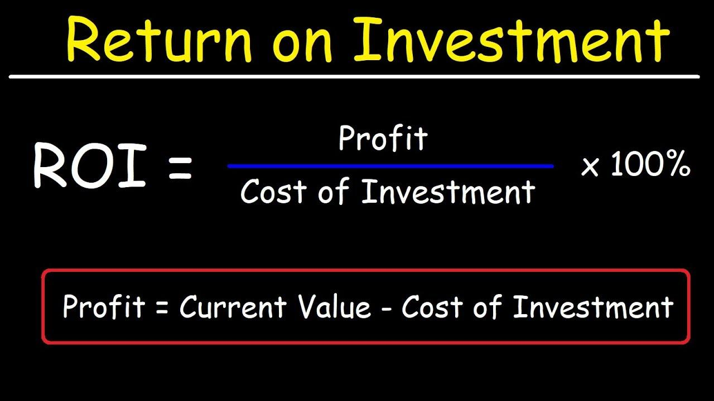

## Table of Contents

## What is Return on Investment (ROI) in real estate?

Return on Investment, or ROI, in real estate is a way to measure how much money you make from your property compared to how much you spent on it. It's like figuring out if buying a house was a good financial decision. To calculate ROI, you take the profit you made from the property, which could be from renting it out or selling it, and divide it by the total amount you invested, including the purchase price and any other costs like repairs or renovations. Then, you multiply that number by 100 to get a percentage.

Understanding ROI is important because it helps you see if your real estate investment is doing well. A high ROI means your property is making you a lot of money compared to what you put into it. A low ROI might mean you're not making as much money as you hoped, and you might need to rethink your strategy. For example, if you bought a house for $100,000 and spent $20,000 on renovations, your total investment is $120,000. If you then sell the house for $150,000, your profit is $30,000. Your ROI would be ($30,000 / $120,000) * 100, which equals 25%. This tells you that for every dollar you invested, you made 25 cents in profit.

## How do you calculate basic ROI for a real estate investment?

To calculate the basic ROI for a real estate investment, you need to know two things: your total profit and your total investment. Your total profit is the money you make from the property, either by selling it for more than you bought it or by collecting rent. Your total investment includes the price you paid for the property plus any money you spent on things like repairs, renovations, or closing costs. Once you have these numbers, you divide your total profit by your total investment. Then, you multiply the result by 100 to turn it into a percentage. That percentage is your ROI.

For example, let's say you bought a house for $200,000 and spent $30,000 on renovations, so your total investment is $230,000. If you sell the house for $280,000, your profit is $50,000. To find your ROI, you divide $50,000 by $230,000, which gives you about 0.217. Multiply that by 100, and your ROI is around 21.7%. This means for every dollar you invested, you made about 22 cents in profit.

## What are the key components needed to calculate ROI in real estate?

To calculate ROI in real estate, you need to know your total profit and your total investment. Your total profit is the money you make from the property. This can come from selling the property for more than you paid for it or from collecting rent. Your total investment is the amount of money you put into the property. This includes the price you paid to buy the property and any additional costs like repairs, renovations, or closing costs.

Once you have these two numbers, calculating ROI is simple. You divide your total profit by your total investment. Then, you multiply the result by 100 to get a percentage. This percentage is your ROI, which shows you how much money you made compared to what you spent. For example, if you bought a house for $150,000, spent $20,000 on renovations, and then sold it for $200,000, your total investment would be $170,000 and your profit would be $30,000. Your ROI would be ($30,000 / $170,000) * 100, which equals about 17.6%.

## How does property appreciation affect ROI calculations?

Property appreciation is when the value of your house goes up over time. This can make your ROI, or return on investment, go up too. If you bought a house for $100,000 and it's now worth $150,000, that extra $50,000 is part of your profit. When you calculate your ROI, you include this increase in value. So, if you spent $10,000 on fixing up the house, your total investment would be $110,000. Your profit from the appreciation would be $50,000, making your ROI ($50,000 / $110,000) * 100, which is about 45.5%.

But, property appreciation can also make things tricky. If you're renting out the house, you might not sell it right away, so you can't use the full appreciated value in your ROI calculation until you actually sell. Also, if the market goes down and the value of your house drops, your ROI could go down too. It's important to keep an eye on how much your property is worth and think about when you plan to sell it, because that can change your ROI a lot.

## What role does rental income play in ROI?

Rental income is a big part of your ROI when you own a rental property. It's the money you get from tenants every month. When you calculate your ROI, you add up all the rent you've collected over time. This money helps you cover your costs like the mortgage, taxes, and repairs. If the rent you get is more than what you spend, that extra money is your profit. So, the more rent you can charge, the higher your ROI can be.

But, you have to think about the whole picture. Sometimes, you might have times when the property is empty and you're not getting any rent. Or, you might need to spend money on fixing things up. These things can lower your ROI. Also, if you plan to sell the property later, the rent you've collected over the years can make your total profit bigger, which can make your ROI even better when you add in the money from selling the house.

## How can you account for expenses like maintenance and taxes in ROI calculations?

When figuring out your ROI for a real estate investment, you need to think about all the money you spend on the property, not just what you paid to buy it. This includes things like maintenance and taxes. Maintenance costs are for fixing things that break or wear out over time, like a leaky roof or a broken dishwasher. Taxes are what you pay to the government for owning the property. These expenses come out of the money you make from the property, either from rent or when you sell it. So, to find your real profit, you subtract these costs from the total money you get.

Let's say you bought a house for $200,000 and spent $10,000 on maintenance and $5,000 on taxes over the years. If you sell the house for $250,000, you might think your profit is $50,000. But after you take away the maintenance and taxes, your actual profit is $35,000. To find your ROI, you add up all your costs, which is $200,000 for the house, $10,000 for maintenance, and $5,000 for taxes, making a total investment of $215,000. Then you divide your real profit of $35,000 by your total investment of $215,000, and multiply by 100. Your ROI would be about 16.3%. This shows how important it is to include all your expenses when calculating ROI, so you get a true picture of your investment's performance.

## What is the difference between gross and net ROI in real estate?

Gross ROI in real estate is the simple way to see how much money you made from your property without thinking about all the costs. It's just your total income, like rent or the profit from selling your property, divided by how much you spent to buy it, then multiplied by 100 to get a percentage. For example, if you bought a house for $100,000 and sold it for $150,000, your gross ROI would be ($50,000 / $100,000) * 100, which is 50%. This number is easy to calculate and gives you a quick idea of your investment's performance.

Net ROI, on the other hand, is a more detailed way to look at your investment because it takes into account all the money you spent on things like maintenance, taxes, insurance, and any other costs. To find your net ROI, you subtract all these costs from your total income to find your real profit. Then you divide this real profit by your total investment, which includes the price you paid for the property plus all those other costs, and multiply by 100. So, if you bought that same house for $100,000, spent $10,000 on maintenance and $5,000 on taxes, and sold it for $150,000, your net profit would be $35,000 after subtracting the costs. Your total investment would be $115,000, so your net ROI would be ($35,000 / $115,000) * 100, which is about 30.4%. This number gives you a clearer picture of how well your investment is really doing.

## How can leverage (using borrowed capital) impact the ROI of a real estate investment?

Using borrowed money, or leverage, to buy a house can make your ROI go up if the house makes more money than what you pay on the loan. Imagine you buy a house with a small down payment and a big loan. If the house goes up in value or you get a lot of rent, the profit you make can be a lot more compared to just the money you put down. This means your ROI can be higher because you're making money on the whole value of the house, not just what you paid.

But, using borrowed money can also make things riskier. If the house doesn't make enough money to cover the loan payments, or if the value of the house goes down, you could end up losing money. This would make your ROI go down or even turn negative. So, while leverage can help boost your ROI, it's important to be careful and make sure you can handle the payments and any unexpected costs.

## What are some advanced metrics beyond simple ROI that investors should consider?

Besides just looking at ROI, investors should also think about something called the Cash-on-Cash Return. This tells you how much money you're making each year compared to the cash you put down to buy the property. It's helpful because it shows you the real return on the money you actually invested, not counting the money you borrowed. For example, if you put down $20,000 on a house and made $2,000 a year from it, your Cash-on-Cash Return would be 10%. This can help you see if the money you're getting back is worth the risk and effort.

Another important thing to look at is the Cap Rate, or Capitalization Rate. This is a way to figure out how good an investment is without thinking about how you paid for it. You find the Cap Rate by taking the money the property makes each year (like rent) and dividing it by how much the property is worth. A higher Cap Rate means the property could be a better investment. For example, if a house makes $10,000 a year and is worth $100,000, the Cap Rate would be 10%. This number can help you compare different properties to see which one might be the best to buy.

## How do you calculate ROI when flipping a property?

When you flip a property, you buy it, fix it up, and then sell it to make a profit. To figure out your ROI, you first need to know how much money you made from selling the house. You subtract the price you paid to buy the house and all the money you spent on fixing it up from the price you sold it for. This gives you your profit. Then, you divide this profit by the total amount you spent, which includes the purchase price and all the fix-up costs. Finally, multiply that number by 100 to turn it into a percentage. That percentage is your ROI.

For example, let's say you bought a house for $100,000 and spent $20,000 on repairs and renovations. You then sold the house for $150,000. Your profit would be $150,000 minus $100,000 (the purchase price) and $20,000 (the fix-up costs), which equals $30,000. Your total investment was $120,000 (the purchase price plus the fix-up costs). So, your ROI would be ($30,000 divided by $120,000) times 100, which is 25%. This means for every dollar you invested, you made 25 cents in profit.

## What are the tax implications that can affect ROI in real estate investments?

Taxes can have a big impact on your ROI when you invest in real estate. When you own a rental property, you have to pay property taxes every year. These taxes come out of the money you make from rent, which means less profit for you. Also, if you sell your property for more than you paid for it, you might have to pay capital gains tax on the profit. This tax can take a big chunk out of your earnings, making your ROI lower than you expected. So, it's important to think about these taxes when you figure out how much money you'll really make from your investment.

Another thing to keep in mind is that you can sometimes lower your taxes by claiming certain expenses on your tax return. For example, you can deduct costs like mortgage interest, property taxes, and the money you spend on repairs and maintenance. These deductions can help reduce the amount of tax you owe, which can make your ROI higher. But, tax laws can be complicated and they change a lot, so it's a good idea to talk to a tax professional to make sure you're doing everything right and taking advantage of all the tax benefits you can.

## How can market conditions and economic factors influence ROI calculations in real estate?

Market conditions and economic factors can change how much money you make from your real estate investment. If the market is doing well, with lots of people wanting to buy houses, the value of your property might go up. This is called appreciation, and it can make your ROI go up too because you can sell the house for more money. Also, if the economy is strong, more people might be able to afford to rent, so you could charge higher rent. But if the market slows down or the economy isn't doing well, the value of your house might go down, and it could be harder to find tenants who can pay the rent you want. This can make your ROI lower because you might not make as much money as you hoped.

Another thing to think about is interest rates. If interest rates go up, it can be harder for people to borrow money to buy houses, which might slow down the market. This could mean your property doesn't go up in value as much as you thought it would, or you might have to lower your rent to keep tenants. On the other hand, if interest rates are low, more people might be able to buy or rent, which could help your ROI. Also, things like job growth and unemployment rates in the area can affect how many people want to live there, which can change how much you can charge for rent or how much you can sell your property for. All these things together can make a big difference in how much money you make from your real estate investment.

## What is the process of decoding Real Estate ROI?

Return on Investment (ROI) is a key performance metric in real estate that signifies the profitability of an investment. It measures the gain or loss generated in relation to the amount of money invested, providing investors with a tool to evaluate the efficacy of their investment ventures. 

### Methods of Calculating ROI

**1. Cash-on-Cash Return:** This method focuses on the cash income earned on the cash invested in the property. It is calculated as:

$$
\text{Cash-on-Cash Return} = \left(\frac{\text{Annual Pre-Tax Cash Flow}}{\text{Total Cash Invested}}\right) \times 100
$$

This metric is particularly useful for investors seeking to understand the annual return in percentage terms, based on the actual cash they have invested, excluding financing and loan dynamics.

**2. Capitalization Rate (Cap Rate):** The cap rate is another essential metric, commonly used for quick property assessments. It is calculated by dividing the net operating income (NOI) by the current market value or purchase price of the property:

$$
\text{Cap Rate} = \left(\frac{\text{Net Operating Income}}{\text{Current Market Value}}\right) \times 100
$$

It offers insights into the expected rate of return, assuming the property was acquired without leverage.

### Factors Influencing ROI

**1. Property Appreciation:** The increase in property value over time significantly affects ROI. Market dynamics, economic factors, and property location play vital roles in appreciation rates. While appreciation can dramatically enhance ROI, unexpected market downturns can also introduce depreciation risks.

**2. Rental Income:** Consistent rental income boosts ROI by providing a steady stream of cash flow. Rental demand, property management quality, and tenant stability can impact the income potential and thereby influence overall returns.

### Risk Factors and Their Impact

Real estate investments entail several risks that can impact ROI positively or negatively:

**1. Market Risk:** Real estate markets are susceptible to fluctuations due to economic cycles, interest rates, and regulatory changes. An unfavorable shift can reduce property values and rental demand, adversely affecting ROI.

**2. Liquidity Risk:** Real estate is a relatively illiquid asset class compared to stocks or bonds. The time and cost associated with selling a property can pose challenges, especially in a declining market, affecting ROI.

**3. Operational Risks:** Poor property management, unexpected maintenance issues, or high vacancy rates can lead to increased expenses and reduced income, diminishing returns.

Understanding these components provides a comprehensive insight into the ROI calculations and helps investors make more informed decisions in their real estate ventures.

 to Algorithmic Trading in Real Estate

Algorithmic trading, commonly known as algo trading, involves the use of computer algorithms to execute trading orders with precision and speed that surpass human capabilities. Its origins can be traced back to the late 20th century in the financial markets, where it revolutionized trading by automating processes and optimizing strategies through complex mathematical models and statistical analyses. Given its initial success in stocks, currencies, and commodities, [algorithmic trading](/wiki/algorithmic-trading) has gradually permeated other sectors, including real estate.

In real estate investments, algorithmic trading is gaining traction as a transformative tool for optimizing portfolio management and maximizing returns. By employing algorithms, investors can automate the decision-making process, utilizing vast datasets to uncover trends, predict market movements, and identify lucrative investment opportunities. For instance, algorithms can analyze data from historical property values, rental yields, demographic shifts, and economic indicators to forecast future real estate trends.

Data-driven strategies serve as the backbone of algorithmic trading in the real estate sector. By systematically gathering and processing data from various sources, such as property listings, market reports, and financial [statistics](/wiki/bayesian-statistics), these strategies facilitate informed decision-making and risk assessment. Machine learning models can enhance this process by learning patterns from historical data and improving predictive accuracy over time.

Technological advancements have significantly bolstered the capabilities of algorithmic trading in real estate. High-performance computing and cloud-based platforms provide the necessary infrastructure to process and analyze large datasets rapidly. Furthermore, advancements in [artificial intelligence](/wiki/ai-artificial-intelligence) (AI) and [machine learning](/wiki/machine-learning) enable algorithms to continuously refine strategies and adapt to dynamic market conditions. AI-driven platforms can even perform sentiment analysis on news articles and social media, offering insights into public perception and potential impacts on real estate markets.

In summary, algorithmic trading represents a fusion of technology and finance, reshaping how real estate investments are approached. The utilization of algorithms for data analysis, portfolio optimization, and strategic execution offers a competitive edge, empowering investors to harness the full potential of real estate markets.

## References & Further Reading

[1]: Lowry, T. S., & Friedman, J. (2007). ["Real Estate Market Analysis: A Case Study Approach."](https://onlinelibrary.wiley.com/doi/full/10.1111/1756-2171.12082) Urban Land Institute.

[2]: Jud, G. D., & Winkler, D. T. (1998). ["The Capitalization Rate of Commercial Properties and Market Returns."](https://www.researchgate.net/profile/G-Jud/publication/5141875_The_Capitalization_Rate_of_Commercial_Properties_and_Market_Returns/links/02e7e53be9258bc059000000/The-Capitalization-Rate-of-Commercial-Properties-and-Market-Returns.pdf) Real Estate Economics, 26(3), 483–495.

[3]: Geltner, D., Miller, N. G., Clayton, J., & Eichholtz, P. (2007). ["Commercial Real Estate Analysis and Investments."](https://www.researchgate.net/publication/245702364_Commercial_Real_Estate_Analysis_and_Investments) South-Western Educational Publishing.

[4]: DePrato, I., & Brealey, R. A. (2020). ["Urban Economics and Real Estate: Theory and Policy."](https://www.wiley.com/en-us/Urban+Economics+and+Real+Estate%3A+Theory+and+Policy%2C+2nd+Edition-p-9780470591482) Springer.

[5]: Mulè, A. (2021). ["Algorithmic Trading: Winning Strategies and Their Rationale."](https://www.wiley.com/en-us/Algorithmic+Trading%3A+Winning+Strategies+and+Their+Rationale-p-9781118460146) Manning Publications.

[6]: Chan, E. P. (2009). ["Quantitative Trading: How to Build Your Own Algorithmic Trading Business."](https://github.com/ftvision/quant_trading_echan_book) Wiley.

[7]: Elsinga, N. J., et al. (2018). ["Data-Driven Real Estate: Decoding the Property Market."](https://www.nejm.org/doi/full/10.1056/NEJMoa1804498) KTH Royal Institute of Technology.