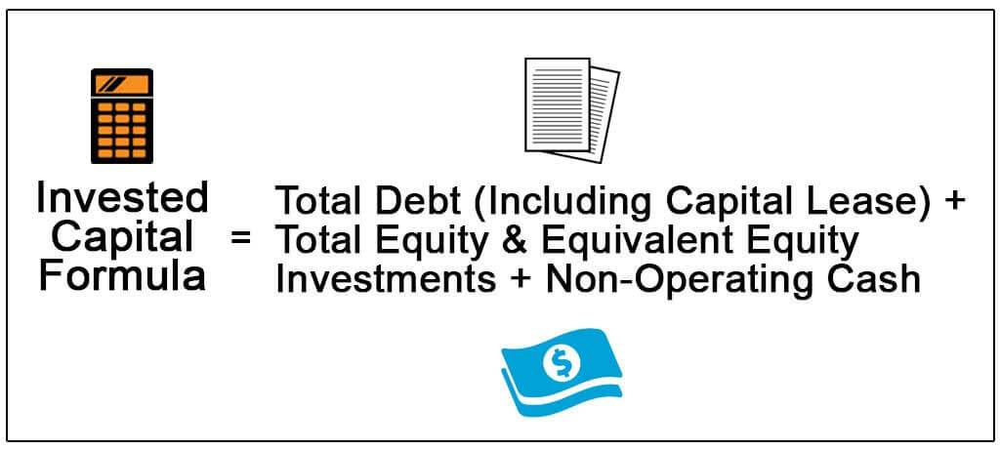

## Table of Contents

## What is incremental invested capital?

Incremental invested capital is the extra money a company puts into its business to help it grow or improve. This can include buying new equipment, expanding facilities, or investing in new projects. It's the difference between the total invested capital at the end of a period and the total invested capital at the beginning of that period. Companies use this to see how much more they are investing over time.

When a company calculates its incremental invested capital, it helps them understand how their new investments are performing. By comparing the returns from these new investments to the amount of money spent, the company can figure out if the extra money they put in is paying off. This is important for making smart decisions about where to invest in the future.

## Why is calculating returns on incremental invested capital important?

Calculating returns on incremental invested capital is important because it helps a company see if the extra money they are spending is making them more money. Imagine you save up to buy a new toy. You want to know if playing with the new toy is more fun than the old one. For a company, it's the same idea but with money. They want to know if the new machines or projects they paid for are bringing in more money than before.

This information is really helpful for making smart choices about where to spend money next. If the new investment is doing well, the company might decide to spend more money on similar things. But if it's not working out, they might choose to try something different. By understanding the returns, a company can keep getting better and making more money over time.

## How do you calculate incremental invested capital?

To calculate incremental invested capital, you start by looking at the total amount of money a company has put into its business at the end of a time period. This includes things like buildings, machines, and money used for projects. Then, you look at the total amount of money the company had invested at the beginning of the same time period. Incremental invested capital is simply the difference between these two amounts. If a company had $100 million invested at the start of the year and $120 million at the end, the incremental invested capital would be $20 million.

This calculation helps a company see how much more money they are putting into their business over time. It's important because it shows if the company is growing or shrinking its investments. By knowing this, the company can make better decisions about where to spend money in the future. If the incremental invested capital is high, it means the company is putting a lot of new money into the business, which could lead to more growth if the investments pay off.

## What is the formula for calculating returns on incremental invested capital?

To calculate returns on incremental invested capital, you first need to know the incremental invested capital, which is the difference between the total invested capital at the end of a period and the total invested capital at the beginning of that period. Next, you need to figure out the extra profit the company made because of this new investment. This extra profit is called incremental profit. To find it, you subtract the profit the company made before the new investment from the profit it made after the new investment.

Once you have both the incremental invested capital and the incremental profit, you can calculate the return. The formula is simple: you divide the incremental profit by the incremental invested capital. Then, you multiply the result by 100 to turn it into a percentage. This percentage tells you how much money the company made for every dollar they put into the new investment. If the percentage is high, it means the new investment was a good choice because it brought in a lot of extra profit. If it's low, the company might want to think about investing their money differently next time.

## Can you explain the difference between total invested capital and incremental invested capital?

Total invested capital is all the money a company has put into its business. This includes money spent on things like buildings, machines, and projects. It's like adding up all the money the company has used to help it grow and work better. If you think of a company as a big tree, total invested capital is like looking at the whole tree, including the trunk, branches, and leaves.

Incremental invested capital, on the other hand, is just the extra money a company puts into its business over a certain time. It's the difference between the total invested capital at the end of that time and the total invested capital at the start. Using the tree example again, incremental invested capital is like looking at the new branches and leaves that have grown since the last time you checked. It helps the company see how much more it's investing and if those new investments are helping the business grow.

## How does incremental invested capital affect a company's financial performance?

Incremental invested capital can really change how well a company does with its money. When a company puts more money into its business, like buying new machines or starting new projects, it's hoping to make more money in the future. If these new investments work out well, the company can earn more profit and grow bigger. But if the new investments don't bring in enough extra money, the company might struggle because it spent a lot without getting much back.

It's important for a company to keep an eye on how its incremental invested capital is doing. By looking at the returns on this new money, the company can figure out if it's making smart choices. If the returns are high, it means the new investments are paying off and the company can keep growing. But if the returns are low, the company might need to change its plans and try investing in different things to do better next time.

## What are common pitfalls when calculating returns on incremental invested capital?

One common problem when calculating returns on incremental invested capital is not figuring out the right amount of extra profit the new investment made. Sometimes, people might mix up the profit that came from the new investment with the profit that was already there from before. It's like trying to see how much bigger a plant got after you watered it, but you forget to think about how much it grew before you started watering it. If you don't separate the new profit from the old profit correctly, you might think the new investment did better or worse than it really did.

Another pitfall is not considering all the costs that come with the new investment. It's not just about the money you spend to buy new things; there might be other costs like training people to use the new machines or fixing problems that come up. If you don't count all these costs, you might think the returns are higher than they really are. It's like buying a new toy and only thinking about the price tag, but not the batteries or the time you spend putting it together. To get a true picture of how well the new investment is doing, you need to include all the costs that go along with it.

## How can a company improve its returns on incremental invested capital?

A company can improve its returns on incremental invested capital by choosing its investments wisely. This means looking closely at different projects and [picking](/wiki/asset-class-picking) the ones that are most likely to make more money. For example, if a company is thinking about buying new machines, it should do a lot of research to see if those machines will help make more products faster or better. By focusing on investments that have a good chance of bringing in more profit, the company can get better returns on the extra money it spends.

Another way to improve returns is by making sure the company uses its new investments as well as possible. This could mean training workers to use new machines correctly or making sure new projects are managed carefully. If the company can get the most out of its new investments, it will make more money from them. It's like making sure you use all the features of a new toy so you can have the most fun with it. By being smart about how it uses its new investments, a company can see bigger returns on the money it spends.

## What role does the time value of money play in calculating returns on incremental invested capital?

The time value of money is really important when figuring out returns on incremental invested capital. It means that a dollar today is worth more than a dollar in the future because you can use it now to make more money. When a company looks at how well its new investments are doing, it needs to think about how long it takes to get the extra profit back. If it takes a long time to see the returns, the company might decide that the investment isn't as good as it looks because the money could have been used to make more money somewhere else in the meantime.

To make sure they're getting a true picture of their returns, companies use something called discounted cash flow analysis. This means they figure out how much the future profits from the new investment are worth today. By doing this, they can see if the new investment is really worth the extra money they're putting in. If the returns, after considering the time value of money, are still good, then the company knows it's making a smart choice with its investments.

## How do different industries approach the calculation of returns on incremental invested capital?

Different industries might use different ways to figure out returns on incremental invested capital because what works for one type of business might not work for another. For example, in the tech industry, companies might focus a lot on how quickly they can get their money back from new projects like developing new software. They might use special methods to see if the new software will make them more money than it cost to make it. On the other hand, in the manufacturing industry, companies might look at how new machines can help them make more products faster or cheaper. They would calculate returns by seeing if the extra money they make from these machines is more than what they spent on them.

In the retail industry, companies might think about how opening new stores or improving old ones can bring in more customers and more sales. They would look at the extra profit from these changes and see if it's worth the money they put into them. Each industry has its own way of doing things, but the main idea is the same: they all want to make sure that the extra money they spend on new investments will bring in more money in the end. By understanding how their industry works, companies can make better choices about where to spend their money.

## What advanced metrics can be used alongside returns on incremental invested capital to gain deeper insights?

One advanced metric that can be used alongside returns on incremental invested capital is Economic Value Added (EVA). EVA helps a company see if it's making more money than the cost of the money it used to make those profits. It's like figuring out if the new toy you bought is worth the money you spent on it, not just in fun but also in making sure you didn't spend more than you should have. By looking at EVA, a company can understand if its new investments are really adding value to the business, beyond just making a little more profit.

Another useful metric is the Internal Rate of Return (IRR). IRR is a way to see how well an investment is doing over time, taking into account the time value of money. It's like trying to figure out if the money you put into a new project will grow faster than if you had just put it in the bank. If the IRR is high, it means the new investment is doing really well and is a good use of the company's money. By using IRR along with returns on incremental invested capital, a company can get a fuller picture of how its new investments are performing and make smarter decisions about where to spend money next.

## How can returns on incremental invested capital be integrated into a broader investment strategy?

Returns on incremental invested capital can be a big help when a company is making plans about where to put its money. By looking at how well past investments did, a company can make better guesses about which new projects will bring in more money. If a company sees that buying new machines made a lot of extra profit last time, it might decide to buy more machines or try something similar. This way, the company can keep getting better at choosing investments that will help it grow and make more money over time.

Using returns on incremental invested capital in a bigger plan also means thinking about other things that affect how well the company does. For example, a company might look at how the economy is doing or what its competitors are up to. By mixing this information with what it knows about its own investments, the company can make a smart plan that covers all the bases. This helps the company stay strong and keep making good choices about where to spend its money, even when things around it change.

## What is Understanding Incremental Invested Capital (IIC)?

Incremental Invested Capital (IIC) is a financial metric that quantifies the additional capital investments a company makes within a given period. This metric is essential for measuring the extent to which a company's financial resources are allocated towards new projects, assets, or expansions. By tracking IIC, organizations can gain insights into how effectively they deploy their capital to drive growth and maintain competitive advantages.

The primary role of IIC is to assess the efficiency of capital deployment within an organization. It enables companies to measure the proportional increase in their invested capital, which includes expenditures on fixed assets and working capital. IIC provides a clearer understanding of how much new investment is being made beyond the existing capital stock, making it a valuable tool for assessing a company's strategic expansion efforts.

Calculating the efficiency of capital deployment using IIC often involves examining the Return on Incremental Invested Capital (ROIIC). ROIIC is a complementary metric that evaluates the financial returns generated from the additional investments represented by IIC. It serves as an indicator of how well a company is converting its new investments into profitable outcomes. ROIIC is calculated using the formula:

$$
\text{ROIIC} = \frac{\Delta \text{NOPAT}}{\Delta \text{Invested Capital}}
$$

Where $\Delta \text{NOPAT}$ is the change in Net Operating Profit After Tax, and $\Delta \text{Invested Capital}$ is the change in invested capital during the period under consideration.

The importance of ROIIC lies in its ability to help businesses identify whether their new capital investments are generating sufficient returns compared to existing operations. A high ROIIC suggests that additional investments are efficiently converted into profits, enhancing shareholder value and supporting future growth. In contrast, a low ROIIC may indicate inefficient capital allocation or diminishing returns on new projects.

Understanding IIC and ROIIC enables businesses to optimize their capital allocation strategies, ensuring that any incremental investments contribute positively to their financial performance. Moreover, these metrics provide essential insights for investors, who can make more informed decisions based on a company's capacity to generate robust returns on its newly invested capital. This focus on capital efficiency and returns supports sustainable long-term growth and competitiveness in dynamic market environments.

## How do Capital Efficiency and Investment Returns relate to each other?

Incremental Invested Capital (IIC) plays a pivotal role in assessing capital efficiency, a critical measure for understanding how effectively a company is using its capital to generate returns. IIC represents the additional capital investment needed to expand business operations or undertake new projects. By focusing on the incremental aspect, it isolates the financial impact of new investments from pre-existing capital base, offering clear insights into their performance.

Investors and financial analysts use IIC as a cornerstone metric to evaluate a company’s deployment of capital. It helps distinguish between profitable and unprofitable investments by highlighting the capacity of fresh capital inputs to generate incremental returns. The efficiency of capital deployment is particularly evident when examined through the Return on Incremental Invested Capital (ROIIC). ROIIC is calculated by dividing the change in net operating profit after taxes (NOPAT) by the change in IIC:

$$
\text{ROIIC} = \frac{\Delta \text{NOPAT}}{\Delta \text{IIC}}
$$

This calculation provides an insightful measure of returns exclusively attributable to new investments, serving as a benchmark to assess whether these returns are meeting or exceeding the cost of capital.

A high IIC typically signals significant capital infusion into business operations, which can drive long-term growth and profitability if managed correctly. Efficiently utilized, it can lead to increased production capacity, market expansion, or innovation, enhancing a firm's competitive edge. However, simply having a high IIC is not inherently beneficial if the additional investments do not yield adequate returns. In such cases, high IIC without corresponding high ROIIC may indicate overinvestment or inefficient capital use, potentially burdening a firm with excessive costs without proportionate benefits.

Understanding these dynamics aids investors in crafting strategies that incorporate IIC metrics, aligning capital deployment with optimal returns. The strategic application of IIC measurements not only clarifies the utilization of capital but underpins forecasts of sustainable economic growth and profitability aligned with investor goals.

## References & Further Reading

[1]: ["Valuation: Measuring and Managing the Value of Companies"](https://www.amazon.com/Valuation-Measuring-Managing-Companies-Finance/dp/1119610885) by McKinsey & Company Inc.

[2]: ["The Intelligent Investor: The Definitive Book on Value Investing"](https://www.amazon.com/Intelligent-Investor-Definitive-Investing-Essentials/dp/0060555661) by Benjamin Graham

[3]: ["Security Analysis: Principles and Techniques"](https://www.amazon.com/Security-Analysis-Seventh-Principles-Techniques/dp/1264932405) by Benjamin Graham and David L. Dodd

[4]: ["Corporate Finance: Theory and Practice"](https://www.amazon.com/Corporate-Finance-Practice-Steve-Lumby/dp/1473758386) by Aswath Damodaran

[5]: ["The Little Book of Valuation: How to Value a Company, Pick a Stock, and Profit"](https://www.amazon.com/Little-Book-Valuation-Company-Profits/dp/1394244401) by Aswath Damodaran