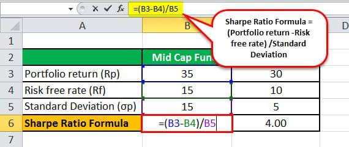

The Sharpe Ratio, conceptualized by Nobel laureate William F. Sharpe in 1966, stands as a cornerstone financial metric, instrumental in assessing the risk-adjusted return of an investment portfolio. This ratio serves as a fundamental tool for investors and analysts, helping them strike a balance between risk and return—a balance that is crucial in the financial world. By comparing the potential returns of an investment to its inherent risk, the Sharpe Ratio provides a quantitative measure that enables both novice investors and experienced professionals to evaluate the efficacy of their trading strategies.

This guide offers a thorough exploration of the Sharpe Ratio, particularly emphasizing its calculation using Microsoft Excel. Given the increasing prevalence of algorithmic trading, understanding how to implement the Sharpe Ratio within Excel can significantly enhance the analysis of automated trading strategies. This aspect of the guide is particularly relevant in an era where algorithmic solutions are frequently leveraged to optimize investment portfolios. Excel, with its extensive capabilities, facilitates the computation of the Sharpe Ratio, allowing users to input historical returns, calculate mean returns, and determine portfolio standard deviations seamlessly.

The integration of the Sharpe Ratio in Excel is not merely an academic exercise but a practical tool that stands to benefit traders and portfolio managers. By comprehensively examining this process, the guide equips investors with the necessary skills to make informed decisions, ultimately leading to improved risk management and optimized returns. Whether you are new to investing or possess years of experience, a firm grasp of the Sharpe Ratio’s functionality within Excel can enhance your analytical toolkit, aiding in the pursuit of an optimized financial portfolio.

## Table of Contents

## Understanding the Sharpe Ratio

The Sharpe Ratio is a widely used financial metric that evaluates an investment's risk-adjusted return. It quantifies how much excess return one could earn for the additional volatility endured compared to a risk-free alternative. The essential formula for calculating the Sharpe Ratio is:

$$
\text{Sharpe Ratio} = \frac{\text{Mean Portfolio Return} - \text{Risk-Free Rate}}{\text{Standard Deviation of Portfolio Return}}
$$

In this equation:

- **Mean Portfolio Return** represents the average return of an investment or portfolio over a specific period.
- **Risk-Free Rate** denotes the return on an investment considered free from risk, often represented by government bonds or treasury bills.
- **Standard Deviation of Portfolio Return** signifies the degree to which the investment's returns deviate from the average, indicating volatility or risk.

A higher Sharpe Ratio indicates superior risk-adjusted performance. This suggests that a portfolio is yielding more return for each unit of risk undertaken. Conversely, a low Sharpe Ratio implies that the returns are not sufficient to justify the associated risk.

Investors utilize the Sharpe Ratio to assess whether the additional returns offered by an investment outweigh the potential risks. By comparing the returns of a portfolio against a risk-free alternative, the Sharpe Ratio provides a clear perspective on performance efficiency. A higher ratio is desirable as it signifies more return for lower levels of risk, thereby helping investors make more informed decisions about their portfolios.

## Calculating the Sharpe Ratio in Excel

To calculate the Sharpe Ratio in Excel, investors need to structure their data methodically to facilitate the application of the formula. The Sharpe Ratio is calculated as:

$$
\text{Sharpe Ratio} = \frac{\text{Mean Portfolio Return} - \text{Risk-Free Rate}}{\text{Standard Deviation of Portfolio Return}}
$$

This process involves several steps that can be easily executed using Excel's built-in functions. 

### Data Preparation

1. **Organize Your Data:**
   Begin by creating columns for the relevant data: 
   - **Time Periods:** Typically, these would be days, months, or years, depending on the frequency of your data.
   - **Portfolio Returns:** List the actual returns of the investment for each time period.
   - **Risk-Free Rate:** This is often the return on a government bond or treasury bill that matches the duration of your investment. You can enter a constant value if it remains the same across periods.

2. **Calculate Excess Returns:**
   Calculate the excess return for each period by subtracting the risk-free rate from the portfolio returns. This can be done in a new column using a simple formula. For instance, if the portfolio return is in column B and the risk-free rate in column C, you would enter `=B2-C2` in the cell corresponding to the first row of your excess returns column.

### Calculating Necessary Components

1. **Mean Portfolio Return:**
   Use the `AVERAGE` function to calculate the mean of your portfolio returns. Assuming your returns are in column B, the formula would be `=AVERAGE(B2:Bn)` where `n` is the number of observations.

2. **Standard Deviation of Portfolio Return:**
   With the portfolio returns in column B, utilize Excel's `STDEV.P` function for the entire population standard deviation, or `STDEV.S` for a sample standard deviation. The formula would be `=STDEV.P(B2:Bn)` or `=STDEV.S(B2:Bn)`.

3. **Insert Risk-Free Rate:**
   Ensure you have the correct risk-free rate value that represents either the time period averages or a constant value.

### Compute the Sharpe Ratio

Finally, integrate these components to calculate the Sharpe Ratio. If the mean portfolio return is in cell D2 and the standard deviation of returns in D3, with the risk-free rate in cell D4, the formula becomes:

$$
= \frac{D2 - D4}{D3}
$$

By organizing your data this way and using these functions, evaluating the Sharpe Ratio becomes a straightforward task within Excel, enabling timely and informed assessment of your investment strategy's risk-adjusted return.

## Example Calculation in Excel

To calculate the Sharpe Ratio in Excel, consider an investment anticipated to yield a 20% return. A risk-free alternative offers a 2.3% return, and the investment has a standard deviation of 15%. The Sharpe Ratio formula, given by $(\text{Mean portfolio return} - \text{Risk-free rate}) / \text{Standard deviation of portfolio return}$, will be applied here as $(20\% - 2.3\%) / 15\%$.

To implement this calculation in Excel and maintain a practical approach:

1. **Data Setup:**
   - Create a column for portfolio returns, with each cell representing the return for a specific period.
   - Establish another column for the risk-free rate, specifying the same rate across each cell since it's constant.
   - Calculate the excess return by subtracting the risk-free rate from each periodic return.

2. **Using Excel Functions:**
   - Employ the `AVERAGE()` function to obtain the mean of the periodic returns. This is your investment's expected return.
   - Use the `STDEV.P()` function to determine the standard deviation of the returns, indicating the investment's volatility.

3. **Calculating the Sharpe Ratio:**
   - Subtract the risk-free rate from the average return calculated in the first step to get the excess average return.
   - Divide this excess return by the standard deviation of the returns to acquire the Sharpe Ratio.

The specific formulas in Excel would be:

- **Average Return**: `=AVERAGE(B2:B11)` if your portfolio returns are in `B2` to `B11`.
- **Excess Return**: `=C2-B2` for each row if your risk-free rates are in column `C`.
- **Standard Deviation**: `=STDEV.P(B2:B11)`
- **Sharpe Ratio**: `=(AVERAGE(B2:B11) - A2) / STDEV.P(B2:B11)`, where `A2` contains the risk-free rate.

This setup allows for a precise calculation of the Sharpe Ratio, which in this hypothetical case results in $(20\%-2.3\%)/15\% = 1.18$. This indicates an acceptable level of return for the associated risk, demonstrating the Sharpe Ratio’s utility in evaluating investment performance.

## Interpreting Sharpe Ratio Results

A Sharpe Ratio greater than 1.0 indicates a good risk-adjusted return, suggesting the investment is yielding returns that justify the inherent risk. When the Sharpe Ratio exceeds 2.0, it is considered very good, denoting superior performance in balancing risk and return. A Sharpe Ratio above 3.0 is exceptional, signaling that the portfolio is generating substantial returns relative to its [volatility](/wiki/volatility-trading-strategies). These benchmarks are essential for investors to evaluate the efficiency of an investment strategy in managing risk.

Conversely, a negative Sharpe Ratio indicates underperformance, as the investment's returns are less than the risk-free rate once adjusted for risk. This outcome suggests that the investor would have been better off opting for a risk-free alternative, often prompting a reassessment of the current investment strategy.

Recognizing these benchmarks assists investors in portfolio refinement and effective risk management. Using the Sharpe Ratio enables a more quantitative approach to investment evaluation, aiding in decision-making processes by setting clear expectations for risk-adjusted performance. However, while these general guidelines provide a foundation for interpretation, investors should also consider the broader market context and specific investment goals.

## Drawbacks and Misconceptions

The Sharpe Ratio is widely praised for its simplicity and utility in providing a singular measure of risk-adjusted return. However, several drawbacks and misconceptions exist regarding its application and interpretation. Key among these is the assumption that investment returns are normally distributed, which means that the metric inherently presumes a symmetrical distribution of returns around the mean. In reality, many financial returns can exhibit skewness or kurtosis, leading to potential misrepresentations of risk and performance when using the Sharpe Ratio as a sole evaluative measure. 

Another limitation is its potential to overemphasize results for portfolios with improved diversification. While diversification can reduce portfolio variance, it does not necessarily correlate with a proportional increase in the Sharpe Ratio unless accompanied by an increase in risk-adjusted returns. This means that a portfolio with a high degree of diversification may appear superior through the Sharpe Ratio, even if it has not truly optimized returns relative to risk.

Moreover, investments with risk-adjusted outcomes, such as those employing derivatives or complex financial instruments, may lead to misleading Sharpe Ratio values. In such cases, the metric may reflect apparent favorable ratios without accurately capturing the portfolio's exposure to extreme losses or tail risks.

To address these drawbacks, investors should complement the Sharpe Ratio with other performance metrics to gain a more comprehensive analysis of investment performance. Alternative measures like the Sortino Ratio, which accounts for downside risk by replacing standard deviation with downside deviation, or the Treynor Ratio, which considers systematic risk, can provide additional insights. 

These considerations remind investors that, while valuable, the Sharpe Ratio should not be the sole criterion in decision-making processes. An informed approach requires a nuanced understanding of portfolio dynamics and risk considerations, ensuring a balanced evaluation that aligns with an investor's specific objectives and market conditions.

## Conclusion

The Sharpe Ratio stands as a crucial metric in assessing the risk-adjusted returns of trading strategies, particularly when employed in [algorithmic trading](/wiki/algorithmic-trading) facilitated by Excel. This measure provides investors a quantitative approach to gauge how well the return of an asset compensates for the risk taken, an essential consideration for making informed investment decisions. By focusing on risk-adjusted returns, investors can better optimize their portfolios to navigate the complexities of financial markets.

However, it is vital to approach the Sharpe Ratio with a discerning eye. This involves recognizing its limitations, such as its assumption of normally distributed returns and its potential overemphasis on portfolios with diversified assets. By supplementing the Sharpe Ratio with complementary metrics like the Sortino Ratio or the Treynor Ratio, investors can attain a more comprehensive view of a portfolio's performance. This nuanced strategy fosters enhanced decision-making by weighing various factors beyond just risk-adjusted returns.

Armed with this understanding, investors can leverage the Sharpe Ratio effectively within Excel to refine their trading strategies. This empowers them to construct optimized portfolios that balance return and risk, ultimately contributing to improved risk management and a stronger foundation for achieving investment objectives. Through a balanced application of the Sharpe Ratio alongside other analytical tools, investors are better positioned to manage risks and capture potential returns.

## References & Further Reading

[1]: Sharpe, W. F. (1966). ["Mutual Fund Performance."](https://www.scirp.org/reference/ReferencesPapers?ReferenceID=1451307) Journal of Business, 39(1), 119-138.

[2]: Bodie, Z., Kane, A., & Marcus, A. J. (2014). ["Investments"](https://www.mheducation.com/highered/product/Investments-Bodie.html). McGraw-Hill Education.

[3]: Fabozzi, F. J., Gupta, F., & Markowitz, H. M. (2002). ["The Legacy of Modern Portfolio Theory."](https://www.semanticscholar.org/paper/The-Legacy-of-Modern-Portfolio-Theory-Fabozzi-Gupta/6619eebc6957d7c101112a041942c4df61783616) Journal of Investing, 11(3), 7-22.

[4]: Alexander, C. (2008). ["Market Risk Analysis, Volume IV: Value at Risk Models."](https://pdfs.semanticscholar.org/afba/364297b19e15f646f9964a7f319225984fe9.pdf) John Wiley & Sons.

[5]: Elton, E. J., Gruber, M. J., Brown, S. J., & Goetzmann, W. N. (2014). ["Modern Portfolio Theory and Investment Analysis, 9th Edition."](https://books.google.com/books/about/Modern_Portfolio_Theory_and_Investment_A.html?id=181CEAAAQBAJ) Wiley.