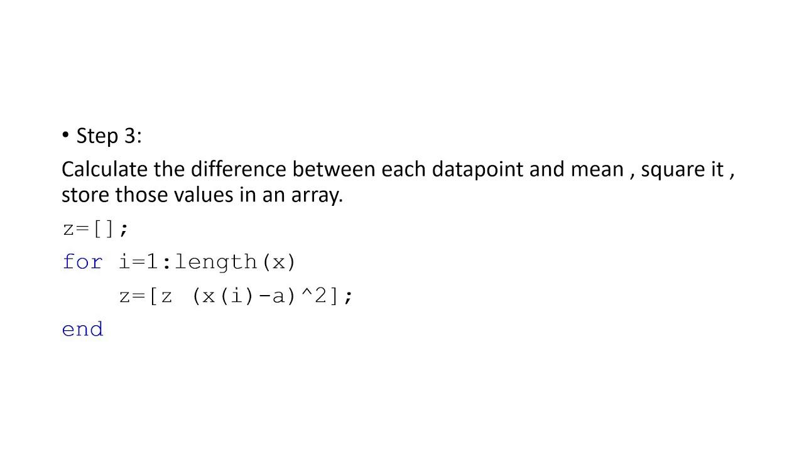

## Table of Contents

## What is standard error and why is it important?

Standard error is a measure of how much the sample mean of a data set is likely to differ from the true population mean. Imagine you're trying to guess the average height of all people in a city by measuring the height of a few people. The standard error tells you how accurate your guess might be. It's calculated by dividing the standard deviation of your sample by the square root of the sample size. The smaller the standard error, the more confident you can be that your sample mean is close to the actual population mean.

Understanding standard error is important because it helps us know how reliable our data is. When researchers or scientists conduct studies, they often work with samples rather than entire populations. By knowing the standard error, they can estimate how much their findings might vary if they were to repeat the study with different samples. This is crucial for making informed decisions and drawing accurate conclusions from data. In fields like medicine, economics, and social sciences, where decisions impact people's lives, having a good grasp of standard error can lead to better, more reliable outcomes.

## How do you calculate the standard error of the mean?

To calculate the standard error of the mean, you need to know the standard deviation of your sample and the size of your sample. First, find the standard deviation, which shows how spread out the numbers in your sample are. Then, take the standard deviation and divide it by the square root of the number of items in your sample. This gives you the standard error of the mean. For example, if your sample's standard deviation is 5 and you have 25 items in your sample, you would divide 5 by the square root of 25, which is 5. So, the standard error would be 5 divided by 5, which equals 1.

The standard error of the mean is important because it tells you how accurate your sample mean is likely to be compared to the true population mean. If the standard error is small, it means your sample mean is probably close to the actual population mean. If it's large, your sample mean might be quite different from the population mean. This helps researchers understand how much they can trust their results. For example, if you're trying to guess the average height of all adults in a city by measuring a few people, a small standard error means your guess is likely to be good, while a large standard error means your guess might be off.

## What MATLAB functions are commonly used to calculate standard error?

In MATLAB, you can calculate the standard error of the mean using a combination of built-in functions. The most common approach involves using the `std` function to calculate the standard deviation of your sample, and then dividing that by the square root of the sample size. You can get the sample size using the `length` function. For example, if your data is stored in a variable called `data`, you would use `std(data) / sqrt(length(data))` to calculate the standard error.

This method is straightforward and widely used because MATLAB's `std` function by default calculates the sample standard deviation, which is what you need for the standard error calculation. The `sqrt` function computes the square root, which is necessary to adjust the standard deviation based on the sample size. By combining these functions, you can easily compute the standard error and get a sense of how reliable your sample mean is as an estimate of the population mean.

## Can you provide a simple MATLAB script to calculate standard error for a given dataset?

Here's a simple MATLAB script to calculate the standard error for a given dataset. First, let's say you have your data stored in a variable called `data`. You can use the `std` function to find the standard deviation of your data. Then, you use the `length` function to find out how many items are in your data. After that, you divide the standard deviation by the square root of the number of items to get the standard error. Here's how you can do it in MATLAB:

```matlab
data = [1, 2, 3, 4, 5]; % This is just an example dataset
standardDeviation = std(data);
sampleSize = length(data);
standardError = standardDeviation / sqrt(sampleSize);
disp(['The standard error is: ', num2str(standardError)]);
```

This script first defines a sample dataset, then calculates the standard deviation using `std(data)`. It finds the sample size with `length(data)` and computes the standard error by dividing the standard deviation by the square root of the sample size. Finally, it displays the result. You can replace the example dataset with your own data to calculate the standard error for your specific case.

## How does sample size affect the standard error in MATLAB calculations?

The sample size plays a big role in how accurate your standard error is. In MATLAB, when you calculate the standard error, you divide the standard deviation of your sample by the square root of the sample size. So, if you have a bigger sample size, the denominator (the square root of the sample size) gets bigger too. This means the standard error becomes smaller. It's like having more pieces of a puzzle; the more pieces you have, the clearer the picture gets.

A smaller standard error is good because it means your sample mean is likely to be closer to the true population mean. For example, if you're trying to guess the average height of all people in a city, a larger sample size will give you a smaller standard error, making your guess more reliable. In MATLAB, you can see this effect by changing the sample size in your data and watching how the standard error changes. It's a simple way to understand how much you can trust your results based on how many data points you have.

## What are the differences between standard deviation and standard error in MATLAB?

Standard deviation and standard error are both used to measure how spread out data is, but they tell us different things. Standard deviation shows how much the numbers in your sample vary from the average of that sample. In MATLAB, you can find it using the `std` function. It helps you understand how spread out your data is. For example, if you measure the heights of a few people, the standard deviation tells you how much their heights differ from the average height of those people.

On the other hand, standard error tells you how much your sample's average might differ from the true average of the whole group you're studying. To calculate it in MATLAB, you take the standard deviation and divide it by the square root of how many items are in your sample. This gives you an idea of how accurate your sample average is. For instance, if you want to guess the average height of all people in a city, the standard error helps you know how close your guess might be to the real average height of everyone in the city.

## How can you calculate the standard error of the mean for multiple groups in MATLAB?

If you want to find the standard error of the mean for different groups in MATLAB, you can do it by organizing your data into groups and then calculating the standard error for each group separately. Let's say you have data from different classes in a school, and you want to know the standard error of the average test scores for each class. You would first split your data into groups based on the class. Then, for each group, you would use the `std` function to find the standard deviation of the test scores in that group. After that, you would divide the standard deviation by the square root of the number of students in that class to get the standard error for that group.

Here's how you can do it in MATLAB: You start by putting your data into a matrix or cell array where each row or cell represents a different group. Then, you can use a loop to go through each group. For each group, you calculate the standard deviation using `std` and the number of items in the group using `length`. You then divide the standard deviation by the square root of the length to get the standard error. By doing this for all groups, you end up with the standard error of the mean for each group, which helps you understand how reliable the average is for each group.

## What are some common mistakes to avoid when calculating standard error in MATLAB?

One common mistake when calculating standard error in MATLAB is forgetting to use the correct standard deviation. MATLAB's `std` function calculates the sample standard deviation by default, which is what you need for standard error. But if you accidentally use the population standard deviation or another type of standard deviation, your standard error will be wrong. Always make sure you're using the sample standard deviation when you divide it by the square root of the sample size.

Another mistake is not using the right sample size in your calculation. The standard error depends on the square root of the number of items in your sample. If you use the wrong number or forget to take the square root, your standard error won't be accurate. Always double-check that you're using the `length` function correctly to get the sample size and that you're taking the square root of it with the `sqrt` function.

## How can you visualize the standard error in MATLAB using error bars?

To show the standard error in MATLAB with error bars, you can use the `errorbar` function. This function lets you plot your data points and add lines that show how much the standard error is. You need to give the function your data's x-values, y-values, and the standard errors for each y-value. For example, if you're looking at test scores from different classes, the x-values could be the class numbers, the y-values could be the average scores, and the standard errors would show how much those averages might vary.

Once you have your data ready, you can use `errorbar` to make the plot. It will show each class's average score as a point on the graph, with lines sticking out to show the standard error. This helps you see at a glance how reliable each average is. If the error bars are short, it means the average is pretty accurate. If they're long, the average might not be as trustworthy. By looking at the error bars, you can quickly understand how much you can trust your data.

## How do you handle missing data when calculating standard error in MATLAB?

When you have missing data and want to calculate the standard error in MATLAB, it's important to deal with those missing values first. Missing data can mess up your calculations if you don't handle it right. One way to handle missing data is to remove it before you calculate the standard error. In MATLAB, you can use the `ismissing` function to find the missing values and the `rmmissing` function to get rid of them. After you've cleaned your data, you can go ahead and calculate the standard error using the `std` function for the standard deviation and dividing it by the square root of the number of items left in your sample.

Another way to handle missing data is to fill in the missing values with some kind of estimate, like the average of the other values in your data. This method is called imputation. In MATLAB, you can use the `fillmissing` function to do this. Once you've filled in the missing values, you can calculate the standard error just like you normally would. Both ways of handling missing data can give you different results, so it's good to think about which method makes the most sense for your data and what you're trying to find out.

## Can you explain how to calculate the standard error for non-normal distributions in MATLAB?

When you want to calculate the standard error for data that doesn't follow a normal distribution, you can still use the same basic formula in MATLAB, but you need to be careful. The standard error is usually calculated by dividing the standard deviation of your sample by the square root of the sample size. Even if your data isn't normal, you can use MATLAB's `std` function to find the standard deviation and then divide it by the square root of the number of items in your sample, which you get with the `length` function. But because your data isn't normal, this standard error might not tell you the whole story about how reliable your sample mean is.

For non-normal distributions, it's a good idea to look at other measures too, like the median or using bootstrapping methods. Bootstrapping is a way to estimate the standard error by creating lots of new samples from your original data and seeing how the sample mean changes. In MATLAB, you can use the `bootstrp` function to do this. It helps you get a better idea of how much your sample mean might vary if you took different samples from the same population. By using these extra methods, you can have a more complete picture of the reliability of your data, even when it's not normally distributed.

## What advanced techniques can be used to estimate standard error in MATLAB for complex statistical models?

When you're working with complex statistical models in MATLAB, one advanced technique to estimate standard error is through bootstrapping. Bootstrapping involves taking lots of new samples from your original data, with replacement, and then calculating the sample mean for each new sample. By doing this many times, you can see how much the sample mean changes and use that to estimate the standard error. In MATLAB, you can use the `bootstrp` function to do this. It's a good method because it doesn't assume your data follows a normal distribution, which is often the case with complex models.

Another technique is using Monte Carlo simulations. This method involves creating simulated data based on your model and then calculating the standard error from these simulations. You can use MATLAB's `mvnrnd` function to generate random samples from a multivariate normal distribution if your model assumes normality, or you can create your own simulation code for more complex models. Monte Carlo simulations help you understand how your model behaves under different conditions and give you a more robust estimate of the standard error. Both bootstrapping and Monte Carlo simulations are powerful tools in MATLAB that can handle the complexities of advanced statistical models and provide more accurate standard error estimates.

## What is the understanding of Standard Error in Statistics?

Standard error is a fundamental concept in statistics, representing the standard deviation of a statistic's sampling distribution. It is particularly important when considering the sample mean, as it provides a means to quantify the precision of this estimate relative to the true population mean. This accuracy is crucial in various applications, including algorithmic trading, where making statistically informed decisions can significantly impact financial outcomes.

The standard error of the mean (SEM) is calculated using the formula:

$$
\text{SEM} = \frac{\sigma}{\sqrt{n}}
$$

where $\sigma$ is the standard deviation of the sample, and $n$ is the sample size. This formula illustrates that the standard error decreases as the sample size increases, enhancing the precision of the sample mean as an estimator of the population mean.

In the context of trading models, standard error provides insights into the accuracy and reliability of statistical inference. It helps traders understand the potential variability in their estimates and forecasts, allowing for more precise risk management and decision-making. By quantifying how much a sample mean might typically differ from the true mean, traders can better assess the soundness of their strategies and make adjustments accordingly.

Overall, standard error serves as a critical measure that assists in evaluating the credibility of statistical outputs and hypotheses in [algorithmic trading](/wiki/algorithmic-trading). It is a tool that enables traders to judge the stability of their conclusions and refine their models for enhanced performance and reduced uncertainty.

## How do you calculate the standard error in MATLAB?

MATLAB provides an efficient mechanism to compute the standard error of a dataset through its built-in functions. The standard error is a measure of the variation or [dispersion](/wiki/dispersion-trading) of a sample mean in relation to the population mean and is useful for understanding the statistical reliability of the data.

To calculate the standard error in MATLAB, one can utilize the basic statistical functions it offers. The standard error of the mean (SEM) is calculated by taking the standard deviation of the sample (`std(data)`) and dividing it by the square root of the sample size. Mathematically, this can be expressed as:

$$
\text{Standard Error} = \frac{s}{\sqrt{n}}
$$

where $s$ represents the sample standard deviation, and $n$ is the sample size.

In MATLAB, you can implement this calculation with a concise code snippet. Assuming `data` is a vector containing the sample observations, the standard error can be computed as follows:

```matlab
stderror = std(data) / sqrt(length(data));
```

This code leverages MATLAB's `std` function, which calculates the standard deviation, and the `length` function, which determines the number of observations in the sample. By executing this calculation, traders and analysts can obtain an estimation of how much sample means deviate from the population mean, aiding in statistical validation and refinement of algorithmic trading strategies.

## References & Further Reading

[1]: ["Advances in Financial Machine Learning"](https://www.amazon.com/Advances-Financial-Machine-Learning-Marcos/dp/1119482089) by Marcos Lopez de Prado

[2]: ["Evidence-Based Technical Analysis: Applying the Scientific Method and Statistical Inference to Trading Signals"](https://www.amazon.com/Evidence-Based-Technical-Analysis-Scientific-Statistical/dp/0470008741) by David Aronson

[3]: ["Machine Learning for Algorithmic Trading"](https://github.com/stefan-jansen/machine-learning-for-trading) by Stefan Jansen

[4]: ["Quantitative Trading: How to Build Your Own Algorithmic Trading Business"](https://www.amazon.com/Quantitative-Trading-Build-Algorithmic-Business/dp/1119800064) by Ernest P. Chan

[5]: Bergstra, J., Bardenet, R., Bengio, Y., & Kégl, B. (2011). ["Algorithms for Hyper-Parameter Optimization."](https://dl.acm.org/doi/10.5555/2986459.2986743) Advances in Neural Information Processing Systems 24.