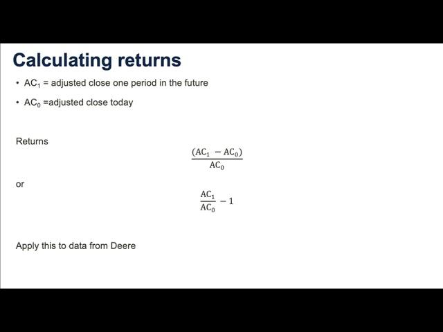

Understanding the nuances of stock prices is crucial for investors and traders in making informed decisions. A key aspect that often requires attention is the adjusted closing price. This metric provides a more accurate representation of a stock's historical performance by accounting for corporate actions such as dividends, stock splits, and other financial maneuvers. Unlike the raw closing price, the adjusted closing price reflects the actual value of a stock, factoring in the changes that might affect its price continuity.

Stock price adjustments are essential for maintaining the accuracy and reliability of market data, allowing investors and traders to make better comparisons over time. These adjustments ensure that a stock's past performance can be accurately assessed, facilitating sound investment and trading strategies. For example, when a dividend is issued, the stock price typically drops to reflect the payout to shareholders; similarly, stock splits alter the price and quantity of shares. By using the adjusted closing price, investors can evaluate the stock's performance without being misled by these corporate actions.



The importance of understanding adjusted closing prices extends into the domain of algorithmic trading, where precise data is fundamental for generating optimized algorithms. Algorithmic trading systems rely heavily on historical data to inform their strategies. Adjusted closing prices thus provide a refined dataset, which traders can leverage to enhance the accuracy of their models and the effectiveness of their trading decisions.

Furthermore, the integration of adjusted closing prices into stock price calculation algorithms is crucial. These algorithms enable the conversion of raw market data into actionable insights, capturing the true market value of a stock. By reflecting adjustments such as splits and dividends, these algorithms help traders make informed predictions and optimize their strategies for better financial outcomes.

## Table of Contents

## What is Stock Price Adjustment?

Stock price adjustment refers to modifications applied to a stock's market price to accurately reflect its true value following certain corporate actions. These adjustments are vital for maintaining the continuity and precision of stock prices, allowing investors and analysts to evaluate financial instruments more effectively. The necessity for stock price adjustments arises primarily from corporate events such as stock splits, dividends, and mergers, which can significantly impact a company's stock price.

A stock split is a corporate action where a company divides its existing shares into multiple shares, thereby reducing the price per share while maintaining the total market capitalization. For example, in a 2-for-1 stock split, each share is split into two, and the stock price is halved. Despite the change in share quantity and individual share price, the overall value of the investment remains constant. Adjustments ensure that the historical prices reflect this split, enabling accurate performance analysis over time.

Cash dividends also necessitate stock price adjustments. When a dividend is paid, the price of the stock typically drops by the amount of the dividend on the ex-dividend date. This drop occurs because the payout reduces the company's net assets. The adjusted closing price integrates this dividend impact to provide a clearer picture of the stock's performance. For instance, if a stock pays a $1 dividend, the price is adjusted to subtract this amount, reflecting a more accurate value movement.

Mergers and acquisitions can lead to more complex scenarios where adjustments are needed to account for the restructured equity valuations. When companies merge, the stock price adjustments help realign the historical data to reflect the impact of such corporate combination events on valuation.

Mathematically, stock price adjustment for dividends can be expressed as:

$$
\text{Adjusted Price} = \text{Previous Closing Price} \times \left(\frac{\text{Old Shares}}{\text{New Shares}}\right) - \text{Dividend}
$$

where:
- $\text{Previous Closing Price}$ is the stock's price before adjustment,
- $\text{Old Shares}/\text{New Shares}$ is the split ratio, if applicable,
- $\text{Dividend}$ is the per-share dividend amount.

Through these adjustments, stock markets ensure that all historical data presented for stocks correctly reflect corporate actions, thus preserving the continuity and comparability of stock price information over time. As a result, investors and traders can make more informed decisions based on an accurate understanding of a stock's historical performance.

## Understanding Adjusted Closing Price

The adjusted closing price of a stock is an essential metric that reflects the closing price accounting for various corporate actions such as dividends, stock splits, and rights offerings. It serves to provide a true depiction of a stock's value over a period, allowing for a more consistent and meaningful historical performance analysis.

When a company issues a dividend, the price of the stock typically decreases by the amount of the dividend declared. This reduction is not due to a loss in intrinsic value but rather an adjustment for the fact that cash has been distributed to shareholders. Therefore, the adjusted closing price is modified to reflect this corporate action by adding back the dividend amount to the closing price.

Stock splits generally occur when a company decides to divide its existing shares into multiple ones, which lowers the trading price of individual shares without affecting the company's overall market capitalization. For instance, in a 2-for-1 split, shareholders receive an additional share for each share held, while the price is halved. To maintain continuity in the stock's historical price data, its closing prices from before the split are adjusted down by the split [factor](/wiki/factor-investing). In Python, the adjusted closing price could be calculated as follows:

```python
def adjust_for_splits(closing_price, split_ratio):
    return closing_price / split_ratio

adjusted_price = adjust_for_splits(old_closing_price, split_ratio)
```

Investors and analysts rely on the adjusted closing price for [backtesting](/wiki/backtesting) investment strategies and computing key financial metrics over time. This reliability stems from the fact that it accounts for changes not due to typical market fluctuations but rather planned corporate actions. By utilizing adjusted closing prices, comparisons across different time frames and investment periods become more accurate, as these adjustments neutralize discrepancies caused by corporate actions.

Furthermore, relying on unadjusted historical prices can lead to misleading analyses of a stock’s past performance since they might erroneously show a decrease in value following dividends or splits. The adjusted closing price thus enhances analytical accuracy by presenting a coherent view of a stock’s trajectory that is necessary for evaluating trend patterns, [volatility](/wiki/volatility-trading-strategies), and growth rates.

In conclusion, the adjusted closing price is a fundamental tool for investors and traders who aim to adequately assess historical stock performance. It ensures that the impact of corporate actions is reflected in the stock price, thereby facilitating more informed and precise investment decisions.

## Stock Calculation and Its Importance

Effective stock calculation methods are crucial for assessing stock performance accurately. These calculations adjust stock prices for various corporate actions such as dividends, stock splits, and mergers to provide a true reflection of a stock's value. When adjustments are made, continuity in historical price data is maintained, which is vital for investors analyzing trends over time.

Accurate stock calculations are necessary for evaluating a stock's historical performance. This evaluation is significant because it can directly impact investment decisions and the valuation of investment portfolios. Adjustments ensure that investors are not misled by distorted price data, often affected by stock splits or dividend distributions. These adjustments make it possible to perform a precise valuation and maintain consistency in a stock's historical performance.

In the context of stock price trends, accurate calculations involve adjusting for corporate actions to maintain the integrity of the data series. For instance, during a stock split, the number of shares increases, and the price per share decreases proportionally. Adjustments in the calculations account for this change, allowing analysts to chart price trends without distortions.

To illustrate these concepts mathematically, consider a stock that undergoes a two-for-one split. If the pre-split closing price is $100, the post-split price should be adjusted to $50. A similar adjustment occurs for dividends. The formula for an adjusted closing price with respect to dividends and splits is:

$$
\text{Adjusted Price} = \frac{\text{Actual Closing Price} + \text{Dividends}}{\text{Split Ratio}}
$$

In Python, calculating adjusted closing prices might look like this:

```python
def calculate_adjusted_price(closing_price, dividend, split_ratio):
    adjusted_price = (closing_price + dividend) / split_ratio
    return adjusted_price

# Example usage
actual_closing_price = 100
dividend = 2
split_ratio = 2  # Two-for-one split
adjusted_price = calculate_adjusted_price(actual_closing_price, dividend, split_ratio)
print(f"The adjusted closing price is: {adjusted_price}")
```

Such calculations are not only fundamental to manual analysis but also form the backbone of [algorithmic trading](/wiki/algorithmic-trading) strategies, where precise historical data is key for backtesting and optimizing trading algorithms. Robust stock calculation methods ensure that both traders and investors can rely on historical data trends to make informed decisions.

## Algorithmic Trading and Stock Price Adjustments

Algorithmic trading is a method that employs computer algorithms to automate trading decisions, enabling rapid execution of trades based on pre-defined criteria. The integration of adjusted closing prices in these algorithms enhances the precision and effectiveness of trading strategies by providing a more accurate reflection of a stock's historical performance and market value.

The adjusted closing price accounts for corporate actions such as stock splits, dividends, and rights offerings, thus presenting a truer picture of a stock's price movements over time. By incorporating these adjustments, algorithmic trading systems can more reliably predict future price movements and make more informed buy or sell decisions.

For instance, when a stock undergoes a split, the number of outstanding shares increases, leading to a reduction in the stock price even though the company's market capitalization remains unchanged. Algorithms that utilize raw closing prices might misinterpret this price drop as a negative signal. However, if adjusted closing prices are used, the algorithm accurately recognizes the split-adjusted price, maintaining the continuity necessary for effective analysis.

In trading strategies where historical price trends and statistical patterns form the basis for predictive models, the adjusted closing price becomes especially crucial. Many quantitative models depend on historical price data to identify trends and calculate indicators such as moving averages. For example, a moving average defined as:

$$
\text{MA}(t) = \frac{1}{n} \sum_{i=0}^{n-1} P_{t-i}
$$

where $MA(t)$ represents the moving average at time $t$, $n$ is the number of periods, and $P_{t-i}$ is the price at a given previous time, benefits significantly when $P_{t-i}$ represents the adjusted closing price. This ensures that any historical corporate actions are factored into the calculations, providing a more valid assessment of price trends.

Algorithmic traders also use adjusted closing prices to calibrate and refine their models. Machine learning algorithms, which are increasingly common in trading strategies, rely heavily on large datasets for training. When these datasets contain adjusted closing prices, the algorithms can learn more accurately from historical data, leading to improved predictions and enhanced trading performance.

In conclusion, the use of adjusted closing prices in algorithmic trading represents a pivotal advancement, allowing for more sophisticated and precise trading models. By considering these adjusted values, traders can optimize their algorithms to better navigate the complexities of the market and execute more effective trading strategies.

## Algorithm for Adjusted Closing Price Calculation

To calculate the adjusted closing price, algorithms typically consider two key corporate actions: dividends and stock splits. These adjustments ensure that the calculated closing price accurately reflects a stock's historical performance by removing anomalies introduced by corporate actions. Here's a breakdown of the algorithmic approach for calculating adjusted closing prices:

### Steps in Adjusting for Dividends

1. **Identify Dividend Distributions**: Determine if any dividends were issued during the period under consideration. Dividends can impact the stock’s price, often leading to a drop in the stock's price equivalent to the dividend amount on the ex-dividend date.

2. **Adjustment Calculation**: For each dividend issued, adjust the closing prices of the stock prior to the ex-dividend date. The adjustment formula is:
$$
   \text{Adjusted Closing Price} = \text{Closing Price} - \text{Dividend Per Share}

$$

   This ensures that the dividend’s impact is reflected in the historical prices.

### Steps in Adjusting for Stock Splits

1. **Identify Stock Splits**: Determine any stock splits that occurred during the historical period. Stock splits affect the number of shares outstanding but do not change the company's actual capitalization.

2. **Calculate Split Factor**: The adjustment factor for a stock split is defined by the ratio of the new number of shares to the old number. For example, in a 2:1 split, the factor is 0.5 since each share is divided into two.

3. **Adjustment Application**: Apply the split factor to adjust all historical closing prices before the split date:
$$
   \text{Adjusted Closing Price} = \text{Closing Price} \times \text{Split Factor}

$$

### Example: Calculation Process

Let's go through an example to illustrate the algorithm's application:

- Suppose a stock closes at $100 on Day 1. On Day 2, it issues a $2 dividend and undergoes a 2:1 stock split.

- **Day 1 Adjustment for Dividend**: 
$$
  \text{Adjusted Price for Dividend} = 100 - 2 = 98

$$

- **Apply Stock Split Adjustment** Both Day 1 and Day 2 prices are adjusted:
$$
  \text{Adjusted Closing Price} = 98 \times 0.5 = 49

$$

On Day 2, the stock closes at $48 in the market, and this price is halved because of the stock split:

- **Day 2 Adjustment for Stock Split**:
$$
  \text{Adjusted Closing Price} = 48 \times 0.5 = 24

$$

By following these steps, investors and analysts can compute the adjusted closing price, providing a clearer understanding of a stock’s historical price movements. This method ensures that comparisons of stock performance over time remain consistent and unaffected by corporate actions.

## Practical Implications for Investors and Traders

Understanding stock price adjustments and the adjusted closing price is crucial for investors and traders seeking to make informed decisions. These elements not only ensure more accurate valuations of stocks but also enable investors to gauge the performance of their portfolios effectively. 

### Impact of Accurate Price Calculations on Portfolio Management

Accurate price calculations are vital for effective portfolio management. By adjusting prices for corporate actions such as dividends and stock splits, investors can achieve a more realistic view of a stock's performance over time. For instance, a stock that regularly pays dividends may appear to underperform when using non-adjusted prices. However, adjusted closing prices include these dividends, painting a more accurate picture of the investment's total return.

Inaccuracies in stock price calculations can lead to overestimation or underestimation of portfolio value, potentially skewing investment strategies and asset allocation decisions. Accurate adjusted closing prices allow investors to maintain a well-balanced portfolio that aligns with their financial goals and risk tolerance.

### Strategies for Integrating Understanding into Trading Practices

Investors and traders can integrate an understanding of stock price adjustments into both manual and automated trading practices through several strategies:

1. **Historical Analysis**: Utilizing adjusted closing prices in historical data analysis helps in identifying long-term trends and stock performance. This practice allows traders to establish better baselines and improve the accuracy of predictive models.

2. **Algorithmic Trading**: In automated trading, algorithms can incorporate adjusted closing prices to refine decision-making processes. By programming algorithms to account for price adjustments, traders can enhance the precision of trade execution and risk management strategies. For example, using Python, one might adjust prices as follows:

   ```python
   def adjust_prices(prices, dividends, splits):
       adjusted_prices = []
       for i, price in enumerate(prices):
           adjusted_price = price - dividends[i]  # Adjust for dividends
           if splits[i] != 0:
               adjusted_price /= splits[i]  # Adjust for stock splits
           adjusted_prices.append(adjusted_price)
       return adjusted_prices

   prices = [100, 105, 110]
   dividends = [2, 0, 0]
   splits = [0, 0, 2]  # Indicates a 2-for-1 split between periods 2 and 3
   print(adjust_prices(prices, dividends, splits))
   ```

3. **Risk Assessment and Management**: Adjusted closing prices provide a more authentic measure of volatility and risk, allowing traders to better assess potential risks involved in trading strategies. This understanding aids in refining risk management techniques and formulating strategies that are robust against market fluctuations.

4. **Benchmarking and Performance Evaluation**: By utilizing adjusted prices, investors and fund managers can benchmark performance against indices or peer groups more accurately. This ensures that investment strategies remain competitive and aligned with market conditions.

Incorporating these practices ensures that traders and investors base their decisions on data that more accurately reflects the market value and performance of stocks, ultimately leading to more robust and successful trading strategies. Adjusted closing prices, therefore, act as a cornerstone for informed investment decision-making and effective portfolio management.

## Conclusion

Stock price adjustments and the concept of adjusted closing prices play a fundamental role in modern financial analysis and trading strategies. These metrics ensure that historical stock data accurately reflects market realities by accounting for corporate actions like dividends, stock splits, and mergers. This accuracy is crucial for investors and traders aiming to assess past performance, set fair valuations, and make informed decisions.

The adjusted closing price is particularly beneficial in stock calculation and algorithmic trading. By integrating these adjustments, it provides a truer picture of a stock's performance over time, facilitating more precise technical analyses and predictions. This enhances the effectiveness of algorithms that rely on historical data to forecast future price movements and evaluate the risk-reward profile of trades.

For example, if a stock undergoes a two-for-one stock split, its price is effectively halved. Investors relying solely on raw data would misinterpret the price trend without understanding the split. Adjusted prices normalize such events, ensuring that calculations and trend analyses remain consistent.

Here’s a Python code snippet to illustrate how adjusted closing prices are computed considering a stock split:

```python
def adjust_for_split(closing_price, split_ratio):
    return closing_price * split_ratio

closing_price = 100  # original closing price
split_ratio = 0.5  # 2-for-1 stock split

adjusted_closing_price = adjust_for_split(closing_price, split_ratio)
print(f"Adjusted Closing Price: {adjusted_closing_price}")
```

Accurate stock price adjustments are essential for effective algorithmic trading, as they enable algorithms to execute trading strategies based on reliable data. Such strategies can optimize investment returns by leveraging precise and timely insights derived from adjusted price metrics.

Encouraging investors and traders to incorporate these considerations into their trading and investment decisions can significantly enhance the accuracy of their portfolio valuations and the efficacy of their trading strategies. This approach ensures a more robust foundation for navigating the complexities of financial markets, ultimately leading to optimization and potentially greater returns on investment.

## References & Further Reading

[1]: Hull, J. (2011). ["Options, Futures, and Other Derivatives"](https://www.semanticscholar.org/paper/Options%2C-Futures%2C-and-Other-Derivatives-Hull/89bdee500c8623864fc9eb7a471546aa713acc44). Pearson Education.

[2]: Bodie, Z., Kane, A., & Marcus, A.J. (2014). ["Investments"](https://www.mheducation.com/highered/product/Investments-Bodie.html). McGraw-Hill Education.

[3]: Graham, B., & Dodd, D. (2009). ["Security Analysis"](https://books.google.com/books/about/Security_Analysis.html?id=xW1EAAAAIAAJ). McGraw-Hill Education.

[4]: Pereiro, L.E. (2002). ["Valuation of Companies in Emerging Markets"](https://archive.org/details/valuationofcompa0000pere). Wiley Finance.

[5]: Damodaran, A. (2012). ["Investment Valuation: Tools and Techniques for Determining the Value of Any Asset"](https://books.google.com/books/about/Investment_Valuation.html?id=5SRHAAAAQBAJ). Wiley Finance.