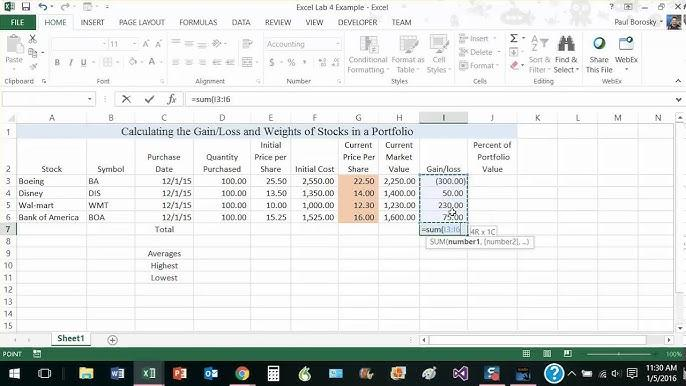

The world of stock trading is inherently complex, demanding a profound understanding of various elements critical to effective investment strategies. Among these, the calculation of gains and losses stands out as a fundamental concept that all investors must grasp. This calculation forms the bedrock upon which sound investment decisions are made, enabling traders to assess the profitability of their transactions.

The advent of algorithmic trading has introduced a new layer of complexity and opportunity to the stock market landscape. These computer-driven trading strategies have heightened the necessity for traders to accurately comprehend and calculate their gains and losses. Algorithmic trading, by leveraging advanced algorithms and high-speed data processing, facilitates trades executed at optimal prices, underscoring the importance of precise gain and loss computation.

To accurately calculate gains and losses, investors must possess a thorough understanding of several key financial components, including the cost basis, purchase and sale prices, and any related fees. The cost basis typically consists of the original purchasing price of the stock, adjusted for stock splits, dividends, and other factors, plus any associated transaction fees. Precise accounting of these variables is essential for an accurate assessment of the financial outcome of buying and selling stocks.

This article aims to provide investors with the necessary insights into both manual calculations and the use of automated tools. Through a detailed exploration of these methods, readers will gain valuable knowledge that aids in making effective stock trading decisions. Such expertise is indispensable in maximizing trading efficiency and optimizing returns in today's technologically advanced trading environment.

## Table of Contents

## Understanding Stock Gains and Losses

A gain or loss from selling stock is determined by the difference between the selling price and the cost basis. The cost basis refers to the original value of the stock, including the purchase price and any associated brokerage fees. Understanding this concept is crucial for accurately calculating stock gains and losses.

Gains on stocks can be either realized or unrealized, which affects their tax implications. Realized gains occur when an investor sells a stock for more than its cost basis, resulting in a taxable event. Unrealized gains, on the other hand, occur when the market value of a stock exceeds the cost basis, but the stock has not yet been sold. These gains are not subject to taxation until the stock is actually sold.

The duration of stock ownership influences the tax rate on realized gains. Short-term gains, arising from stocks held for less than one year, are taxed at ordinary income tax rates. In contrast, long-term gains, derived from stocks held for more than one year, receive more favorable tax treatment with lower tax rates. This distinction emphasizes the importance of strategic planning in stock trading to optimize tax efficiency.

For precise calculations, maintaining thorough documentation of stock transactions is essential. This includes trade execution forms and brokerage statements, which provide details of the purchase and sale transactions, including dates, prices, and fees. Proper documentation ensures that investors can accurately calculate their gains or losses and comply with tax obligations.

In mathematical terms, the formula for calculating the gain or loss from selling a stock can be expressed as:

$$
\text{Gain/Loss} = \text{Selling Price} - \text{Cost Basis}
$$

This simple formula aids investors in determining the financial outcome of their stock transactions. Keeping meticulous records and understanding the tax implications are key components of effective stock trading and investment management.

## Calculating Gains and Losses Manually

Manual calculation of gains and losses in stock trading requires a systematic approach, beginning with the determination of the cost basis. The cost basis is the original value of the stock, including the purchase price and any fees associated with the acquisition. These fees can encompass brokerage commissions, which are essential to consider for precise calculation.

To calculate gains, investors subtract the total cost basis from the total selling price. The formula is expressed as:

$$
\text{Gain} = \text{Selling Price} - \text{Cost Basis}
$$

The cost basis may need adjustments when considering dividends reinvested or stock splits. In the case of reinvested dividends, the additional shares purchased should be included in the cost basis. Similarly, stock splits alter the number of shares and per-share cost, necessitating revisions to the original cost basis.

Brokerage commission fees are another critical element in the calculation of stock gains and losses. These fees apply both at the purchase and selling stages. Therefore, to ascertain accurate gain or loss figures, it is crucial to incorporate these costs into the total selling price and cost basis.

For example:

- **Initial Purchase**: 100 shares at $50 each, with a $10 brokerage fee.
- **Reinvested Dividends**: 5 additional shares purchased at $55 each.
- **Stock Split**: 2-for-1 split occurs, resulting in a total of 210 shares.
- **Selling Transaction**: All shares sold at $60 each with a $15 commission.

Initially, the cost basis is calculated as:

$$
\text{Cost Basis} = (100 \times 50) + 10 = \$5,010
$$

Incorporating the reinvested dividends:

$$
\text{Additional Cost Basis} = 5 \times 55 = \$275
$$

Revising for the stock split, the new number of shares is 210, keeping the cost basis as follows:

$$
\text{Revised Cost Basis per Share} = \frac{5,285}{210}
$$

Finally, calculating the total selling price and resultant gain:

$$
\text{Total Selling Price} = (210 \times 60) - 15 = \$12,585
$$

The gain is:

$$
\text{Gain} = 12,585 - 5,285 = \$7,300
$$

By following these steps, traders can systematically ascertain the financial outcomes of their stock transactions. Such clarity aids in making informed decisions, taking into account all factors influencing the cost basis and resultant gains or losses.

## Algorithmic Trading and Its Impact on Calculations

Algorithmic trading, often referred to as algo-trading, utilizes computer algorithms to buy and sell securities efficiently. By executing trades based on pre-set criteria, these algorithms optimize trading strategies for speed, price, and [volume](/wiki/volume-trading-strategy).

One of the primary advantages of [algorithmic trading](/wiki/algorithmic-trading) is its ability to calculate potential profits and losses using historical data and predictive analytics. By analyzing vast datasets, algorithms can identify patterns and predict price movements with a level of precision that would be challenging for human traders. This is possible through various quantitative methods, such as statistical analysis and [machine learning](/wiki/machine-learning) models. For instance, algorithms might use time-series forecasting techniques to predict future price movements based on past trends.

The effectiveness of these algorithms lies in their strength, determined by the complexity and accuracy of the underlying models. A well-designed algorithm can significantly enhance the accuracy of gain and loss predictions, providing traders with actionable insights. This is crucial for making informed decisions and optimizing returns. For instance, machine learning models, such as regression analysis or neural networks, can be employed to refine these predictions.

However, despite their efficiency and sophistication, it is crucial to manually verify the outputs of algorithmic trades. Ensuring operational reliability and transparency is vital to prevent unforeseen errors that could lead to significant financial losses. Regular audits and [backtesting](/wiki/backtesting) are necessary to validate the performance of these algorithms under different market conditions.

In summary, algorithmic trading provides a powerful framework for achieving precision in stock trading calculations. By leveraging historical data, advanced predictive models, and continuous refinement, traders can potentially optimize their strategies and improve financial outcomes. Nonetheless, maintaining a balance between automated processes and human oversight is essential to ensure accuracy and reliability in trading operations.

## Automated Tools for Calculating Gains and Losses

Various online calculators have been designed to facilitate the computation of stock trading gains and losses, serving as invaluable tools for both novice and experienced investors. These automated tools enhance financial decision-making by eliminating common manual errors and delivering prompt, accurate results.

One primary advantage of these calculators is their ability to automate the data input process. Users simply need to input critical variables such as the number of shares, initial purchase prices, sale prices, and any trading commissions incurred. For instance, if 100 shares of a stock are purchased at $50 each, with a brokerage fee of $10, and later sold at $70 per share with a $10 commission, these amounts can be readily entered into the calculator to ascertain financial outcomes. This process significantly curtails the likelihood of miscalculation, which is especially beneficial when dealing with large volumes of transactions.

Most automated tools also incorporate features to evaluate the tax implications of trades, which provides a comprehensive understanding of the net profit or loss. For example, distinguishing between short-term and long-term capital gains is crucial for tax purposes, as they are taxed differently. Users can input the duration for which the stocks were held, and the calculator can apply the appropriate tax treatment, thus offering an accurate picture of the financial and tax landscape of their trades.

Several popular stock calculators exemplify these functionalities. Tools like TurboTax Investment Calculator and Tradervue provide user-friendly interfaces and a range of analytical features. They typically allow users to track various stock portfolios, compare different investment scenarios, and even integrate data from multiple brokerage accounts for a single overview. This functionality helps investors in making informed decisions and strategizing their market moves efficiently.

Incorporating automated tools in stock trading allows investors to focus more on refining their trading strategies rather than getting bogged down by intricate calculations. By leveraging technology to conduct meticulous calculations, investors can achieve a level of precision that significantly mitigates risk and enhances profitability in the competitive stock market landscape.

## Tax Implications on Stock Trade Profits

Understanding the tax implications of stock trade profits is essential for optimizing net gains from trading activities. Realized gains from selling stocks are subject to income tax, and the tax treatment varies significantly depending on whether these gains are classified as short-term or long-term. 

Short-term gains, accrued from stocks held for less than one year, are taxed at ordinary income tax rates. This means the profit is added to your regular income and taxed according to the applicable marginal tax rate, which could be as high as 37% for federal taxes in the United States depending on your income bracket. Conversely, long-term gains, from stocks held for more than one year, benefit from reduced tax rates. As of the most recent guidelines, these rates typically range from 0% to 20%, contingent on the taxpayer’s overall income level (Internal Revenue Service, 2023).

Failure to comply with tax regulations, such as accurately reporting stock trades on tax returns, can lead to serious penalties, including fines and interest on overdue taxes. As such, maintaining precise financial records, including purchase and sale documentation, is critical. This ensures that the correct cost basis is reported and the appropriate gain or loss is calculated for each trade.

Strategic liquidation of stocks can significantly impact the overall return on investment. For instance, tax-loss harvesting involves selling underperforming stocks at a loss to offset taxable gains, thus reducing the tax liability. Additionally, holding onto a stock to transition a short-term gain into a long-term gain can result in substantial tax savings, provided market conditions allow for such a strategy without risking significant loss.

Professional tax advice is often invaluable in navigating the complexities of stock trade taxation. A competent tax advisor can provide tailored strategies to ensure compliance with both federal and state tax laws while maximizing after-tax profits. They can also offer insights into the timing of trades and the use of tax-advantaged accounts to shelter investment gains from taxation. This expert guidance can be pivotal in not only adhering to tax obligations but also enhancing the overall efficiency and profitability of investment strategies. 

In conclusion, understanding the intricacies of tax implications on stock trade profits can potentially improve investment returns and avoid unnecessary penalties. Investment and tax planning should be integrated to achieve optimal financial outcomes, and leveraging both technology and professional advice can significantly enhance this process.

## Conclusion

Accurately calculating stock gains and losses is essential for informed trading decisions. Investors can choose between manual methods and automated tools to analyze the financial outcomes of their stock trades effectively. Manual calculations involve determining the cost basis, net of any fees, and subtracting it from the selling price to determine potential gains or losses. This traditional approach, while time-consuming, allows for precise adjustments based on dividends or stock splits.

Automated tools, such as online calculators and software applications, provide a faster alternative by automating data input and processing. These tools minimize human error and offer immediate insights. With the advent of algorithmic trading, investors can leverage algorithms to execute trades and forecast gains or losses with high accuracy using historical data and predictive analytics. However, verifying these automated results remains critical to ensure reliability and transparency.

In addition to calculation strategies, understanding the tax implications of trading activities is vital. Tax treatment varies, with short-term gains taxed at ordinary income rates and long-term gains enjoying potential tax advantages. Staying informed of these implications can help optimize net profits and ensure compliance with tax regulations, reducing the risk of penalties.

Ultimately, the successful trading of stocks involves the prudent use of technology, such as algorithmic trading and automated tools, combined with human expertise and strategic tax planning. By integrating these elements, investors can make informed decisions, enhancing their ability to capitalize on market opportunities and maximize their investment returns.

## Resources and Tools

For investors and traders seeking to enhance their financial acumen and streamline their trading activities, a variety of resources and tools are available. These tools can significantly aid in the calculation of gains and losses, enhance algorithmic trading strategies, and assist in comprehensive portfolio management. Here is a guide to valuable resources and tools:

**Online Stock Calculators and Financial Planning Resources**

1. **CalcXML**: This online tool offers multiple calculators, including stock yield and ROI calculators, allowing traders to quickly estimate gains or losses. [CalcXML Stock Calculator](https://www.calcxml.com)

2. **Yahoo Finance Investment Calculator**: Provides an easy-to-use interface for calculating the potential return on stock investments over time while considering dividends. [Yahoo Finance Investment Calculator](https://www.finance.yahoo.com/calculator)

3. **MarketWatch Investment Calculator**: Offers tools to calculate the future value of investments, incorporating variable interest rates and compounding periods. [MarketWatch Calculator](https://www.marketwatch.com/tools/investment-calculator)

**Books and Articles on Algorithmic Trading and Financial Analysis**

1. **"Algorithmic Trading: Winning Strategies and Their Rationale" by Ernest P. Chan** - A comprehensive guide for traders interested in developing robust algorithmic trading strategies.

2. **"Advances in Financial Machine Learning" by Marcos López de Prado** - Focuses on the application of machine learning in finance, providing insights into investment strategies powered by cutting-edge data analytics.

**Software Tools for Portfolio Management**

1. **MetaTrader 4/5**: A popular platform among traders for algorithmic trading, providing advanced charting functions and automated trading capabilities through Expert Advisors (EAs).

2. **TradeStation**: Known for its powerful trading analysis tools and the ability to automate custom trading strategies, ideal for professional traders.

3. **Morningstar Portfolio Manager**: Assists investors in detailed tracking of their portfolios, providing insights and analytics on performance and risk management.

**Contacts for Professional Tax Advisors and Financial Consultants**

1. **Garrett Tax Advisors**: Specializing in capital gains tax planning and stock transaction guidance. [Garrett Tax Advisors](https://www.garretttax.com)

2. **EY Global Financial Advisers**: Offer comprehensive services for financial planning and tax optimization, particularly for investors engaged in frequent trading. [EY Financial Services](https://www.ey.com/en_gl/tax)

**Further Reading Materials on Investment Strategies and Market Analysis**

1. **"The Intelligent Investor" by Benjamin Graham** - A seminal book on value investing, guiding investors on making decisions for long-term benefits.

2. **"A Random Walk Down Wall Street" by Burton G. Malkiel** - Offers insights into various investment strategies, supporting the case for passive investing as a means to achieve financial goals.

These resources and tools serve to enhance the trader's knowledge and efficiency, supporting better decision-making and strategic planning in stock trading activities.

## References & Further Reading

[1]: ["Algorithmic Trading: Winning Strategies and Their Rationale"](https://books.google.com/books/about/Algorithmic_Trading.html?id=WAlFDwAAQBAJ) by Ernest P. Chan

[2]: ["Advances in Financial Machine Learning"](https://www.amazon.com/Advances-Financial-Machine-Learning-Marcos/dp/1119482089) by Marcos López de Prado

[3]: ["The Intelligent Investor"](https://www.amazon.com/Intelligent-Investor-3rd-Ed/dp/0063356724) by Benjamin Graham

[4]: ["A Random Walk Down Wall Street"](https://www.amazon.com/Random-Walk-Down-Wall-Street/dp/0393358380) by Burton G. Malkiel

[5]: ["Quantitative Trading: How to Build Your Own Algorithmic Trading Business"](https://www.amazon.com/Quantitative-Trading-Build-Algorithmic-Business/dp/1119800064) by Ernest P. Chan

[6]: ["Evidence-Based Technical Analysis: Applying the Scientific Method and Statistical Inference to Trading Signals"](https://onlinelibrary.wiley.com/doi/book/10.1002/9781118268315) by David Aronson

[7]: ["Machine Learning for Algorithmic Trading"](https://github.com/stefan-jansen/machine-learning-for-trading) by Stefan Jansen