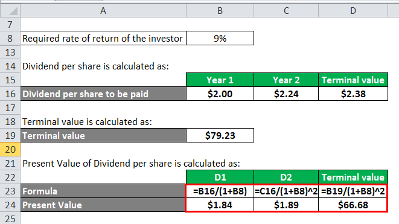

## Table of Contents

## What is the Gordon Growth Model and how is it used to calculate stock value?

The Gordon Growth Model is a way to figure out what a stock might be worth. It's based on the idea that the dividends a company pays out to its shareholders will keep growing at a steady rate forever. This model is especially useful for companies that are stable and not expected to change much in the future. The main formula for the Gordon Growth Model is: Stock Value = Next Year's Dividend / (Discount Rate - Dividend Growth Rate). Here, the "Discount Rate" is the rate of return investors want, and the "Dividend Growth Rate" is how fast the dividends are expected to grow.

To use the Gordon Growth Model, you need to know or estimate three things: next year's dividend, the discount rate, and the dividend growth rate. Let's say a company is expected to pay a dividend of $2 next year, investors want a 10% return, and the dividends are expected to grow by 5% each year. Plugging these numbers into the formula, you get: Stock Value = $2 / (0.10 - 0.05) = $2 / 0.05 = $40. This means, according to the Gordon Growth Model, the stock should be worth about $40 per share. It's a simple tool, but it's important to remember that it relies on the assumptions about future dividends and growth rates being accurate.

## What are the key components required to use the Gordon Growth Model in Excel?

To use the Gordon Growth Model in Excel, you need to set up a few key pieces of information. First, you need to know or estimate the next year's dividend for the company. This is the amount of money the company is expected to pay out to shareholders next year. You'll enter this number into a cell in your Excel spreadsheet. Next, you need the discount rate, which is the rate of return investors want from the stock. This could be based on the risk of the investment or other factors, and you'll put this number in another cell. Lastly, you need the dividend growth rate, which is how fast you expect the dividends to grow each year. This number goes into a third cell.

Once you have these three pieces of information in your Excel spreadsheet, you can use a formula to calculate the stock's value. The formula for the Gordon Growth Model is: Stock Value = Next Year's Dividend / (Discount Rate - Dividend Growth Rate). In Excel, you can write this formula using the cell references where you entered your numbers. For example, if next year's dividend is in cell A1, the discount rate is in cell B1, and the dividend growth rate is in cell C1, your formula in another cell would look like this: =A1/(B1-C1). This will give you the estimated value of the stock according to the Gordon Growth Model. Remember, the accuracy of this calculation depends on how well you've estimated the inputs.

## How do you set up the Gordon Growth Model formula in an Excel spreadsheet?

To set up the Gordon Growth Model in an Excel spreadsheet, first, you need to enter the three key pieces of information you need for the model. In one cell, like A1, enter the next year's expected dividend for the company. In another cell, like B1, enter the discount rate, which is the return investors want from the stock. Then, in a third cell, like C1, enter the dividend growth rate, which is how fast you expect the dividends to grow each year.

Once you have these numbers in your spreadsheet, you can use a formula to calculate the stock's value. The formula for the Gordon Growth Model is: Stock Value = Next Year's Dividend / (Discount Rate - Dividend Growth Rate). In Excel, you can write this formula in another cell, like D1, using the cell references where you entered your numbers. So, your formula in cell D1 would be =A1/(B1-C1). This will give you the estimated value of the stock according to the Gordon Growth Model. Just make sure your estimates for the inputs are as accurate as possible to get a good result.

## What is the dividend discount model and how does it relate to the Gordon Growth Model?

The dividend discount model (DDM) is a way to figure out how much a stock is worth. It looks at the future dividends a company will pay out and adds them up to find the stock's value. The idea is that the value of a stock is the total of all the future dividends it will pay, but since money in the future is worth less than money now, these future dividends are "discounted" back to today's value. The DDM is useful for companies that pay regular dividends and are expected to keep doing so in the future.

The Gordon Growth Model is a special version of the dividend discount model. It assumes that dividends will grow at a steady rate forever. This makes the math simpler because you only need to know three things: next year's dividend, the discount rate, and the dividend growth rate. The Gordon Growth Model is often used for stable companies where the dividends are expected to grow slowly but steadily. So, while the DDM looks at all future dividends in any pattern, the Gordon Growth Model simplifies this by assuming a constant growth rate, making it easier to use but also more specific in its assumptions.

## How do you estimate the dividend growth rate for use in the Gordon Growth Model?

To estimate the dividend growth rate for the Gordon Growth Model, you can look at how fast the company's dividends have grown in the past. You can find this information in the company's financial reports or on financial websites. Take the dividends from a few years back and see how much they've gone up each year. This average increase can give you a good guess for the future growth rate. But remember, past growth doesn't always mean the same growth will happen in the future, so you might want to think about what's happening in the company and the economy too.

Another way to estimate the dividend growth rate is by looking at what the company says about its future plans. Sometimes, companies give out forecasts or guidance about their expected earnings and dividends. If a company says it plans to increase dividends by a certain percentage each year, you can use that number. Also, you can look at what experts and analysts are saying about the company's future. They might have their own predictions about how fast the company's dividends will grow. Combining all these different pieces of information can help you come up with a reasonable estimate for the dividend growth rate to use in the Gordon Growth Model.

## What is the required rate of return and how do you determine it for the Gordon Growth Model?

The required rate of return is the amount of money investors want to earn from a stock. It's like the minimum return they need to feel okay about investing their money. This rate depends on how risky the stock is. If a stock is very risky, investors might want a higher return to make up for the risk. The required rate of return is important for the Gordon Growth Model because it's used to figure out what the stock is worth.

To determine the required rate of return for the Gordon Growth Model, you can use something called the Capital Asset Pricing Model (CAPM). The CAPM helps you figure out the return investors should expect based on how risky the stock is compared to the whole market. You need to know three things: the risk-free rate, which is like the return you get from super safe investments like government bonds; the market risk premium, which is how much more return you expect from the whole market compared to safe investments; and the stock's beta, which tells you how much the stock's price moves compared to the market. Once you have these, you can calculate the required rate of return. If you can't use CAPM, you might also look at what similar stocks are offering as returns or ask investors directly what return they expect.

## How can you use historical data to input values into the Gordon Growth Model in Excel?

To use historical data to input values into the Gordon Growth Model in Excel, first gather the company's past dividend payments. You can find this information in the company's financial reports or on financial websites. Look at the dividends paid over the last few years and calculate the average annual growth rate. For example, if dividends were $1 last year and $1.05 this year, the growth rate is 5%. Enter this average growth rate into a cell in Excel, like cell C1, as the dividend growth rate.

Next, estimate next year's dividend. You can do this by taking the most recent dividend and multiplying it by one plus the growth rate you calculated. If the most recent dividend was $1.05 and the growth rate is 5%, next year's dividend would be $1.05 * 1.05 = $1.1025. Enter this number into another cell, like cell A1. For the required rate of return, you might use the Capital Asset Pricing Model or look at similar stocks to estimate a fair return, say 10%. Enter this into a cell, like B1. Then, use the Gordon Growth Model formula in another cell, like D1, with the formula =A1/(B1-C1). This will give you the stock's estimated value based on historical data.

## What are common pitfalls to avoid when applying the Gordon Growth Model in Excel?

When using the Gordon Growth Model in Excel, one common pitfall is using unrealistic numbers. If you put in a dividend growth rate that's too high or a discount rate that's too low, the model might say the stock is worth much more than it really is. It's important to use numbers that make sense based on what the company has done in the past and what's happening in the economy. Also, make sure the growth rate is less than the discount rate. If it's not, the formula won't work because you'll be dividing by zero or a negative number.

Another thing to watch out for is not updating your numbers. If you use old data or don't change your estimates when things change, your results won't be accurate. It's a good idea to check your numbers regularly and make sure they still make sense. Also, remember that the Gordon Growth Model works best for companies that don't change much and have steady growth. If a company's dividends jump around a lot or it's going through big changes, this model might not give you a good estimate of the stock's value.

## How do you interpret the results of the Gordon Growth Model calculation in Excel?

When you use the Gordon Growth Model in Excel and get a number, that number is what the model thinks the stock is worth right now. It's based on the idea that the stock's value comes from all the future dividends the company will pay out, but those dividends are discounted to today's value. If the number you get is higher than what the stock is currently selling for, the model is saying the stock might be a good buy because it's undervalued. On the other hand, if the number is lower than the stock's current price, the model thinks the stock might be overvalued, and you might want to think twice before buying it.

But remember, the Gordon Growth Model is just a tool, and its results depend a lot on the numbers you put in. If your guesses for next year's dividend, the discount rate, or the dividend growth rate are off, the model's result will be off too. So, it's important to use numbers that make sense and to keep checking them to make sure they're still good. Also, this model works best for companies that don't change much and have steady growth, so if the company you're looking at is different, the model might not give you a good answer.

## What are the limitations of the Gordon Growth Model when calculating stock value?

The Gordon Growth Model is a simple way to figure out what a stock might be worth, but it has some big limits. One big problem is that it assumes dividends will grow at the same rate forever. This is not very realistic because companies and the economy change a lot. If you guess the growth rate wrong, the model's answer will be way off. Also, the model needs the growth rate to be less than the discount rate. If it's not, the formula won't work because you'll be dividing by zero or a negative number.

Another limit is that the Gordon Growth Model works best for companies that don't change much and have steady growth. If a company is going through big changes or its dividends jump around a lot, this model won't give you a good guess about the stock's value. It's also hard to pick the right discount rate because it depends on how risky the stock is and what investors want. If you get this number wrong, the model's result will be wrong too. So, while the Gordon Growth Model can be a helpful tool, it's important to know its limits and not rely on it too much.

## How can you adjust the Gordon Growth Model for different scenarios in Excel?

To adjust the Gordon Growth Model for different scenarios in Excel, you can change the numbers you put into the model. For example, if you think the company might do better or worse in the future, you can change the dividend growth rate. If you put a higher number for the growth rate, the model will say the stock is worth more. If you put a lower number, it will say the stock is worth less. You can also change the discount rate. If you think the stock is riskier, you might use a higher discount rate, which will make the stock's value go down. If you think it's less risky, you can use a lower discount rate, which will make the value go up.

Another way to adjust the model is by changing next year's dividend. If the company says it will pay more or less next year, you can change this number in the model. This will change the stock's value too. You can also use Excel's "What-If Analysis" tool to see how different numbers affect the stock's value. This tool lets you change the numbers and see how the result changes without having to type in new numbers every time. By playing around with these different numbers, you can see how the stock's value might change in different situations.

## How can you compare the results of the Gordon Growth Model with other valuation methods in Excel?

To compare the results of the Gordon Growth Model with other valuation methods in Excel, you can set up different sections of your spreadsheet for each method. For example, you might have one section for the Gordon Growth Model, another for the Discounted Cash Flow (DCF) Model, and another for the Price/Earnings (P/E) Ratio method. In each section, you'll calculate the stock's value using the specific formulas for that method. Once you have the values, you can put them side by side in a summary table to see how they compare. This helps you see if the Gordon Growth Model's estimate is higher, lower, or about the same as the other methods.

Each valuation method has its own way of looking at a company's value, so they might give different results. The Gordon Growth Model focuses on dividends and assumes they grow at a steady rate forever. The DCF Model looks at all future cash flows, not just dividends, and can handle more complicated growth patterns. The P/E Ratio method compares the stock's price to its earnings per share and is often used to see how a stock's value stacks up against others in the same industry. By comparing these different methods in Excel, you can get a fuller picture of what the stock might be worth and understand why the numbers might be different.

## What is the Gordon Growth Model and how can it be understood?

The Gordon Growth Model (GGM), also known as the Dividend Discount Model (DDM), is a fundamental technique used to determine the intrinsic value of a stock based on the theory that a stock's value is the present value of its future dividends. It assumes that a company will continue to pay and grow its dividends at a constant rate indefinitely, providing a simple and efficient method for valuing equity securities.

### Key Components

1. **Dividends (D1):** The model primarily focuses on the expected future dividends that a company will pay. Dividends are considered a direct benefit to shareholders and a critical indicator of company value.

2. **Growth Rate (g):** This is the constant rate at which dividends are expected to grow over time. It is crucial in forecasting future dividends and should reflect a realistic growth expectation based on historical data and market conditions.

3. **Required Rate of Return (r):** The rate represents the investor's expected return on investment, accounting for risk. It serves as the discount rate in the model, anchoring the future dividend stream to present value terms.

The formula for the Gordon Growth Model is expressed as:

$$
P_0 = \frac{D_1}{r - g}
$$

Where $P_0$ is the present value of the stock, $D_1$ is the expected dividend in one year, $r$ is the required rate of return, and $g$ is the growth rate.

### Advantages of the Gordon Growth Model

The GGM offers several analytical advantages:
- **Simplicity:** Its straightforward approach makes it an easily calculable method, beneficial for quick assessments.
- **Focus on Dividends:** By emphasizing dividends, the model prioritizes actual cash flows to shareholders, which is an attractive measure of value for dividend-paying stocks.
- **Long-Term Perspective:** The model is particularly advantageous for evaluating companies with stable dividend policies, offering long-term growth predictions.

### Limitations and Applicability

Despite its utility, the Gordon Growth Model has limitations that may restrict its applicability:
- **Constant Growth Assumption:** Assuming constant dividend growth may not reflect reality for companies experiencing fluctuating income or economic conditions.
- **Restricted to Dividend-Paying Stocks:** Companies that do not pay dividends cannot be evaluated using this model.
- **Sensitivity to Inputs:** The model is highly sensitive to changes in the growth rate and required rate of return, which makes accurate estimations critical for reliable outputs.

The usefulness of the GGM is maximized when applied to well-established companies with predictable dividend growth patterns. In scenarios where dividend policies are inconsistent or companies exhibit rapid and variable growth, alternative valuation methods may be more appropriate.

## How can you implement the Gordon Growth Model in Excel?

To effectively implement the Gordon Growth Model (GGM) in Excel, one must follow a structured approach that incorporates relevant formulas and functions to accurately calculate stock valuation. The process can be broken down into steps that facilitate ease of understanding and ensure the precision of the model's computations.

### Step-by-Step Guide to Setting Up an Excel Spreadsheet for the Gordon Growth Model

1. **Prepare the Input Data**: Begin by setting up an Excel spreadsheet with the necessary input data. Include the following parameters:
   - **Current Dividend (D₀)**: The dividend payout expected at the end of the current period.
   - **Growth Rate (g)**: The expected constant growth rate of the dividends.
   - **Required Rate of Return (r)**: The investor's required rate of return.

2. **Input Data Configuration**: Arrange these variables in the Excel sheet in clearly labeled cells. For example:
   - Cell B1: "Current Dividend (D₀)"
   - Cell B2: "Growth Rate (g)"
   - Cell B3: "Required Rate of Return (r)"

3. **Enter Input Data**: Directly below these labels, input the specific values for your analysis:
   - Current Dividend (e.g., $5)
   - Growth Rate (e.g., 4% or 0.04)
   - Required Rate of Return (e.g., 9% or 0.09)

4. **Formulas for Calculating Stock Valuation**: The Gordon Growth Model formula is:
$$
   \text{Intrinsic Value of Stock (P)} = \frac{D₀ \times (1 + g)}{r - g}

$$
   To implement this in Excel:
   - Enter the formula in a new cell (e.g., cell B4), referencing the cells with input data:
   ```excel
   =B1 * (1 + B2) / (B3 - B2)
   ```

5. **Visualizing Data in Excel**:
   - **Tables**: Organize the input data and corresponding stock valuation in a structured table to enhance clarity.
   - **Charts**: Use Excel’s charting tools to create visual representations such as line or bar charts. This can help demonstrate the relationship between the growth rate, dividends, and the intrinsic stock value over time.

6. **Verifying the Accuracy of Calculations**:
   - Double-check input values and ensure that the growth rate (g) is less than the required rate of return (r) to avoid division errors.
   - Utilize Excel’s “Error Checking” feature to identify and rectify any potential formula errors.

7. **Example Verification**:
   - Assume a dividend (D₀) of $5, a growth rate (g) of 4%, and a required rate of return (r) of 9%.
   - The resulting intrinsic value calculation should look like this:
     - Input in cell B1: 5
     - Input in cell B2: 0.04
     - Input in cell B3: 0.09
     - Formula output in cell B4: $(5 \times 1.04) / (0.09 - 0.04) = \$104$.

By following these steps, Excel can be leveraged to effectively calculate and visualize stock valuations using the Gordon Growth Model. This setup not only aids in manual verification efforts but also provides a systematic framework for integrating the GGM into [algorithmic trading](/wiki/algorithmic-trading) strategies.

## How can the Gordon Growth Model be integrated with algorithmic trading?

Algorithmic trading, commonly referred to as algo trading, involves using computer algorithms to execute trading strategies at high speed and with precision, which is not possible through manual trading. It leverages advanced mathematical models and technological solutions to make trading decisions, manage portfolios, and minimize the impact of human emotions on trades. Key advantages for investors include enhanced efficiency, the ability to process and analyze large datasets in real-time, and the execution of trades at the most optimal prices, often leading to reduced transaction costs and improved market [liquidity](/wiki/liquidity-risk-premium).

To integrate the Gordon Growth Model into an algorithmic trading strategy, traders must first automate the model's calculations, which revolve around the present value of future expected dividends, assuming a constant growth rate. The Gordon Growth Model (GGM), represented by the formula:

$$
P = \frac{D_1}{r - g}
$$

where $P$ is the stock price, $D_1$ is the expected dividend in the next period, $r$ is the required rate of return, and $g$ is the growth rate, serves as a basis for assessing the intrinsic value of a stock. In algo trading, the model is used to evaluate trading signals and identify mispriced stocks that algorithmic strategies can exploit for potential profit.

Python serves as an ideal tool due to its simplicity and extensive financial libraries like NumPy and pandas. Below is an example of how the GGM might be implemented in a basic trading algorithm using Python:

```python
# Python code for calculating stock price using the Gordon Growth Model
def gordon_growth_model(d1, required_return, growth_rate):
    # Calculate the stock price using the GGM formula
    price = d1 / (required_return - growth_rate)
    return price

# Example parameters
expected_dividend = 2.0  # Expected dividend
required_rate_of_return = 0.08  # 8% required rate of return
growth_rate = 0.04  # 4% constant growth rate

# Calculate stock price
stock_price = gordon_growth_model(expected_dividend, required_rate_of_return, growth_rate)
print(f"The calculated stock price is: ${stock_price:.2f}")

# Example trading decision based on calculated stock price
market_price = 40.0  # Current market price of the stock
if stock_price > market_price:
    print("Buy the stock")
else:
    print("Do not buy the stock")
```

Choosing the right trading platform that supports Excel integration is crucial for implementing GGM within algorithmic strategies. Platforms like MetaTrader 5, NinjaTrader, and TradeStation offer extensive Excel support and APIs that simplify data exchange and strategy execution.

Basic algorithms leveraging the GGM can involve [pair trading](/wiki/pair-trading) strategies where dividends of two correlated stocks are compared to identify trading opportunities, or strategies that dynamically adjust portfolio weights based on the calculated intrinsic values relative to market prices. These strategies often continuously monitor the stock market for valuation discrepancies, executing trades based on predefined rules triggered by the Gordon Growth Model's assessments. 

Overall, the integration of GGM into algo trading can greatly enhance decision-making processes by providing a mathematically grounded approach to stock valuation while leveraging the speed and efficiency of automated systems.

## References & Further Reading

[1]: ["The Theory of Investment Value"](https://archive.org/details/in.ernet.dli.2015.225177) by John Burr Williams, 1938. This book introduces the concept of discounted cash flow which is fundamental to models like the Gordon Growth Model.

[2]: Gordon, M. J., & Shapiro, E. (1956). ["Capital Equipment Analysis: The Required Rate of Profit."](https://www.jstor.org/stable/2627177) Management Science, 3(1), 102-110. This paper introduces the Gordon Growth Model.

[3]: ["Financial Modeling"](https://en.wikipedia.org/wiki/Financial_modeling) by Simon Benninga. This book provides comprehensive tutorials on implementing financial models including dividend discount models in Excel.

[4]: ["Algorithmic Trading: Winning Strategies and Their Rationale"](https://onlinelibrary.wiley.com/doi/pdf/10.1002/9781118676998.fmatter) by Ernie Chan. This book explores the basics of algorithmic trading strategies.

[5]: Bodie, Z., Kane, A., & Marcus, A. J. (2018). ["Investments, 11th Edition"](https://www.mheducation.com/highered/product/Investments-Bodie.html) by Zvi Bodie, Alex Kane, and Alan J. Marcus. This textbook is fundamental for understanding security valuation models used in finance.