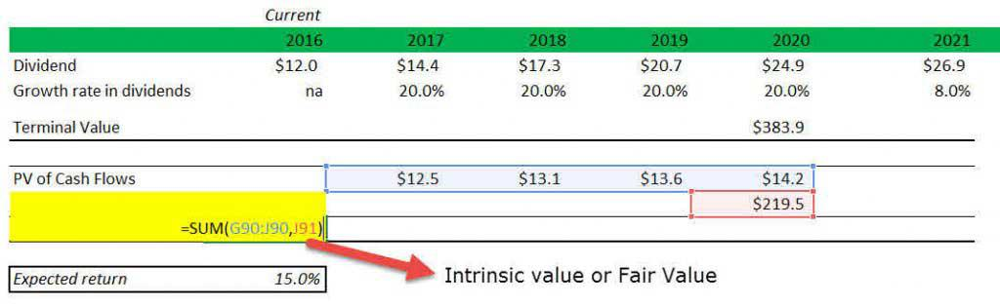

Stock valuation is a fundamental concept in the domain of trading, serving as a critical tool for determining the intrinsic value of a company's stock. By assessing whether a stock is undervalued or overvalued, traders and investors can make informed decisions about buying, selling, or holding securities. Central to stock valuation is the effort to forecast the future performance of a stock to achieve favorable returns. Valuation methods incorporate various financial metrics and models, each with its unique approach to assessing value based on a company's financial health, industry position, and economic conditions.

One notable model employed in stock valuation is the Gordon Growth Model (GGM), a dividend discount model that provides a framework for valuing a company's stock price based on its dividends. The GGM assumes that a company will maintain a steady growth rate in its dividend payments, making it particularly useful for valuing stable, dividend-paying firms. The model calculates the present value of an infinite series of future dividends, which are expected to grow at a constant rate, utilizing the formula:  



$$

P = \frac{D_1}{r - g} 
$$

where $P$ represents the stock's price, $D_1$ is the expected dividend in the next period, $r$ is the required rate of return, and $g$ is the growth rate of the dividends. Despite its simplicity, the GGM holds significant importance in stock analysis due to its ability to provide a straightforward valuation based on future prospects and investor expectations. However, the model's utility is bounded by its assumptions, which can impact its applicability to all market conditions or company types. 

In recent years, algorithmic trading has seen a substantial rise in prominence within financial markets. This approach involves the use of computerized systems to execute trading strategies based on algorithms, allowing for rapid and high-frequency trading. The introduction of algorithmic trading has revolutionized the trading landscape, providing significant advantages such as increased speed, reduced transaction costs, and the ability to process large volumes of data efficiently. By integrating advanced mathematical models and data analytics, algorithmic trading enhances the capacity for executing strategic trades and capturing market opportunities that are imperceptible in manual trading.

The purpose of this article is to explore the integration of the Gordon Growth Model into Excel for developing algorithmic trading strategies. This approach combines the theoretical foundations of stock valuation with the practical benefits of technology, offering a powerful tool for traders, investors, and financial analysts to refine their decision-making processes. By leveraging Excel's computational capabilities and data management functions, stakeholders can streamline the application of the GGM within algorithmic trading systems, leading to more robust and responsive trading strategies. 

Ultimately, this guide aims to empower traders, investors, and financial analysts to harness the potential of classical valuation models through modern technological advancements, facilitating enhanced precision and efficacy in stock valuation and trading activities.

## Table of Contents

## Understanding the Gordon Growth Model

The Gordon Growth Model (GGM), also known as the Dividend Discount Model (DDM), is a fundamental technique used to determine the intrinsic value of a stock based on the theory that a stock's value is the present value of its future dividends. It assumes that a company will continue to pay and grow its dividends at a constant rate indefinitely, providing a simple and efficient method for valuing equity securities.

### Key Components

1. **Dividends (D1):** The model primarily focuses on the expected future dividends that a company will pay. Dividends are considered a direct benefit to shareholders and a critical indicator of company value.

2. **Growth Rate (g):** This is the constant rate at which dividends are expected to grow over time. It is crucial in forecasting future dividends and should reflect a realistic growth expectation based on historical data and market conditions.

3. **Required Rate of Return (r):** The rate represents the investor's expected return on investment, accounting for risk. It serves as the discount rate in the model, anchoring the future dividend stream to present value terms.

The formula for the Gordon Growth Model is expressed as:

$$
P_0 = \frac{D_1}{r - g}
$$

Where $P_0$ is the present value of the stock, $D_1$ is the expected dividend in one year, $r$ is the required rate of return, and $g$ is the growth rate.

### Advantages of the Gordon Growth Model

The GGM offers several analytical advantages:
- **Simplicity:** Its straightforward approach makes it an easily calculable method, beneficial for quick assessments.
- **Focus on Dividends:** By emphasizing dividends, the model prioritizes actual cash flows to shareholders, which is an attractive measure of value for dividend-paying stocks.
- **Long-Term Perspective:** The model is particularly advantageous for evaluating companies with stable dividend policies, offering long-term growth predictions.

### Limitations and Applicability

Despite its utility, the Gordon Growth Model has limitations that may restrict its applicability:
- **Constant Growth Assumption:** Assuming constant dividend growth may not reflect reality for companies experiencing fluctuating income or economic conditions.
- **Restricted to Dividend-Paying Stocks:** Companies that do not pay dividends cannot be evaluated using this model.
- **Sensitivity to Inputs:** The model is highly sensitive to changes in the growth rate and required rate of return, which makes accurate estimations critical for reliable outputs.

The usefulness of the GGM is maximized when applied to well-established companies with predictable dividend growth patterns. In scenarios where dividend policies are inconsistent or companies exhibit rapid and variable growth, alternative valuation methods may be more appropriate.

## Implementing the Gordon Growth Model in Excel

To effectively implement the Gordon Growth Model (GGM) in Excel, one must follow a structured approach that incorporates relevant formulas and functions to accurately calculate stock valuation. The process can be broken down into steps that facilitate ease of understanding and ensure the precision of the model's computations.

### Step-by-Step Guide to Setting Up an Excel Spreadsheet for the Gordon Growth Model

1. **Prepare the Input Data**: Begin by setting up an Excel spreadsheet with the necessary input data. Include the following parameters:
   - **Current Dividend (D₀)**: The dividend payout expected at the end of the current period.
   - **Growth Rate (g)**: The expected constant growth rate of the dividends.
   - **Required Rate of Return (r)**: The investor's required rate of return.

2. **Input Data Configuration**: Arrange these variables in the Excel sheet in clearly labeled cells. For example:
   - Cell B1: "Current Dividend (D₀)"
   - Cell B2: "Growth Rate (g)"
   - Cell B3: "Required Rate of Return (r)"

3. **Enter Input Data**: Directly below these labels, input the specific values for your analysis:
   - Current Dividend (e.g., $5)
   - Growth Rate (e.g., 4% or 0.04)
   - Required Rate of Return (e.g., 9% or 0.09)

4. **Formulas for Calculating Stock Valuation**: The Gordon Growth Model formula is:
$$
   \text{Intrinsic Value of Stock (P)} = \frac{D₀ \times (1 + g)}{r - g}

$$
   To implement this in Excel:
   - Enter the formula in a new cell (e.g., cell B4), referencing the cells with input data:
   ```excel
   =B1 * (1 + B2) / (B3 - B2)
   ```

5. **Visualizing Data in Excel**:
   - **Tables**: Organize the input data and corresponding stock valuation in a structured table to enhance clarity.
   - **Charts**: Use Excel’s charting tools to create visual representations such as line or bar charts. This can help demonstrate the relationship between the growth rate, dividends, and the intrinsic stock value over time.

6. **Verifying the Accuracy of Calculations**:
   - Double-check input values and ensure that the growth rate (g) is less than the required rate of return (r) to avoid division errors.
   - Utilize Excel’s “Error Checking” feature to identify and rectify any potential formula errors.

7. **Example Verification**:
   - Assume a dividend (D₀) of $5, a growth rate (g) of 4%, and a required rate of return (r) of 9%.
   - The resulting intrinsic value calculation should look like this:
     - Input in cell B1: 5
     - Input in cell B2: 0.04
     - Input in cell B3: 0.09
     - Formula output in cell B4: $(5 \times 1.04) / (0.09 - 0.04) = \$104$.

By following these steps, Excel can be leveraged to effectively calculate and visualize stock valuations using the Gordon Growth Model. This setup not only aids in manual verification efforts but also provides a systematic framework for integrating the GGM into [algorithmic trading](/wiki/algorithmic-trading) strategies.

## Integrating Gordon Growth Model with Algo Trading

Algorithmic trading, commonly referred to as algo trading, involves using computer algorithms to execute trading strategies at high speed and with precision, which is not possible through manual trading. It leverages advanced mathematical models and technological solutions to make trading decisions, manage portfolios, and minimize the impact of human emotions on trades. Key advantages for investors include enhanced efficiency, the ability to process and analyze large datasets in real-time, and the execution of trades at the most optimal prices, often leading to reduced transaction costs and improved market [liquidity](/wiki/liquidity-risk-premium).

To integrate the Gordon Growth Model into an algorithmic trading strategy, traders must first automate the model's calculations, which revolve around the present value of future expected dividends, assuming a constant growth rate. The Gordon Growth Model (GGM), represented by the formula:

$$
P = \frac{D_1}{r - g}
$$

where $P$ is the stock price, $D_1$ is the expected dividend in the next period, $r$ is the required rate of return, and $g$ is the growth rate, serves as a basis for assessing the intrinsic value of a stock. In algo trading, the model is used to evaluate trading signals and identify mispriced stocks that algorithmic strategies can exploit for potential profit.

Python serves as an ideal tool due to its simplicity and extensive financial libraries like NumPy and pandas. Below is an example of how the GGM might be implemented in a basic trading algorithm using Python:

```python
# Python code for calculating stock price using the Gordon Growth Model
def gordon_growth_model(d1, required_return, growth_rate):
    # Calculate the stock price using the GGM formula
    price = d1 / (required_return - growth_rate)
    return price

# Example parameters
expected_dividend = 2.0  # Expected dividend
required_rate_of_return = 0.08  # 8% required rate of return
growth_rate = 0.04  # 4% constant growth rate

# Calculate stock price
stock_price = gordon_growth_model(expected_dividend, required_rate_of_return, growth_rate)
print(f"The calculated stock price is: ${stock_price:.2f}")

# Example trading decision based on calculated stock price
market_price = 40.0  # Current market price of the stock
if stock_price > market_price:
    print("Buy the stock")
else:
    print("Do not buy the stock")
```

Choosing the right trading platform that supports Excel integration is crucial for implementing GGM within algorithmic strategies. Platforms like MetaTrader 5, NinjaTrader, and TradeStation offer extensive Excel support and APIs that simplify data exchange and strategy execution.

Basic algorithms leveraging the GGM can involve [pair trading](/wiki/pair-trading) strategies where dividends of two correlated stocks are compared to identify trading opportunities, or strategies that dynamically adjust portfolio weights based on the calculated intrinsic values relative to market prices. These strategies often continuously monitor the stock market for valuation discrepancies, executing trades based on predefined rules triggered by the Gordon Growth Model's assessments. 

Overall, the integration of GGM into algo trading can greatly enhance decision-making processes by providing a mathematically grounded approach to stock valuation while leveraging the speed and efficiency of automated systems.

## Case Study: Enhanced Stock Valuation through Automation

Real-world applications of the Gordon Growth Model (GGM) within algorithmic trading frameworks provide significant insights into the benefits of automation in stock valuation. Traders leveraging the GGM with automated systems have reported notable improvements in the speed and precision of their trading decisions. This section explores practical instances where automation has amplified the efficacy of stock valuation, comparing manual and automated implementations, and drawing out key lessons and strategies.

### Real-world Examples of Automation with GGM

Traders using the GGM in algorithmic trading typically integrate it into their systems to continuously evaluate dividend-paying stocks. One approach involves programming the GGM formula into an algorithm [P = D / (r - g)], where $P$ represents the stock price, $D$ is the expected dividend, $r$ is the required rate of return, and $g$ is the growth rate of dividends. The formula dynamically assesses stock prices as new data becomes available, allowing for real-time valuation adjustments.

#### Comparison of Manual vs. Automated Implementation

In manual implementations, financial analysts must periodically update spreadsheets with relevant data, perform calculations, and analyze results. This process can be time-consuming and prone to human error, particularly when handling large datasets or needing timely decisions. Automated systems, however, allow for seamless integration with financial platforms, pulling real-time data and recalculating stock valuations instantly. The automation significantly reduces the time spent on data gathering and number crunching, allowing traders to focus on strategic decision-making.

For example, a trading firm implementing a GGM algorithm reduced their valuation update time from hours to seconds, providing a significant competitive edge. The increased frequency of calculations helped capture short-term market opportunities that manual processes could miss.

### Impact on Speed and Accuracy

The integration of the GGM in algorithmic systems has a profound impact on both the speed and accuracy of stock valuations. By automatically retrieving the latest financial metrics and executing predefined trading strategies, algorithms can respond almost instantaneously to market changes. This rapid response capability reduces the risks associated with delayed human interventions.

Moreover, automation minimizes the likelihood of computational errors inherent in manual data entry and formula application. Consistent and accurate evaluations lead to more reliable trading decisions, reducing the chances of costly mistakes.

### Lessons Learned and Best Practices

Successful case studies highlight a few best practices for using automation with the GGM. 

1. **Robust Data Infrastructure**: Establishing a dependable data pipeline that ensures accurate and timely inputs for the GGM is critical. This includes choosing trustworthy data sources and ensuring real-time data integration.

2. **Thorough Testing**: Rigorous backtesting of algorithms under various market conditions is essential. This process helps identify potential flaws and areas for refinement before deploying them in live trading scenarios.

3. **Continuous Monitoring and Updating**: Despite automation, continuous oversight is necessary. Algorithms should be monitored for performance and adaptability to new market information. Keeping the parameters, such as required rates of return and growth estimates, updated ensures ongoing relevance and accuracy.

4. **Risk Management**: Automated systems should be equipped with strong risk management protocols. This includes implementing stop-loss orders and stress-testing models to foresee possible market disruptions or anomalies.

By embracing these strategies, traders utilizing automated GGM implementations can significantly enhance their stock valuation processes. The transition from manual to automated systems not only accelerates trading operations but also anchors them in a framework of increased precision and reliability.

## Challenges and Considerations

Combining stock valuation models with algorithmic trading presents several challenges. Traders must navigate the inherent complexity of merging theoretical models with the practical requirements of trading algorithms. This section discusses the common challenges faced, factors for ensuring accuracy in model assumptions, and the importance of ongoing risk management and continuous system evaluation.

A significant challenge in integrating stock valuation models like the Gordon Growth Model with algorithmic trading is ensuring the accuracy of data input and model assumptions. Stock valuation models rely on historical financial data and specific assumptions such as dividend growth rates and discount rates. Any inaccuracies or misestimations can lead to incorrect valuations and poor trading decisions. Traders must diligently verify the integrity of the data and critically assess the assumptions used in the models.

Risk management is another crucial consideration in algorithmic trading. Market [volatility](/wiki/volatility-trading-strategies) and rapid price changes can dramatically impact the performance of trading algorithms. Effective risk management strategies include setting stop-loss orders to limit potential losses, diversifying the algorithm's strategies across different asset classes, and employing hedging techniques to protect against adverse market movements. The use of volatility forecasting models and real-time data feeds allows traders to adjust their positions dynamically, mitigating potential risks.

Furthermore, the successful integration of valuation models with algorithmic trading requires continuous monitoring and adjustments. Financial markets are influenced by numerous dynamic factors, including economic news, political developments, and technological advances. Consequently, algorithms need regular updates and recalibrations to maintain their effectiveness. Machine learning techniques can be employed to adapt algorithms automatically based on changing market conditions, enhancing their predictive capabilities and optimizing returns.

In programming languages such as Python, traders can implement these monitoring and adjustment processes. For instance, using libraries like `pandas` and `numpy` for data analysis, `matplotlib` for visualization, and `scikit-learn` for [machine learning](/wiki/machine-learning), traders can create robust systems that respond to real-time market changes. The following Python snippet exemplifies a basic structure for monitoring algorithm performance:

```python
import pandas as pd
import numpy as np
import matplotlib.pyplot as plt

# Hypothetical function to update algorithm parameters
def update_algorithm_parameters(data):
    # Example logic for parameter update based on volatility
    volatility = np.std(data['price_changes'])
    if volatility > threshold:
        # Adjust parameters
        new_param_value = some_function(volatility)
    return new_param_value

# Simulated trading data
trading_data = pd.DataFrame({'price_changes': np.random.randn(100)})

# Monitoring and adjusting the algorithm
for i in range(len(trading_data)):
    current_data = trading_data.iloc[:i+1]
    new_params = update_algorithm_parameters(current_data)
    # Apply new parameters to the algorithm
```

This snippet illustrates how traders can iteratively monitor data and adjust algorithm parameters, reflecting the need for continuous enhancement of trading strategies.

In summary, successfully merging stock valuation models with algorithmic trading involves overcoming challenges related to data accuracy, managing risk effectively, and ensuring continuous system adaptation. By addressing these considerations, traders can build more robust and reliable trading strategies that leverage both traditional valuation models and modern algorithmic techniques.

## Conclusion

The integration of the Gordon Growth Model with algorithmic trading represents a significant advancement in the world of financial analysis and trading strategies. As we've explored, the Gordon Growth Model, a pivotal tool for stock valuation, leverages a company's future dividend projections to estimate its intrinsic value. By merging this classical model with modern trading algorithms, traders can enhance their decision-making process, achieving more precise and dynamic asset assessments.

One of the key learnings from this integration is the potential for sophistication in trading systems. Advanced models, when combined with algorithmic strategies, enable automated trading systems to make real-time calculations and execute trades at unparalleled speeds. This synergy not only improves the efficiency of valuation processes but also increases the accuracy of predictions made by traders and financial analysts.

As the financial markets continue to evolve with technological advancements, there is immense potential for the development of new models and trading algorithms. Machine learning and [artificial intelligence](/wiki/ai-artificial-intelligence) are paving the way for algorithms that can adapt and learn from market trends, offering even more refined data analysis and predictive capabilities. This progression calls for traders and analysts to embrace experimentation by integrating classical valuation models like the Gordon Growth Model with innovative technology, thereby harnessing both historical robustness and modern efficiency.

Remaining informed about financial modeling and technological advancements becomes crucial as the trading landscape shifts. In doing so, traders can maintain their competitive edge and capably navigate the complexities of today's financial markets. Continuous education and adaptation are essential for successfully implementing these integrated strategies, ensuring that one's approach remains relevant and effective.

In conclusion, the collaboration between traditional financial models and cutting-edge technology heralds an exciting era for trading and investment strategies. Embracing this convergence will empower traders to achieve greater accuracy and efficiency, fully realizing the potential of their trading endeavors.

## References & Further Reading

[1]: ["The Theory of Investment Value"](https://archive.org/details/in.ernet.dli.2015.225177) by John Burr Williams, 1938. This book introduces the concept of discounted cash flow which is fundamental to models like the Gordon Growth Model.

[2]: Gordon, M. J., & Shapiro, E. (1956). ["Capital Equipment Analysis: The Required Rate of Profit."](https://www.jstor.org/stable/2627177) Management Science, 3(1), 102-110. This paper introduces the Gordon Growth Model.

[3]: ["Financial Modeling"](https://en.wikipedia.org/wiki/Financial_modeling) by Simon Benninga. This book provides comprehensive tutorials on implementing financial models including dividend discount models in Excel.

[4]: ["Algorithmic Trading: Winning Strategies and Their Rationale"](https://onlinelibrary.wiley.com/doi/pdf/10.1002/9781118676998.fmatter) by Ernie Chan. This book explores the basics of algorithmic trading strategies.

[5]: Bodie, Z., Kane, A., & Marcus, A. J. (2018). ["Investments, 11th Edition"](https://www.mheducation.com/highered/product/Investments-Bodie.html) by Zvi Bodie, Alex Kane, and Alan J. Marcus. This textbook is fundamental for understanding security valuation models used in finance.