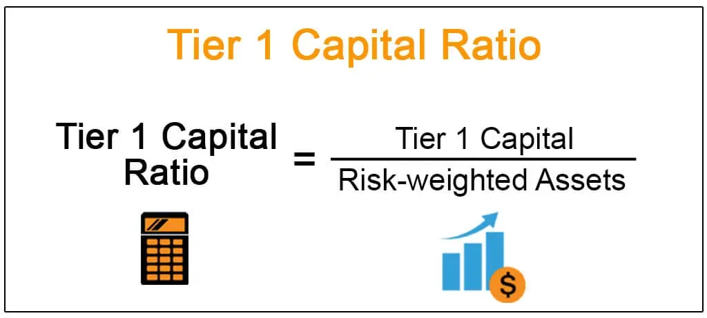

Understanding the financial stability of banks is essential for investors, regulators, and customers alike, as it determines how well a bank can withstand economic fluctuations and financial stress. A critical metric used in assessing a bank's financial robustness is the Tier 1 capital ratio. This ratio serves as a measure of a bank's core capital, which primarily includes common stock, retained earnings, and certain other reserves. It provides insight into the bank's ability to absorb losses while continuing to operate effectively.

The Tier 1 capital ratio is a key component of the regulatory framework established by the Basel Accords, a series of international banking regulations developed by the Basel Committee on Banking Supervision. These agreements aim to ensure that financial institutions maintain adequate capital levels to manage risks and prevent systemic crises. A strong Tier 1 capital ratio signifies a bank's resilience and ability to cover potential losses, thus safeguarding its solvency during periods of financial turbulence.



Beyond traditional banking operations, the significance of capital ratios extends into areas such as algorithmic trading and risk management. In algorithmic trading, investment decisions are often automated and rely on quantitative metrics, including capital ratios, to assess the stability and viability of banks and other financial entities. Consequently, understanding and analyzing these ratios can lead to more informed trading strategies and improved risk assessments.

This article will explore the integral role of Tier 1 capital, the regulatory requirements under the Basel Accords, and the implications of these capital standards on the banking sector. It will also examine how capital ratios serve as essential tools in algorithmic trading and risk management, highlighting the necessity for comprehensive understanding in navigating the complex landscape of modern banking.

## Table of Contents

## What is Tier 1 Capital?

Tier 1 capital represents the core capital that a bank is required to possess. It is primarily composed of shareholders' equity and retained earnings, serving as a fundamental component in absorbing losses and maintaining a bank's solvency, especially during periods of financial turbulence. This capital is vital because it provides the first line of defense against unexpected losses, ensuring a bank's ongoing financial health and operational continuity.

The concept of Tier 1 capital is deeply embedded in international banking regulations, most notably the Basel Accords. These accords are a series of recommendations on banking regulations issued by the Basel Committee on Banking Supervision (BCBS). The accords are designed to improve the regulation, supervision, and risk management within the banking sector. Tier 1 capital requirements are central to these guidelines, underscoring their critical importance in underpinning a bank's financial stability.

The Basel Accords establish that banks must maintain a certain level of Tier 1 capital relative to their risk-weighted assets (RWA). This ratio is a crucial determinant of a bank's financial health. It ensures that banks have enough capital to sustain operations through challenging economic conditions without resorting to emergency measures such as large-scale asset sales or borrowing from central banks.

Mathematically, the Tier 1 capital ratio can be expressed as follows:

$$
\text{Tier 1 Capital Ratio} = \frac{\text{Tier 1 Capital}}{\text{Risk-Weighted Assets}} \times 100\%
$$

This formula highlights the proportion of a bank’s risk-weighted assets that are covered by Tier 1 capital, providing a clear measure of the bank’s ability to withstand financial distress.

Maintaining an adequate level of Tier 1 capital is not only a regulatory requirement but also a strategic necessity for banks striving to reassure investors, depositors, and regulators of their financial robustness. The stipulations under the Basel Accords have grown in importance, particularly following the global financial crisis of 2008, which underscored the need for stringent capital requirements to safeguard the financial system.

## Understanding Capital Requirements under Basel III

Basel III, a comprehensive set of reforms developed by the Basel Committee on Banking Supervision, imposes rigorous standards to bolster the resilience of banks during economic adversities. A central aspect of Basel III is the mandate for banks to maintain a minimum Tier 1 capital ratio of 6%. This requirement is critical in ensuring that banks possess a robust financial buffer to absorb shocks and sustain their operations during unfavorable economic conditions.

The Tier 1 capital ratio is a measure of a bank's core equity capital compared with its total risk-weighted assets (RWA). The formula for the Tier 1 capital ratio is:

$$
\text{Tier 1 Capital Ratio} = \left(\frac{\text{Tier 1 Capital}}{\text{Risk-Weighted Assets}}\right) \times 100
$$

In addition to the Tier 1 capital ratio, Basel III introduces the concept of the Common Equity Tier 1 (CET1) ratio, which focuses on the most loss-absorbing form of capital, predominantly common shares. The CET1 ratio serves as a more stringent benchmark within the broader Tier 1 capital framework, requiring banks to maintain higher levels of high-quality capital.

Moreover, Basel III introduces capital conservation buffers—a layer of capital over and above the minimum capital requirements. This buffer aims to ensure that banks accumulate capital buffers in good times that can be drawn upon during periods of stress. The capital conservation buffer is set at 2.5% of risk-weighted assets, effectively bringing the total capital requirement, including the CET1, to 8.5%.

These requirements are fundamentally designed to enhance the overall stability and resilience of the banking sector. By mandating higher capital reserves, Basel III intends to mitigate the impact of unexpected economic shocks, reducing the likelihood of bank failures and promoting confidence in the financial system. The reforms reflect lessons learned from past financial crises, encouraging banks to operate with prudential risk management practices.

## Importance of the Capital Ratio in Banking

The Tier 1 capital ratio serves as an essential measure of a bank's financial health, offering insights into its ability to manage risk and withstand financial [volatility](/wiki/volatility-trading-strategies). This metric is pivotal for regulators, as it categorizes banks into different capitalization levels—well-capitalized, adequately capitalized, or undercapitalized. These categorizations assist in ensuring that banks have adequate capital buffers to function smoothly even during economic downturns.

Banks with higher Tier 1 capital ratios are typically better positioned to absorb losses without disrupting their operations. The ratio is calculated using the formula:

$$
\text{Tier 1 Capital Ratio} = \frac{\text{Tier 1 Capital}}{\text{Risk-Weighted Assets}} \times 100\%
$$

A higher ratio indicates a stronger capital base relative to the risk exposure, signaling to regulators and stakeholders that the bank in question is likely to be more resilient in times of financial instability.

This resilience is crucial, as it provides a buffer against potential loan defaults or investment losses. By maintaining robust Tier 1 capital ratios, banks can assure regulators of their solvency, reduce the risk of bank runs, and contribute to the overall stability of the financial sector. Furthermore, a well-capitalized bank can offer more competitive lending rates and invest in growth opportunities while mitigating risks associated with market volatility.

## Algorithmic Trading and Capital Ratios

Algorithmic trading relies heavily on quantitative metrics to optimize investment decisions in a rapid and automated fashion. One such critical metric is the capital ratio, with the Tier 1 capital ratio being particularly important in assessing a bank's financial robustness. Capital ratios serve as indicators of a bank's ability to absorb losses without jeopardizing depositors' funds or requiring external assistance. Understanding these ratios is crucial for [algorithmic trading](/wiki/algorithmic-trading), as they inform both trading strategies and risk assessments.

Firstly, the financial strength of banks, derived from their capital ratios, can directly impact trading strategies. For instance, a bank with a higher Tier 1 capital ratio is generally perceived as having a lower risk of default. This perception can lead to such banks being favored in lending operations, interbank lending, or when entering partnerships, thereby altering the flow of capital and [liquidity](/wiki/liquidity-risk-premium) in financial markets. Algorithmic trading models can incorporate these metrics to adjust trading positions, prioritize transactions with certain financial institutions, or hedge against risks associated with others.

Moreover, with advancements in real-time data processing and analysis, algorithmic trading systems can swiftly react to changes in a bank's capital ratios. When a bank's capital ratio significantly improves or deteriorates, it might indicate underlying changes in its financial health. An improved capital ratio could highlight an opportunity for strategic investments, suggesting that the bank has successfully bolstered its financial position. Conversely, a declining ratio could prompt sell-offs or hedges against potential risks. Algorithmic trading systems exploit this real-time analysis through [machine learning](/wiki/machine-learning) models and quantitative algorithms:

```python
import numpy as np
from sklearn.linear_model import LinearRegression

# Sample data representing capital ratios and a hypothetical bank-related asset price
capital_ratios = np.array([8.0, 9.0, 8.5, 10.0, 9.5]).reshape(-1, 1)
asset_prices = np.array([100, 105, 102, 110, 108])

# Simple linear regression model to predict asset prices based on capital ratios
model = LinearRegression()
model.fit(capital_ratios, asset_prices)

# Predicting asset prices for new capital ratios
new_ratios = np.array([9.8, 10.5]).reshape(-1, 1)
predicted_prices = model.predict(new_ratios)

print("Predicted asset prices:", predicted_prices)
```

The above Python code exemplifies how capital ratios, fed as input data, can be used in predictive modeling to assess their potential impact on asset prices. Such integration allows algorithmic traders to dynamically adjust portfolios, enhancing returns while mitigating risks based on a nuanced understanding of banking capital ratios.

In summary, as algorithmic trading continues to expand in scale and sophistication, leveraging capital ratios will remain integral. The ability to interpret these ratios accurately ensures that trading systems can make informed, timely decisions, ultimately leading to more efficient and resilient financial markets.

## Conclusion

Tier 1 capital and its ratio are critical indicators of a bank's financial health and operational stability. These metrics demonstrate a bank's ability to absorb losses and maintain solvency during economic challenges. The Basel Accords have played a pivotal role in shaping these requirements, particularly following the 2008 financial crisis. By mandating robust capital ratios, the Accords aim to bolster the resilience of banking institutions and prevent similar financial disruptions in the future.

As financial markets evolve with advancements such as algorithmic trading, the importance of understanding capital metrics like the Tier 1 ratio cannot be overstated. Algorithmic trading systems depend on real-time quantitative data, and insights from capital ratios can provide a competitive edge in investment decision-making and risk management. Thus, a comprehensive grasp of these financial indicators remains crucial for navigating the complexities of the banking sector and adhering to regulatory standards.

## References & Further Reading

[1]: Basel Committee on Banking Supervision. (2011). ["Basel III: A global regulatory framework for more resilient banks and banking systems."](https://www.bis.org/publ/bcbs189.htm) Bank for International Settlements.

[2]: ["Basel III: The Liquidity Coverage Ratio and liquidity risk monitoring tools."](https://www.bis.org/publ/bcbs238.htm) Basel Committee on Banking Supervision.

[3]: Saunders, A., & Cornett, M. M. (2018). ["Financial Institutions Management: A Risk Management Approach."](https://www.mheducation.com/highered/product/Financial-Institutions-Management-A-Risk-Management-Approach-Saunders.html) McGraw-Hill Education.

[4]: Hull, J. C. (2018). ["Risk Management and Financial Institutions."](https://books.google.com/books/about/Risk_Management_and_Financial_Institutio.html?id=1J1QDwAAQBAJ) Wiley.

[5]: ["Principles for enhancing corporate governance."](https://www.bis.org/publ/bcbs176.htm) Basel Committee on Banking Supervision.

[6]: King, M. R., & Tarbert, H. (2011). ["Basel III: An overview."](https://www.weil.com/~/media/files/pdfs/Basel_III_May_2011.pdf) 

[7]: Bhatti, M. I., & Huang, A. (2019). ["Financial Risk Management and Modeling."](https://scholar.google.com.sg/citations?user=gJhCA9MAAAAJ&hl=en) Elsevier.

[8]: ["The impact of the Basel III leverage ratio on risk-taking and bank stability."](https://www.ecb.europa.eu/pub/pdf/fsr/art/ecb.fsrart201511_01.en.pdf) Journal of Banking & Finance.