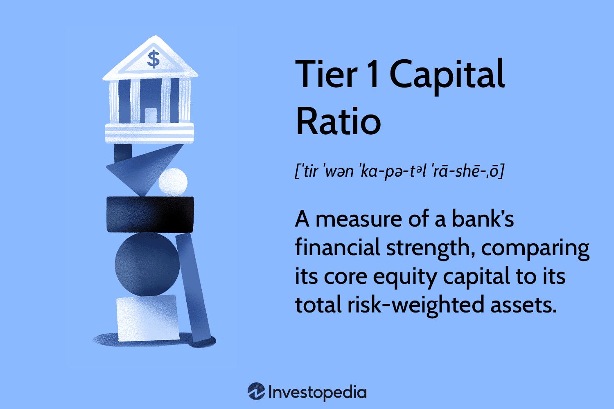

## Table of Contents

## What is Tier 1 Capital?

Tier 1 Capital is the core measure of a bank's financial strength. It includes the bank's common stock, retained earnings, and certain types of preferred stock. This type of capital is important because it helps banks absorb losses without failing. Regulators look at Tier 1 Capital to make sure banks can handle tough financial times.

There are two main parts of Tier 1 Capital: Common Equity Tier 1 and Additional Tier 1. Common Equity Tier 1 is the most important part because it includes the most basic and stable forms of capital, like common stock and retained earnings. Additional Tier 1 includes other types of capital, like some preferred stocks, which can help absorb losses but are not as stable as Common Equity Tier 1. Together, these parts help make sure a bank is strong and safe.

## Why is the Tier 1 Capital Ratio important for banks?

The Tier 1 Capital Ratio is important for banks because it shows how strong and safe a bank is. It tells us if a bank has enough money to handle losses and keep going even if things get tough. The ratio is calculated by dividing a bank's Tier 1 Capital by its risk-weighted assets. If the ratio is high, it means the bank has a lot of strong capital compared to the risks it is taking, which is good.

Regulators use the Tier 1 Capital Ratio to make sure banks are not taking too many risks. They set minimum levels that banks must meet to keep the financial system stable. If a bank's Tier 1 Capital Ratio is too low, it might need to get more capital or reduce its risky activities. This helps protect customers and the economy by making sure banks can survive tough times.

## How do you calculate the Tier 1 Capital Ratio?

The Tier 1 Capital Ratio is calculated by dividing a bank's Tier 1 Capital by its risk-weighted assets. Tier 1 Capital includes the bank's core capital like common stock, retained earnings, and certain preferred stocks. Risk-weighted assets are the bank's loans and other assets, but each asset is given a risk weight based on how likely it is to cause losses. For example, a loan to a stable government might have a low risk weight, while a loan to a risky business might have a high risk weight.

To find the Tier 1 Capital Ratio, you take the total amount of Tier 1 Capital and divide it by the total amount of risk-weighted assets. The result is usually shown as a percentage. If a bank has $100 million in Tier 1 Capital and $1 billion in risk-weighted assets, the Tier 1 Capital Ratio would be 10% ($100 million divided by $1 billion, then multiplied by 100 to get a percentage). This ratio helps show how well a bank can handle losses and stay safe.

## What are the components of Tier 1 Capital?

Tier 1 Capital is made up of two main parts: Common Equity Tier 1 and Additional Tier 1. Common Equity Tier 1 is the most important part. It includes things like common stock, which are the shares that people buy and own in the bank, and retained earnings, which is the money the bank has made and kept over time. These are the strongest types of capital because they are very stable and help the bank stay strong even when things get tough.

Additional Tier 1 includes other types of capital that are not as strong as Common Equity Tier 1 but still help the bank. This can include certain types of preferred stock, which are like shares but have some special features. These features can help the bank absorb losses, but they are not as reliable as common stock or retained earnings. Together, these parts of Tier 1 Capital make sure the bank has enough money to handle any problems that come up.

## What is the difference between Common Equity Tier 1 and Additional Tier 1 Capital?

Common Equity Tier 1 Capital is the most important part of a bank's capital. It includes things like common stock, which is what people buy to own a part of the bank, and retained earnings, which is the money the bank has made and kept over time. These are the strongest types of capital because they are very stable. They help the bank stay strong even when things get tough. Common Equity Tier 1 Capital is the core of what makes a bank safe and able to handle losses.

Additional Tier 1 Capital includes other types of capital that are not as strong as Common Equity Tier 1 but still help the bank. This can include certain types of preferred stock, which are like shares but have some special features. These features can help the bank absorb losses, but they are not as reliable as common stock or retained earnings. While Additional Tier 1 Capital helps, it is seen as less stable and less important than Common Equity Tier 1 Capital. Together, both types of capital make sure the bank has enough money to handle any problems that come up.

## What is considered as risk-weighted assets in the Tier 1 Capital Ratio calculation?

Risk-weighted assets are the loans and other things a bank owns, but each one is given a special number based on how risky it is. This number is called a risk weight. For example, if a bank gives a loan to a government that is very stable, the risk weight might be low because it's not very likely that the government won't pay back the loan. But if the bank gives a loan to a business that is risky, the risk weight might be high because there's a bigger chance the business might not pay back the loan.

To find out the total risk-weighted assets, the bank looks at all its loans and other things it owns, and then multiplies each one by its risk weight. After doing this for everything, the bank adds up all the numbers to get the total risk-weighted assets. This total is used in the Tier 1 Capital Ratio to see how much strong capital the bank has compared to the risks it is taking.

## What is the minimum Tier 1 Capital Ratio required by regulatory bodies?

The minimum Tier 1 Capital Ratio that banks must have is set by groups like the Basel Committee on Banking Supervision. This group suggests that banks should have at least a 6% Tier 1 Capital Ratio. This means that for every $100 of risk-weighted assets, a bank should have at least $6 in Tier 1 Capital. This rule helps make sure banks have enough strong money to handle tough times and keep the financial system safe.

Different countries can set their own rules, which might be stricter than the Basel Committee's suggestion. For example, in the United States, banks that are very important to the economy are often required to have a Tier 1 Capital Ratio of at least 8%. This extra requirement helps make sure these big banks are extra safe and can handle even bigger problems. By having these rules, regulators try to keep banks strong and protect people's money.

## How does the Tier 1 Capital Ratio impact a bank's stability and operations?

The Tier 1 Capital Ratio is really important for a bank's stability. It shows how much strong money a bank has compared to the risks it takes. If the ratio is high, it means the bank can handle losses better and stay strong even when things get tough. This makes people feel safer about keeping their money in the bank. Regulators watch this ratio to make sure banks are not taking too many risks. If a bank's Tier 1 Capital Ratio is too low, it might have to get more money or cut back on risky activities to stay safe.

The ratio also affects how a bank operates. Banks with a high Tier 1 Capital Ratio can do more things, like giving out more loans or trying new business ideas, because they have a strong financial base. But if the ratio is low, a bank might have to be more careful. It might need to focus on getting more strong money instead of growing or taking on new projects. This can slow down the bank's growth and limit what it can do. So, keeping a good Tier 1 Capital Ratio is key for a bank to stay stable and keep running smoothly.

## Can you explain how Basel III regulations affect the Tier 1 Capital Ratio?

Basel III is a set of rules made to make banks safer and stronger. These rules changed how banks need to calculate their Tier 1 Capital Ratio. Before Basel III, banks could use a lot of different types of money to count as Tier 1 Capital. But Basel III made it stricter. Now, banks need to have more of the strongest types of money, like common stock and retained earnings, which are part of Common Equity Tier 1. This means banks have to be more careful about what they count as their strong money.

These changes in Basel III make banks keep a higher Tier 1 Capital Ratio. The rules say that banks should have at least a 6% Tier 1 Capital Ratio, but they also need to have at least 4.5% in Common Equity Tier 1. This is to make sure banks have enough of the very best kind of money to handle tough times. By making these rules stricter, Basel III helps make the whole banking system safer and more stable. Banks have to work harder to keep their Tier 1 Capital Ratio high, which means they might need to get more strong money or be more careful about the risks they take.

## What are the consequences of a bank having a Tier 1 Capital Ratio below the regulatory minimum?

If a bank has a Tier 1 Capital Ratio below the regulatory minimum, it can face big problems. Regulators might step in and tell the bank to fix it fast. They might make the bank get more strong money, like common stock or retained earnings, to bring the ratio up. If the bank can't do this, it might have to cut back on risky activities or even stop giving out new loans. This can slow down the bank's business and make it hard to grow.

Having a low Tier 1 Capital Ratio also makes people worried. Customers might start taking their money out of the bank because they think it's not safe. This can make the bank's problems even worse. If a lot of people take their money out at the same time, it could lead to the bank failing. Regulators want to stop this from happening, so they keep a close eye on banks to make sure they have enough strong money to stay safe and keep running smoothly.

## How do banks manage and improve their Tier 1 Capital Ratio?

Banks manage and improve their Tier 1 Capital Ratio by making sure they have enough strong money, like common stock and retained earnings. They can do this by selling more shares to people who want to own part of the bank. This brings in more money that counts as Tier 1 Capital. Banks can also keep more of the money they make instead of giving it out as dividends. This adds to their retained earnings, which is another part of Tier 1 Capital. By doing these things, banks can make their Tier 1 Capital Ratio higher and stay safe.

Sometimes, banks need to cut back on risky things to improve their Tier 1 Capital Ratio. If a bank has a lot of risky loans, it might decide to give out fewer new loans or sell some of the risky ones it already has. This can lower the bank's risk-weighted assets, which makes the Tier 1 Capital Ratio go up. Banks also have to be smart about the kinds of money they use. They need to focus on the strongest types of money that count as Tier 1 Capital, like common stock and retained earnings, and not rely too much on weaker types of money. By being careful and making smart choices, banks can keep their Tier 1 Capital Ratio high and stay strong.

## What are some advanced strategies for optimizing Tier 1 Capital in response to economic changes?

When the economy changes, banks need to use smart strategies to keep their Tier 1 Capital strong. One way is by using something called "stress testing." This means banks pretend that bad things happen in the economy, like a big drop in the stock market or a lot of people not paying back their loans. By doing these pretend tests, banks can see if they have enough strong money to handle tough times. If the tests show the bank might not have enough, they can get more money by selling new shares or keeping more of their profits instead of giving them out as dividends.

Another strategy is to be smart about the risks they take. Banks can use something called "risk management" to look at all their loans and other things they own. They can then decide to give out fewer risky loans or sell some of the risky ones they already have. This can make their risk-weighted assets smaller, which helps their Tier 1 Capital Ratio go up. Banks can also look at new ways to make money, like starting new services or working with other companies. By doing these things, banks can keep their Tier 1 Capital strong even when the economy changes a lot.

## What is Tier 1 Capital?

Tier 1 capital represents the core capital that a bank is required to possess. It is primarily composed of shareholders' equity and retained earnings, serving as a fundamental component in absorbing losses and maintaining a bank's solvency, especially during periods of financial turbulence. This capital is vital because it provides the first line of defense against unexpected losses, ensuring a bank's ongoing financial health and operational continuity.

The concept of Tier 1 capital is deeply embedded in international banking regulations, most notably the Basel Accords. These accords are a series of recommendations on banking regulations issued by the Basel Committee on Banking Supervision (BCBS). The accords are designed to improve the regulation, supervision, and risk management within the banking sector. Tier 1 capital requirements are central to these guidelines, underscoring their critical importance in underpinning a bank's financial stability.

The Basel Accords establish that banks must maintain a certain level of Tier 1 capital relative to their risk-weighted assets (RWA). This ratio is a crucial determinant of a bank's financial health. It ensures that banks have enough capital to sustain operations through challenging economic conditions without resorting to emergency measures such as large-scale asset sales or borrowing from central banks.

Mathematically, the Tier 1 capital ratio can be expressed as follows:

$$
\text{Tier 1 Capital Ratio} = \frac{\text{Tier 1 Capital}}{\text{Risk-Weighted Assets}} \times 100\%
$$

This formula highlights the proportion of a bank’s risk-weighted assets that are covered by Tier 1 capital, providing a clear measure of the bank’s ability to withstand financial distress.

Maintaining an adequate level of Tier 1 capital is not only a regulatory requirement but also a strategic necessity for banks striving to reassure investors, depositors, and regulators of their financial robustness. The stipulations under the Basel Accords have grown in importance, particularly following the global financial crisis of 2008, which underscored the need for stringent capital requirements to safeguard the financial system.

## What are the capital requirements under Basel III?

Basel III, a comprehensive set of reforms developed by the Basel Committee on Banking Supervision, imposes rigorous standards to bolster the resilience of banks during economic adversities. A central aspect of Basel III is the mandate for banks to maintain a minimum Tier 1 capital ratio of 6%. This requirement is critical in ensuring that banks possess a robust financial buffer to absorb shocks and sustain their operations during unfavorable economic conditions.

The Tier 1 capital ratio is a measure of a bank's core equity capital compared with its total risk-weighted assets (RWA). The formula for the Tier 1 capital ratio is:

$$
\text{Tier 1 Capital Ratio} = \left(\frac{\text{Tier 1 Capital}}{\text{Risk-Weighted Assets}}\right) \times 100
$$

In addition to the Tier 1 capital ratio, Basel III introduces the concept of the Common Equity Tier 1 (CET1) ratio, which focuses on the most loss-absorbing form of capital, predominantly common shares. The CET1 ratio serves as a more stringent benchmark within the broader Tier 1 capital framework, requiring banks to maintain higher levels of high-quality capital.

Moreover, Basel III introduces capital conservation buffers—a layer of capital over and above the minimum capital requirements. This buffer aims to ensure that banks accumulate capital buffers in good times that can be drawn upon during periods of stress. The capital conservation buffer is set at 2.5% of risk-weighted assets, effectively bringing the total capital requirement, including the CET1, to 8.5%.

These requirements are fundamentally designed to enhance the overall stability and resilience of the banking sector. By mandating higher capital reserves, Basel III intends to mitigate the impact of unexpected economic shocks, reducing the likelihood of bank failures and promoting confidence in the financial system. The reforms reflect lessons learned from past financial crises, encouraging banks to operate with prudential risk management practices.

## What is the importance of the capital ratio in banking?

The Tier 1 capital ratio serves as an essential measure of a bank's financial health, offering insights into its ability to manage risk and withstand financial [volatility](/wiki/volatility-trading-strategies). This metric is pivotal for regulators, as it categorizes banks into different capitalization levels—well-capitalized, adequately capitalized, or undercapitalized. These categorizations assist in ensuring that banks have adequate capital buffers to function smoothly even during economic downturns.

Banks with higher Tier 1 capital ratios are typically better positioned to absorb losses without disrupting their operations. The ratio is calculated using the formula:

$$
\text{Tier 1 Capital Ratio} = \frac{\text{Tier 1 Capital}}{\text{Risk-Weighted Assets}} \times 100\%
$$

A higher ratio indicates a stronger capital base relative to the risk exposure, signaling to regulators and stakeholders that the bank in question is likely to be more resilient in times of financial instability.

This resilience is crucial, as it provides a buffer against potential loan defaults or investment losses. By maintaining robust Tier 1 capital ratios, banks can assure regulators of their solvency, reduce the risk of bank runs, and contribute to the overall stability of the financial sector. Furthermore, a well-capitalized bank can offer more competitive lending rates and invest in growth opportunities while mitigating risks associated with market volatility.

## References & Further Reading

[1]: Basel Committee on Banking Supervision. (2011). ["Basel III: A global regulatory framework for more resilient banks and banking systems."](https://www.bis.org/publ/bcbs189.htm) Bank for International Settlements.

[2]: ["Basel III: The Liquidity Coverage Ratio and liquidity risk monitoring tools."](https://www.bis.org/publ/bcbs238.htm) Basel Committee on Banking Supervision.

[3]: Saunders, A., & Cornett, M. M. (2018). ["Financial Institutions Management: A Risk Management Approach."](https://www.mheducation.com/highered/product/Financial-Institutions-Management-A-Risk-Management-Approach-Saunders.html) McGraw-Hill Education.

[4]: Hull, J. C. (2018). ["Risk Management and Financial Institutions."](https://books.google.com/books/about/Risk_Management_and_Financial_Institutio.html?id=1J1QDwAAQBAJ) Wiley.

[5]: ["Principles for enhancing corporate governance."](https://www.bis.org/publ/bcbs176.htm) Basel Committee on Banking Supervision.

[6]: King, M. R., & Tarbert, H. (2011). ["Basel III: An overview."](https://www.weil.com/~/media/files/pdfs/Basel_III_May_2011.pdf) 

[7]: Bhatti, M. I., & Huang, A. (2019). ["Financial Risk Management and Modeling."](https://scholar.google.com.sg/citations?user=gJhCA9MAAAAJ&hl=en) Elsevier.

[8]: ["The impact of the Basel III leverage ratio on risk-taking and bank stability."](https://www.ecb.europa.eu/pub/pdf/fsr/art/ecb.fsrart201511_01.en.pdf) Journal of Banking & Finance.