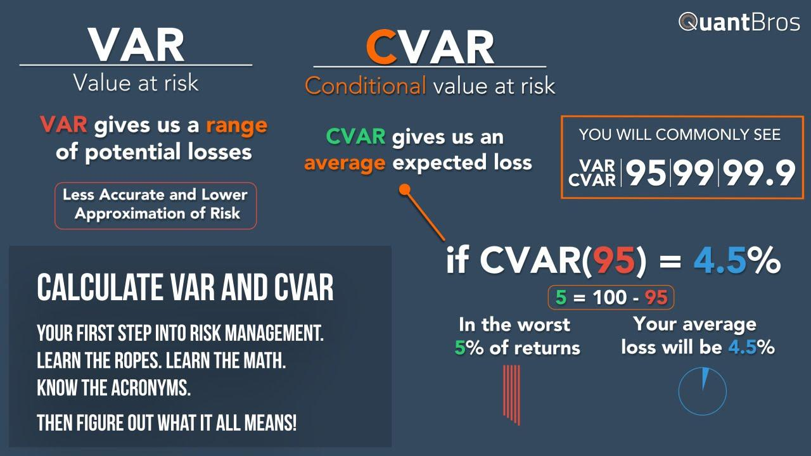

## Table of Contents

## What is Value at Risk (VaR) and why is it important?

Value at Risk, or VaR, is a way to measure how much money you might lose on an investment over a certain period of time. It tells you the maximum amount you could lose, with a certain level of confidence, usually 95% or 99%. For example, if your VaR is $100,000 at a 95% confidence level over one day, it means there's a 5% chance you could lose more than $100,000 in a single day.

VaR is important because it helps people and businesses understand and manage the risks they take with their investments. It's like a warning sign that shows how much risk you're taking on. Banks, investment firms, and even individual investors use VaR to make better decisions about where to put their money. By knowing the potential losses, they can take steps to protect themselves, like buying insurance or adjusting their investment strategies.

## How can VaR be calculated using the historical simulation method?

To calculate Value at Risk (VaR) using the historical simulation method, you start by looking at what happened to your investment in the past. You take all the daily changes in the value of your investment over a certain time period, like the last year or five years. Then, you sort these changes from the biggest loss to the biggest gain. If you want to find the VaR at a 95% confidence level, you look at the change that is worse than 5% of all the changes. That change is your VaR. For example, if the 5th percentile change is a loss of $10,000, then your VaR at a 95% confidence level is $10,000.

The historical simulation method is simple because it doesn't need any fancy math formulas. It just uses what actually happened in the past to guess what might happen in the future. But, it assumes that the future will be a lot like the past, which might not always be true. If the market changes a lot, the historical data might not be a good guide. Still, this method is easy to understand and use, making it popular for many investors who want a quick way to see their risk.

## What are the basic steps to calculate VaR in Excel?

To calculate VaR using the historical simulation method in Excel, you start by collecting your data. This means you need to have the daily changes in the value of your investment over a certain time period, like the last year. You can put these changes in a column in Excel. Next, you sort these changes from the biggest loss to the biggest gain. If you want to find the VaR at a 95% confidence level, you need to find the change that is worse than 5% of all the changes. To do this, you can use the PERCENTILE function in Excel. For example, if you have 252 days of data, you would use the formula `=PERCENTILE(array, 0.05)` where 'array' is the range of your sorted data. The result of this formula is your VaR at a 95% confidence level.

For example, let's say you have daily returns in column A from A1 to A252. You would first sort these values from smallest to largest. Then, in another cell, you would enter the formula `=PERCENTILE(A1:A252, 0.05)`. If the result is -0.02, this means your VaR at a 95% confidence level is a 2% loss. This means there's a 5% chance that your investment could lose more than 2% of its value in a single day, based on the historical data. Remember, this method assumes the future will be similar to the past, so it's important to keep updating your data and checking your VaR regularly.

## How do you set up a basic VaR calculation in Python?

To set up a basic VaR calculation in Python, you first need to gather your historical data. This data should be the daily changes in the value of your investment over a certain time period, like the last year. You can store this data in a list or a pandas DataFrame. Once you have your data, you can use the numpy library to help you calculate the VaR. You'll need to sort the data from the biggest loss to the biggest gain, and then find the value at the 5th percentile if you want a 95% confidence level.

For example, if you have your daily returns in a list called `returns`, you can use the `numpy` function `np.percentile` to find the VaR. You would write `var = np.percentile(returns, 5)` to get the VaR at a 95% confidence level. This means there's a 5% chance that your investment could lose more than the value you calculated in a single day, based on the historical data. Remember, this method assumes the future will be similar to the past, so it's important to keep updating your data and checking your VaR regularly.

## What is the variance-covariance method for VaR calculation and how is it implemented in Excel?

The variance-covariance method for calculating Value at Risk (VaR) is another way to measure risk, different from the historical simulation method. It uses math to figure out how much your investment might lose. This method looks at the average return of your investment and how much it changes, which is called the standard deviation. With these numbers, you can use a formula to find out the VaR. The formula is: VaR = (Expected Return - Z * Standard Deviation) * Investment Value. The Z is a number from a normal distribution table that matches your confidence level, like 1.65 for 95% confidence.

To use the variance-covariance method in Excel, you first need to know the average return and the standard deviation of your investment's returns. You can use Excel's AVERAGE and STDEV functions to find these numbers. For example, if your returns are in cells A1 to A252, you would use `=AVERAGE(A1:A252)` for the average return and `=STDEV(A1:A252)` for the standard deviation. Then, you need the Z value for your confidence level. For a 95% confidence level, the Z value is 1.65. You can enter this directly or use the `=NORMSINV(0.95)` function to get it. Finally, you can calculate the VaR with a formula like `=(AVERAGE(A1:A252) - 1.65 * STDEV(A1:A252)) * Investment_Value`, where `Investment_Value` is the total value of your investment. This will give you the VaR at a 95% confidence level.

## How can you use Monte Carlo simulation to calculate VaR in Python?

To calculate Value at Risk (VaR) using Monte Carlo simulation in Python, you first need to set up a model of how your investment might change over time. This means you need to know the average return and the standard deviation of your investment's returns, just like in the variance-covariance method. But instead of using a formula, you use a computer to create many different possible futures for your investment. You do this by generating random numbers that follow the pattern of your investment's past returns. You can use the `numpy` library in Python to help you generate these random numbers. For each future, you calculate the return, and after you have created thousands of these futures, you sort them from the worst return to the best return. Then, you pick the return at the 5th percentile if you want a 95% confidence level. This return is your VaR.

Monte Carlo simulation is useful because it can handle more complex situations than other methods. For example, if your investment depends on several different things, like stock prices and interest rates, you can model how all these things might change together. To do this in Python, you would use the `numpy.random` functions to generate random numbers for each of these factors, and then use these numbers to calculate the return of your investment. After running the simulation many times, you collect all the returns and sort them. The VaR is the return at the 5th percentile, which tells you the maximum loss you might expect with 95% confidence. This method takes more time and computer power, but it can give you a better picture of the risks you face.

## What are the advantages and disadvantages of using Excel versus Python for VaR calculations?

Excel is easy to use for VaR calculations because it has built-in functions like AVERAGE and STDEV that help you find the numbers you need. It's also good for small projects where you don't have a lot of data. You can quickly enter your data, do the calculations, and see the results all in one place. But Excel can be slow if you have a lot of data, and it's not as good at handling complex math or running lots of simulations. If you want to use the Monte Carlo method, Excel might take a long time to run all the calculations.

Python, on the other hand, is better for bigger projects and more complex calculations. It has libraries like numpy that make it easy to do math and run simulations quickly. With Python, you can handle a lot of data and run thousands of simulations in a short time, which is great for the Monte Carlo method. But Python can be harder to learn if you're not used to coding. You need to write out the steps of your calculation in a program, which takes more time to set up than just using Excel's functions. Once you have the program set up, though, you can run it over and over with different data without having to start from scratch each time.

## How do you account for non-normal distributions when calculating VaR in Python?

When calculating VaR, it's common to assume that returns follow a normal distribution, but real-world data often doesn't fit this pattern. If your investment returns are not normally distributed, you need to use a different method to calculate VaR accurately. One way to do this in Python is by using a different distribution that fits your data better, like the Student's t-distribution or even a custom distribution based on your historical data.

To handle non-normal distributions in Python, you can use libraries like `scipy` which has tools for different types of distributions. For example, if you think your data follows a Student's t-distribution, you can use the `scipy.stats.t` function to model it. After fitting your data to this distribution, you can then use Monte Carlo simulation to generate many possible future returns and calculate the VaR based on these simulations. This approach helps you get a more accurate VaR when your data doesn't fit the normal distribution.

## What are the common pitfalls when calculating VaR in Excel and how can they be avoided?

One common pitfall when calculating VaR in Excel is using the wrong data or not having enough data. If you only use a short time period or don't include all the ups and downs of your investment, your VaR might not be accurate. To avoid this, make sure you have enough data that covers different market conditions. Also, double-check that your data is correct and that you've entered it into Excel properly.

Another issue is that Excel can be slow and might not handle complex calculations well, especially if you're trying to use the Monte Carlo simulation method. If your computer takes a long time to run the calculations or if it crashes, your VaR might not be right. To fix this, you could use simpler methods like historical simulation if you're working with a lot of data. If you really need to use Monte Carlo, consider using a more powerful tool like Python that can handle these calculations faster.

## How can you incorporate stress testing into VaR calculations in Python?

To add stress testing to VaR calculations in Python, you first need to understand what stress testing is. Stress testing means looking at what would happen to your investment if things got really bad. You can do this by changing the numbers you use in your VaR calculation to see what would happen in a crisis. For example, you might use a bigger loss or a higher chance of a big loss than what you see in your normal data.

To do this in Python, you can change the numbers you use in your Monte Carlo simulation. You can make the average return lower or the standard deviation bigger to see what would happen if the market crashed. After you run the simulation with these new numbers, you can find the new VaR, which will show you the maximum loss you might expect in a really bad situation. This helps you be ready for the worst and make better decisions about your investments.

## What advanced techniques can be used to enhance VaR calculations in Python, such as using machine learning?

One advanced way to make VaR calculations better in Python is by using [machine learning](/wiki/machine-learning). Machine learning can help you find patterns in your investment data that you might miss with simpler methods. For example, you can use a type of machine learning called neural networks to predict how your investment might change in the future. These predictions can then be used in your Monte Carlo simulation to make your VaR more accurate. By learning from past data, machine learning can help you see what might happen next, even if things are changing a lot.

Another technique is to use something called 'conditional VaR' or CVaR, which looks at what might happen if things get really bad. Instead of just finding the worst 5% of outcomes like regular VaR, CVaR looks at the average of those worst outcomes. You can use Python to calculate CVaR by running a lot of simulations and then finding the average of the worst losses. This gives you a better idea of what you might lose in a crisis. By combining CVaR with machine learning, you can get a very detailed picture of the risks you face, helping you make smarter choices about your investments.

## How can you validate and backtest VaR models in both Excel and Python?

To validate and backtest VaR models in Excel, you start by comparing the VaR numbers you calculated with what actually happened to your investment. You can do this by keeping a record of your daily VaR and then checking how often your losses were bigger than your VaR. If your VaR is set at a 95% confidence level, you should see losses bigger than your VaR about 5% of the time. If it happens more or less often, your model might need some changes. You can use Excel's COUNTIF function to count how many times your losses were bigger than your VaR, and then divide that by the total number of days to see the percentage. This helps you see if your VaR model is working right and if you need to make it better.

In Python, validating and backtesting VaR models is similar, but you can use more advanced tools. You can write a program that keeps track of your daily VaR and then compares it to your actual losses. Just like in Excel, you check how often your losses were bigger than your VaR to see if it matches your confidence level. Python's libraries like pandas can help you handle large amounts of data easily, and you can use numpy to do the math quickly. If you find that your losses are bigger than your VaR too often or not often enough, you can tweak your model. Python also lets you run simulations to see how your model might perform in different situations, which helps you make it more accurate.

## What are the Methods of VaR Calculation?

Value at Risk (VaR) is a widely used metric in finance for quantifying the potential loss in the value of an asset or portfolio. The calculation of VaR can be approached through three primary methods: Variance-Covariance, Historical Simulation, and Monte Carlo Simulation. Each method has unique characteristics regarding its assumptions, advantages, and limitations.

### Variance-Covariance Method

The Variance-Covariance (VCV) method assumes that the returns of a portfolio are normally distributed. This approach calculates VaR by determining the standard deviation ([volatility](/wiki/volatility-trading-strategies)) of the portfolio's returns, along with the mean, and applying a confidence level to estimate potential losses. Mathematically, VaR is calculated using:

$$
\text{VaR} = Z \times \sigma \times \sqrt{t}
$$

where $Z$ is the z-score corresponding to the confidence level, $\sigma$ represents the standard deviation of portfolio returns, and $t$ is the time horizon.

#### Assumptions:
- Returns are normally distributed.
- Linear relationships between returns are maintained, making it suitable for portfolios of linear instruments.

#### Advantages:
- Simplicity and speed in calculations.
- Effective for portfolios with normally distributed returns and linear financial instruments.

#### Limitations:
- Inaccurate for non-linear instruments such as options due to the assumption of normality.
- May underestimate VaR during times of market turbulence when returns are not normally distributed.

### Historical Simulation Method

Historical Simulation does not assume a specific distribution of returns. Instead, it uses historical returns data to simulate potential future losses. This method orders past returns and identifies the percentile reflecting the desired confidence level.

#### Assumptions:
- Historical data accurately reflects future risk.
- The method is non-parametric, requiring no assumption about the return distribution.

#### Advantages:
- Captures fat tails and skewed distributions, making it suitable for portfolios with nonlinear instruments.
- Easy to understand and implement using historical data.

#### Limitations:
- Relies on the assumption that historical patterns will repeat, which may not hold in changing market conditions.
- Requires a large amount of historical data to be reliable.

### Monte Carlo Simulation Method

Monte Carlo Simulation uses random sampling and statistical modeling to estimate potential losses. It generates numerous scenarios for portfolio returns based on assumed distributions, and VaR is determined from the distribution of simulated results.

#### Assumptions:
- Assumes a specific stochastic process for returns, which can be tailored to fit complex financial instruments.

#### Advantages:
- Highly flexible, accommodating complex portfolios and non-linear instruments.
- Can incorporate various market conditions and volatilities in its simulations.

#### Limitations:
- Computationally intensive and time-consuming.
- Accuracy depends on the chosen model and quality of input parameters.

### Python-Based Framework for VaR Calculation

Python offers a robust environment for implementing VaR calculations using libraries like NumPy, Pandas, and SciPy. Each method can be implemented through Python code that efficiently handles data and performs the necessary computations.

Here's a simple example of calculating VaR using the Variance-Covariance method in Python:

```python
import numpy as np
from scipy.stats import norm

# Portfolio attributes
mean_return = 0.001  # average return
volatility = 0.01    # standard deviation of returns
confidence_level = 0.95
time_horizon = 1  # 1 day

# Calculate Z-score
z_score = norm.ppf(confidence_level)

# Calculate VaR
var = z_score * volatility * np.sqrt(time_horizon)

print(f"VaR at {confidence_level*100}% confidence level: {var:.2f}")
```

This example demonstrates calculating VaR for a portfolio assuming normal distribution of returns using VaR's standard formula. Python's flexibility and extensive library support make it an effective tool for implementing VaR calculations and customizing them to fit specific portfolio needs, across all methods discussed here.

## How can VaR be implemented in Python?

To implement Value at Risk (VaR) using the Variance-Covariance method in Python, we begin by understanding this approach. The Variance-Covariance method assumes that returns are normally distributed. VaR is calculated by determining the potential loss at a given confidence level over a specified time horizon.

### Step-by-step Implementation of the Variance-Covariance Method

1. **Data Preparation**: 
   Begin by obtaining historical price data for the asset or portfolio. Libraries such as Pandas are invaluable for handling time series data. 

2. **Calculate Returns**: 
   Compute the logarithmic returns of the price data, which are more suitable for statistical analysis.

   ```python
   import pandas as pd
   import numpy as np

   # Assuming df is a DataFrame with price data
   df['Returns'] = np.log(df['Price'] / df['Price'].shift(1))
   ```

3. **Calculate the Mean and Standard Deviation**:
   Calculate the mean and standard deviation of the returns. These [statistics](/wiki/bayesian-statistics) are used to model the distribution of returns.

   ```python
   mean = df['Returns'].mean()
   std_dev = df['Returns'].std()
   ```

4. **Determine the VaR**:
   Use the Z-score for the desired confidence level (e.g., 1.65 for 95% confidence). The VaR is calculated as:
$$
   \text{VaR} = \text{Investment} \times (Z \times \text{std\_dev} - \text{mean})

$$

   ```python
   confidence_level = 0.95
   z_score = norm.ppf(confidence_level)  # Import norm from scipy.stats

   investment = 100000  # Example: $100,000
   var = investment * (z_score * std_dev - mean)
   ```

### Historical Simulation Method

Historical Simulation does not assume a normal distribution and relies on actual historical returns to compute VaR.

1. **Sort Historical Returns**: 
   Organize the daily returns from lowest to highest.

2. **Select the VaR percentile**: 
   For a 95% confidence level, select the 5th percentile of sorted returns.

   ```python
   sorted_returns = np.sort(df['Returns'])
   var_historical = investment * np.percentile(sorted_returns, 5)
   ```

### Monte Carlo Simulation

Monte Carlo Simulation generates random price paths to compute the potential losses. This involves simulating a large number of scenarios to observe the distribution of returns.

1. **Generate Random Scenarios**:
   Use the historical mean and standard deviation to simulate returns for a number of iterations.

2. **Calculate VaR based on simulated returns**:
   Similar to the historical method, calculate the percentile of these simulated returns.

   ```python
   simulations = 10000
   simulated_returns = np.random.normal(mean, std_dev, simulations)
   var_monte_carlo = investment * np.percentile(simulated_returns, 5)
   ```

### Utilizing Python Libraries

Python's libraries such as NumPy, Pandas, and SciPy provide robust capabilities for performing these calculations. Pandas excels in data manipulation, NumPy offers efficient numerical computations, and SciPy provides statistical tools like the `norm.ppf` function for the Z-score.

By implementing VaR using these methods in Python, quantitative traders can effectively measure and manage potential risks associated with their portfolios. This approach enhances [algorithmic trading](/wiki/algorithmic-trading) strategies by providing a comprehensive risk assessment tool.

## What are Advanced VaR Techniques and Considerations?

Advanced Value at Risk (VaR) techniques offer enhanced insights into potential risks and are integral to sophisticated financial modeling. Among these techniques, Parametric VaR and Semi-Parametric VaR stand out due to their tailored approaches to assessing risk.

Parametric VaR, sometimes referred to as the Variance-Covariance method, assumes that asset returns follow a normal distribution. This method leverages statistical measures such as the mean and standard deviation to estimate risk. The formula for Parametric VaR is given by:

$$
\text{VaR}_{\alpha} = \mu + \sigma \cdot Z_{\alpha}
$$

where $\mu$ is the expected return, $\sigma$ is the standard deviation of returns, and $Z_{\alpha}$ is the Z-score corresponding to the confidence level $\alpha$. While straightforward and computationally efficient, it is primarily suitable for linear portfolios and may not accurately capture risks in non-normally distributed contexts.

Semi-Parametric VaR combines aspects of both parametric and non-parametric approaches. It allows for more flexibility by incorporating non-linear models or using historical data distributions with adjustments. This method is particularly useful when dealing with assets that do not exhibit a normal distribution, providing a balance between simplicity and realism.

Monte Carlo Simulation is a robust technique beneficial in complex financial models. Unlike methods reliant on historical data or simplistic assumptions, Monte Carlo employs random sampling to simulate a wide range of potential future states for a portfolio. By generating a large number of scenarios, it estimates the distribution of potential losses, thus offering a comprehensive view of risk. Its primary advantage is flexibility, as it can incorporate a variety of instruments and acknowledge the non-linear relationships and non-normality of returns.

```python
import numpy as np

# Monte Carlo Simulation for VaR
def monte_carlo_var(portfolio, num_simulations=10000, confidence_level=0.95):
    # Simulate returns
    simulated_returns = np.random.normal(np.mean(portfolio), np.std(portfolio), num_simulations)
    # Calculate VaR
    var = np.percentile(simulated_returns, 100 * (1 - confidence_level))
    return var

# Example usage
portfolio_returns = np.random.normal(0.001, 0.01, 1000)  # Generate some dummy portfolio returns
var_95 = monte_carlo_var(portfolio_returns)
```

When addressing multi-asset portfolios, advanced VaR models must consider the correlations between assets. This aspect can significantly affect the overall risk profile, as ignoring interactions between assets could lead to underestimating risk. Furthermore, [backtesting](/wiki/backtesting) is crucial to validate VaR models, ensuring their reliability over time. By comparing predicted VaR values against actual losses, practitioners can assess the model's accuracy and make necessary adjustments.

Incorporating backtesting and refining the assumptions of VaR models are essential steps in improving their predictive power. Utilizing Python libraries like NumPy and pandas facilitates these processes, providing the computational support needed for real-world applications. As financial environments grow more complex, these advanced VaR techniques and considerations prepare traders and analysts to navigate risk with precision and confidence.

## References & Further Reading

[1]: Jorion, P. (2007). ["Value at Risk: The New Benchmark for Managing Financial Risk."](https://link.springer.com/article/10.1007/s11408-007-0057-3) McGraw-Hill.

[2]: Hull, J. C. (2018). ["Risk Management and Financial Institutions."](https://books.google.com/books/about/Risk_Management_and_Financial_Institutio.html?id=1J1QDwAAQBAJ) Wiley.

[3]: Dowd, K. (2002). ["Measuring Market Risk."](https://onlinelibrary.wiley.com/doi/book/10.1002/9781118673485) John Wiley & Sons.

[4]: Glasserman, P. (2003). ["Monte Carlo Methods in Financial Engineering."](https://link.springer.com/book/10.1007/978-0-387-21617-1) Springer.

[5]: Blacker, K. (2011). ["How to Calculate Value at Risk: Implementing Financial Models in Excel."](https://excelgraduate.com/calculate-value-at-risk-in-excel/) KBS Publishing.

[6]: Grinold, R. C., & Kahn, R. N. (2000). ["Active Portfolio Management: A Quantitative Approach for Producing Superior Returns and Controlling Risk."](https://www.amazon.com/Active-Portfolio-Management-Quantitative-Controlling/dp/0070248826) McGraw-Hill.

[7]: Alexander, C. (2008). ["Market Risk Analysis, Volume II: Practical Financial Econometrics."](https://www.wiley.com/en-us/Market+Risk+Analysis%2C+Volume+II%2C+Practical+Financial+Econometrics-p-9780470998014) Wiley.

[8]: Litterman, R. (2003). ["Modern Investment Management: An Equilibrium Approach."](https://www.wiley.com/en-us/Modern+Investment+Management%3A+An+Equilibrium+Approach-p-9780471480655) Wiley.

[9]: Chan, E. (2009). ["Quantitative Trading: How to Build Your Own Algorithmic Trading Business."](https://github.com/ftvision/quant_trading_echan_book) Wiley.