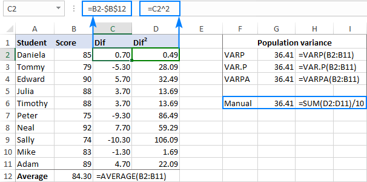

## Table of Contents

## What is variance and why is it important in data analysis?

Variance is a measure that tells us how spread out a set of numbers is. Imagine you have a bunch of numbers, and you want to know if they are all close to each other or if they are spread out a lot. Variance helps you figure that out. It does this by calculating the average of the squared differences from the mean of those numbers. If the numbers are all close to the mean, the variance will be small. If they are spread out, the variance will be large.

Understanding variance is important in data analysis because it helps us understand how much the data varies. This is useful in many ways. For example, if you are looking at test scores of students, a high variance might mean that the scores are very different from each other, suggesting that some students did much better than others. On the other hand, a low variance would mean that most students scored around the same level. Knowing the variance helps us make better decisions and predictions based on the data we have.

## How do you access the basic functions in Excel to calculate variance?

To calculate variance in Excel, you can use the built-in functions. There are two main functions you might use: VAR.P and VAR.S. VAR.P calculates the variance for an entire population, while VAR.S calculates the variance for a sample of a population. To use these functions, you simply type them into a cell followed by the range of cells that contain your data. For example, if your data is in cells A1 through A10, you would type "=VAR.P(A1:A10)" or "=VAR.S(A1:A10)" into a cell to get the variance.

These functions are easy to find in Excel. You can either type them directly into a cell, or you can use the Formula tab on the ribbon. If you click on the Formula tab, you'll see a section called "Function Library." Click on "More Functions," then "Statistical," and you'll see both VAR.P and VAR.S listed there. You can click on the one you need, and a dialog box will pop up where you can select your data range. This makes it simple to calculate variance without having to remember the exact function names or syntax.

## What is the difference between sample variance and population variance in Excel?

Sample variance and population variance are two ways to measure how spread out your data is, but they are used in different situations. Sample variance is used when you are looking at just a part of the whole group, like if you only surveyed some people out of a big city. In Excel, you use the function VAR.S to calculate this. It takes into account that you're not looking at everyone, so it makes a small adjustment to give you a better estimate of how spread out the whole group might be.

Population variance, on the other hand, is used when you have data for every single member of the group you're studying. For example, if you have test scores for all students in a small class, you would use population variance. In Excel, you use the function VAR.P for this. It's a bit simpler because it doesn't need to make any adjustments since you're looking at the entire group. Knowing which one to use depends on whether you're working with a sample or the whole population, and Excel makes it easy to calculate both.

## How do you use the VAR.S function in Excel to calculate sample variance?

To use the VAR.S function in Excel to calculate sample variance, you first need to have your data ready in a set of cells. Let's say your data is in cells A1 through A10. You would click on the cell where you want the result to appear, then type "=VAR.S(A1:A10)" into that cell. This tells Excel to look at the numbers in cells A1 through A10 and calculate the sample variance for them. Once you press Enter, Excel will show you the result in the cell where you typed the formula.

The VAR.S function is specifically designed for situations where you are working with a sample of a larger population. This means you're not looking at every single item, but just a part of it. For example, if you surveyed 100 people out of a city of 10,000, you would use VAR.S to get an estimate of how spread out the whole city's responses might be. It's important to use VAR.S instead of VAR.P in these cases because VAR.S adjusts for the fact that you're working with a sample, giving you a more accurate estimate of the variance for the entire population.

## How do you use the VAR.P function in Excel to calculate population variance?

To use the VAR.P function in Excel to calculate population variance, you need to have your data ready in a set of cells. For example, if your data is in cells A1 through A10, you would click on the cell where you want the result to appear. Then, type "=VAR.P(A1:A10)" into that cell. This tells Excel to look at the numbers in cells A1 through A10 and calculate the population variance for them. After you press Enter, Excel will show you the result in the cell where you typed the formula.

The VAR.P function is used when you have data for every single item in your group, not just a sample. For instance, if you have test scores for all students in a small class, you would use VAR.P to find out how spread out the scores are. This is different from VAR.S, which is used for samples. When you use VAR.P, you don't need to adjust for the fact that you're only looking at some of the data, because you're looking at all of it. This makes the calculation simpler and more direct.

## Can you explain how to calculate variance manually in Excel using formulas?

To calculate variance manually in Excel using formulas, you first need to find the mean of your data. Let's say your data is in cells A1 through A10. In another cell, say B1, you can find the mean by typing "=AVERAGE(A1:A10)" and pressing Enter. Once you have the mean, you need to calculate the difference between each data point and the mean, then square those differences. In cell C1, you can type "=(A1-B1)^2" to do this for the first data point. Then, drag the formula down to fill cells C2 through C10 to do the same for all data points.

Next, you need to find the average of these squared differences. In another cell, say D1, type "=AVERAGE(C1:C10)" and press Enter. This will give you the variance for a population. If you're working with a sample, you need to adjust this number. To do this, multiply the result in D1 by the number of data points (in this case, 10) and then divide by the number of data points minus one (10-1 = 9). So, in another cell, say E1, type "=D1*10/9" and press Enter. This will give you the sample variance.

## What are the common errors to watch out for when calculating variance in Excel?

When calculating variance in Excel, one common mistake is using the wrong function. If you're working with a sample but use VAR.P instead of VAR.S, your variance will be too low because VAR.P is for entire populations. Another error is selecting the wrong range of cells. If you accidentally include empty cells or cells with text, Excel might give you an error or a wrong result. It's important to double-check the cell range you're using in your formula.

Another thing to watch out for is how you handle outliers. If your data has extreme values, they can make the variance much bigger than it should be. You might need to look at your data carefully and decide if those outliers should be included or not. Also, make sure you're not mixing up the steps when calculating variance manually. Forgetting to square the differences from the mean or not dividing by the right number can lead to wrong results. Always check your work to make sure you've done each step correctly.

## How can you use conditional formatting to highlight variance in Excel?

To use conditional formatting to highlight variance in Excel, start by selecting the cells where you want to see the variance. Let's say you've already calculated the variance in these cells. Click on the "Home" tab, then find the "Conditional Formatting" button. Click on it and choose "New Rule." In the new window, select "Format only cells that contain." Then, set the rule to highlight cells based on their values. For example, if you want to highlight high variance, you can choose to highlight cells with values above a certain number.

After setting up the rule, click on "Format" to choose how you want the cells to look. You can change the color, add borders, or make the text bold. Once you're happy with the formatting, click "OK" to apply it. Now, any cell with a variance that meets your rule will stand out. This makes it easier to see where the variance is high or low in your data, helping you understand it better.

## How do you calculate variance for grouped data in Excel?

To calculate variance for grouped data in Excel, you first need to understand that grouped data is when you have numbers in groups or categories, like age ranges or test score ranges. Instead of having each number separately, you have the number of items in each group. To start, you need to find the midpoint of each group. If you have age groups like 20-29, 30-39, the midpoints would be 24.5 and 34.5. You then multiply each midpoint by the number of items in that group to get what's called the "frequency times midpoint." Add up all these values and divide by the total number of items to get the mean.

Next, you calculate the variance. For each group, subtract the mean from the midpoint, square the result, and then multiply by the number of items in that group. Add up all these values to get the sum of squared differences. Divide this sum by the total number of items to get the variance for the population. If you're working with a sample, divide by the total number of items minus one instead. This way, you can find out how spread out your grouped data is, even though you don't have each number separately.

## What advanced techniques can be used to analyze variance across multiple datasets in Excel?

To analyze variance across multiple datasets in Excel, you can use pivot tables. A pivot table helps you quickly see how variance changes in different groups or categories. You can put your data into a pivot table, then use the "Value Field Settings" to choose "Variance" as the calculation type. This way, you can easily compare the variance of different groups without having to calculate each one separately. For example, if you have sales data from different regions, a pivot table can show you the variance in sales for each region, helping you see where the data is more spread out.

Another advanced technique is to use Excel's data analysis toolpak. This tool has a feature called "Anova" which stands for Analysis of Variance. Anova helps you compare variances between different groups to see if there are significant differences. You can use it to test if the variances in your datasets are due to random chance or if there's a real difference between the groups. For example, if you're looking at test scores from different schools, Anova can tell you if the variance in scores is significantly different between schools, which can be useful for making decisions about education policies or programs.

## How can you automate variance calculations using Excel macros?

To automate variance calculations using Excel macros, you first need to open the Visual Basic for Applications (VBA) editor. You can do this by pressing Alt + F11 on your keyboard. Once in the VBA editor, you can create a new module and write a macro that will calculate the variance for you. In the macro, you'll tell Excel to select the data range you want to analyze, use the VAR.S or VAR.P function to calculate the variance, and then place the result in a specific cell. For example, if your data is in cells A1 through A10, your macro can automatically calculate the variance and put the result in cell B1. This way, you don't have to type the formula every time you want to find the variance.

Using macros to automate variance calculations can save you a lot of time, especially if you're working with large datasets or need to calculate variance often. Once you've written the macro, you can run it whenever you need to by pressing a button or using a keyboard shortcut. This makes it easy to update your variance calculations quickly and accurately. Plus, if you need to change the data range or the cell where the result goes, you can just edit the macro once, and it will work for all future calculations.

## What are some best practices for presenting variance data in Excel reports?

When presenting variance data in Excel reports, it's important to make the information clear and easy to understand. Start by using tables and charts to show the variance. A simple table can list the data and its variance, while a chart like a bar or line graph can visually show how the variance changes across different groups or over time. Use colors to highlight important parts of the data, like high or low variance. This helps people quickly see what's important without getting lost in numbers.

Also, always include a brief explanation of what the variance means in your report. Not everyone knows what variance is, so a simple sentence or two explaining that it shows how spread out the data is can help. You can also add a summary or key findings section that points out the main things to notice about the variance. This way, even if someone doesn't read the whole report, they can still get the main points about the data's spread.

## What is the understanding of variance in finance?

Variance is a fundamental statistical measure used to quantify the spread or [dispersion](/wiki/dispersion-trading) within a set of data points. In finance, variance serves as a crucial metric in assessing the volatility of asset returns and in determining the risk associated with investments. Mathematically, variance is defined as the average of the squared differences from the mean, and it is calculated using the formula:

$$
\text{Variance} (\sigma^2) = \frac{\sum (X_i - \mu)^2}{N}
$$

where $X_i$ represents each data point, $\mu$ is the mean of the data set, and $N$ is the number of data points.

Variance is essential in evaluating investment risks and performance because it provides a quantitative measure of how much returns can deviate from the expected average. A higher variance indicates greater [volatility](/wiki/volatility-trading-strategies), suggesting increased risk and potentially higher returns. Conversely, a lower variance implies more stability, which is appealing for risk-averse investors.

While variance provides valuable insights, it is often used alongside standard deviation, another statistical measure that is simply the square root of variance. Standard deviation presents the spread of a data set in the same units as the data itself, making it a more interpretable and intuitive measure for comparing variability between different data sets. In financial analytics, standard deviation is widely employed since it easily facilitates the direct comparison of volatility across different asset classes and portfolios.

In portfolio management and [algorithmic trading](/wiki/algorithmic-trading), understanding and analyzing variance is integral to risk assessment. Utilizing variance, financial analysts can model and predict the potential fluctuations in an asset's return, enabling them to devise strategies that optimize risk-adjusted returns. For algorithmic trading, which relies heavily on quantitative methods, variance assists in constructing robust trading algorithms that can adapt to market volatility. By incorporating variance calculations, traders can simulate various scenarios, gauge the potential impact of trades on portfolio volatility, and adjust positions accordingly to manage risk efficiently.

Overall, variance plays an indispensable role in financial analytics by aiding in the interpretation of investment risk and informing strategic decisions in portfolio management and algorithmic trading.

## What are the advanced techniques for managing variance in risk management?

Value at Risk (VaR) is a widely used risk management tool that quantifies the potential loss in value of a portfolio over a defined period for a given confidence interval. A key component of estimating VaR is variance, which measures the dispersion of returns in a financial portfolio. VaR can be calculated using the formula:

$$
\text{VaR} = \mu + z \times \sigma
$$

where $\mu$ represents the mean return, $z$ is the z-score associated with the chosen confidence interval, and $\sigma$ is the standard deviation, the square root of variance. By assessing variance, VaR provides a probabilistic metric of risk exposure under normal market conditions.

Variances play a crucial role in shaping robust risk management practices, especially amidst volatile markets. Higher variance indicates a wider spread of returns, leading to a greater risk which requires proactive mitigation strategies. By monitoring the variance consistently, financial institutions can adapt to fluctuations by adjusting their risk exposure, optimizing hedge ratios, or reallocating resources.

Incorporating variance analysis into diversified investment strategies offers significant benefits. Diversification aims to reduce risk by spreading investments across uncorrelated assets. By computing the variance of individual assets and their correlations, investors can construct portfolios that minimize risk for a given level of expected return. The variance-covariance matrix, a collection of variances and covariances for a set of assets, serves as a critical tool for achieving optimal diversification.

Beyond traditional risk management, variance plays a pivotal role in financial modeling and predictive analytics. Techniques such as Monte Carlo simulations rely on variance to estimate the potential variability of investment returns, enabling stress testing and scenario analysis. Machine learning models also integrate variance to improve predictive accuracy by understanding patterns and anomalies in financial data.

Overall, variance not only aids in quantifying potential losses but also enhances decision-making frameworks, enabling better preparedness for market uncertainties.

## References & Further Reading

[1]: ["Statistics for Business and Financial Economics"](https://link.springer.com/book/10.1007/978-1-4614-5897-5) by Cheng-Few Lee, John C. Lee, Alice C. Lee

[2]: ["Advances in Financial Machine Learning"](https://www.amazon.com/Advances-Financial-Machine-Learning-Marcos/dp/1119482089) by Marcos Lopez de Prado

[3]: Tarighi, H., Fazel Zarandi, M. H., & Turksen, I. B. (2020). ["A survey on the role of machine learning in algorithmic trading"](https://pubmed.ncbi.nlm.nih.gov/27198133/). Expert Systems with Applications, 140.

[4]: Alexander, C. (2008). ["Market Risk Analysis, Volume IV: Value at Risk Models"](https://pdfs.semanticscholar.org/afba/364297b19e15f646f9964a7f319225984fe9.pdf). Wiley.

[5]: ["Quantitative Trading: How to Build Your Own Algorithmic Trading Business"](https://www.amazon.com/Quantitative-Trading-Build-Algorithmic-Business/dp/1119800064) by Ernest P. Chan

[6]: Bodie, Z., Kane, A., & Marcus, A. J. (2014). ["Investments"](https://www.mheducation.com/highered/product/Investments-Bodie.html). McGraw-Hill Education. 

[7]: Jorion, P. (2007). ["Value at Risk: The New Benchmark for Managing Financial Risk"](https://link.springer.com/article/10.1007/s11408-007-0057-3) 3rd Edition, McGraw-Hill Education.