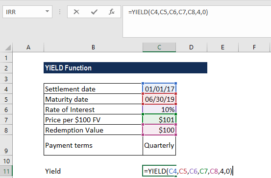

## Table of Contents

## What is yield and why is it important to calculate?

Yield is a measure of how much of something you get from a process or investment. For example, in farming, yield is the amount of crops you harvest from a field. In finance, yield is the income you earn from an investment, like the interest from a bond or dividends from stocks. It's a simple way to see how productive or profitable something is.

Calculating yield is important because it helps you understand if you are getting good results from your efforts or money. If a farmer knows the yield of their crops, they can decide if they need to change their methods to grow more food. For investors, knowing the yield helps them compare different investments and choose the ones that will give them the best return. This way, they can make smarter decisions and use their resources more effectively.

## How do you open Microsoft Excel to start calculating yield?

To open Microsoft Excel and start calculating yield, first find the Excel icon on your computer. It usually looks like a green square with a white 'X' inside. You can find this icon on your desktop, in the start menu, or by searching for 'Excel' in your computer's search bar. Once you find it, double-click the icon to open the program.

After Excel opens, you'll see a blank spreadsheet. This is where you can start entering your data to calculate yield. For example, if you're calculating crop yield, you might enter the number of acres and the amount of crops harvested in different cells. Then, you can use Excel's formulas to calculate the yield per acre. If you're calculating investment yield, you would enter the amount invested and the income earned, then use a formula to find the yield percentage.

## What are the basic formulas used to calculate yield in Excel?

To calculate crop yield in Excel, you need to know the total amount of crops harvested and the area of land used. Let's say you harvested 1000 bushels of wheat from 5 acres. You can enter the number of bushels in one cell, say A1, and the number of acres in another cell, say B1. To find the yield per acre, you would use a simple division formula in another cell, like C1. You would type '=A1/B1' in C1, and Excel will show you the yield, which in this case would be 200 bushels per acre.

For investment yield, you need to know the income earned from the investment and the amount invested. Let's say you invested $1000 and earned $50 in interest. You can enter the amount invested in one cell, say A2, and the income earned in another cell, say B2. To find the yield percentage, you would use a formula in another cell, like C2. You would type '=(B2/A2)*100' in C2, and Excel will show you the yield percentage, which in this case would be 5%. This helps you see how much return you are getting on your investment.

## How can you input data into Excel for yield calculation?

To input data into Excel for calculating crop yield, first open Excel and you will see a blank spreadsheet with rows and columns. Find an empty cell, like A1, and type in the total amount of crops you harvested. For example, if you harvested 1000 bushels of wheat, type '1000' into A1. Then, move to another cell, like B1, and type in the number of acres you used, such as '5'. Now, you have the basic data you need to calculate the yield per acre.

For calculating investment yield, open Excel and find an empty cell, like A2, to enter the amount you invested. For example, if you invested $1000, type '1000' into A2. Then, move to another cell, like B2, and type in the income you earned from the investment, such as '50' if you earned $50 in interest. With this data, you can now calculate the yield percentage to see how well your investment is doing.

## What are the common types of yield (e.g., bond yield, dividend yield) and how do they differ?

There are several common types of yield, and each one tells you something different about your investment. Bond yield is the amount of interest you earn from a bond each year, shown as a percentage of the bond's price. If you buy a bond for $1000 and it pays $50 in interest every year, the bond yield is 5%. Dividend yield is similar, but it's for stocks. It's the amount of money a company pays out in dividends each year, divided by the stock's price. If a stock costs $100 and pays $4 in dividends each year, the dividend yield is 4%.

These types of yield help investors compare different investments. Bond yield is important for people who want a steady income from their investments, like retirees. Dividend yield is important for people who want to earn money from stocks without selling them. Both types of yield can change over time, so it's good to keep an eye on them. Knowing the yield helps you decide if an investment is a good choice for you.

## How do you calculate bond yield using Excel functions?

To calculate bond yield in Excel, you first need to know some details about the bond, like its face value, the annual coupon payment, the time until it matures, and the price you paid for it. Let's say you bought a bond for $950 with a face value of $1000, it pays $50 in interest every year, and it will mature in 5 years. You can use the Excel function called YIELD to find out the bond's yield. In an empty cell, type '=YIELD(settlement, maturity, rate, pr, redemption, frequency, [basis])'. For our example, you would enter '=YIELD("2023-01-01", "2028-01-01", 0.05, 950, 1000, 1)' if the bond was bought on January 1, 2023, and matures on January 1, 2028. The '0.05' is the annual coupon rate (50/1000), '950' is the price you paid, '1000' is the face value, and '1' means the bond pays interest once a year. Excel will then show you the bond's yield.

Understanding bond yield helps you see how much money you will earn from the bond each year, compared to what you paid for it. If the yield is high, it means you are getting a good return on your investment. If it's low, you might want to look for other bonds that could give you a better return. Remember, the bond yield can change over time, so it's a good idea to check it regularly to make sure your investment is still doing well.

## Can you explain how to use the YIELD function in Excel?

The YIELD function in Excel helps you find out how much money you will earn from a bond every year, compared to what you paid for it. To use the YIELD function, you need to know some things about the bond: when you bought it, when it will mature, how much interest it pays each year, how much you paid for it, and its face value. In Excel, you type '=YIELD(settlement, maturity, rate, pr, redemption, frequency, [basis])' into a cell. The 'settlement' is the date you bought the bond, 'maturity' is when it will mature, 'rate' is the annual coupon rate, 'pr' is the price you paid, 'redemption' is the face value of the bond, 'frequency' is how often the bond pays interest (1 for yearly, 2 for semi-yearly), and 'basis' is an optional part that tells Excel how to count days.

For example, if you bought a bond on January 1, 2023, for $950, it pays $50 in interest each year, has a face value of $1000, and will mature on January 1, 2028, you would type '=YIELD("2023-01-01", "2028-01-01", 0.05, 950, 1000, 1)' into a cell. The '0.05' is the annual coupon rate because $50 divided by $1000 is 0.05, and '1' means the bond pays interest once a year. Excel will then show you the bond's yield, which tells you how good your investment is. If the yield is high, you are getting a good return on your money. If it's low, you might want to look for a better bond.

## How do you adjust for different compounding periods when calculating yield?

When you calculate yield, you need to think about how often the interest is paid. This is called the compounding period. If a bond pays interest once a year, you use a 'frequency' of 1 in the YIELD function in Excel. But if it pays interest twice a year, you use a 'frequency' of 2. The more often the interest is paid, the higher the yield will be because your money grows faster when it's added more often.

For example, let's say you have a bond that pays $50 every year and you paid $950 for it. If it pays interest once a year, you would use '=YIELD("2023-01-01", "2028-01-01", 0.05, 950, 1000, 1)' in Excel. But if it pays interest twice a year, you would use '=YIELD("2023-01-01", "2028-01-01", 0.05, 950, 1000, 2)'. The second formula would give you a higher yield because the interest is added more often, making your money grow faster.

## What are some advanced Excel functions that can be used for more complex yield calculations?

For more complex yield calculations, you can use the XIRR function in Excel. This function is great for figuring out the yield of investments that don't pay interest at regular times. You just need to know the dates and amounts of money you put in and take out. For example, if you invested $1000 on January 1, 2023, and got $1100 back on January 1, 2024, you would type '=XIRR({-1000, 1100}, {"2023-01-01", "2024-01-01"})' into a cell. This tells you the yearly rate of return, which is like the yield but for irregular payments.

Another useful function is the EFFECT function, which helps you find out the effective annual yield when interest is compounded more than once a year. If you have a bond that pays 5% interest every six months, you can use '=EFFECT(0.10, 2)' to find the effective annual yield. The '0.10' is the total yearly interest rate (5% + 5%), and '2' means it's compounded twice a year. This function shows you how much your money would grow in a year if it was compounded at that rate, which is important for understanding the true yield of your investment.

## How can you use Excel to compare yields from different investments?

To compare yields from different investments using Excel, you first need to gather the necessary data for each investment, like the amount invested, the income earned, and any other important details like the dates of transactions. Once you have this information, you can enter it into Excel. For example, if you have two bonds, you can put the purchase price, face value, and annual interest for each bond into separate rows or columns. Then, you can use the YIELD function to calculate the yield for each bond. You would type '=YIELD(settlement, maturity, rate, pr, redemption, frequency)' into a cell for each bond, changing the numbers to match each bond's details. This way, you can see the yield for each bond side by side and compare them easily.

After you have the yields calculated, you can use Excel to help you make a decision. You might want to sort the yields from highest to lowest to see which investment gives you the best return. Or, you could use a simple chart to show the yields visually, which can make it easier to understand the differences. If you're comparing different types of investments, like bonds and stocks, you might need to use different functions like XIRR for stocks with irregular dividends. By putting all this information into Excel, you can see at a glance which investment has the highest yield and make a smarter choice about where to put your money.

## What are common errors to avoid when calculating yield in Excel?

When calculating yield in Excel, one common mistake is getting the numbers wrong. It's easy to mix up the purchase price and the face value of a bond, or to put in the wrong dates for when you bought it and when it will mature. If you use the wrong numbers, your yield calculation will be off. So, make sure to double-check all the numbers you enter into the YIELD function. Another mistake is not using the right frequency for how often the bond pays interest. If a bond pays interest twice a year, you need to use a frequency of 2 in the YIELD function. Using the wrong frequency will give you the wrong yield.

Another error to watch out for is forgetting to update the yield calculation when things change. The yield of a bond can go up or down over time, so if you don't recalculate it, you might think you're getting a better or worse return than you really are. Also, make sure you're using the right Excel function for the type of investment you have. For example, if you're calculating the yield of a stock with irregular dividends, you need to use the XIRR function instead of the YIELD function. Using the wrong function will give you the wrong answer. By avoiding these common mistakes, you can make sure your yield calculations are accurate and helpful for making investment decisions.

## How can you automate yield calculations in Excel using macros or VBA?

You can automate yield calculations in Excel by using macros or VBA (Visual Basic for Applications). Macros are like shortcuts that let you do the same thing over and over without having to type it out each time. To make a macro for yield calculations, you first record what you do when you calculate the yield manually. You click 'Record Macro' in Excel, then do the steps to calculate the yield, like entering the numbers and using the YIELD function. After you're done, you stop recording, and Excel saves those steps as a macro. Now, whenever you want to calculate the yield, you can just run the macro, and it will do all the work for you.

VBA is a bit more advanced but gives you more control. With VBA, you can write code that tells Excel exactly what to do. For example, you can write a VBA script that takes the numbers you put into certain cells and uses them to calculate the yield automatically. You can also make the script run every time you open the Excel file or whenever you change certain cells. This way, you don't have to remember to run a macro; the yield calculation happens on its own. Using VBA can save you a lot of time and make sure your yield calculations are always up to date and correct.

## What is the meaning of yield in a financial context?

Yield is a fundamental concept in finance, encapsulating the income return on an investment over a specified period. It serves as a vital metric for evaluating the performance of various assets, including bonds, stocks, and other financial instruments. Yield calculations provide investors with insights into both the profitability and the potential risks associated with their investment opportunities, guiding them in their financial planning and decision-making processes.

### Types of Yield Calculations

There are several types of yield calculations that investors and analysts commonly use, each serving a distinct purpose in financial assessment:

1. **Current Yield**: This is calculated as the annual interest payment divided by the current market price of the bond. It provides a snapshot of the income generated by an investment, relative to its current price. The formula for current yield is:
$$
   \text{Current Yield} = \frac{\text{Annual Coupon Payment}}{\text{Current Market Price}}

$$

   Notably, current yield reflects the [earning](/wiki/earning-announcement) power of an investment at a specific point in time, making it a useful short-term indicator.

2. **Yield to Maturity (YTM)**: YTM is a more comprehensive measure, representing the total return anticipated on a bond if it is held until maturity. It considers the present value of all future coupon payments and the repayment of the principal at maturity. The YTM formula is more complex, often requiring iterative methods or financial calculators for precise computation. In Excel, the YIELD function can be utilized to compute YTM efficiently.
$$
   \text{YTM} = \left( \frac{\text{Coupon}}{1+y} + \frac{\text{Coupon}}{(1+y)^2} + \cdots + \frac{\text{Coupon} + \text{Face Value}}{(1+y)^n} \right) = \text{Current Price}

$$

   Here, $y$ is the yield, and $n$ is the number of periods until maturity. 

### Impact on Investment Decisions

Yield calculations profoundly influence investment decisions by enabling investors to compare the profitability of different financial instruments. For instance, a higher YTM might attract investors seeking long-term growth, while those focused on immediate [liquidity](/wiki/liquidity-risk-premium) might prefer investments with a substantial current yield.

Moreover, understanding these yields assists in financial planning by allowing for the assessment of potential income streams and the evaluation of risk profiles. This knowledge is invaluable, especially in configuring balanced portfolios that align with an investor's risk tolerance and financial goals.

In summary, yield analysis is indispensable for any investor or financial professional aiming to optimize their investment strategy. By quantifying the expected returns against market conditions and financial objectives, yield calculations offer a window into the future performance and risk exposure of financial assets.

## What are the financial formulas for yield calculation in Excel?

Excel is a versatile tool that offers a range of built-in functions to calculate yield, essential for investors and traders to make informed financial decisions. Understanding these Excel functions can simplify complex calculations and improve financial analysis accuracy.

### Basic Excel Formulas for Yield Calculation

#### Current Yield

The current yield is a straightforward calculation representing the annual income (interest or dividends) from an investment divided by the current market price of the security. In Excel, this can be computed using the formula:

$$
\text{Current Yield} = \frac{\text{Annual Coupon Payment}}{\text{Current Market Price}}
$$

For example, if a bond has an annual coupon payment of $50 and is currently priced at $1,000, the current yield is:

$$
\text{Current Yield} = \frac{50}{1000} = 0.05 \text{ or } 5\%
$$

In Excel, you would input `=50/1000` into a cell to compute the current yield.

#### Yield to Maturity (YTM)

Yield to maturity (YTM) is a more comprehensive measure of a bond's yield, reflecting the total return an investor can expect if the bond is held until maturity. Unlike the current yield, YTM considers all future coupon payments and the difference between the bond's current price and its face value. While YTM requires iterative calculations, Excel simplifies this with the `YIELD` function. 

The `YIELD` function in Excel has the following syntax:

```excel
YIELD(settlement, maturity, rate, pr, redemption, frequency, [basis])
```

- `settlement`: The date the bond is purchased.
- `maturity`: The bond's maturity date.
- `rate`: The annual coupon rate.
- `pr`: The bond's current price per $100 face value.
- `redemption`: The amount to be received at maturity, typically $100 for each bond.
- `frequency`: The number of coupon payments per year (1, 2, or 4).
- `basis`: The day count basis to use (optional).

For example, to calculate the YTM of a bond with a 5% annual coupon rate, sold for $950 with a maturity date one year from the settlement date, with semi-annual payments, and $100 redemption, you would use:

```excel
=YIELD(TODAY(), DATE(YEAR(TODAY())+1, MONTH(TODAY()), DAY(TODAY())), 0.05, 950, 100, 2)
```

### Setting Up Excel for Bond Yield Calculations

To efficiently set up an Excel worksheet for bond yield calculations, follow these steps:

1. **Data Input**: Label columns for essential data such as settlement date, maturity date, coupon rate, bond price, redemption value, and frequency.
2. **Function Application**: Use the Excel `YIELD` function for each bond entry to compute the yield to maturity.
3. **Automating Calculations**: Implement Excel formulas to compute results automatically as input data changes, allowing for dynamic financial modeling.

### Illustrative Examples

Suppose a trading portfolio manager has several bonds, each with different parameters. By organizing the data into an Excel spreadsheet and applying the current yield and YTM formulas, they can quickly assess the comparative yields. 

Consider the following Excel setup for bonds:

| Settlement Date | Maturity Date | Coupon Rate | Bond Price | Redemption | Frequency | Current Yield | YTM         |
|-----------------|---------------|-------------|------------|------------|-----------|---------------|-------------|
| 01/01/2023      | 01/01/2028    | 5%          | $1,050     | $100       | 2         | `=50/1050`    | `=YIELD(...)` |

By inputting the detailed information into the spreadsheet, the manager can compute both the current yield and the YTM effortlessly, ensuring more accurate investment decisions.

Excel's yield calculation functions empower users with the ability to perform sophisticated financial assessments with ease. Understanding and utilizing these capabilities can significantly enhance trading and investment analysis.

## References & Further Reading

[1]: ["Excel 2019 for Dummies"](https://www.amazon.com/Excel-2019-Dummies-Greg-Harvey/dp/1119513324) by Greg Harvey

[2]: Fabozzi, F. J. (2003). ["Fixed Income Analysis Workbook."](https://books.google.com/books/about/Fixed_Income_Analysis.html?id=lujLawVLS3YC) CFA Institute Investment Series.

[3]: Chincarini, L. B., & Kim, D. (2006). ["Quantitative Equity Portfolio Management."](https://www.amazon.com/Quantitative-Equity-Portfolio-Management-Construction/dp/0071459391) McGraw Hill.

[4]: ["Microsoft Excel Data Analysis For Dummies"](https://www.wiley.com/en-us/Excel+Data+Analysis+For+Dummies%2C+5th+Edition-p-9781119844426) by Paul McFedries

[5]: ["Financial Modelling in Practice: A Concise Guide for Intermediate and Advanced Level"](https://onlinelibrary.wiley.com/doi/book/10.1002/9781118374658) by Michael Rees

[6]: Litterman, R., & Scheinkman, J. (1991). ["Common Factors Affecting Bond Returns."](https://www.pm-research.com/content/iijfixinc/1/1/54) The Journal of Fixed Income.

[7]: ["Algorithmic Trading & DMA: An introduction to direct access trading strategies"](https://archive.org/details/algorithmictradi0000john) by Barry Johnson

[8]: Zivot, E., & Wang, J. (2006). ["Modeling Financial Time Series with S-PLUS."](https://link.springer.com/book/10.1007/978-0-387-32348-0) Springer.