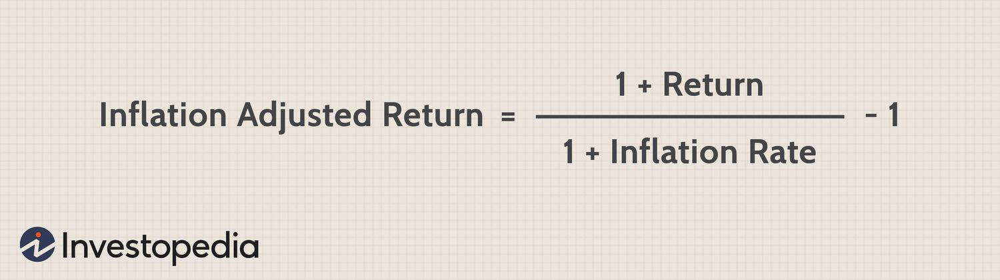

## Table of Contents

## What is an inflation-adjusted bond?

An inflation-adjusted bond is a type of bond that protects investors from inflation. Inflation is when prices go up over time, making money worth less. These bonds change their value based on inflation rates, so the money you get back keeps its buying power.

For example, if you buy an inflation-adjusted bond and inflation goes up, the bond's value will increase too. This means you will get more money when the bond matures or when you get interest payments. This makes these bonds a good choice for people who want to make sure their investment keeps up with rising prices.

## Why is calculating the yield of inflation-adjusted bonds important?

Calculating the yield of inflation-adjusted bonds is important because it helps investors understand how much money they will really earn from their investment. The yield tells you the return on your investment after accounting for inflation. This is key because inflation can eat away at the value of money over time. By knowing the yield, investors can see if the bond will keep up with or even beat inflation, helping them make smarter choices about where to put their money.

Also, knowing the yield helps investors compare inflation-adjusted bonds with other investment options. Different investments have different risks and returns. By looking at the yield, investors can decide if an inflation-adjusted bond is a better choice than, say, a regular bond or a stock. This comparison is crucial for building a balanced investment portfolio that meets their financial goals while managing risk.

## How does inflation affect bond yields?

Inflation can change how much money you get from bonds. When inflation goes up, the value of money goes down. This means that the fixed payments you get from regular bonds are worth less. So, to make up for this, people who lend money (bond investors) want higher interest rates. This makes bond yields go up because the yield is the [interest rate](/wiki/interest-rate-trading-strategies) you get from the bond.

Inflation-adjusted bonds work differently. These bonds change their value based on inflation. If inflation goes up, the bond's payments go up too. This means the yield stays about the same in real terms, because the bond keeps up with inflation. So, with inflation-adjusted bonds, the yield doesn't change much even when inflation changes.

## What is the difference between nominal yield and real yield?

Nominal yield is the interest rate you see on a bond before you think about inflation. It's the percentage of the bond's price that you get as interest every year. For example, if you have a bond that pays $50 a year and you paid $1,000 for it, the nominal yield is 5%. This is the simple way to see how much money you're getting from the bond.

Real yield is different because it takes inflation into account. It tells you how much your money is really growing after prices go up. If the nominal yield on your bond is 5% but inflation is 2%, the real yield is only 3%. This is important because it shows you if your bond is keeping up with the cost of living. Inflation-adjusted bonds are designed to give you a real yield that stays the same even when inflation changes.

## How do you calculate the real yield of an inflation-adjusted bond?

To calculate the real yield of an inflation-adjusted bond, you start with the bond's nominal yield. This is the interest rate the bond pays you before thinking about inflation. Then, you look at the inflation rate over the same time period. You can find the inflation rate from government reports or economic data. Once you know both numbers, you subtract the inflation rate from the nominal yield. For example, if your bond has a nominal yield of 3% and the inflation rate is 1%, the real yield would be 3% minus 1%, which is 2%.

This calculation is important because it shows you how much your money is really growing. If the real yield is positive, your investment is keeping up with inflation, and your money is worth more over time. If the real yield is negative, inflation is going up faster than your bond's payments, so your money is worth less. Inflation-adjusted bonds are designed to keep the real yield steady, so you know what to expect even when prices change.

## What is the formula for calculating the yield of inflation-adjusted bonds?

To calculate the yield of an inflation-adjusted bond, you need to know two things: the nominal yield of the bond and the inflation rate. The nominal yield is the interest rate the bond pays you before you think about inflation. The inflation rate tells you how much prices are going up. To find the real yield, which is the yield after inflation, you subtract the inflation rate from the nominal yield. For example, if your bond has a nominal yield of 4% and the inflation rate is 2%, the real yield is 4% minus 2%, which equals 2%.

This calculation is important because it shows you how much your money is really growing. If the real yield is positive, it means your investment is keeping up with inflation, and your money is worth more over time. If the real yield is negative, inflation is going up faster than your bond's payments, so your money is worth less. Inflation-adjusted bonds are designed to keep the real yield steady, so you know what to expect even when prices change.

## How do inflation expectations influence the yield of inflation-adjusted bonds?

Inflation expectations are what people think inflation will be in the future. These expectations can change the yield of inflation-adjusted bonds. If people expect higher inflation, they might want a higher yield to make up for the rising prices. This means the bond's nominal yield might go up to keep the real yield the same. Inflation-adjusted bonds are made to keep up with inflation, so if inflation is expected to be higher, the bond's payments will go up too.

On the other hand, if people expect lower inflation, they might be okay with a lower nominal yield. This is because the bond's payments won't need to go up as much to keep up with inflation. So, the yield of inflation-adjusted bonds can change based on what people think will happen with inflation in the future. This helps make sure the bond keeps its value even when people's expectations about inflation change.

## What are the key components needed to calculate the yield of inflation-adjusted bonds?

To calculate the yield of inflation-adjusted bonds, you need to know two main things: the bond's nominal yield and the inflation rate. The nominal yield is the interest rate the bond pays you before you think about inflation. It's like the sticker price of the bond's return. The inflation rate tells you how much prices are going up. You can find this number from government reports or economic data. These two pieces of information are what you need to figure out the yield.

Once you have the nominal yield and the inflation rate, you subtract the inflation rate from the nominal yield to get the real yield. The real yield shows you how much your money is really growing after accounting for inflation. For example, if your bond has a nominal yield of 4% and the inflation rate is 2%, the real yield is 4% minus 2%, which equals 2%. This calculation is important because it tells you if your investment is keeping up with the rising cost of living. Inflation-adjusted bonds are designed to keep the real yield steady, so your money keeps its value even when prices change.

## How does the choice of inflation index affect the yield calculation?

The choice of inflation index can change how you calculate the yield of inflation-adjusted bonds. An inflation index is a way to measure how much prices are going up. Different countries might use different indexes, like the Consumer Price Index (CPI) in the United States or the Retail Price Index (RPI) in the UK. If you use a different inflation index, the number you get for inflation will be different. This means the real yield you calculate will also be different because the real yield is what you get after you subtract the inflation rate from the bond's nominal yield.

Using a different inflation index can make a big difference in the yield calculation. For example, if one index shows a higher inflation rate than another, the real yield of your bond will be lower when you use that index. This is because you're subtracting a bigger number from the nominal yield. So, it's important to know which inflation index your bond uses. That way, you can make sure your yield calculation is right and you understand how much your money is really growing.

## What are common pitfalls when calculating the yield of inflation-adjusted bonds?

One common mistake when calculating the yield of inflation-adjusted bonds is using the wrong inflation index. Different countries use different indexes to measure inflation, like the Consumer Price Index (CPI) or the Retail Price Index (RPI). If you use the wrong index, your inflation rate will be off, which means your real yield calculation won't be right. The real yield is what you get after subtracting the inflation rate from the bond's nominal yield, so using the wrong index can make a big difference.

Another pitfall is not updating the inflation rate regularly. Inflation changes over time, so you need to use the most recent data to get an accurate real yield. If you use old inflation numbers, your calculation won't reflect what's happening now, and you might think your bond is doing better or worse than it really is. Keeping up with the latest inflation figures is important to make sure your yield calculation stays correct.

## How do you adjust the yield calculation for different compounding frequencies?

When you want to figure out the yield of an inflation-adjusted bond with different compounding frequencies, you need to know how often the interest is added to the bond's value. Compounding can happen yearly, semi-annually, quarterly, or even monthly. The more often the interest is compounded, the more money you'll get because the interest starts earning interest on itself more frequently. To adjust the yield calculation, you use a formula that takes into account how often the interest is compounded. The formula is: Yield = (1 + Nominal Yield / Number of Compounding Periods)^(Number of Compounding Periods) - 1. This helps you see how the bond's value grows over time with different compounding schedules.

For example, if your bond has a nominal yield of 4% and it compounds semi-annually, you would divide the nominal yield by 2 (the number of compounding periods in a year) to get 2%. Then, you would use the formula: Yield = (1 + 0.02)^2 - 1. This would give you a yield of about 4.04%. If the same bond compounded quarterly, you would divide the nominal yield by 4 to get 1%, and use the formula: Yield = (1 + 0.01)^4 - 1, which would give you a yield of about 4.06%. So, the more often the interest is compounded, the higher the yield will be, even if the nominal yield stays the same.

## How can advanced statistical models improve the accuracy of yield calculations for inflation-adjusted bonds?

Advanced statistical models can help make yield calculations for inflation-adjusted bonds more accurate by predicting inflation better. These models look at a lot of different things, like past inflation numbers, economic reports, and even what people think will happen in the future. By using all this information, the models can guess the inflation rate more closely than just using the latest numbers. This means when you subtract the inflation rate from the bond's nominal yield to find the real yield, you're using a better guess of inflation, so your real yield calculation is more correct.

Also, these models can take into account how often the interest is added to the bond's value, which is called compounding. Different bonds might add interest yearly, every six months, or even every month. Advanced models can adjust for these different schedules to give you a more exact yield. This is important because the more often interest is added, the more money you get. So, by using these models, you can see how your bond will grow over time more clearly, helping you make better choices about your investments.

## Are Inflation-Adjusted Bonds a Hedge Against Inflation?

Inflation-adjusted bonds are crucial financial instruments designed to protect investors from the eroding effects of inflation. One of the most widely recognized forms of these securities is the Treasury Inflation-Protected Securities (TIPS) offered by the U.S. Department of the Treasury. These bonds are structured to adjust their principal based on changes in the Consumer Price Index (CPI), ensuring that the purchasing power of the invested capital is preserved over time.

### How Inflation-Adjusted Bonds Work and Their Benefits to Investors

Inflation-adjusted bonds work by linking the bond's principal to an inflation index, such as the CPI. As inflation rises, the principal amount of the bond is adjusted upwards, thereby increasing the interest payments, which are calculated as a percentage of the adjusted principal. This mechanism ensures that the real value of the investment and the return keeps pace with inflation.

Benefits to investors include:

1. **Preservation of Purchasing Power**: By adjusting the principal for inflation, these bonds help maintain the investor's purchasing power, thus reducing the negative impact of inflation on returns.

2. **Reduced Inflation Risk**: Investors in inflation-adjusted bonds are shielded from the risk of inflation eroding their investment returns, which is a significant concern with regular fixed-income securities.

3. **Predictable Real Returns**: These bonds provide a reliable real yield, as both the principal and interest payments are adjusted for inflation.

### Comparison Between Regular Bonds and Inflation-Adjusted Bonds in Terms of Risk and Return

Regular bonds typically provide fixed interest payments and return the principal amount at maturity, leaving investors exposed to inflation risk. In contrast, inflation-adjusted bonds, like TIPS, offer adjusted payouts that fluctuate with inflation, thus mitigating this risk.

In terms of risk, regular bonds are exposed to inflation risk, meaning that the purchasing power of interest payments and principal may diminish in real terms if inflation rises. Inflation-adjusted bonds eliminate this risk by design. However, they have their own risks, such as those associated with fluctuations in real interest rates.

In terms of return, while regular bonds may offer higher nominal yields, their real returns can be significantly lower during inflationary periods. Inflation-adjusted bonds, on the other hand, may offer lower nominal yields but guarantee real yields, ensuring better inflation protection.

### The Significance of Real Yield and Its Calculation in Inflation-Adjusted Bonds

Real yield refers to the return on an investment adjusted for inflation. For inflation-adjusted bonds, it is calculated using the formula:

$$
\text{Real Yield} = \frac{\text{Nominal Yield} - \text{Inflation Rate}}{1 + \text{Inflation Rate}}
$$

This formula reflects the true [earning](/wiki/earning-announcement) potential of an investment by accounting for the inflation impact. For TIPS, the quoted yield is already adjusted for inflation, allowing investors to understand the real return without additional calculations.

### Case Studies or Examples of Inflation-Adjusted Bonds in Action

Consider a scenario during a period of rising inflation, such as the late 2000s. Investors in standard Treasury bonds would have witnessed a reduction in their real investment returns as the consumer prices soared. Meanwhile, investors in TIPS saw adjustments in their principal and interest payments that compensated for inflation, effectively preserving their investment's real value.

Another example can be seen in diversified portfolios that include inflation-adjusted bonds. These portfolios often fare better under inflationary pressures as the bonds provide stable real returns, thus contributing to overall portfolio resilience.

Inflation-adjusted bonds are a valuable tool for investors seeking to safeguard their investment against inflation. They offer a secure means to ensure real returns, making them an integral component of a balanced investment strategy.

## References & Further Reading

[1]: Bodie, Z., Kane, A., & Marcus, A. J. (2013). ["Investments"](https://www.mheducation.com/highered/product/Investments-Bodie.html). McGraw-Hill Education.

[2]: Tuckman, B. & Serrat, A. (2011). ["Fixed Income Securities: Tools for Today's Markets"](https://www.amazon.com/Fixed-Income-Securities-Todays-Markets/dp/0470891696). Wiley.

[3]: ["Advances in Financial Machine Learning"](https://www.amazon.com/Advances-Financial-Machine-Learning-Marcos/dp/1119482089) by Marcos Lopez de Prado.

[4]: Fabozzi, F. J. (2009). ["Handbook of Fixed-Income Securities"](https://www.amazon.com/Handbook-Fixed-Income-Securities-Ninth/dp/1260473899). McGraw-Hill Education.

[5]: ["Quantitative Trading: How to Build Your Own Algorithmic Trading Business"](https://www.amazon.com/Quantitative-Trading-Build-Algorithmic-Business/dp/1119800064) by Ernest P. Chan.

[6]: Shreve, S. E. (2004). ["Stochastic Calculus for Finance I: The Binomial Asset Pricing Model"](https://link.springer.com/book/10.1007/978-0-387-22527-2). Springer.

[7]: ["Machine Learning for Algorithmic Trading"](https://github.com/stefan-jansen/machine-learning-for-trading) by Stefan Jansen.