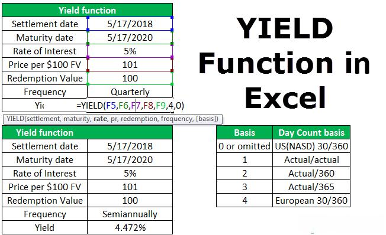

Understanding bond calculations and yield to maturity (YTM) is essential for investors focusing on fixed-income securities. Yield to maturity provides a comprehensive measure of a bond's potential returns, given its current price, coupon payments, and time to maturity. It is an integral part of bond valuation, helping investors compare different bonds and assess the risk-return trade-off for potential investments. By estimating the annual return an investor can expect if the bond is held until maturity, YTM serves as a benchmark for making informed investment decisions.

Microsoft Excel is widely recognized for its versatility in handling financial computations, including those necessary for accurate bond pricing and yield calculations. Excel's suite of functions allows investors to model various scenarios, offering detailed insights into different bond metrics. For instance, functions such as RATE, YIELD, and YIELDMAT in Excel can compute yields based on bond details like coupon rates and market prices. These built-in tools provide an accessible platform for both veteran investors and those new to fixed-income securities, ensuring that even complex calculations are simplified and transparent.



The role of Excel extends beyond basic calculations, forming the backbone of algorithmic trading in modern finance. By transitioning bond yield calculations into automated trading algorithms, Excel helps blend analytical approaches with trading strategies, allowing investors to maximize their portfolio performance in dynamic markets. Thus, mastering bond yield computations in Excel not only aids in evaluating individual securities but also supports the development of cutting-edge trading systems capable of reacting swiftly to market changes. This article aims to elucidate the methodologies employed in Excel for executing bond yield calculations and their consequential adaptation in algorithmic trading strategies.

## Table of Contents

## Understanding Bonds and Yield to Maturity

Yield to maturity (YTM) is a critical metric for investors in fixed-income securities, reflecting the total return an investor can expect if a bond is held until it matures. It encompasses both the present value of future interest payments, known as coupon payments, and the bond's face value, which is repaid upon maturity. These calculations collectively account for the total expected yield of the bond, expressed as an annual percentage rate.

YTM is calculated based on the principle that the present value of a bond's future cash flows should equal its current market price. The bond price equation can be expressed as:

$$

P = \sum_{t=1}^{n} \frac{C}{(1 + YTM)^t} + \frac{F}{(1 + YTM)^n} 
$$

Where:
- $P$ is the current market price of the bond.
- $C$ represents the coupon payment received per period.
- $n$ is the total number of periods until maturity.
- $F$ denotes the bond's face value.
- $YTM$ is the yield to maturity, which the equation seeks to determine.

YTM provides investors with a standardized method for comparing the potential returns of various bonds, encompassing different maturities, coupon rates, and market prices. This is crucial for evaluating the risk and return profile associated with different bond investments. Investors can use YTM to gauge the attractiveness of a bond relative to its peers by assessing whether a bond offers a favorable return given its market and credit risks.

The calculation of YTM assumes that all coupon payments are reinvested at the YTM rate, which may not always reflect real-world conditions. Nevertheless, this assumption provides a uniform framework for comparison and risk assessment across the fixed-income market. YTM is fundamental to portfolio management, enabling investors to devise strategies that align with their investment goals and risk tolerance.

## Bond Pricing Fundamentals

Bond pricing is a fundamental aspect of bond investing and involves determining the present value of all future cash flows generated by the bond, including periodic interest payments and the principal repayment at maturity. This evaluation is crucial as it influences an investor's assessment of a bond’s overall value compared to other investment opportunities.

### Present Value Calculation

To calculate the present value of a bond, the following formula is applied:

$$

PV = \sum_{t=1}^{n} \frac{C}{(1+r)^t} + \frac{F}{(1+r)^n} 
$$

where:
- $PV$ is the present value of the bond.
- $C$ is the coupon payment.
- $r$ is the required return or discount rate.
- $F$ is the face value of the bond.
- $n$ is the total number of periods.
- $t$ is the specific time period at which the cash flow occurs.

### Factors Affecting Bond Pricing

1. **Coupon Rate**: The coupon rate is the bond’s stated interest rate, which determines the periodic payment amounts to the bondholder. A higher coupon rate generally increases the bond's present value, assuming other conditions remain constant.

2. **Required Return**: Also known as the discount rate, the required return reflects the investor's expected rate of return for the bond. This rate is influenced by factors like perceived risk and prevailing market interest rates. A rise in the required return will decrease the bond’s present value, as future cash flows are discounted more heavily.

3. **Market Interest Rates**: Interest rates in the broader market significantly impact bond pricing. As market interest rates rise, existing bonds with lower fixed coupon rates become less attractive, resulting in a decline in their value. Conversely, if market rates fall, the value of existing bonds goes up.

### Utilizing Excel for Bond Pricing

Microsoft Excel provides users with robust functions to streamline the bond pricing process. For example, the "PV" function can be utilized to calculate the present value of future cash flows. This makes bond pricing accessible, enabling users with limited financial backgrounds to perform complex financial analyses. Here’s a simple way to use Excel to calculate the present value of a bond’s cash flows:

```python
import numpy as np

# Define bond parameters
coupon_payment = 50  # example coupon payment
face_value = 1000    # bond's face value
discount_rate = 0.05 # required discount rate
n_periods = 10       # lifetime of the bond in years

# Calculate CFs
cash_flows = np.full(n_periods, coupon_payment)
cash_flows[-1] += face_value   # add face value to the last cash flow

# Compute Present Value
present_value = np.npv(discount_rate, cash_flows)
print(f"The present value of the bond is: ${present_value:.2f}")
```

This code uses Python's NumPy library to efficiently calculate the present value, illustrating the kind of computations that Excel automates with built-in functions like `PV`. By simplifying these calculations, Excel enables investors and analysts to evaluate bonds more efficiently, supporting informed decision-making in fixed-income investing.

## Using Microsoft Excel for Bond Calculations

Microsoft Excel offers a suite of functions designed to simplify bond calculations for investors and financial analysts. Among the most commonly used functions for calculating bond metrics are RATE, YIELD, and YIELDMAT. These functions are instrumental in determining the yield to maturity (YTM) and other yield measures with precision and efficiency.

### RATE Function
The RATE function is primarily used to calculate the [interest rate](/wiki/interest-rate-trading-strategies) per period of an annuity. In the context of bonds, it can be employed to ascertain the periodic interest rate when the number of periods, periodic payment, present value, future value, and type of annuity are known. The basic syntax for the RATE function is:

```
RATE(nper, pmt, pv, [fv], [type], [guess])
```

Where:
- `nper` is the total number of payment periods.
- `pmt` is the payment made each period; it remains constant throughout the annuity's life.
- `pv` is the present value, or the total amount that a series of future payments is worth now.
- `[fv]` is the future value, or the cash balance desired after the last payment is made.
- `[type]` indicates when payments are due (0 = end of period, 1 = beginning).

### YIELD Function
The YIELD function directly calculates the annual yield of a security that pays periodic interest. It is particularly useful for determining the yield of standard fixed-interest securities. The syntax for the YIELD function is:

```
YIELD(settlement, maturity, rate, pr, redemption, frequency, [basis])
```

Where:
- `settlement` is the security's settlement date.
- `maturity` is the security's maturity date.
- `rate` is the security's annual coupon rate.
- `pr` is the security's price per $100 face value.
- `redemption` is the security's redemption value per $100 face value.
- `frequency` is the number of coupon payments per year (1, 2, or 4).
- `[basis]` is the day count basis to use (0 = 30/360, 1 = actual/actual, etc.).

### YIELDMAT Function
The YIELDMAT function is used for calculating the annual yield of a security that pays interest at maturity. This function is particularly applicable for zero-coupon bonds or bonds where the interest is paid at maturity rather than periodically. The formula is structured as:

```
YIELDMAT(settlement, maturity, issue, rate, pr, [basis])
```

Where each argument corresponds similarly to the YIELD function, but it also includes:
- `issue` as the security's issue date.

Excel's adaptability allows these functions to be incorporated into both manual financial models and automated trading algorithms. Users can easily modify their calculations based on different scenarios, making Excel a preferred tool for individuals and entities involved in financial analysis.

Additionally, using Excel's array formulas and programming features such as VBA (Visual Basic for Applications), users can automate complex bond calculations and integrate them into larger financial systems. This capability is invaluable for [algorithmic trading](/wiki/algorithmic-trading) strategies, where real-time decision-making and calculations are imperative.

As a versatile platform, Excel not only eases the process of bond yield calculations but also supports sophisticated financial modeling and algorithmic trading applications, enhancing its utility across various financial sectors.

## Implementing Yield to Maturity Calculations in Excel

Setting up yield to maturity (YTM) calculations in Microsoft Excel involves utilizing specific financial functions capable of processing complex bond data. Excel is equipped with built-in tools such as RATE, YIELD, and others that facilitate the accurate computation of YTM values, making it accessible to investors with varied expertise levels.

### Detailed Steps for Yield to Maturity Calculation

1. **Data Preparation**:
   Begin by collecting the necessary bond details:
   - **Face Value (FV)**: The bond's redemption value at maturity.
   - **Current Market Price (P)**: The amount paid to purchase the bond.
   - **Coupon Rate**: The annual interest payment percentage of the bond's face value.
   - **Number of Periods (N)**: Total payment periods until the bond matures.
   - **Annual or Periodic Payment**: Based on the coupon rate and bond frequency.

2. **Using the YIELD Function**:
   Excel's `YIELD` function can calculate YTM by requiring parameters such as settlement date, maturity date, coupon rate, and others.

   Example:
   ```excel
   =YIELD(settlement, maturity, rate, pr, redemption, frequency, [basis])
   ```
   - **Settlement**: Date when the bond is purchased.
   - **Maturity**: Maturity date of the bond.
   - **Rate**: Annual coupon rate.
   - **Pr**: Current market price.
   - **Redemption**: Redemption value per $100 face value.
   - **Frequency**: Number of coupon payments per year (e.g., 1, 2, 4 for annual, semi-annual, and quarterly, respectively).

3. **Applying the RATE Function**:
   The `RATE` function can also approximate the YTM by solving for the interest rate in the present value equation of bond pricing.

   Example in Excel:
   ```excel
   =RATE(nper, pmt, pv, [fv], [type], [guess])
   ```
   - **Nper**: Total number of periods until maturity.
   - **Pmt**: Periodic coupon payment amount.
   - **Pv**: Present value, or the negative of the bond's current market price.
   - **Fv**: Future value at maturity.

### Real-World Application

Consider a bond with a face value of $1,000, a market price of $950, a coupon rate of 5% paid semi-annually, and five years to maturity. Utilize the `YIELD` function using specific bond data to determine YTM:
```excel
=YIELD(DATE(2023,1,1), DATE(2028,1,1), 0.05, 950, 1000, 2, 0)
```

Alternatively, using the `RATE` function,
```excel
=RATE(10, 25, -950, 1000) * 2
```
(Multiply the result by 2 to annualize the semi-annual rate).

### Handling Various Bond Types

#### Zero-Coupon Bonds:
Zero-coupon bonds do not offer periodic interest payments, requiring a different approach:

For a zero-coupon bond with a face value of $1,000, current price of $800, and maturity in 3 years, use the `RATE` function:
```excel
=RATE(3, 0, -800, 1000)
```
This provides the annual yield, as interest compounds solely at maturity.

### Tips for Accuracy

- **Data Consistency**: Ensure all date inputs and interest rates are consistent in terms of frequency and basis.
- **Use of Correct Function**: While `YIELD` is well-suited for bonds with periodic coupons, the `RATE` function can be adapted for custom payment schedules or zero-coupon bonds.
- **Basis Parameter**: The basis in date functions accounts for different day count conventions. Choose appropriately to reflect bond terms.

Understanding the application of Excel functions in calculating bond yields empowers investors to confidently manage bond portfolios and validate trading strategies, enhancing financial decision-making precision.

## Excel in Algorithmic Trading

Algorithmic trading strategies frequently leverage Microsoft Excel for their ability to perform complex calculations and model bond investments efficiently. Excel serves as a useful platform for the initial analysis and testing of bond investment models. Its comprehensive suite of financial functions allows traders to calculate key metrics such as yield to maturity (YTM) and assess the impact of varying market conditions on their bond portfolios. Traders can simulate different scenarios and optimize strategies before deploying them in real-world trading environments.

Excel's advanced features, such as its data analysis toolpak and ability to handle Visual Basic for Applications (VBA), offer powerful options for automating trading decisions. Through Excel, bond traders can develop custom trading models that monitor yield curves and other financial parameters in real-time. By using VBA scripting, traders can automate tasks such as data importation, calculations, and the execution of trading signals. For example, a trader might also write a VBA macro to update bond prices and calculate the YTM automatically, streamlining workflow and minimizing manual input errors.

```python
# Example of Python code to calculate the yield to maturity
def calculate_ytm(present_value, future_value, periodic_coupon, num_periods):
    ytm = (periodic_coupon + (future_value - present_value) / num_periods) / ((future_value + present_value) / 2)
    return ytm
```

Despite these capabilities, transitioning from Excel models to fully automated trading systems presents challenges. One major challenge is the scalability of Excel-based models. While Excel is suitable for developing and testing trading strategies in a static environment, it may not handle high-frequency trading data or execute trades at the speeds required by active markets. Thus, traders need to migrate their models to more robust platforms, such as Python or specialized trading software, to handle larger datasets and execute trades in real-time.

Another challenge is ensuring data integrity and accuracy. In trading, erroneous data inputs can lead to flawed calculations and poor trading decisions. As such, implementing thorough data validation checks in Excel, or the final automated system, is a crucial best practice. Additionally, it is advisable to maintain clear documentation and version control when developing and updating trading models to facilitate troubleshooting and updates.

Ultimately, while Excel remains an essential tool for initial strategy formulation and testing in algorithmic trading, integrating dedicated programming languages and trading platforms is vital for executing fully automated systems effectively. By adhering to best practices and embracing advanced technology, traders can maximize the return potential from their bond investments.

## Conclusion

Excel remains a vital tool for investors and traders when it comes to bond yield calculations and strategy development. Its comprehensive suite of financial functions allows users to accurately calculate essential metrics such as yield to maturity (YTM), which is crucial for evaluating the potential rate of return on bonds, taking into account their present value and future cash flows. This capability enables investors to make informed decisions and optimize portfolio returns, particularly in the fixed-income market where precise calculations are key to assessing investment viability and risk.

Excel's versatility extends beyond basic calculations; it serves as a robust platform for modeling complex financial strategies, including algorithmic trading. With its advanced functionalities, Excel facilitates the automation of trading decisions, aligning calculated yields with dynamic market conditions. Features such as macros and Visual Basic for Applications (VBA) enhance Excel's capacity to handle sophisticated computations and workflows, allowing traders to simulate and test different scenarios efficiently.

Moreover, continuous advancements in Excel's capabilities, such as Power Query and dynamic arrays, have significantly increased the software's processing power and ease of data analysis. These enhancements have expanded Excel's applicability in modern finance, providing users with tools needed to integrate real-time data feeds, automate complex analytical processes, and create data-driven trading algorithms.

Overall, mastering bond metrics within Excel not only equips investors with the ability to make strategic financial decisions but also prepares them to leverage the latest advancements in technology for more effective trading strategies. As Excel evolves, its role in finance becomes increasingly pivotal, bridging the gap between traditional financial analysis and modern automated trading solutions.

## References & Further Reading

[1]: Fabozzi, F. J. (2012). ["Bond Markets, Analysis, and Strategies"](https://books.google.com/books/about/Bond_Markets_Analysis_and_Strategies_ten.html?id=bQpNEAAAQBAJ). Prentice Hall.

[2]: Bodie, Z., Kane, A., & Marcus, A. J. (2014). ["Investments"](https://www.mheducation.com/highered/product/Investments-Bodie.html). McGraw-Hill Education.

[3]: Damodaran, A. (2010). ["The Little Book of Valuation: How to Value a Company, Pick a Stock and Profit"](https://www.amazon.com/Little-Book-Valuation-Company-Profits/dp/1394244401). Wiley.

[4]: ["Microsoft Excel 2019 Data Analysis and Business Modeling"](https://www.microsoftpressstore.com/store/microsoft-excel-2019-data-analysis-and-business-modeling-9781509305889) by Wayne Winston

[5]: ["Financial Modelling in Practice: A Concise Guide for Intermediate and Advanced Level"](https://onlinelibrary.wiley.com/doi/book/10.1002/9781118374658) by Michael Rees

[6]: Brandimarte, P. (2012). ["Quantitative Methods: An Introduction for Business Management"](https://onlinelibrary.wiley.com/doi/book/10.1002/9781118023525). Wiley.

[7]: Hull, J. C. (2017). ["Options, Futures, and Other Derivatives"](https://www.semanticscholar.org/paper/Options%2C-Futures%2C-and-Other-Derivatives-Hull/89bdee500c8623864fc9eb7a471546aa713acc44). Pearson.