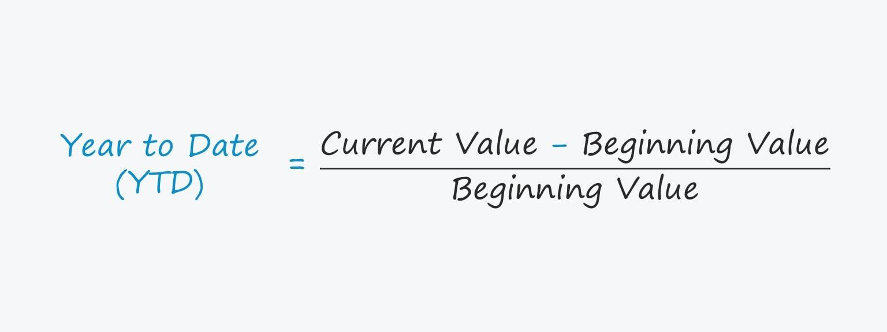

## Table of Contents

## What is a Year-to-Date (YTD) return on an investment portfolio?

Year-to-Date (YTD) return on an investment portfolio is a measure of how much the portfolio has grown or lost from the beginning of the current year to the current date. It's a useful way to see how well your investments are doing over the part of the year that has already passed. For example, if you want to know how your stocks, bonds, or mutual funds have performed since January 1 until today, you would look at the YTD return.

To calculate the YTD return, you start with the value of your portfolio at the beginning of the year and compare it to its value today. If your portfolio was worth $10,000 on January 1 and is now worth $11,000, your YTD return would be positive, showing a gain. On the other hand, if it's now worth $9,000, your YTD return would be negative, indicating a loss. This simple calculation helps investors quickly understand their portfolio's performance over the current year.

## Why is it important to calculate the YTD return on an investment portfolio?

Calculating the Year-to-Date (YTD) return on an investment portfolio is important because it gives you a clear picture of how your investments are doing so far this year. It helps you see if your portfolio is growing or losing value over the time from January 1 to the current date. This can be really helpful for making decisions about whether to keep your investments as they are or make changes to improve your returns.

Knowing the YTD return also allows you to compare your portfolio's performance with other investments or market benchmarks. For example, if the stock market is up 10% YTD but your portfolio is only up 5%, you might want to look into why your investments are not keeping up. This comparison can guide you in adjusting your investment strategy to better meet your financial goals.

## What are the basic steps to calculate the YTD return on an investment portfolio?

To calculate the Year-to-Date (YTD) return on your investment portfolio, start by finding out how much your portfolio was worth at the beginning of the year, on January 1. Then, check its current value today. Subtract the starting value from the current value to find out the gain or loss. For example, if your portfolio was worth $10,000 on January 1 and is now worth $11,000, you have a gain of $1,000.

Next, to turn this gain or loss into a percentage, divide the gain or loss by the starting value of your portfolio. In our example, you would divide $1,000 by $10,000 to get 0.10. Multiply this number by 100 to turn it into a percentage, which gives you a YTD return of 10%. If your portfolio lost value, the calculation would be the same, but the result would be a negative percentage, showing a loss.

## How do you determine the initial value of your portfolio at the start of the year?

To find out the initial value of your portfolio at the start of the year, you need to add up the value of all your investments on January 1. This includes stocks, bonds, mutual funds, and any other assets you own. If you keep track of your investments in a spreadsheet or an investment app, you can look at the values from the last trading day of the previous year. This will give you the total value of your portfolio at the beginning of the current year.

If you don't have records from January 1, you can use statements from your brokerage or financial institution. These statements often show the value of your investments at specific dates, including the beginning of the year. By adding up the values listed on these statements, you can determine the initial value of your portfolio accurately.

## What is the formula for calculating YTD return?

The formula for calculating the Year-to-Date (YTD) return on an investment portfolio is simple. First, you find the difference between the current value of your portfolio and its value at the start of the year. If your portfolio was worth $10,000 on January 1 and is now worth $11,000, the difference is $1,000. Then, you divide this difference by the starting value of your portfolio. In our example, you would divide $1,000 by $10,000 to get 0.10. Finally, you multiply this result by 100 to turn it into a percentage. So, the YTD return in this case is 10%.

This formula can be written as: YTD Return = ((Current Value - Starting Value) / Starting Value) * 100. If your portfolio lost value over the year, the calculation stays the same, but the result will be a negative percentage. For example, if your portfolio was worth $10,000 at the start of the year and is now worth $9,000, the difference is -$1,000. Dividing -$1,000 by $10,000 gives you -0.10, and multiplying by 100 gives you a YTD return of -10%. This simple formula helps you quickly see how your investments are doing from the beginning of the year until now.

## How can you account for dividends and interest in your YTD return calculation?

When calculating your Year-to-Date (YTD) return, it's important to include dividends and interest because they add to your overall investment gains. Dividends are payments you get from stocks or mutual funds, and interest is what you earn from bonds or savings accounts. To include these in your YTD return, you need to add up all the dividends and interest you've received since the start of the year. Once you have this total, you add it to the current value of your portfolio before calculating the return.

So, if your portfolio was worth $10,000 on January 1 and is now worth $11,000, but you also received $200 in dividends and interest over the year, you would add that $200 to the $11,000 to get a new current value of $11,200. Then, you use this updated current value in the YTD return formula. The formula would be: YTD Return = (($11,200 - $10,000) / $10,000) * 100, which gives you a YTD return of 12%. Including dividends and interest gives you a more accurate picture of how well your investments are doing.

## What are common mistakes to avoid when calculating YTD return?

When calculating your Year-to-Date (YTD) return, it's important not to forget to include dividends and interest. These are extra money you get from your investments, like payments from stocks or earnings from bonds. If you don't add these to your current portfolio value, your YTD return will be lower than it should be. For example, if you received $200 in dividends but didn't include it, you might think your investments did worse than they actually did.

Another mistake is using the wrong starting value for your portfolio. Make sure you use the value from January 1 of the current year, not a different date. If you use a value from another time, your calculation will be off. Also, be careful with the math. Dividing and multiplying correctly is important to get the right percentage. A small error can make a big difference in how you see your investments' performance.

## How does the frequency of portfolio valuation affect YTD return calculations?

The frequency of how often you check your portfolio's value can change your YTD return calculation. If you only look at your investments once a year, you might miss out on seeing how they're doing throughout the year. For example, if you check your portfolio's value just on January 1 and then again at the end of the year, you won't know if it went up and down a lot in between. Checking more often, like every month or every quarter, gives you a better idea of how your investments are doing over time.

Checking your portfolio more often can help you make better decisions. If you see that your investments are not doing well, you might decide to change them sooner rather than waiting until the end of the year. But, if you check too often, you might get worried about small changes that don't matter in the long run. Finding a good balance, like checking every three months, can help you keep track of your YTD return without stressing over daily ups and downs.

## How can you adjust YTD return calculations for contributions and withdrawals throughout the year?

When you add money to your investment portfolio or take some out during the year, it can change your YTD return. If you put more money in, the starting value of your portfolio goes up. If you take money out, the starting value goes down. To figure out the YTD return with these changes, you need to adjust the starting value to include any money you added or took out. For example, if your portfolio was worth $10,000 on January 1 and you added $1,000 in March, your new starting value would be $11,000. If you then took out $500 in June, you would subtract that to get a new starting value of $10,500.

After adjusting the starting value, you can use the updated number in the YTD return formula. If your portfolio is now worth $11,500 at the end of the year, and you received $200 in dividends, you would add the dividends to get a current value of $11,700. Then, you calculate the YTD return as (($11,700 - $10,500) / $10,500) * 100, which gives you a return of about 11.4%. By including any contributions or withdrawals you made during the year, you get a more accurate picture of how well your investments are doing.

## What tools or software can help automate YTD return calculations?

Many tools and software can help make calculating your YTD return easier and more accurate. One popular choice is using investment tracking apps like Personal Capital or Mint. These apps can automatically pull in data from your bank and investment accounts, so you don't have to enter the numbers yourself. They can show you your portfolio's value at the start of the year, its current value, and even include dividends and interest in the calculation. This way, you can see your YTD return with just a few clicks.

Another option is using spreadsheet software like Microsoft Excel or Google Sheets. You can set up a simple formula to calculate your YTD return, and with some extra work, you can make it update automatically. For example, you can use functions to pull in current stock prices and add up dividends. This method gives you more control over how you calculate your returns, but it requires a bit more setup. Both types of tools can save you time and help you keep a close eye on how your investments are doing throughout the year.

## How do you compare YTD returns across different types of investments or portfolios?

Comparing YTD returns across different types of investments or portfolios helps you see which ones are doing better this year. To do this, you need to calculate the YTD return for each investment or portfolio separately. For example, if you have stocks, bonds, and a mutual fund, you would find out how much each one has grown or lost since January 1. Once you have these numbers, you can compare them to see which investment has the highest YTD return. This can help you decide where to put more of your money or if you should change your investments.

It's also important to think about the risks when comparing YTD returns. Some investments might have a higher YTD return but be riskier. For example, stocks might have a bigger YTD return than bonds, but they can also lose value more quickly. So, when you compare YTD returns, you should also consider how safe each investment is. This way, you can make smarter choices about your money and find a good balance between risk and reward.

## What advanced metrics or considerations should be included for a more comprehensive analysis of YTD return on an investment portfolio?

To get a fuller picture of how your investments are doing, you should look at more than just the YTD return. One important thing to consider is the risk-adjusted return, like the Sharpe Ratio. This helps you see how much return you're getting for the risk you're taking. If two investments have the same YTD return, but one is riskier, the Sharpe Ratio can show you which one is a better choice because it balances the return with the risk. Another thing to think about is the beta of your investments. Beta tells you how much your investment moves with the market. A high beta means your investment might go up or down a lot more than the market, which can affect your YTD return in big ways.

Also, you should look at the impact of inflation on your YTD return. If your investments grow by 5% but inflation is 3%, your real return is only 2%. This is important because inflation can eat away at your money over time. Another useful metric is the alpha, which shows how well your portfolio is doing compared to a benchmark, like the S&P 500. A positive alpha means your investments are doing better than expected, while a negative alpha means they're not keeping up. By including these advanced metrics and considerations, you can get a clearer idea of how well your investments are really doing and make better decisions for the future.

## What is the meaning of Year-to-Date (YTD) Returns?

Year-to-Date (YTD) return is a fundamental metric utilized by investors to evaluate the profitability or loss of an investment portfolio from the start of the calendar year up to the current date. This metric is crucial for assessing performance over specific periods and is integral to making informed investment decisions.

Calculating the YTD return is straightforward. The formula involves subtracting the initial value of the portfolio at the beginning of the year from its current value, then dividing the result by the initial value. This quotient is then multiplied by 100 to express it as a percentage. The formula is represented as follows:

$$
\text{YTD Return (\%)} = \left(\frac{\text{Current Value} - \text{Starting Value}}{\text{Starting Value}}\right) \times 100
$$

This percentage illustrates how much the portfolio has increased or decreased in value over the year and serves as a benchmark for comparing performance against indices like the S&P 500.

The utility of YTD returns lies in their ability to provide a snapshot of a portfolio’s performance. They enable investors to track the progress of their investments, gauge the effectiveness of their strategy, and make necessary adjustments. By comparing YTD returns with those of market indices, investors can discern whether their portfolio is outperforming or underperforming the broader market.

While YTD returns are informative, they are but one component of a comprehensive investment evaluation. It's imperative to consider them alongside other metrics to gain a nuanced understanding of an investment’s performance.

## How do you calculate YTD returns for an investment portfolio?

Calculating the Year-to-Date (YTD) return of an investment portfolio is a fundamental process for assessing performance over a specific period. This calculation allows investors to ascertain the profitability or loss from the start of the calendar year to the current date. The YTD return is determined through clear steps, enabling a straightforward evaluation of investment returns against benchmarks or historical performance.

To calculate the YTD return:

1. **Identify Initial and Current Values**: Begin by determining the portfolio's value at the start of the year (initial value) and its current value. Accurate values at both points are essential for precision.

2. **Compute Dollar Increase**: Subtract the initial value (IV) from the current value (CV) to find the increase in dollar terms:
$$
   \text{Dollar Increase} = \text{CV} - \text{IV}

$$

3. **Calculate Return as a Decimal**: Divide the dollar increase by the initial value to convert this increase into a return expressed as a decimal:
$$
   \text{Return (Decimal)} = \frac{\text{Dollar Increase}}{\text{IV}}

$$

4. **Convert to Percentage**: Multiply the decimal return by 100 to express the return as a percentage, making it easier to interpret and compare:
$$
   \text{YTD Return (\%)} = \text{Return (Decimal)} \times 100

$$

**Illustrative Example**:

Consider a portfolio valued at $100,000 on January 1st. By the end of September, the portfolio’s value has increased to $120,000. To calculate the YTD return:

- **Initial Value (IV):** $100,000
- **Current Value (CV):** $120,000
- **Dollar Increase:** $120,000 - $100,000 = $20,000
- **Return (Decimal):** $20,000 / $100,000 = 0.20
- **YTD Return (\%):** 0.20 × 100 = 20%

Thus, the YTD return for this portfolio is 20%, indicating a substantial gain over the specified period. This method provides investors with a clear and concise metric to evaluate their portfolio's performance, taking into account changes in value while excluding additional contributions or withdrawals made throughout the year.

## What are examples of YTD returns in practice?

Consider a hypothetical portfolio valued at $50,000 at the start of the year. Six months later, the portfolio value increases to $55,000. To determine the year-to-date (YTD) return, the calculation involves assessing the change in portfolio value relative to its initial value. The formula for YTD return is as follows:

$$
\text{YTD Return} = \left( \frac{\text{Current Value} - \text{Start Value}}{\text{Start Value}} \right) \times 100
$$

Applying this to the example:

$$
\text{YTD Return} = \left( \frac{55,000 - 50,000}{50,000} \right) \times 100 = 10\%
$$

This example illustrates the process of quantifying gains or declines, thereby providing clarity on the portfolio's performance over a specified period. It demonstrates how investors can gain insights into their investment strategies and the effectiveness of their asset allocations.

It is also important to consider additional factors such as dividends or interest payments, which contribute to the overall profit of an investment. These elements should be factored into calculations to enhance accuracy and reflect genuine increases in the portfolio's value. Including such income streams can be expressed as:

$$
\text{Total YTD Return} = \left( \frac{\text{(Current Value + Dividends/Interest)} - \text{Start Value}}{\text{Start Value}} \right) \times 100
$$

For example, if the portfolio generated an additional $500 in dividends during the six-month period, the calculation would be:

$$
\text{Total YTD Return} = \left( \frac{(55,000 + 500) - 50,000}{50,000} \right) \times 100 = 11\%
$$

This comprehensive approach ensures that investors have a more accurate understanding of their portfolio's performance, capturing all sources of return within the assessment period.

## References & Further Reading

[1]: ["Quantitative Trading: How to Build Your Own Algorithmic Trading Business"](https://www.amazon.com/Quantitative-Trading-Build-Algorithmic-Business/dp/0470284889) by Ernest P. Chan

[2]: ["Advances in Financial Machine Learning"](https://www.amazon.com/Advances-Financial-Machine-Learning-Marcos/dp/1119482089) by Marcos Lopez de Prado

[3]: ["Evidence-Based Technical Analysis: Applying the Scientific Method and Statistical Inference to Trading Signals"](https://www.amazon.com/Evidence-Based-Technical-Analysis-Scientific-Statistical/dp/0470008741) by David Aronson

[4]: ["Machine Learning for Algorithmic Trading"](https://github.com/PacktPublishing/Machine-Learning-for-Algorithmic-Trading-Second-Edition) by Stefan Jansen

[5]: Tharp, V. (1999). "Trade Your Way to Financial Freedom." McGraw-Hill.

[6]: Pardo, R. (2008). "The Evaluation and Optimization of Trading Strategies." Wiley Trading.