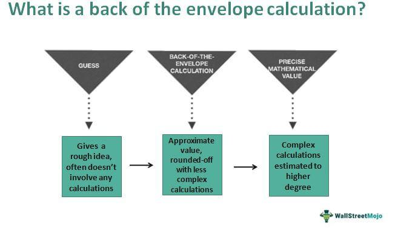

Financial services play a crucial role in resolving financial disputes, vital for maintaining market stability and investor confidence. These services provide mechanisms for navigating the complexities of modern financial markets, where derivatives and algorithmic trading are common. Disputes in financial markets often arise from derivatives trading, where calculation agents play a pivotal role. Calculation agents are responsible for determining the value of derivatives, ensuring accurate financial transactions. They are central to the pricing and valuation of complex financial products, making them integral to dispute resolution in financial agreements.

Algorithmic trading, the use of computer algorithms to automate trading processes, has grown in influence within financial markets. It enhances trading efficiency and liquidity but introduces challenges such as potential errors and market manipulation. The complex algorithms underlying this trading form the backbone of modern financial systems, often intersecting with the roles of calculation agents.



Calculation agents and algorithmic trading can sometimes lead to financial disputes when their operations differ or when algorithmic trades result in unexpected market outcomes. Understanding this interaction is essential for resolving disputes and ensuring market integrity.

This article examines these issues within financial markets, exploring the role of calculation agents in derivatives, their involvement in disputes, the impact of algorithmic trading, and future trends in advanced technologies and regulatory changes. The goal is to provide a comprehensive understanding of how these components are interconnected and their influence on financial dispute resolution.

## Table of Contents

## Understanding Calculation Agents

Calculation agents play a crucial role in the financial services sector, particularly in the domain of derivatives and structured products. These entities, which can be either a person or an institution, are entrusted with the responsibility of determining the value of complex financial instruments. Their determinations affect the final payouts or settlements related to derivative contracts and structured financial products.

### Definition and Role

A calculation agent is defined as an entity responsible for providing and verifying financial computations required in the contractual agreement of derivatives. Derivatives are financial instruments whose value is derived from underlying assets, such as commodities, currencies, interest rates, or stocks. The role of the calculation agent is to ensure that values are accurately calculated based on predefined terms within the derivatives contracts, effectively acting as a neutral party to the transaction.

### Determining the Value of Derivatives

When valuing derivatives, calculation [agents](/wiki/agents) use mathematical models and market data to assess the present and potential future values of these instruments. This valuation process can involve complex computations incorporating variables such as interest rates, time to maturity, [volatility](/wiki/volatility-trading-strategies), and the performance of the underlying assets. For instance, the Black-Scholes model is a widely used mathematical model for pricing options, which are a type of derivative. This model uses inputs like the current price of the asset, the option's strike price, time until expiration, risk-free [interest rate](/wiki/interest-rate-trading-strategies), and asset volatility to determine the option's theoretical value.

### Establishing Prices for Structured Products

For structured products, which combine derivatives with traditional securities to provide returns based on the performance of underlying assets or indices, calculation agents determine the price based on a set structure. This could involve using combinations of derivatives such as options, forwards, and swaps. Pricing these products requires a comprehensive understanding of market conditions and often involves scenario analysis to predict various outcomes. Calculation agents provide transparency and confidence to investors by ensuring prices reflect current market conditions and contractual terms.

### Importance in Financial Transactions

The presence of calculation agents in financial transactions is indispensable due to the complexity and potential for volatility in derivative markets. Their accurate assessments mitigate counterparty risks and ensure contract integrity. They facilitate the smooth functioning of markets by providing timely and reliable calculations, which is critical in maintaining market confidence and operational efficiency. Furthermore, their independent assessments can help prevent and resolve disputes by ensuring that all parties agree on financial valuations and settlements.

In conclusion, calculation agents are essential for the functioning of modern financial markets. Their expertise and impartiality provide the transparency necessary for evaluating complex financial instruments and maintaining the integrity of financial transactions.

## The Role of Calculation Agents in Financial Disputes

Calculation agents hold a pivotal role in the accurate execution and settlement of financial derivatives, including options, swaps, and complex structured products. Their principal function is the determination of essential values, such as interests, payoffs, or termination events, based on predefined terms outlined in financial agreements. Calculation agents are integral to ensuring that transactions are executed according to contractual terms, which often involve intricate financial models and assumptions. However, their determinations can become contentious, leading to disputes between parties involved in derivatives transactions.

### Common Areas of Dispute

Disputes often emerge in calculations related to interest rate swaps, currency swaps, and equity derivatives. These disputes may arise due to varying interpretations of contractual terms, discrepancies in market data, or disagreements concerning the methods utilized in calculations. Complex derivatives, by nature, involve a multitude of variables that must be precisely accounted for, such as volatility, correlation, or dividends, all of which are susceptible to differing interpretations. Calculation agents might also face disputes when there are ambiguities in how to handle disruptions in underlying markets or unforeseen market events that aren't clearly addressed in the contract.

### Emergence of Disputes

Disputes may surface when parties disagree with the agent's computation of settlement amounts or other financial metrics. Such disagreements can be driven by:

1. **Market Data Discrepancies:** Variations in market data sources can lead to different valuation outcomes. Different interpretations of how data should be applied in calculations may also cause disagreements.

2. **Contractual Ambiguities:** If the agreement language is unclear, disputes may arise due to differing interpretations concerning the rights and obligations of the parties involved.

3. **Modeling Assumptions:** Calculation agents use financial models that incorporate various assumptions. Disagreements may occur if the assumptions or methodologies used are contested by one of the parties.

### Resolution Mechanisms

To resolve disputes involving calculation agents, parties can employ several mechanisms:

- **Negotiation and Mediation:** Initial attempts often involve direct negotiation or mediation between parties. These processes aim to reach a mutual agreement without escalating to formal litigation.

- **Arbitration:** This is an alternative to court litigation, where an arbitrator's decision provides a binding resolution. Arbitration is commonly preferred for its confidentiality and speed compared to traditional court processes.

- **Litigation:** When other resolution methods fail, parties may resort to court proceedings, which can be costly and time-consuming but necessary for complex or high-stakes disputes.

### The Role of ISDA

The International Swaps and Derivatives Association (ISDA) plays a crucial role in mitigating disputes through its standard documentation and legal framework. ISDA Master Agreements provide standard terms and conventions that form the backbone of many derivatives transactions. They help reduce legal risk by establishing a consistent structure for contractual obligations, definitions, and procedures. ISDA also provides standardized definitions and protocols to address common issues, which aids in minimizing discrepancies arising from complex financial products.

The ISDA Dispute Resolution Protocol serves as a guideline for resolving conflicts related to valuation and calculation. By offering a predefined process for resolving differences, ISDA reduces uncertainty and fosters a more predictable dispute resolution environment. Through workshops, educational materials, and its commitment to updated standards, ISDA continues to play a crucial role in ensuring the smooth resolution of disputes in derivative markets.

 to Algorithmic Trading

Algorithmic trading refers to the use of computer programs and systems to execute financial trades based on pre-defined strategies and algorithms. The primary function of [algorithmic trading](/wiki/algorithmic-trading) is to automate the trading process by utilizing mathematical models and complex formulas to make decisions and execute trades at speeds and frequencies that would be impossible for human traders. Algorithms can be developed to perform various functions, such as determining the timing, price, or quantity of trades, and they operate based on given instructions and back-tested strategies.

### Key Components of an Algorithmic Trading System

An algorithmic trading system comprises several key components that work together to facilitate efficient and automated trading:

1. **Data Acquisition**: This component involves collecting large volumes of market data, including historical prices, trading volumes, economic indicators, and news events. The quality and speed of data collection directly affect the effectiveness of trading algorithms.

2. **Signal Generation**: Algorithms analyze the acquired data to identify trading opportunities. This analysis can involve statistical models, machine learning techniques, or technical indicators to generate buy or sell signals.

3. **Order Management System (OMS)**: Once a signal is generated, the OMS is responsible for executing orders in the market. This component optimizes the execution by choosing appropriate routes and venues, managing the order size, and ensuring speed and efficiency.

4. **Risk Management**: Managing risk is critical in algorithmic trading to minimize potential losses. Systems are typically equipped with mechanisms to control exposure, set stop-loss limits, and monitor market conditions in real-time to adjust strategies accordingly.

5. **Performance Analysis**: Continuous monitoring and analysis of algorithm performance are essential to ensure profitability and efficiency. This involves evaluating executed trades, tweaking parameters, and adapting algorithms to changing market dynamics.

### Advantages and Disadvantages of Algorithmic Trading

Algorithmic trading offers several advantages that can enhance trading performance:

- **Speed and Efficiency**: Algorithms can process and execute orders far faster than human traders, capitalizing on arbitrage opportunities and market inefficiencies within milliseconds.
- **Reduced Emotional Bias**: Automated systems remove human emotions from the trading process, reducing the risks associated with impulsive decisions.
- **Backtesting**: Traders can test strategies against historical data to evaluate their potential profitability before deploying them in live markets.
- **Diversification**: Automated systems can manage multiple strategies and trade across various asset classes simultaneously, increasing diversification.

However, algorithmic trading also presents certain disadvantages:

- **Technical Failures**: System glitches, connectivity issues, or bugs in the algorithm can lead to significant financial losses.
- **Market Impact**: Large orders executed rapidly can affect market prices, causing higher costs than anticipated.
- **Overfitting**: Algorithms may be overly optimized for historical data, leading to poor performance under different market conditions.
- **Regulatory Challenges**: The complexity of algorithmic trading systems poses challenges for regulatory compliance and monitoring.

### Types of Market Participants in Algorithmic Trading

Various market participants engage in algorithmic trading, each with distinct objectives and strategies:

- **Hedge Funds and Proprietary Trading Firms**: These entities typically use sophisticated algorithms to capitalize on short-term market inefficiencies, employing high-frequency trading (HFT) strategies.
- **Investment Banks**: Banks may use algorithms for executing large orders on behalf of clients, ensuring minimal market impact and cost-effectiveness.
- **Retail Investors**: With the advent of user-friendly trading platforms, individual investors increasingly leverage algorithmic strategies for portfolio management and trade execution.
- **Market Makers**: These participants utilize algorithms to provide liquidity and maintain order in financial markets by continuously quoting bid and ask prices.

In summary, algorithmic trading plays a pivotal role in modern financial markets by enhancing trade execution efficiency and enabling complex strategies. Despite its advantages, the potential for significant risks and challenges necessitates robust risk management and continual monitoring to ensure optimal performance and adherence to regulatory requirements.

## Risks of Algorithmic Trading in Financial Markets

Algorithmic trading, a critical component of modern financial markets, leverages computer algorithms to execute trades at speeds and frequencies that are beyond human capability. However, this technological advancement is not without its risks. One significant concern is the potential for market abuse through the misuse of trading algorithms. Algorithms designed with malicious intent can manipulate market prices, creating artificial demand or supply. Such practices are often classified as forms of market manipulation, such as spoofing, where an algorithm places large orders with no intention of fulfilling them, solely to influence the stock price.

Regulatory concerns are particularly heightened with high-frequency trading ([HFT](/wiki/high-frequency-trading-strategies)). HFT involves the use of sophisticated algorithms to execute a high [volume](/wiki/volume-trading-strategy) of trades in fractions of a second. This method can lead to systemic risks, as the rapid pace and complexity of the trades can exacerbate market volatility. Regulators around the world, including the U.S. Securities and Exchange Commission (SEC) and the European Securities and Markets Authority (ESMA), have raised concerns about HFT. They worry about potential unfair advantages it provides to seasoned traders over traditional market participants, leading to inequitable market conditions.

There are numerous case studies illustrating the unintended consequences of algorithmic trading. One prominent example is the Flash Crash of May 6, 2010, where the U.S. stock market plummeted approximately 1,000 points within minutes, only to recover shortly afterward. This dramatic event was partly attributed to the algorithms that exacerbated selling pressures in a highly automated trading environment. Another case is the Knight Capital incident in 2012, where a software glitch in an algorithm resulted in a $440 million trading loss within 45 minutes, illustrating the potential for catastrophic losses due to algorithm errors.

Thus, while algorithmic trading offers efficiencies and new opportunities, it also poses risks that require careful management. Regulatory bodies continue to develop frameworks to mitigate these risks, aiming to balance innovation with the need to maintain stability and fairness in financial markets.

## Combining Calculation Agents and Algo Trading in Dispute Resolution

The intersection of calculation agents and algorithmic trading presents unique challenges in dispute resolution, notably increasing the complexity of financial disagreements. Algorithmic trading, characterized by the use of computer algorithms to automate trade execution, has revolutionized market dynamics, enabling high-frequency and data-driven transactions. However, the speed and volume at which trades occur introduce layers of complexity, particularly when discrepancies between algorithmic outcomes and the valuations provided by calculation agents arise.

Calculation agents play a pivotal role in financial markets by determining the values and payoffs of derivative products. They rely on varying methodologies and market data inputs to establish fair valuations. Discrepancies in these calculations can lead to disputes, especially when an algorithmic trade's outcome is perceived as inconsistent with a calculation agent's valuation.

The complexity of resolving such disputes necessitates advanced computational techniques. Discrepancies may occur due to differences in market data feeds, valuation models, or execution timing inherent in algorithmic trading. Addressing these issues often involves sophisticated simulations and stress-testing models to understand the impact of various inputs and market conditions on the disputed calculations.

Consider a hypothetical scenario: an algorithmic trading system executes a series of trades based on input market data, which leads to a pricing disagreement with a calculation agent's derivative valuation. In this case, resolution may require the use of regression analysis to examine historical pricing data relative to current market conditions, evaluating the algorithm's predictive accuracy and the calculation agent's model assumptions. Additionally, [machine learning](/wiki/machine-learning) techniques can be utilized to identify patterns or anomalies in trading data that might have contributed to the discrepancy.

For instance, Python, a popular programming language for data analysis, offers libraries such as NumPy and pandas to facilitate data manipulation and statistical analysis. A basic outline of such analysis might look like this:

```python
import numpy as np
import pandas as pd

# Simulate market data and execution prices
market_data = pd.Series(np.random.normal(100, 10, 1000))  # Simulated market prices
execution_prices = pd.Series(np.random.normal(101, 10, 1000))  # Simulated execution prices by the algorithm

# Calculate the discrepancies
discrepancies = execution_prices - market_data

# Perform basic statistical analysis
mean_discrepancy = discrepancies.mean()
std_discrepancy = discrepancies.std()

print("Mean Discrepancy:", mean_discrepancy)
print("Standard Deviation of Discrepancy:", std_discrepancy)
```

The snippet above demonstrates a foundational analysis of discrepancies between trading executions and market valuations. By further leveraging algorithms to detect outliers or significant deviations, stakeholders can isolate potential causes of the dispute.

Historical cases highlight the potential for algorithmic trading to inadvertently exacerbate discrepancies. One prominent example involves the 2010 Flash Crash, where a confluence of high-frequency trading algorithms led to unprecedented market volatility, resulting in significant pricing disagreements and valuation challenges for calculation agents. Such instances underscore the necessity of robust computational frameworks in identifying and resolving discrepancies.

In conclusion, the convergence of calculation agents and algorithmic trading systems demands sophisticated techniques to navigate disputes. This interplay will continue to evolve, compelling market participants to adopt advanced technological solutions and collaborative practices to ensure equitable resolutions.

## Future Trends and Developments

The financial services industry is experiencing transformative changes with the increasing integration of [artificial intelligence](/wiki/ai-artificial-intelligence) (AI) into both calculation agent operations and algorithmic trading. AI's role in enhancing the efficiency, speed, and accuracy of these systems cannot be overstated. Machine learning algorithms, a subset of AI, are used by calculation agents to process vast amounts of complex data, enabling more accurate pricing of derivatives and structured products. Similarly, in algorithmic trading, AI algorithms analyze market data to optimize trading strategies, predict trends, and execute trades at speeds unattainable by human traders.

The growing reliance on AI exacerbates the complexity of financial disputes and introduces new challenges, particularly with regards to regulatory oversight. Regulators are increasingly pressured to keep pace with technological advancements to ensure market integrity and protection for stakeholders. It is anticipated that future regulatory frameworks will place a greater emphasis on AI transparency, requiring firms to disclose algorithms and processes used in trading and pricing. This might include stress-tests, audits, and controls to evaluate the robustness and fairness of AI systems, minimizing risks associated with algorithmic decisions.

As a response to these evolving technologies, the financial industry is likely to adopt more sophisticated tools and processes for managing disputes. Advanced computational techniques, including AI-powered dispute resolution platforms, could be developed. These systems might offer automated analysis of trading and pricing discrepancies, providing quicker dispute resolutions. Additionally, the rise of smart contracts in blockchain technologies could automate contract enforcement, mitigating some disputes relating to calculation agents and algorithmic trading.

In summary, the foreseeable future will witness AI becoming a pivotal component of financial services, necessitating innovations in regulatory practices and dispute resolution mechanisms. The challenge lies in balancing the benefits of technological advancements with the necessity of controls to maintain market stability and fairness.

## Conclusion

In conclusion, the dynamic landscape of financial services underscores the crucial role that calculation agents and algorithmic trading play in both facilitating and complicating financial transactions. Calculation agents are central in determining the fair value of derivatives and structured products, providing essential transparency and trust in financial markets. However, their complex calculations can become focal points for disputes, particularly when subjective judgment is required or when market conditions change rapidly.

Algorithmic trading, with its inherent speed and complexity, further heightens the stakes. The convergence of automated systems and human oversight in trading environments necessitates a robust framework for dispute resolution, especially given the potential for algorithm-induced market anomalies. Misalignments between algorithmic outcomes and calculation agent valuations can lead to significant disputes, requiring sophisticated resolution strategies.

Understanding these processes is crucial for managing disputes effectively. Organizations such as the International Swaps and Derivatives Association (ISDA) play a pivotal role in standardizing practices and providing guidelines to navigate these challenges. As financial markets continue to evolve, foreseen by increased algorithmic intervention and AI integration, regulatory frameworks will likely become more stringent, emphasizing the need for financial entities to adapt proactively.

Thus, the future of financial services hinges on the ability to seamlessly integrate technological advancements with robust regulatory compliance and effective dispute resolution mechanisms. Embracing these changes not only safeguards the integrity of the financial markets but also ensures that they remain fair and efficient, fostering a resilient economic environment.

## References & Further Reading

[1]: Bergstra, J., Bardenet, R., Bengio, Y., & Kégl, B. (2011). ["Algorithms for Hyper-Parameter Optimization."](https://papers.nips.cc/paper/4443-algorithms-for-hyper-parameter-optimization) Advances in Neural Information Processing Systems 24.

[2]: ["Advances in Financial Machine Learning"](https://www.amazon.com/Advances-Financial-Machine-Learning-Marcos/dp/1119482089) by Marcos Lopez de Prado

[3]: ["Evidence-Based Technical Analysis: Applying the Scientific Method and Statistical Inference to Trading Signals"](https://www.amazon.com/Evidence-Based-Technical-Analysis-Scientific-Statistical/dp/0470008741) by David Aronson

[4]: ["Machine Learning for Algorithmic Trading"](https://github.com/stefan-jansen/machine-learning-for-trading) by Stefan Jansen

[5]: ["Quantitative Trading: How to Build Your Own Algorithmic Trading Business"](https://www.amazon.com/Quantitative-Trading-Build-Algorithmic-Business/dp/1119800064) by Ernest P. Chan