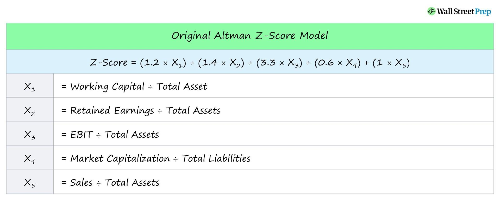

In the world of financial analysis, predicting a company's potential for bankruptcy is a critical skill for investors and analysts alike. Assessing this risk effectively can shape investment strategies, inform credit decisions, and aid in safeguarding against financial loss. One of the most widely recognized methods for evaluating bankruptcy risk is the Altman Z-Score. Developed by Edward Altman in the 1960s, this financial tool integrates various financial ratios to assess a company’s financial health and its probability of bankruptcy.

The Altman Z-Score combines key financial metrics, providing a single score that is easy to interpret. A high Z-Score indicates a lower likelihood of financial distress, while a low score suggests a greater risk of bankruptcy. The simplicity and effectiveness of this model have made it a staple in financial analysis, enabling investors and analysts to assess the financial stability of companies efficiently.



This article will explore the Altman Z-Score, shedding light on its applications in financial analysis and its role in enhancing algorithmic trading strategies. Understanding how this score functions can help professionals make better-informed decisions, whether in investment portfolios or automated trading environments.

## Table of Contents

## Understanding the Altman Z-Score

The Altman Z-Score is an analytical tool developed by Edward Altman in the 1960s to assess the bankruptcy risk of a company. This predictive measure amalgamates several financial ratios derived from a company's financial statements, offering a quantitative evaluation of a firm's financial health.

The formula used to calculate the Altman Z-Score is as follows:

$$
Z = 1.2X_1 + 1.4X_2 + 3.3X_3 + 0.6X_4 + 1.0X_5
$$

Each component of this formula represents a specific financial ratio, pivotal for analyzing the company's operational and financial conditions:

1. **Working Capital/Total Assets (X1)**: This ratio assesses the net liquidity position of the company relative to its total assets, indicating its capability to manage short-term obligations and invest in growth opportunities.

2. **Retained Earnings/Total Assets (X2)**: Retained earnings signify the cumulative profits that have been reinvested in the company. This ratio measures a company's capacity to compound and sustain growth with internally generated funds.

3. **Earnings Before Interest and Taxes (EBIT)/Total Assets (X3)**: Also known as the return on assets (ROA), this ratio evaluates operational efficiency and profitability by expressing earnings before interest and tax as a percentage of total assets.

4. **Market Value of Equity/Book Value of Total Liabilities (X4)**: This ratio reflects the firm’s market-based financial leverage by comparing the market value of its equity to its liabilities, gauging the shareholder protection in the event of a company’s dissolution.

5. **Sales/Total Assets (X5)**: Representing asset turnover, this ratio illustrates the efficiency with which a company utilizes its assets to generate revenue.

The values obtained from the Z-Score calculation can be interpreted as follows:

- A Z-Score above 3.0 indicates robust financial health, suggesting that the company is unlikely to face bankruptcy.
- A Z-Score below 1.8 signifies a high risk of financial distress, indicating caution to investors and creditors.
- Scores that fall between these thresholds necessitate further analysis, as they indicate a moderate risk profile.

The Altman Z-Score is especially notable for its effectiveness across a range of industries and environments, providing a quantitative evidence-based approach in assessing and comparing corporate financial stability.

## Calculating the Altman Z-Score

The calculation of the Altman Z-Score is based on a formula that aggregates various financial ratios derived from a company's financial statements. The formula is expressed as:

$$
Z = 1.2X1 + 1.4X2 + 3.3X3 + 0.6X4 + 1.0X5
$$

Each variable in the equation represents a distinct aspect of a company's financial health:

1. **X1: Working Capital to Total Assets**  
   The working capital ratio (X1) measures the [liquidity](/wiki/liquidity-risk-premium) of a company by comparing its working capital to total assets. A higher X1 indicates strong liquidity, suggesting that the company efficiently manages its short-term obligations using its current assets minus current liabilities.

2. **X2: Retained Earnings to Total Assets**  
   Representing the accumulated profits that have not been distributed as dividends, X2 assesses a company's ability to reinvest its earnings for future growth. A higher ratio indicates a robust capacity to fund operations without external financing. It reflects the profitability and age of the firm, with older firms generally having higher retained earnings.

3. **X3: Earnings Before Interest and Taxes (EBIT) to Total Assets**  
   EBIT relative to total assets (X3) is an indicator of a company's operational efficiency and its ability to generate profits before taxes and interest from its asset base. A higher X3 implies that the company is effectively using its assets to generate earnings.

4. **X4: Market Value of Equity to Book Value of Total Liabilities**  
   This ratio is a measure of leverage, comparing the company's market capitalization to its total liabilities. A greater X4 ratio suggests lower financial risk and indicates that investors place a higher value on the company compared to its debts.

5. **X5: Sales to Total Assets**  
   X5 reflects asset turnover, showing how effectively a company uses its assets to generate sales. A higher sales-to-assets ratio is indicative of operational efficiency, showcasing the company's ability to produce revenue from its asset investments.

The Z-Score, as an aggregate measure, provides insight into the overall financial health of a company, with scores above 3.0 typically indicating good financial standing, while scores below 1.8 suggest a high risk of bankruptcy. However, the interpretation of these results should consider industry-specific factors and economic conditions that could influence the financial metrics involved.

## Applications of Altman Z-Score in Financial Analysis

Bankruptcy prediction using the Altman Z-Score is a crucial aspect of financial analysis, offering significant value to lenders, investors, and policymakers. By assessing the financial stability of a company, the Z-Score serves as a guide for informed investment and credit decisions.

The Altman Z-Score evaluates a firm's financial health by leveraging a blend of financial ratios derived from its balance sheet and income statement. This multifaceted formula has been applied successfully across multiple industries to predict corporate distress or bankruptcy with a reasonable degree of accuracy.

**Understanding Financial Stability**

In financial analysis, the Z-Score assists in identifying companies at risk of default, thereby aiding investors in managing their portfolios more effectively. A higher Z-Score indicates stronger financial health, which is reassuring for equity investors looking for long-term stability. Conversely, a lower Z-Score warns of potential financial issues, allowing creditors to adjust their lending terms or reassess the risk profile of their loans.

**Case Studies and Real-World Applications**

Several notable case studies demonstrate the utility of the Altman Z-Score in financial analysis:

1. **Enron (2001):** Prior to its collapse, Enron's declining Z-Score highlighted its deteriorating financial health. Analysts utilizing the Z-Score observed a consistent decline in key ratios, signaling impending bankruptcy before the scandal fully unfolded.

2. **Airline Industry Post-9/11:** The airline industry faced significant financial strain following the events of September 11, 2001. The Z-Score model was employed to assess airlines' financial viability, guiding both investment strategies and policy interventions by spotting carriers that required financial assistance.

3. **Retail Sector Analysis:** In retail, where market dynamics are rapidly changing, the Z-Score model has been applied to evaluate the financial soundness of companies like Sears and J.C. Penney. By doing so, both lenders and investors can preemptively identify retailers likely to face bankruptcy, mitigating risks associated with insolvencies.

These case studies highlight the practical applications of the Altman Z-Score in proactive risk assessment. By enabling investors, lenders, and policymakers to anticipate financial distress, resources can be allocated more effectively, supporting stable economic growth and informed decision-making.

**Integration with Modern Analysis Tools**

In recent years, the Altman Z-Score has found its place amidst sophisticated financial analysis tools and algorithms. By integrating contemporary data analytics and [machine learning](/wiki/machine-learning) models, analysts enhance the predictive accuracy of financial health assessments. The use of historical Z-Score data feeds into these algorithms, optimizing decision strategies and enabling timely interventions in volatile markets.

Ultimately, while the Altman Z-Score is not a foolproof predictor of corporate failure, it provides an essential framework for assessing financial stability. Its application in financial analysis continues to evolve, underlining its enduring relevance in evaluating corporate health and guiding investment strategies.

## Altman Z-Score in Algorithmic Trading

Algorithmic trading, which involves the use of computerized systems to execute trading strategies, can significantly benefit from incorporating the Altman Z-Score. This metric, known for assessing the likelihood of a company's bankruptcy, provides valuable insights that traders can utilize to enhance their financial distress predictions and optimize trading decisions.

The integration of the Z-Score into [algorithmic trading](/wiki/algorithmic-trading) strategies typically begins with the analysis of historical financial data. Algorithms can monitor the trends and patterns of the Z-Score over time to better anticipate potential market shifts or financial distress events. By identifying companies whose Z-Scores suggest impending financial trouble, traders can make informed decisions about short selling or exiting positions, thereby potentially minimizing losses.

For example, an algorithm might be composed to continuously calculate the Z-Score for a portfolio of companies using the latest financial statement data. This could be implemented in Python as follows:

```python
def calculate_z_score(working_capital, total_assets, retained_earnings, ebit, market_value_equity, total_liabilities, sales):
    X1 = working_capital / total_assets
    X2 = retained_earnings / total_assets
    X3 = ebit / total_assets
    X4 = market_value_equity / total_liabilities
    X5 = sales / total_assets
    z_score = 1.2 * X1 + 1.4 * X2 + 3.3 * X3 + 0.6 * X4 + 1.0 * X5
    return z_score

# Example calculation
z_score = calculate_z_score(100000, 500000, 200000, 150000, 300000, 200000, 450000)
```

Traders can program their algorithms to trigger specific trading actions when a company's Z-Score crosses certain thresholds. For instance, if a company's Z-Score falls below 1.8, the algorithm could signal a short sell to capitalize on imminent financial instability. Conversely, a Z-Score above 3.0 might indicate a strong buy opportunity due to the company's financial health.

Algorithmic traders also utilize Z-Score trends to anticipate broader market movements. By aggregating Z-Scores across industries or sectors, algorithms can detect systemic risks or opportunities, such as predicting when a sector might experience higher rates of default.

Moreover, adopting the Z-Score in machine learning models can enhance predictive accuracy. By using historical Z-Score data as a feature in training models, traders can develop sophisticated algorithms that not only predict individual company bankruptcies but also recognize evolving economic patterns.

In conclusion, the incorporation of the Altman Z-Score into algorithmic trading provides traders with a robust tool for identifying financial distress signals and making strategic trading decisions. By leveraging the predictive power of the Z-Score alongside historical data analysis and machine learning techniques, algorithmic traders can achieve a competitive edge in the dynamic financial markets.

## Limitations and Considerations

The Altman Z-Score, despite its utility in predicting bankruptcy risk, has certain limitations that users must consider. One of the primary concerns is the variability across different industries. The model was originally developed for manufacturing firms and may not accurately predict the financial health of companies in other sectors. For instance, service-oriented industries and technology firms might not align well with the original Z-Score model, which leans heavily on tangible assets and traditional manufacturing metrics.

Another limitation stems from the changing dynamics of the market. Economic conditions, regulatory changes, and evolving business practices can impact the accuracy of the Z-Score. These factors can alter the predictive power of the financial ratios used in the calculation, thus affecting the score's reliability. As a result, a company that appears financially stable according to the Z-Score might still face unexpected financial difficulties due to external market conditions.

Moreover, the Z-Score model relies on historical financial data, which may not capture the current operational challenges or future prospects of a company. It uses static snapshots of financial statements, inherently delaying real-time risk assessment. Therefore, relying solely on the Z-Score for investment or lending decisions can lead to oversight of nuanced financial indicators and potential risks.

To address these limitations, investors and analysts should integrate the Altman Z-Score with other financial metrics and qualitative analyses. Combining it with assessments of cash flow, market trends, and macroeconomic indicators can offer a more comprehensive view of a company's financial health. Diversifying analytical approaches ensures a more robust and accurate investment evaluation strategy, mitigating the risk associated with the inherent constraints of the Z-Score model.

## Conclusion

The Altman Z-Score remains a pivotal instrument in the landscape of financial analysis, particularly for assessing bankruptcy risk. Recognized for its simplicity and efficacy, this scoring mechanism has empowered investors, analysts, and financial institutions to evaluate the financial condition of companies with greater precision. As financial markets evolve, the integration of the Altman Z-Score within algorithmic trading strategies represents a significant advancement, enhancing predictive analytics and informing investment decisions. This integration allows traders to anticipate potential financial distress, optimizing their trading tactics in an increasingly competitive environment.

While the Z-Score provides a valuable assessment tool, it is essential to remember its limitations. Variations in industry practices and rapid market changes can affect its reliability. Therefore, it is prudent for investors and analysts to complement the Z-Score with other analytical methods to form a comprehensive understanding of a company's financial health. Despite its constraints, when applied judiciously, the Altman Z-Score offers considerable insights into a company's financial viability, assisting stakeholders in navigating the complexities of financial risk assessment and management.

## References & Further Reading

[1]: ["Financial Ratios as Predictors of Failure."](https://www.jstor.org/stable/2490171?read-now=1) The Journal of Accounting Research, 1968 by Edward I. Altman.

[2]: ["Predicting Financial Distress of Companies: Revisiting the Z-Score and ZETA Models"](https://www.academia.edu/62517962/Predicting_financial_distress_of_companies_Revisiting_the_Z_score_and_Zeta_models) by Edward I. Altman.

[3]: ["Emerging Markets Score, Z-Score Plus and Risk of Bankruptcy"](https://stablebread.com/altman-z-score/) by Edward I. Altman, Andrea Resti, and Andrea Sironi, published in the Journal of International Finance and Economics.

[4]: ["The Revised Altman Z-Score Model: A Case Study of Toyota"](https://www.semanticscholar.org/paper/A-Comprehensive-Review-of-the-Altman-Z-Score-Model-Rashid-Khan/b1fa97958b33e56f38c7bed04ed08da8efff04cd) by Edwin C. Rivera.

[5]: ["Introduction to Machine Learning with Python: A Guide for Data Scientists"](https://www.amazon.com/Introduction-Machine-Learning-Python-Scientists/dp/1449369413) by Andreas C. Müller and Sarah Guido.