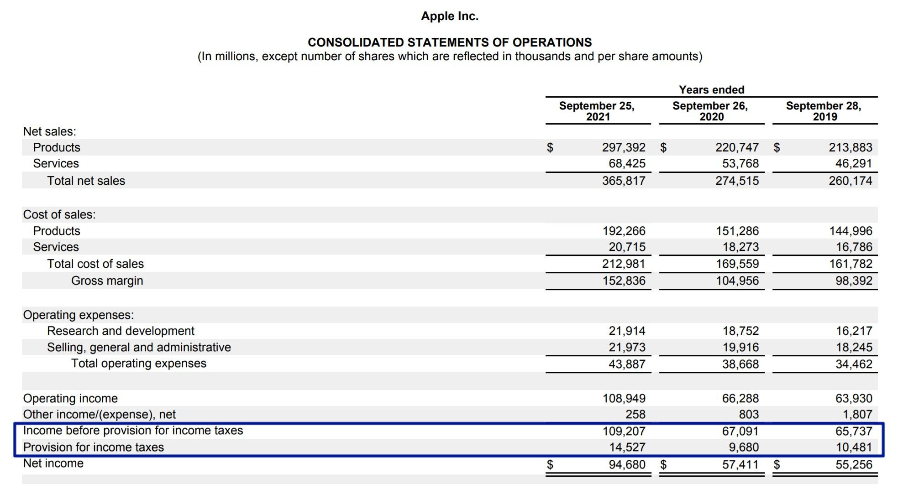

## Table of Contents

## What is an effective tax rate?

An effective tax rate is the average rate at which an individual or a business is taxed on their income. It is calculated by dividing the total amount of tax paid by the total income, then multiplying the result by 100 to get a percentage. This rate gives a more accurate picture of what someone actually pays in taxes compared to their marginal tax rate, which is the rate applied to the last dollar of income earned.

For example, if someone earns $50,000 and pays $5,000 in taxes, their effective tax rate would be 10%. This is useful because it shows the overall tax burden, taking into account all the different tax rates and deductions that might apply. It helps people understand how much of their income is going towards taxes and can be a helpful tool for financial planning and tax strategy.

## How does the effective tax rate differ from the statutory tax rate?

The effective tax rate and the statutory tax rate are two different ways to look at how much tax someone pays. The statutory tax rate is the rate set by law that applies to different levels of income. For example, if the law says that income over $50,000 is taxed at 20%, that 20% is the statutory rate. It's the rate you see on tax tables and in tax laws.

On the other hand, the effective tax rate is the actual percentage of your total income that you end up paying in taxes. It takes into account all the taxes you pay, not just the statutory rate. For instance, if you earn $60,000 and pay $8,000 in taxes, your effective tax rate would be about 13.33%. This rate is lower than the statutory rate because it considers deductions, credits, and other factors that can reduce your tax bill. The effective tax rate gives a better picture of your real tax burden.

## What components of an income statement are needed to calculate the effective tax rate?

To calculate the effective tax rate, you need two main pieces of information from the income statement: the total income and the total tax expense. The total income is usually shown as the "Income Before Tax" or "Pre-Tax Income" on the income statement. This is the amount of money a company makes before any taxes are taken out. The total tax expense is the amount of money the company actually pays in taxes, which is listed as "Income Tax Expense" on the income statement.

Once you have these two numbers, you can find the effective tax rate by dividing the total tax expense by the total income and then multiplying the result by 100 to get a percentage. For example, if a company's income before tax is $100,000 and its income tax expense is $25,000, the effective tax rate would be 25%. This rate shows the actual percentage of the company's income that goes to taxes, which can be different from the statutory tax rate due to various deductions and credits.

## Can you explain the formula used to calculate the effective tax rate?

The formula to calculate the effective tax rate is pretty simple. You take the total amount of tax you paid and divide it by your total income. Then, you multiply that number by 100 to turn it into a percentage. So, if you paid $5,000 in taxes and your income was $50,000, you'd divide $5,000 by $50,000 to get 0.1. Multiply 0.1 by 100, and you get 10%. That means your effective tax rate is 10%.

This formula helps you see the real percentage of your income that goes to taxes. It's different from the tax rate you see in the tax laws because it takes into account all the different ways you might reduce your taxes, like deductions and credits. Knowing your effective tax rate can help you plan your finances better and understand your tax situation more clearly.

## What is the difference between pre-tax income and taxable income in the context of calculating the effective tax rate?

Pre-tax income and taxable income are two different things when figuring out your effective tax rate. Pre-tax income is the total amount of money you earn before any taxes are taken out. It's the number you see on your income statement as "Income Before Tax." This is important because it's the starting point for figuring out how much tax you actually pay.

Taxable income, on the other hand, is what's left after you take away all the deductions and exemptions you're allowed. This is the amount that the tax rates from the tax laws are applied to. So, when you calculate your effective tax rate, you use your pre-tax income as the total income, and the taxes you paid based on your taxable income. This difference matters because your effective tax rate shows the real percentage of your pre-tax income that goes to taxes, not just the percentage of your taxable income.

## How can one find the income tax expense on an income statement?

To find the income tax expense on an income statement, look for the section that lists expenses. The income tax expense is usually one of the last items listed before the net income. It's the amount of money the company paid in taxes for that period. The income statement might call it "Income Tax Expense" or something similar, so keep an eye out for that label.

This number is important because it shows how much of the company's earnings went to taxes. It's used to calculate the effective tax rate, which tells you the actual percentage of the company's income that was paid in taxes. By finding this number, you can get a better understanding of the company's financial health and how much of its profits are being taken by taxes.

## What adjustments might be necessary when calculating the effective tax rate from an income statement?

When calculating the effective tax rate from an income statement, you might need to make some adjustments to get a more accurate picture. Sometimes, the income statement includes one-time or unusual items that can affect the tax expense. For example, if a company sold a big asset and had to pay a special tax on that sale, you might want to remove that from the income tax expense to see what the regular tax rate is. Also, if the company operates in different countries, the tax rates in those places can be different, so you might need to adjust for that too.

Another thing to think about is any tax benefits or credits the company might have. These can lower the tax expense, so if you want to see what the effective tax rate would be without those benefits, you'd need to add them back in. For example, if a company got a big tax credit for research and development, you might want to see what the tax rate would be without that credit. By making these adjustments, you can get a clearer idea of the company's regular effective tax rate and how much of its income is really going to taxes.

## How do tax credits and deductions affect the calculation of the effective tax rate?

Tax credits and deductions can lower the amount of tax you have to pay, which in turn affects your effective tax rate. A tax credit directly reduces the amount of tax you owe, dollar for dollar. For example, if you owe $1,000 in taxes and get a $200 tax credit, you'll only have to pay $800. This means your effective tax rate will be lower because you're paying less tax on the same income. Deductions, on the other hand, reduce your taxable income. If you have a deduction, you subtract it from your income before calculating your tax. So, if you earn $50,000 and have a $5,000 deduction, you'll only pay taxes on $45,000. This also lowers your effective tax rate because you're paying taxes on a smaller amount of income.

When calculating the effective tax rate from an income statement, you need to consider how these tax credits and deductions have already been applied. The income tax expense on the statement reflects the taxes paid after taking into account all these benefits. If you want to see what the effective tax rate would be without these benefits, you would need to adjust the income tax expense. For instance, if a company received a large tax credit, you might add that back to the tax expense to see what the rate would be without it. By understanding how tax credits and deductions work, you can better grasp how they impact the effective tax rate and make more informed financial decisions.

## What are common pitfalls to avoid when calculating the effective tax rate from financial statements?

One common mistake when calculating the effective tax rate from financial statements is not considering one-time or unusual items that can affect the tax expense. For example, if a company sold a big asset and had to pay a special tax on that sale, including that in the calculation can make the effective tax rate look higher than it usually is. Another pitfall is not accounting for different tax rates in different countries if the company operates internationally. If you don't adjust for these differences, your calculation might not give you an accurate picture of the company's regular tax burden.

Another thing to watch out for is not understanding how tax credits and deductions have already been applied to the income tax expense shown on the financial statement. These can lower the tax bill, so if you want to see the effective tax rate without these benefits, you need to adjust the numbers. For instance, if a company got a big tax credit, you might need to add that back into the tax expense to see what the rate would be without it. By being aware of these pitfalls and making the right adjustments, you can get a clearer and more accurate view of the company's effective tax rate.

## How can discrepancies between book and tax income impact the effective tax rate calculation?

Discrepancies between book income and tax income can mess up the effective tax rate calculation. Book income is what a company shows on its financial statements, while tax income is what it reports to the tax authorities. Sometimes, these numbers are different because of things like depreciation methods or special tax rules. If you use book income to calculate the effective tax rate but the tax expense is based on tax income, the rate you get might not be right.

To fix this, you need to make sure you're using the right numbers. If you want to see the effective tax rate based on what the company actually pays in taxes, you should use the tax income number instead of the book income. By matching the income to the tax expense correctly, you can get a more accurate effective tax rate. This helps you understand how much of the company's earnings are really going to taxes.

## How might multinational companies' effective tax rates be influenced by different tax jurisdictions?

Multinational companies often work in many different countries, and each country has its own tax rules. This can make their effective tax rate different from what you might expect. For example, some countries have lower tax rates than others. If a company makes a lot of its money in a country with low taxes, its overall effective tax rate will be lower. They might also move money around to take advantage of these lower rates, which is called tax planning.

This means that when you look at a multinational company's effective tax rate, you need to think about all the different places they do business. The rate can be hard to figure out because it's a mix of all the taxes they pay in different countries. If you don't consider these differences, you might think the company's tax rate is higher or lower than it really is.

## What advanced analytical techniques can be used to refine the calculation of the effective tax rate for more accurate financial analysis?

To get a more accurate effective tax rate, you can use advanced analytical techniques like tax reconciliation analysis. This technique helps you break down the differences between the statutory tax rate and the effective tax rate. You look at all the things that change the tax bill, like special tax rules, deductions, credits, and one-time items. By understanding these adjustments, you can see why the effective tax rate is different from what the law says it should be. This helps you get a clearer picture of the real tax burden on the company.

Another technique is using segmental analysis, which is especially useful for multinational companies. This means you look at the effective tax rate for each part of the company that operates in different countries. By doing this, you can see how tax rates in different places affect the overall effective tax rate. You can also use this to figure out how the company's tax planning strategies are working. By putting together all these pieces, you get a more detailed and accurate view of the effective tax rate, which can help with better financial planning and analysis.

## How are Effective Tax Rates Calculated?

The effective tax rate (ETR) serves as a comprehensive measure of the actual tax burden faced by individuals and corporations, rather than relying solely on marginal tax rates. For individuals, the effective tax rate is calculated by dividing the total taxes paid by the taxable income, which provides a clearer picture of how much income is actually subject to tax after all deductions and credits have been applied. This can be expressed as:

$$
\text{Effective Tax Rate (Individuals)} = \frac{\text{Total Taxes Paid}}{\text{Taxable Income}} \times 100\%
$$

In the context of corporations, the effective tax rate is determined by dividing total taxes paid by pre-tax earnings. This calculation highlights the proportion of a corporation's earnings that are paid in taxes, providing insight into the company's tax efficiency. The formula is:

$$
\text{Effective Tax Rate (Corporations)} = \frac{\text{Total Taxes Paid}}{\text{Pre-Tax Earnings}} \times 100\%
$$

Understanding and calculating the effective tax rate is critical for financial analyses and planning. It offers a realistic view of tax obligations and influences strategic decisions within personal finance and corporate environments. For individuals, it can impact budgeting and saving strategies, while for corporations, it affects investment decisions, dividend policies, and pricing strategies.

A deeper comprehension of the effective tax rate helps individuals and companies make informed decisions about potential financial strategies, tax planning, and optimization. It allows for better forecasting of future tax liabilities and enhances the accuracy of financial projections. Ultimately, having a clear understanding of one's effective tax rate is instrumental in maximizing net returns and ensuring that tax obligations are met efficiently.

## References & Further Reading

OECD's Base Erosion and Profit Shifting (BEPS) Project is an essential initiative aimed at addressing tax avoidance strategies that exploit gaps and mismatches in tax rules to artificially shift profits to low or no-tax locations. The project's measures ensure that profits are taxed where economic activities generating the profits are performed and where value is created. The BEPS Action Plan, developed in collaboration with various global stakeholders, comprises 15 action points offering tools against such tax planning strategies. More information about this project can be found on the OECD's official website [here](https://www.oecd.org/tax/beps/).

The Tax Foundation provides a comprehensive analysis of international corporate tax rates, highlighting the differences and similarities across various countries. Their insights assist businesses and policymakers in understanding global tax environments and the implications these have on strategic financial decisions. The Tax Foundation's breakdown of international corporate tax comparisons can be accessed through their reports and publications, available on their [website](https://taxfoundation.org/international-tax-competitiveness-index/).

"Algorithmic Trading: Strategies for Managing Transaction Costs" is a crucial resource for understanding the interplay between algorithmic trading strategies and transaction costs, including tax implications. This literature explores various techniques traders use to enhance profits while minimizing costs, thus providing valuable insights for adapting to changing tax landscapes effectively. Studies and works related to this topic can be found in financial journals and platforms that focus on algorithmic trading strategies and cost management.

