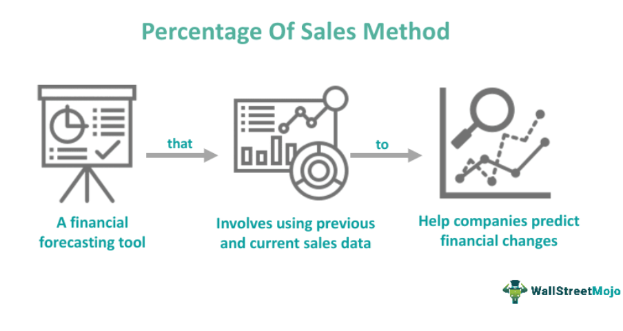

In the rapidly evolving world of finance, understanding key metrics like credit sales percentage is vital for firms striving to maintain liquidity and operational efficiency. As businesses expand and financial markets become increasingly complex, having a firm grasp of financial metrics helps organizations make informed decisions, ensuring sustainability and growth. The credit sales percentage is one such critical metric that enables firms to evaluate the proportion of sales made on credit, providing insights into cash flow management and financial health.

Concurrently, the use of algorithmic trading has gained prominence in financial markets around the globe. This powerful tool for automated investment utilizes computer algorithms to execute trades at speeds and frequencies impossible for human traders. By minimizing human intervention, algorithmic trading enhances precision and efficiency in executing trading strategies, providing a competitive edge in the financial landscape.

This article will explore key aspects of firm finance, particularly focusing on the calculation and significance of credit sales percentage. It will also examine the role of algorithmic trading and its integration within modern financial practices. As financial technology advances, understanding these elements becomes increasingly crucial for firms aiming to optimize their financial operations and maintain a robust market presence.

## Table of Contents

## Understanding Firm Finance and Credit Sales

Firm finance encompasses various aspects of managing a company's financial activities to ensure sustainable operations and growth. One crucial component of firm finance is managing credit sales, which play a significant role in maintaining healthy cash flow. Credit sales occur when goods or services are sold with the agreement that payment will be made at a later date. These transactions are recorded as accounts receivable on a company's balance sheet until the payment is received.

Credit sales are vital for businesses as they provide customers with the flexibility to purchase without immediate cash outlay, potentially leading to increased sales and customer loyalty. However, they also carry the risk of delayed or defaulted payments, which can affect a firm's liquidity. Therefore, effectively managing credit sales is essential to ensure sufficient cash inflows to meet operational expenses and invest in growth opportunities.

Different industries manage credit sales in various ways, influenced by factors such as market norms, competitive strategies, and inherent risks. For example, industries like manufacturing and wholesale often offer extended credit terms to maintain strong relationships with retailers and distributors, which can result in higher accounts receivable. Conversely, retail and service sectors might offer shorter credit periods to preserve cash flow.

The impact of credit sales on a firm's [liquidity](/wiki/liquidity-risk-premium) and financial health can be profound. A high level of accounts receivable compared to sales may indicate inefficient collection processes or heightened exposure to credit risk. Monitoring the proportion of credit sales to total sales helps firms assess their credit risk and make informed decisions about adjusting credit policies or improving collection strategies.

Formulaically, understanding credit sales involves evaluating the ratio of accounts receivable to total sales. The calculation is straightforward:

$$
\text{Credit Sales Percentage} = \left( \frac{\text{Accounts Receivable}}{\text{Total Sales}} \right) \times 100
$$

This percentage provides insight into the proportion of sales made on credit, assisting businesses in managing their financial operations efficiently. By regularly assessing and optimizing their credit sales strategies, firms can maintain liquidity, minimize risks, and enhance overall financial health.

## Calculating Credit Sales Percentage

The credit sales percentage is a critical financial ratio that assesses a company's credit risk and operational efficiency. This ratio offers insight into how much of a company's sales are being made on credit, which can impact cash flow and liquidity. Calculating this percentage involves a straightforward mathematical process. 

To determine the credit sales percentage, use the following formula:

$$
\text{Credit Sales Percentage} = \left( \frac{\text{Accounts Receivable}}{\text{Total Sales}} \right) \times 100
$$

This formula signifies the proportion of total sales that are represented by accounts receivable, indicating the extent of credit reliance in sales operations. A high credit sales percentage may suggest that a company extends significant credit to customers, which might impact cash flow if accounts are not collected promptly. Conversely, a low percentage could imply efficient credit management or perhaps stringent credit policies, potentially limiting sales growth.

Understanding the credit sales percentage allows businesses to make informed decisions about their credit policies and cash flow management strategies. By monitoring this metric, firms can assess whether their credit terms align with market realities and adjust their approaches to mitigate risk, thereby enhancing their financial stability and operational efficiency. This analysis is useful in configuring optimal credit terms that strike a balance between attracting customers and ensuring healthy cash flows.

## Algorithmic Trading in Modern Firm Finance

Algorithmic trading represents a sophisticated advancement in the financial sector, automating trading processes that were once reliant on human decision-making. By using computer algorithms, it facilitates the execution of trading strategies with precision and speed, adapting to market changes much faster than human traders. This technology leverages vast amounts of data and incorporates predictive analytics to enhance investment decisions, therefore playing a pivotal role in modern firm finance.

The implementation of [algorithmic trading](/wiki/algorithmic-trading) has significant implications for credit sales and other financial operations within firms. This technology provides firms with the capacity to analyze historical data and current market conditions to predict future trends. By doing so, it enhances the accuracy of financial forecasting, which is critical in managing credit sales efficiently. For instance, understanding the patterns that lead to credit sales can help firms optimize their cash flow management strategies, ensuring an optimal balance between receivables and payable accounts.

Moreover, algorithmic trading systems are capable of processing large volumes of transactions quickly, thereby improving market liquidity and reducing transaction costs. The reduction in manual intervention not only decreases the likelihood of human error but also allows trading operations to continue functioning seamlessly even under volatile market conditions. This ensures that firms can maintain financial stability and operational efficiency at all times.

The integration of algorithmic trading into financial operations enables firms to respond proactively to market shifts, providing a competitive edge. By utilizing advanced algorithms and data analytics, companies can fine-tune their credit sales tactics to align with real-time market intelligence. This synergy between technology and financial strategy fosters more informed decision-making processes that can positively impact a firm's profitability and market position.

In conclusion, algorithmic trading stands at the forefront of modern financial innovation, offering transformative benefits to firms. It not only enhances the efficiency of trading activities but also supports more robust financial planning and credit management frameworks. As firms continue to adopt this technology, the potential for optimized financial operations and strategic advantage grows ever stronger.

## Benefits and Challenges of Algo Trading

Algorithmic trading (algo trading) offers numerous benefits to financial markets, primarily through enhancing the precision, speed, and efficiency of trade execution. By employing complex algorithms, trading strategies can be executed at speeds beyond human capability, facilitating improved market liquidity and reduced transaction costs. The rapid execution of trades allows market participants to capitalize on price discrepancies and adjust their positions swiftly in response to market changes. This level of efficiency means that orders can be filled more accurately, with less slippage and at lower costs due to reduced bid-ask spreads. 

For example, if a trading algorithm is designed to buy a stock when its price falls below a certain threshold and sell when it rises above another, it can execute such trades almost instantaneously. The speed and accuracy of such trades are crucial in high-frequency trading environments, where even milliseconds can be the difference between profit and loss.

Despite these advantages, algorithmic trading introduces several challenges that firms must adeptly manage. One of the primary challenges is the requirement for high-frequency data. Successful algo trading hinges on access to large datasets that can be processed quickly to inform trading decisions. The necessity for robust data infrastructure can impose significant costs on firms, requiring investment in powerful computing resources and data acquisition services.

Moreover, the risk of algorithmic errors poses a significant challenge. Algorithms are not infallible and can behave unpredictably under certain market conditions, potentially leading to significant financial losses. For instance, a minor programming error or an unexpected market event can trigger a cascade of faulty trades, affecting not only the firm but the market as a whole.

The complexity of algorithm implementation is also a hurdle. Developing effective algorithms requires not only advanced programming skills but also a deep understanding of financial markets. Integrating these components seamlessly with existing trading systems is crucial yet challenging, as any incompatibility can disrupt trading operations.

Given these challenges, effective risk management strategies are imperative for firms involved in algo trading. This includes rigorous testing and validation of algorithms under various market conditions to ensure reliability and robustness. Implementing real-time monitoring systems can help detect anomalies and halt malfunctioning algorithms before they cause significant harm. Additionally, employing safeguards such as circuit breakers can mitigate the risks of large-scale market impacts.

In summary, while algorithmic trading offers the potential for improved operational efficiency and cost reduction, it also demands meticulous planning and risk management to navigate its inherent complexities and risks successfully.

## Integrating Credit Sales Management with Algo Trading

Integrating credit sales management with algorithmic trading presents a significant opportunity for firms to enhance their operational efficiency and optimize decision-making processes. This integration allows for a seamless flow of information between sales data and trading algorithms, paving the way for more informed investment strategies and improved financial performance.

The incorporation of analytics from credit sales into AI models is a crucial step in this integration. By analyzing historical credit sales data, firms can develop predictive models that forecast future sales trends. This predictive capability assists in anticipating market demand and adjusting trading strategies accordingly. For instance, if a firm's credit sales data indicates an upward trend in a particular product line, this information can be utilized to allocate more resources to stockpiling or trading related commodities or securities, thereby optimizing investment activities.

To successfully integrate credit sales management with algorithmic trading, firms should adhere to several best practices. Firstly, the data infrastructure should support real-time data processing and analytics. This can be achieved by using advanced data management systems that can handle large volumes of transactions and rapidly update predictive models.

Moreover, developing robust AI models requires a multidisciplinary approach, involving financial analysts, data scientists, and IT specialists. These teams should work collaboratively to ensure that the AI models are accurately trained on relevant data sets and continuously refined to reflect the latest market conditions.

Ensuring data accuracy is another critical aspect. Accurate and updated credit sales data should be fed into AI models to prevent erroneous predictions that could lead to suboptimal trading decisions. Implementing regular audits and validation checks can help maintain data integrity.

Lastly, firms should establish effective communication channels between their credit sales and trading departments. This ensures that insights derived from credit sales analytics are promptly communicated to the trading teams, facilitating timely adjustments to trading algorithms.

In conclusion, the integration of credit sales management systems with algorithmic trading can significantly boost a firm's ability to navigate the financial markets. By leveraging AI-driven insights from credit sales data, firms can enhance their predictive capabilities and optimize their trading strategies, resulting in improved operational efficiency and competitive advantage.

## Conclusion

As the financial landscape continues to evolve, keeping abreast of tools such as the credit sales percentage and algorithmic trading is becoming increasingly crucial. Credit sales percentage serves as a significant financial ratio, enabling firms to assess credit risk and efficiency, thereby aiding in refined cash flow management strategies. Algorithmic trading, on the other hand, has revolutionized the way firms approach investment by utilizing computer algorithms to automate trading strategies, thus enhancing decision-making processes and reducing the dependency on manual intervention.

By strategically managing these elements, firms can significantly enhance their financial operations and market positioning. Effective implementation of algorithmic trading allows for precise and efficient trading opportunities, improving liquidity and reducing transaction costs. Simultaneously, understanding and optimizing credit sales can ensure better anticipation of cash flow, thereby supporting sustainable business growth.

Businesses operating in the modern financial sector must commit to continuous innovation and adaptability. The integration of advanced technologies and analytical tools is not just beneficial but also necessary for maintaining competitiveness in an increasingly technology-driven market. By leveraging data analytics and predictive models, firms can forecast sales trends and make informed investment choices, facilitating stronger market positioning and operational efficiency.

As technology and market dynamics continue to shift, firms must proactively adjust their strategies and implement robust risk management practices. This approach not only safeguards against potential financial pitfalls but also ensures that firms remain competitive. Engaging with and investing in emerging financial technologies will be pivotal for organizations aiming to thrive in a rapidly changing economic environment.

## References & Further Reading

[1]: Bergstra, J., Bardenet, R., Bengio, Y., & Kégl, B. (2011). ["Algorithms for Hyper-Parameter Optimization."](https://dl.acm.org/doi/10.5555/2986459.2986743) Advances in Neural Information Processing Systems 24.

[2]: ["Advances in Financial Machine Learning"](https://www.amazon.com/Advances-Financial-Machine-Learning-Marcos/dp/1119482089) by Marcos Lopez de Prado

[3]: ["Evidence-Based Technical Analysis: Applying the Scientific Method and Statistical Inference to Trading Signals"](https://www.amazon.com/Evidence-Based-Technical-Analysis-Scientific-Statistical/dp/0470008741) by David Aronson

[4]: ["Machine Learning for Algorithmic Trading"](https://github.com/stefan-jansen/machine-learning-for-trading) by Stefan Jansen

[5]: ["Quantitative Trading: How to Build Your Own Algorithmic Trading Business"](https://github.com/LucindaYa/quant-resources/blob/master/Quantitative%20Trading%20How%20to%20Build%20Your%20Own%20Algorithmic%20Trading%20Business.pdf) by Ernest P. Chan