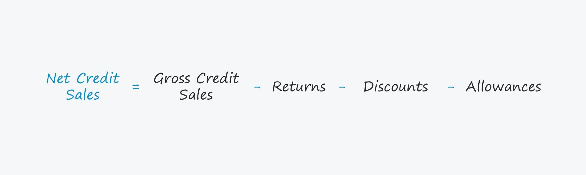

## Table of Contents

## What are credit sales and why are they important for a firm?

Credit sales are when a business lets customers buy things now but pay later. Instead of paying right away, the customer gets to use the product or service first and then pays the business after some time. This is different from cash sales, where the customer pays the full amount immediately.

Credit sales are important for a firm because they can help the business grow. By offering credit, a company can attract more customers who might not have enough money to pay all at once. This can increase sales and help the business make more money. Also, credit sales can help build strong relationships with customers, making them more likely to come back and buy more in the future. However, businesses need to be careful because if customers don't pay back, it can cause problems for the company.

## How do you define the credit sales percentage of a firm?

The credit sales percentage of a firm tells you how much of the total sales were made on credit. To find this percentage, you take the total amount of credit sales and divide it by the total sales of the firm. Then, you multiply the result by 100 to get a percentage. For example, if a firm had $50,000 in credit sales and $100,000 in total sales, the credit sales percentage would be 50%.

Knowing the credit sales percentage is helpful for a firm because it shows how much the business depends on credit to make sales. If the percentage is high, it means a lot of customers are buying on credit, which can be good for increasing sales but also risky if customers don't pay back. If the percentage is low, it might mean the firm is more cautious about giving credit or that most customers prefer to pay cash. This information helps the firm make better decisions about its credit policies and manage its finances more effectively.

## What is the basic formula to calculate a firm's credit sales percentage?

The basic formula to calculate a firm's credit sales percentage is to take the total amount of credit sales and divide it by the total sales of the firm. After you do the division, you multiply the result by 100 to turn it into a percentage. For example, if a firm has $30,000 in credit sales and $60,000 in total sales, the credit sales percentage would be ($30,000 / $60,000) * 100 = 50%.

Understanding the credit sales percentage is important for a firm because it shows how much of their business relies on credit. A high percentage means a lot of customers are buying on credit, which can help increase sales but also comes with the risk that some customers might not pay back. A low percentage might mean the firm is careful about giving credit or that customers prefer to pay with cash. This information helps the firm decide how to manage its credit policies and finances better.

## Can you explain the difference between credit sales and cash sales?

Credit sales and cash sales are two ways a business can sell its products or services. Credit sales happen when a customer buys something but doesn't pay for it right away. Instead, they agree to pay the business later, usually within a certain time period. This can help customers who don't have enough money at the moment to buy things they need or want. On the other hand, cash sales are when a customer pays the full amount for a product or service at the time of purchase. This means the business gets the money immediately.

Both types of sales are important for a business, but they work differently. With credit sales, the business might sell more because customers can buy now and pay later. However, there's a risk that some customers might not pay back, which can be a problem for the business. Cash sales are safer because the business gets the money right away, but it might not attract customers who need to spread out their payments. Knowing the difference between these two helps a business decide how to sell its products and manage its money.

## What data is required to accurately calculate a firm's credit sales percentage?

To accurately calculate a firm's credit sales percentage, you need to know two main pieces of information: the total amount of credit sales and the total amount of sales for the firm. Credit sales are the sales made when customers buy products or services but pay for them later. Total sales include both the credit sales and the cash sales, where customers pay right away.

Once you have these numbers, you can find the credit sales percentage by dividing the total credit sales by the total sales and then multiplying the result by 100 to get a percentage. For example, if a firm has $40,000 in credit sales and $100,000 in total sales, the credit sales percentage would be ($40,000 / $100,000) * 100 = 40%. This calculation helps the firm understand how much of its business relies on customers paying later, which can be useful for managing finances and planning for the future.

## How often should a firm calculate its credit sales percentage?

A firm should calculate its credit sales percentage regularly, like every month or every quarter. This helps the business see how much of its sales come from customers who pay later. By checking this often, the firm can make quick changes if needed, like tightening credit rules if too many customers are not paying back on time.

Looking at the credit sales percentage every month or quarter also helps the firm plan better for the future. If the percentage is going up, it might mean more customers are buying on credit, which could be good for sales but also risky. If it's going down, the firm might need to think about why and if they should offer more credit to boost sales. Regular checks help the business stay on top of things and make smart choices.

## What are common industry benchmarks for credit sales percentages?

Common industry benchmarks for credit sales percentages can vary a lot depending on the type of business. For example, in industries like furniture or appliances, where big purchases are common, credit sales percentages might be high, often around 50% to 70%. This is because customers often need to spread out payments for expensive items. On the other hand, in industries like grocery stores or fast food, where purchases are usually smaller, credit sales percentages are typically lower, maybe around 10% to 20%. These businesses often see more cash or debit card transactions.

Knowing these benchmarks helps a firm see how it's doing compared to others in the same field. If a firm's credit sales percentage is much higher than the industry average, it might mean they're taking on more risk by giving out a lot of credit. But if it's lower, they might be missing out on sales by not offering enough credit options. By keeping an eye on these benchmarks, a firm can make better decisions about its credit policies to stay competitive and manage risks well.

## How can a firm's credit sales percentage impact its financial strategy?

A firm's credit sales percentage can have a big effect on its financial strategy. If a lot of the firm's sales are on credit, it means they have to wait to get paid. This can be good because it might help them sell more stuff, but it also means they need to plan carefully. They might need more money to keep running the business while they wait for customers to pay. This can lead them to borrow money or use their savings, which changes how they manage their money.

Also, a high credit sales percentage means the firm has to think about the risk of customers not paying back. They might need to set aside money to cover this risk, which affects how much profit they make. If the credit sales percentage is low, the firm might not have these problems as much, but they might also be missing out on sales. So, the firm needs to find a good balance in its credit policy to keep selling well and stay financially healthy.

## What are the potential pitfalls in calculating credit sales percentage?

One potential pitfall in calculating credit sales percentage is using incorrect or incomplete data. If the firm doesn't keep good records of its credit sales and total sales, the numbers might be wrong. This can happen if the firm doesn't track all its sales properly or if there are mistakes in the accounting. Using wrong numbers can lead to a wrong credit sales percentage, which can make the firm think it's doing better or worse than it really is.

Another pitfall is not understanding what the credit sales percentage really means. Just knowing the percentage isn't enough. The firm needs to think about how it fits with the rest of the business. For example, a high credit sales percentage might look good because it means more sales, but it can also mean more risk if customers don't pay back. If the firm doesn't think about these things, it might make bad decisions about its credit policy and how to manage its money.

## How can discrepancies in credit sales data affect the calculation?

Discrepancies in credit sales data can mess up the calculation of a firm's credit sales percentage. If the numbers are wrong, like if some credit sales are missing or counted twice, the total credit sales won't be right. This means when you divide the credit sales by the total sales, you'll get a wrong percentage. This can make the firm think it's doing better or worse than it really is, which can lead to bad decisions about how to run the business.

These discrepancies can come from mistakes in the firm's records. Maybe someone wrote down a number wrong, or the computer system didn't track all the sales correctly. If the firm doesn't fix these mistakes, it won't have a clear picture of how much it depends on credit sales. This can be a big problem because the firm needs to know this to plan its money and decide if it should give out more or less credit to customers.

## What advanced analytical methods can be used to enhance the accuracy of credit sales percentage calculations?

To make the calculation of a firm's credit sales percentage more accurate, one advanced method is using data analytics. This means using special software to look at all the sales data carefully. The software can find and fix mistakes in the numbers, like if some sales are missing or counted twice. It can also check the data over time to see if there are patterns or changes that need to be looked at more closely. This helps make sure the credit sales percentage is based on correct numbers, so the firm can trust it and make good decisions.

Another method is using [machine learning](/wiki/machine-learning). This is a type of computer program that can learn from data and get better at finding and fixing errors over time. Machine learning can look at lots of sales data and spot things that might be wrong, like if a sale looks different from usual. It can also predict how the credit sales percentage might change in the future, which helps the firm plan better. By using these advanced methods, a firm can get a more accurate picture of its credit sales percentage and manage its money more wisely.

## How can a firm use its credit sales percentage to forecast future sales and manage credit risk?

A firm can use its credit sales percentage to forecast future sales by looking at how much of its sales come from customers who pay later. If the credit sales percentage is going up, it might mean more customers want to buy on credit in the future. The firm can use this information to plan how much money it will need to keep running the business while waiting for customers to pay. By keeping an eye on the credit sales percentage, the firm can guess how many sales might be on credit and how much money it will get from them.

The firm can also use the credit sales percentage to manage credit risk. If the percentage is high, it means the firm is giving out a lot of credit, which can be risky if customers don't pay back. The firm can set aside money to cover this risk or decide to be stricter about who gets credit. By watching the credit sales percentage, the firm can see if it's taking on too much risk and make changes to its credit policy to keep the business safe. This helps the firm balance making sales and staying financially healthy.

## What is the understanding of Firm Finance and Credit Sales?

Firm finance encompasses various aspects of managing a company's financial activities to ensure sustainable operations and growth. One crucial component of firm finance is managing credit sales, which play a significant role in maintaining healthy cash flow. Credit sales occur when goods or services are sold with the agreement that payment will be made at a later date. These transactions are recorded as accounts receivable on a company's balance sheet until the payment is received.

Credit sales are vital for businesses as they provide customers with the flexibility to purchase without immediate cash outlay, potentially leading to increased sales and customer loyalty. However, they also [carry](/wiki/carry-trading) the risk of delayed or defaulted payments, which can affect a firm's liquidity. Therefore, effectively managing credit sales is essential to ensure sufficient cash inflows to meet operational expenses and invest in growth opportunities.

Different industries manage credit sales in various ways, influenced by factors such as market norms, competitive strategies, and inherent risks. For example, industries like manufacturing and wholesale often offer extended credit terms to maintain strong relationships with retailers and distributors, which can result in higher accounts receivable. Conversely, retail and service sectors might offer shorter credit periods to preserve cash flow.

The impact of credit sales on a firm's [liquidity](/wiki/liquidity-risk-premium) and financial health can be profound. A high level of accounts receivable compared to sales may indicate inefficient collection processes or heightened exposure to credit risk. Monitoring the proportion of credit sales to total sales helps firms assess their credit risk and make informed decisions about adjusting credit policies or improving collection strategies.

Formulaically, understanding credit sales involves evaluating the ratio of accounts receivable to total sales. The calculation is straightforward:

$$
\text{Credit Sales Percentage} = \left( \frac{\text{Accounts Receivable}}{\text{Total Sales}} \right) \times 100
$$

This percentage provides insight into the proportion of sales made on credit, assisting businesses in managing their financial operations efficiently. By regularly assessing and optimizing their credit sales strategies, firms can maintain liquidity, minimize risks, and enhance overall financial health.

## How do you calculate the percentage of credit sales?

The credit sales percentage is a critical financial ratio that assesses a company's credit risk and operational efficiency. This ratio offers insight into how much of a company's sales are being made on credit, which can impact cash flow and liquidity. Calculating this percentage involves a straightforward mathematical process. 

To determine the credit sales percentage, use the following formula:

$$
\text{Credit Sales Percentage} = \left( \frac{\text{Accounts Receivable}}{\text{Total Sales}} \right) \times 100
$$

This formula signifies the proportion of total sales that are represented by accounts receivable, indicating the extent of credit reliance in sales operations. A high credit sales percentage may suggest that a company extends significant credit to customers, which might impact cash flow if accounts are not collected promptly. Conversely, a low percentage could imply efficient credit management or perhaps stringent credit policies, potentially limiting sales growth.

Understanding the credit sales percentage allows businesses to make informed decisions about their credit policies and cash flow management strategies. By monitoring this metric, firms can assess whether their credit terms align with market realities and adjust their approaches to mitigate risk, thereby enhancing their financial stability and operational efficiency. This analysis is useful in configuring optimal credit terms that strike a balance between attracting customers and ensuring healthy cash flows.

## References & Further Reading

[1]: Bergstra, J., Bardenet, R., Bengio, Y., & Kégl, B. (2011). ["Algorithms for Hyper-Parameter Optimization."](https://dl.acm.org/doi/10.5555/2986459.2986743) Advances in Neural Information Processing Systems 24.

[2]: ["Advances in Financial Machine Learning"](https://www.amazon.com/Advances-Financial-Machine-Learning-Marcos/dp/1119482089) by Marcos Lopez de Prado

[3]: ["Evidence-Based Technical Analysis: Applying the Scientific Method and Statistical Inference to Trading Signals"](https://www.amazon.com/Evidence-Based-Technical-Analysis-Scientific-Statistical/dp/0470008741) by David Aronson

[4]: ["Machine Learning for Algorithmic Trading"](https://github.com/stefan-jansen/machine-learning-for-trading) by Stefan Jansen

[5]: ["Quantitative Trading: How to Build Your Own Algorithmic Trading Business"](https://github.com/LucindaYa/quant-resources/blob/master/Quantitative%20Trading%20How%20to%20Build%20Your%20Own%20Algorithmic%20Trading%20Business.pdf) by Ernest P. Chan