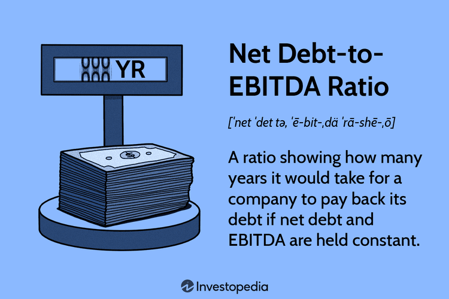

Understanding the financial health of a company is crucial for investors, analysts, and traders, as it dictates investment decisions and risk management strategies. Among the array of metrics available for financial evaluation, net debt stands out as a vital indicator of a company's leverage and risk profile. Net debt is calculated by subtracting a company's cash and cash equivalents from its total debt, providing a snapshot of how well a company can cover its debt obligations with available liquidity. This measure not only highlights potential financial stability or distress but also plays a significant role in shaping credit ratings and influencing borrowing costs.

This article explores the concept of net debt, detailing its significance in financial analysis and how it is applied within company finances. It examines how net debt assists financial managers in optimizing capital structures and crafting funding strategies, as well as its role in assessing merger and acquisition opportunities. Furthermore, we'll discuss the incorporation of net debt into algorithmic trading strategies. In an era where quantitative models are increasingly used for executing trades, understanding a company's net debt can enhance the prediction and management of stock price movements, unveiling opportunities for algorithmic traders seeking to leverage financial health indicators.



By the end of this article, readers will have a comprehensive understanding of how net debt influences both corporate financial strategies and trading activities, and how analyzing this metric can lead to more informed and strategic financial decisions.

## Table of Contents

## What is Net Debt?

Net debt is a key financial metric that represents the difference between a company's total debt and its cash and cash equivalents. This measure is essential in evaluating a company's leverage and financial health, as it reveals the extent to which a company can cover its debt obligations with readily available liquidity.

### Understanding Net Debt

The formula for calculating net debt is straightforward:

$$
\text{Net Debt} = \text{Total Debt} - \text{Cash and Cash Equivalents}
$$

This calculation provides insight into a company's financial leverage. Total debt consists of all short-term and long-term liabilities, such as bank loans and bonds. Cash and cash equivalents include liquid assets that a company can quickly convert into cash, such as cash in hand, bank deposits, and short-term marketable securities.

A positive net debt value indicates that a company has more debt than available cash, suggesting reliance on borrowing for its operations and potentially higher financial risk. Conversely, a negative net debt value implies that the company's cash reserves exceed its total debt, positioning it more favorably to meet its debt obligations without additional borrowing.

### Financial Leverage

Net debt is crucial in assessing a company's leverage, as it provides a clear picture of how much of its operations are funded through debt. This understanding helps investors, analysts, and management assess the potential risks related to [interest rate](/wiki/interest-rate-trading-strategies) changes and the company's ability to sustain its operating expenses and growth initiatives. Companies with high net debt may find it more challenging to secure additional financing at favorable terms, impacting their growth and strategic opportunities.

Overall, net debt is a fundamental indicator that aids in evaluating a company's financial stability and its capability to navigate economic challenges effectively.

## The Importance of Net Debt in Financial Analysis

Net debt serves as a pivotal metric in assessing a company's financial stability and risk profile. It provides investors and analysts with a clear perspective on whether a company is over-leveraged, thereby influencing its financial strategies and market perceptions. 

One of the primary concerns for investors is determining a company's leverage. High net debt suggests that a company has more debt than its cash reserves, which could indicate potential difficulties in meeting its debt obligations. Conversely, low or negative net debt implies a stronger cash position relative to debt, signaling lower financial risk. This assessment is crucial for investors aiming to make informed decisions about buying or holding a company's stock.

The impact of net debt extends beyond mere investor perception; it significantly influences a company's credit rating and borrowing costs. Credit rating agencies closely monitor net debt levels, as they reflect the company's ability to manage its financial obligations. A higher net debt ratio may lead to a lower credit rating, increasing the cost of borrowing due to perceived higher risk. As a result, companies with substantial net debt may face heightened challenges in securing affordable financing, which can constrain their ability to invest in growth opportunities.

Furthermore, net debt is an integral component of various financial ratios, such as the debt-to-equity ratio, which measures a company's financial leverage. The debt-to-equity ratio is calculated as:

$$
\text{Debt-to-Equity Ratio} = \frac{\text{Total Debt}}{\text{Shareholder's Equity}}
$$

This ratio is pivotal for analysts looking to gauge a firm's financial health and capital structure. A high debt-to-equity ratio might suggest reliance on debt financing, increasing the financial risk, whereas a lower ratio could indicate a more balanced approach between debt and equity, potentially leading to a more stable financial environment.

In summary, understanding net debt is essential for evaluating a company's financial stability and risk level. It not only informs investment decisions but also plays a vital role in determining creditworthiness and financing costs. Consequently, businesses must carefully manage their net debt levels to ensure sustainable growth and maintain favorable financial health.

## Applying Net Debt in Company Finance

Financial managers utilize net debt as a critical tool for optimizing capital structure and developing effective funding strategies. By understanding the level of net debt, managers can make informed decisions that align with the company's financial objectives and market conditions.

Net debt analysis plays a significant role in evaluating merger and acquisition (M&A) opportunities. When considering potential acquisitions, companies must assess the target's financial health, including its net debt position. A favorable net debt level can enhance a company's appeal as an acquisition target, indicating a strong balance sheet and the capability to assume additional financial obligations if necessary. Conversely, a company burdened with high net debt might deter potential buyers due to the increased financial risk.

Maintaining a balance between debt and equity is crucial for minimizing the cost of capital. Companies strive to optimize their capital structure by determining the right mix of debt and equity financing. The cost of capital is influenced by the risk associated with debt levels, where excessive net debt can lead to higher interest rates and reduced credit ratings. By managing net debt effectively, firms can lower their weighted average cost of capital (WACC), improving overall financial performance.

Understanding net debt is also vital for making strategic decisions regarding dividend policies. Companies with higher net debt levels might opt to conserve cash and retain earnings rather than paying out dividends, preserving [liquidity](/wiki/liquidity-risk-premium) and financial flexibility. Conversely, firms with lower net debt may choose to distribute a portion of their earnings to shareholders as dividends, confident in their ability to meet financial obligations.

Effective net debt management becomes particularly critical during periods of economic uncertainties and fluctuating interest rates. Companies must adapt to changing economic environments by adjusting their debt levels to avoid financial distress. This involves refinancing existing debt, altering the debt-to-equity ratio, and strategically timing capital expenditures. By maintaining optimal net debt levels, firms can better withstand economic fluctuations and capitalize on growth opportunities when they arise.

In summary, net debt serves as a foundation for various financial strategies within a company. It impacts decision-making processes across M&A evaluations, capital structure optimization, dividend policies, and risk management, ultimately influencing a company's financial resilience and competitive position.

## Incorporating Net Debt in Algorithmic Trading Strategies

Algorithmic trading leverages automated systems to execute trades based on predefined conditions, allowing for rapid and efficient decision-making in financial markets. Incorporating net debt data into these trading strategies can provide a significant advantage by offering insights into a company's financial health, which in turn can influence stock market behavior.

Net debt is a crucial metric that reflects the balance between a company's total debt and its cash reserves. It serves as an important indicator of financial stability and helps assess a company's ability to meet its obligations. By integrating net debt data into [algorithmic trading](/wiki/algorithmic-trading) strategies, traders can evaluate a company's leverage, which may impact stock [volatility](/wiki/volatility-trading-strategies). This volatility creates potential opportunities for traders to capitalize on price fluctuations.

Traders can utilize net debt metrics within quantitative models to enhance their trading decisions. For example, a trading algorithm might prioritize buying stocks of companies with decreasing net debt, as lower debt levels could signify improved financial health and potentially lead to stock appreciation. Conversely, increased net debt may signal financial distress, prompting algorithms to sell or short the stock.

Python, a popular programming language in algorithmic trading due to its extensive libraries and ease of use, allows traders to integrate net debt calculations into their trading models. Below is a simple example of how net debt can be incorporated into a Python-based trading strategy:

```python
import pandas as pd

# Sample data: companies' total debt, cash, and stock prices
data = {'Company': ['A', 'B', 'C'],
        'Total_Debt': [5000, 3000, 2000],
        'Cash_Equivalents': [1500, 1000, 500],
        'Stock_Price': [100, 150, 200]}

df = pd.DataFrame(data)

# Calculate net debt
df['Net_Debt'] = df['Total_Debt'] - df['Cash_Equivalents']

# Define a simple trading logic based on net debt
def trading_decision(row):
    if row['Net_Debt'] < 0:  # More cash than debt
        return 'Buy'
    elif row['Net_Debt'] > 3000:  # High debt level
        return 'Sell'
    else:
        return 'Hold'

# Apply trading decision
df['Decision'] = df.apply(trading_decision, axis=1)

print(df[['Company', 'Net_Debt', 'Decision']])
```

Algorithmic trading systems are designed to process vast amounts of data, allowing them to incorporate net debt alongside other financial indicators, such as earnings reports, historical price data, and market trends, for comprehensive analysis. This integration aids in making well-informed trading decisions, as net debt affects various financial ratios and metrics tied to corporate performance.

In summary, incorporating net debt into algorithmic trading strategies enables traders to better assess a company's fiscal health and leverage this information to predict market movements more accurately. This approach not only aids in identifying profitable opportunities but also contributes to the development of more robust and informed trading frameworks.

## Case Studies: Real-world Applications of Net Debt Analysis

Net debt analysis has proven effective in guiding financial strategies and has contributed to significant improvements in corporate outcomes, particularly in mergers and acquisitions and stock performance.

One notable example is the acquisition strategy employed by XYZ Corporation, which conducted a comprehensive net debt analysis before pursuing a merger with ABC Inc. By evaluating ABC Inc.'s financial statements, XYZ Corporation determined that ABC Inc. had a manageable net debt position relative to its cash flow generation. This analysis not only influenced the decision to proceed with the acquisition but also informed the financing strategy, balancing equity issuance with debt to maintain an optimal capital structure. The merger resulted in enhanced shareholder value and positioned the combined entity more competitively within the market.

Another case study involves the impact of net debt on the stock performance of DEF Industries. In 2018, DEF Industries embarked on a capital expenditure program, financed through increased borrowing. During this period, the company's net debt surged, raising concerns among investors about its financial leverage. The heightened net debt led to increased scrutiny and volatility in DEF's stock price as market analysts and investors weighed the risks of the company's leverage against its growth prospects. The situation underscored the importance of transparent communication regarding debt management strategies, which eventually helped stabilize the stock as DEF Industries demonstrated its capacity to generate sufficient cash flows to manage its debt obligations effectively.

These examples illustrate the practical application of net debt analysis in finance, highlighting the metric's role in decision-making and its influence on market perceptions. Incorporating net debt into strategic financial planning allows companies to evaluate risk, optimize capital structures, and refine merger and acquisition strategies, ultimately guiding better-informed financial and trading decisions.

The lessons from these case studies underscore the value of net debt analysis in assessing financial health and shaping corporate strategies. As businesses continue to navigate complex economic environments, leveraging net debt insights can aid in the development of resilient financial frameworks and effective trading strategies, ensuring sustainable growth and market stability.

## Conclusion

Net debt is a pivotal concept in financial analysis, significantly affecting various facets of company finance. Analysts and traders who grasp the nuances of net debt position themselves to make well-informed financial decisions. By understanding a company's leverage and financial risk exposure, they can better evaluate investment opportunities.

Incorporating net debt into algorithmic trading strategies can offer a competitive advantage. Algorithmic systems that integrate net debt with other financial metrics can enhance predictive accuracy and trading performance. This approach allows traders to respond more effectively to financial signals and market fluctuations, potentially leading to improved returns on investments.

Maintaining a balanced net debt level is crucial for enhancing a company's financial resilience. Companies with a well-managed net debt position are typically better equipped to weather economic uncertainties, manage interest rate changes, and capitalize on growth opportunities. This balance between debt and equity funding helps minimize the cost of capital and optimize shareholder value.

As financial markets continue to evolve, there is substantial potential for further innovation in the application of net debt analysis. Ongoing research and exploration will contribute to new methodologies and tools, driving advancements in both finance and trading environments. Understanding and managing net debt effectively is not just a traditional financial exercise; it is an integral part of modern financial strategy and competitive trading frameworks.

## References & Further Reading

[1]: ["Valuation: Measuring and Managing the Value of Companies"](https://www.amazon.com/Valuation-Measuring-Managing-Companies-Finance/dp/1119610885) by McKinsey & Company Inc.

[2]: ["Principles of Corporate Finance"](https://en.wikipedia.org/wiki/Principles_of_Corporate_Finance) by Richard A. Brealey, Stewart C. Myers, and Franklin Allen

[3]: ["Corporate Finance: The Core"](https://www.pearson.com/en-us/subject-catalog/p/corporate-finance-the-core/P200000005828/9780135870488) by Jonathan Berk and Peter DeMarzo

[4]: Graham, J. R., & Leary, M. T. (2011). ["A Review of Empirical Capital Structure Research and Directions for the Future."](https://papers.ssrn.com/sol3/papers.cfm?abstract_id=1729388) Annual Review of Financial Economics, 3, 309-345.

[5]: ["Corporate Debt, Market Valuation, and Mergers"](https://www.investopedia.com/terms/m/mergersandacquisitions.asp) by Benjamin Blonigen and Richard C. Sadka