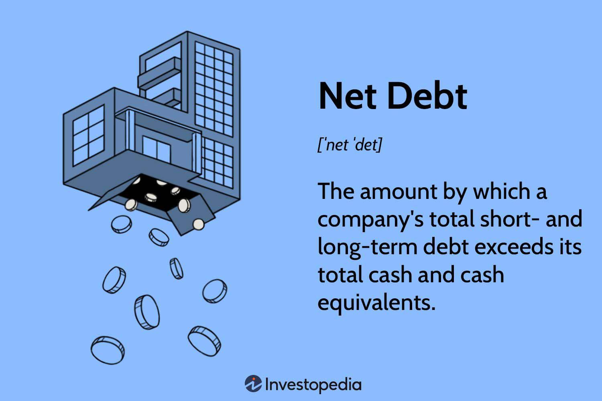

## Table of Contents

## What is net debt?

Net debt is the amount of money a company owes after subtracting its cash and cash equivalents from its total debt. It's like figuring out how much debt a company really has when you consider the money it has on hand. If a company has a lot of cash, it can use that to pay off some of its debt, so the net debt would be lower than the total debt.

Understanding net debt is important because it shows how much a company would need to borrow if it had to pay off all its debts right now. A lower net debt means the company is in a better financial position because it has more cash to cover its debts. On the other hand, a high net debt might mean the company could struggle to pay off its debts, which could be risky for investors and creditors.

## How is net debt calculated?

Net debt is calculated by taking a company's total debt and subtracting its cash and cash equivalents. Total debt includes things like loans, bonds, and any other money the company owes. Cash and cash equivalents are the money the company has in the bank or can easily turn into cash, like short-term investments.

To find the net debt, you start with the total debt number from the company's balance sheet. Then, you look at the cash and cash equivalents, also found on the balance sheet. Subtract the cash and cash equivalents from the total debt, and the result is the net debt. If a company has $100 million in debt and $30 million in cash, its net debt would be $70 million.

## Why is net debt important for businesses?

Net debt is important for businesses because it shows how much money they really owe after using the cash they have. If a business has a lot of cash, it can use that to pay off some of its debt. So, the net debt is lower than the total debt. This helps business owners and investors see if the company is in a good financial spot. A low net debt means the business can handle its debts well, which makes it safer for investors.

On the other hand, a high net debt can be a warning sign. It means the business might struggle to pay off what it owes, which could be risky. Investors and lenders look at net debt to decide if they should put money into the business or lend it more. By keeping an eye on net debt, businesses can make better choices about borrowing money and managing their finances.

## What is the difference between gross debt and net debt?

Gross debt and net debt are two different ways to look at how much money a company owes. Gross debt is the total amount of money a company has borrowed. This includes all loans, bonds, and any other money the company owes. It's like looking at the whole bill without taking anything away.

Net debt, on the other hand, is what's left after you subtract the company's cash and cash equivalents from its gross debt. Cash and cash equivalents are the money the company has in the bank or can easily turn into cash. So, net debt shows how much debt a company really has when you consider the money it has on hand. It's like figuring out how much you'd owe on your credit card after using some of your savings to pay it down.

## How does net debt affect a company's financial health?

Net debt is a key number that tells us about a company's financial health. It shows how much money a company owes after using its cash. If a company has a low net debt, it means it has enough cash to cover a lot of its debts. This is good because the company can handle its bills easily. It's like having money in your pocket to pay off what you owe. Investors and lenders like to see a low net debt because it means the company is less risky.

On the other hand, a high net debt can be a warning sign. It means the company might struggle to pay off what it owes, which can be risky. If a company has a lot of debt and not enough cash, it could have trouble paying its bills on time. This can make investors and lenders worried, and they might not want to give the company more money. So, keeping net debt low is important for a company's financial health because it shows that the company is managing its money well.

## What are the implications of high net debt for a company?

High net debt can be a big problem for a company. It means the company owes a lot of money even after using all its cash. This can make it hard for the company to pay its bills on time. If the company can't pay its debts, it might have to borrow more money, which can lead to even more debt. This can scare away investors and lenders because they don't want to put money into a company that might not be able to pay them back.

Having a lot of net debt can also make it harder for a company to grow. Instead of using its money to invest in new projects or expand its business, the company has to use its money to pay off its debts. This can slow down the company and make it less competitive. In the worst case, if the company can't handle its high net debt, it might even go bankrupt. So, keeping net debt low is important for a company to stay healthy and grow.

## How can net debt be used in financial analysis?

Net debt is a useful tool in financial analysis because it helps people see how much money a company really owes after using its cash. It's like checking how much you would still owe on your credit card after using your savings to pay it down. By looking at net debt, analysts and investors can tell if a company is in a good financial position. A low net debt means the company has enough cash to cover a lot of its debts, which is a good sign. It shows the company can handle its bills easily and is less risky for investors.

On the other hand, a high net debt can be a warning sign. It means the company might struggle to pay off what it owes, which can be risky. If a company has a lot of debt and not enough cash, it could have trouble paying its bills on time. This can make investors and lenders worried, and they might not want to give the company more money. So, net debt is important in financial analysis because it helps people make better decisions about whether to invest in or lend money to a company.

## What are some strategies to manage or reduce net debt?

To manage or reduce net debt, a company can start by increasing its cash flow. This means finding ways to bring in more money, like selling more products or services, or cutting costs. If the company makes more money than it spends, it can use the extra cash to pay down its debts. Another way to boost cash flow is to sell off assets that the company doesn't need anymore. By turning these assets into cash, the company can use that money to reduce its net debt.

Another strategy is to refinance existing debt. This means the company can take out new loans with lower interest rates to pay off old loans with higher rates. By doing this, the company can save money on interest payments, which helps it pay down the principal faster. If the company can't get better loan terms, it might need to talk to its lenders about restructuring its debt. This can mean asking for more time to pay or even negotiating to owe less money. By using these strategies, a company can work on lowering its net debt and improving its financial health.

## How does net debt impact a company's valuation?

Net debt can have a big impact on how much a company is worth. When people want to know a company's value, they often look at its net debt. If a company has a lot of net debt, it means it owes a lot of money even after using all its cash. This can make the company seem less valuable because it might struggle to pay its bills. Investors and buyers might not want to pay as much for a company with high net debt because it's riskier.

On the other hand, if a company has low net debt, it means it doesn't owe much money after using its cash. This can make the company seem more valuable because it can handle its debts easily. Investors and buyers might be willing to pay more for a company with low net debt because it's less risky. So, net debt is important when figuring out how much a company is worth.

## Can net debt be negative, and what does that signify?

Yes, net debt can be negative. This happens when a company has more cash and cash equivalents than it has total debt. It's like having more money in your pocket than what you owe on your credit card. When a company's net debt is negative, it's a good sign. It means the company is in a strong financial position because it has enough cash to pay off all its debts and still have money left over.

A negative net debt can make a company look more attractive to investors and lenders. It shows that the company is managing its money well and is less risky. Investors might be willing to pay more for a company with negative net debt because it's a sign of financial health. Lenders might also be more willing to give the company money because they know it can easily pay them back.

## How do changes in interest rates affect net debt?

Changes in interest rates can affect a company's net debt in a big way. When interest rates go up, it costs more for a company to borrow money. This means the company might have to pay more interest on its loans and bonds. If the company's income doesn't grow as fast as the interest rates, it might end up with more debt because it's harder to pay off what it owes. This can lead to a higher net debt because the company has to use more of its cash to cover the higher interest payments.

On the other hand, when interest rates go down, it's cheaper for a company to borrow money. The company can pay less interest on its loans and bonds, which means it can use more of its cash to pay down its debt. This can help lower the company's net debt because it has more money left over after paying interest. So, keeping an eye on interest rates is important for a company to manage its net debt and stay financially healthy.

## What are the industry-specific considerations when analyzing net debt?

When looking at net debt, it's important to think about the kind of industry a company is in. Different industries have different ways of handling debt. For example, companies in industries like utilities or telecoms often have a lot of debt because they need to spend a lot of money on big projects like power plants or phone networks. So, a high net debt might not be as scary for these companies as it would be for a company in a different industry. On the other hand, companies in industries like tech or retail might not need as much debt because they don't have to spend as much on big projects. For these companies, a high net debt could be a bigger problem.

Another thing to think about is how much money companies in different industries usually make. Some industries, like oil and gas, can have big ups and downs in their income because of changes in oil prices. If a company in this industry has a lot of net debt, it might be riskier because it's harder to pay off debts when income is low. But if the company has a lot of cash saved up, it might be able to handle its debt better during tough times. So, when looking at net debt, it's important to think about the ups and downs of the industry and how much cash the company has to cover its debts.

## What is Net Debt?

Net debt is a key financial metric that represents the difference between a company's total debt and its cash and cash equivalents. This measure is essential in evaluating a company's leverage and financial health, as it reveals the extent to which a company can cover its debt obligations with readily available [liquidity](/wiki/liquidity-risk-premium).

### Understanding Net Debt

The formula for calculating net debt is straightforward:

$$
\text{Net Debt} = \text{Total Debt} - \text{Cash and Cash Equivalents}
$$

This calculation provides insight into a company's financial leverage. Total debt consists of all short-term and long-term liabilities, such as bank loans and bonds. Cash and cash equivalents include liquid assets that a company can quickly convert into cash, such as cash in hand, bank deposits, and short-term marketable securities.

A positive net debt value indicates that a company has more debt than available cash, suggesting reliance on borrowing for its operations and potentially higher financial risk. Conversely, a negative net debt value implies that the company's cash reserves exceed its total debt, positioning it more favorably to meet its debt obligations without additional borrowing.

### Financial Leverage

Net debt is crucial in assessing a company's leverage, as it provides a clear picture of how much of its operations are funded through debt. This understanding helps investors, analysts, and management assess the potential risks related to [interest rate](/wiki/interest-rate-trading-strategies) changes and the company's ability to sustain its operating expenses and growth initiatives. Companies with high net debt may find it more challenging to secure additional financing at favorable terms, impacting their growth and strategic opportunities.

Overall, net debt is a fundamental indicator that aids in evaluating a company's financial stability and its capability to navigate economic challenges effectively.

## What is the importance of net debt in financial analysis?

Net debt serves as a pivotal metric in assessing a company's financial stability and risk profile. It provides investors and analysts with a clear perspective on whether a company is over-leveraged, thereby influencing its financial strategies and market perceptions. 

One of the primary concerns for investors is determining a company's leverage. High net debt suggests that a company has more debt than its cash reserves, which could indicate potential difficulties in meeting its debt obligations. Conversely, low or negative net debt implies a stronger cash position relative to debt, signaling lower financial risk. This assessment is crucial for investors aiming to make informed decisions about buying or holding a company's stock.

The impact of net debt extends beyond mere investor perception; it significantly influences a company's credit rating and borrowing costs. Credit rating agencies closely monitor net debt levels, as they reflect the company's ability to manage its financial obligations. A higher net debt ratio may lead to a lower credit rating, increasing the cost of borrowing due to perceived higher risk. As a result, companies with substantial net debt may face heightened challenges in securing affordable financing, which can constrain their ability to invest in growth opportunities.

Furthermore, net debt is an integral component of various financial ratios, such as the debt-to-equity ratio, which measures a company's financial leverage. The debt-to-equity ratio is calculated as:

$$
\text{Debt-to-Equity Ratio} = \frac{\text{Total Debt}}{\text{Shareholder's Equity}}
$$

This ratio is pivotal for analysts looking to gauge a firm's financial health and capital structure. A high debt-to-equity ratio might suggest reliance on debt financing, increasing the financial risk, whereas a lower ratio could indicate a more balanced approach between debt and equity, potentially leading to a more stable financial environment.

In summary, understanding net debt is essential for evaluating a company's financial stability and risk level. It not only informs investment decisions but also plays a vital role in determining creditworthiness and financing costs. Consequently, businesses must carefully manage their net debt levels to ensure sustainable growth and maintain favorable financial health.

## References & Further Reading

[1]: ["Valuation: Measuring and Managing the Value of Companies"](https://www.amazon.com/Valuation-Measuring-Managing-Companies-Finance/dp/1119610885) by McKinsey & Company Inc.

[2]: ["Principles of Corporate Finance"](https://en.wikipedia.org/wiki/Principles_of_Corporate_Finance) by Richard A. Brealey, Stewart C. Myers, and Franklin Allen

[3]: ["Corporate Finance: The Core"](https://www.pearson.com/en-us/subject-catalog/p/corporate-finance-the-core/P200000005828/9780135870488) by Jonathan Berk and Peter DeMarzo

[4]: Graham, J. R., & Leary, M. T. (2011). ["A Review of Empirical Capital Structure Research and Directions for the Future."](https://papers.ssrn.com/sol3/papers.cfm?abstract_id=1729388) Annual Review of Financial Economics, 3, 309-345.

[5]: ["Corporate Debt, Market Valuation, and Mergers"](https://www.investopedia.com/terms/m/mergersandacquisitions.asp) by Benjamin Blonigen and Richard C. Sadka