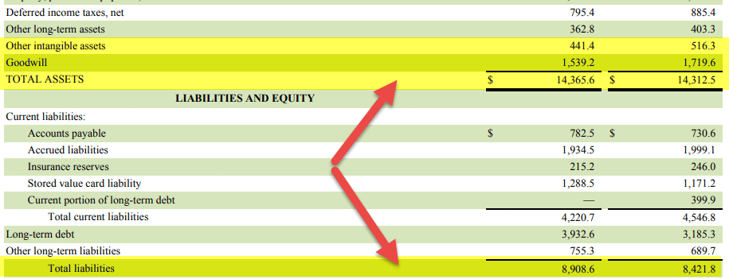

In the complex world of financial metrics and investment analysis, understanding the true value of a company is paramount. Investors, analysts, and financial managers continually seek methods to accurately determine a company’s worth and optimize investment strategies. This article explores the intersection of financial metrics, asset calculations, net tangible assets, and algorithmic trading. Each of these components plays a significant role in assessing a company’s financial health and potential for growth.

Financial metrics provide essential data points that evaluate a company’s performance and forecast its future prospects. Among these metrics, asset calculations help assess the total value of a company, encompassing both tangible and intangible components. By differentiating between physical assets like property and machinery, and non-physical assets such as patents and brand value, investors can gain insights into the operational capabilities and competitive advantages that drive a company forward.

Understanding net tangible assets (NTA) is crucial as they reflect the tangible value of a company after accounting for liabilities and non-physical assets. The formula for determining NTA is:

$$
\text{NTA} = \text{Total Assets} - \text{Intangible Assets} - \text{Total Liabilities}
$$

This metric helps in evaluating a company’s liquidation value and creditworthiness—critical factors in investment decisions.

Algorithmic trading revolutionizes the decision-making process by employing computer algorithms to execute trades based on predefined criteria involving these financial metrics. By integrating net tangible assets into algorithmic models, traders can refine strategies and enhance decision-making accuracy. Algorithms analyze large datasets in real-time, optimizing market performance through precision trading and bridging traditional valuation methods with modern technology.

This guide offers valuable insights into these critical financial concepts, aiding investors in making informed decisions and equipping them with the knowledge to harness potential investment opportunities under diverse market conditions. Whether you are assessing a potential stock investment or strategizing a comprehensive portfolio management plan, a thorough understanding of these financial metrics and the application of advanced trading technologies is essential.

## Table of Contents

## Understanding Financial Metrics in Investment

Financial metrics play an integral role in evaluating a company's performance and assessing its potential for growth. They provide a framework for understanding a company's financial health by offering insights into its assets, liabilities, and overall value. Among these metrics, tangible assets, liabilities, and net tangible assets (NTA) stand out as pivotal indicators for investment analysis. By examining these key metrics, investors can better gauge a company's real value and financial stability.

Tangible assets are physical items that a company possesses and utilizes in its operations. These include property, plant, equipment, and inventory. They form the backbone of a company's assets, directly contributing to revenue generation. Assessing the value of tangible assets helps investors understand the company's operational efficiency and resource management capabilities.

Liabilities, on the other hand, represent obligations that a company must fulfill, which can include loans, accounts payable, and any other forms of debt. Evaluating a company's liabilities is crucial in understanding its financial obligations and risk exposure. High levels of liabilities can indicate potential financial distress, while a manageable level may suggest financial stability.

Net tangible assets (NTA) offer a refined perspective by subtracting intangible assets and liabilities from the total asset value. The formula is expressed as:

$$
\text{NTA} = \text{Total Assets} - \text{Intangible Assets} - \text{Total Liabilities}
$$

This calculation highlights the physical asset backing of a company, which is especially useful in assessing its liquidation value and creditworthiness. In analyzing these metrics, investors can identify companies that might be underestimated due to their tangible asset base, thus uncovering potential opportunities.

Investors leverage these metrics to develop strategic investment decisions. By identifying undervalued companies with strong tangible asset bases, they can optimize portfolio strategies for long-term growth. Additionally, understanding these metrics aids in determining the right entry and [exit](/wiki/exit-strategy) points for investments, ultimately contributing to successful financial outcomes.

## Asset Calculation: The Foundation of Financial Valuation

Asset calculation is a crucial process in determining the financial valuation of a company, as it encompasses both tangible and intangible assets. Tangible assets are the physical items that a company owns, such as machinery, buildings, and inventory. These assets play a direct role in the organization's operational capabilities and revenue generation. They are often seen as the foundation of a company's asset portfolio because their value can be easily quantified and liquidated if necessary.

Intangible assets, on the other hand, do not have a physical presence. They include elements like patents, trademarks, goodwill, and proprietary technologies. Despite their non-physical nature, intangible assets can provide substantial competitive advantages and contribute significantly to a company's overall value. For example, a strong brand reputation or a revolutionary patent can enhance a company's market position, facilitating higher pricing power and customer loyalty.

The process of asset calculation involves identifying and quantifying these assets. For tangible assets, their assessment can typically be done by reviewing the company's balance sheet, which lists these items along with their respective valuations. Depreciation is often considered to ensure that the reported values of physical assets accurately reflect their current worth.

Intangible assets, however, require more complex valuation methods. Techniques such as discounted cash flow (DCF) analysis, market comparison, and cost-based valuation are often employed to estimate their worth. These methods consider factors like future income streams, comparable market values, and the cost of recreating or replacing the intangible assets.

Understanding the nuances of asset calculation is essential for investors and financial analysts, as it aids in assessing a company's overall worth and financial stability. By accurately evaluating both tangible and intangible assets, stakeholders can gain insights into the true economic value of a company, beyond what is immediately apparent in financial statements. Thus, asset calculation forms a foundational element of informed investment decision-making, aligning financial strategies with the underlying value of corporate assets.

## Net Tangible Assets: An Essential Financial Metric

Net tangible assets (NTA) represent a company's tangible assets minus its liabilities and intangible assets, providing a focused view of the firm's tangible financial backing. Understanding and calculating NTA is crucial for investment evaluations, as it offers insights into the company's physical asset foundation and liquidation value, which are essential for assessing creditworthiness and strategic financial management.

The formula for NTA is:

$$
\text{NTA} = \text{Total Assets} - \text{Intangible Assets} - \text{Total Liabilities}
$$

This calculation involves three primary components:

1. **Total Assets**: This includes all resources owned by a company that have economic value. These are typically listed on a company's balance sheet and comprise both current and non-current assets.

2. **Intangible Assets**: These are non-physical assets that contribute to the value of a company, such as patents, trademarks, goodwill, and intellectual property. Although they can provide significant value, intangible assets are excluded from the NTA calculation because the focus is on tangible, liquidable assets.

3. **Total Liabilities**: These are a company's obligations or debts owed to external parties. Subtracting these from the total tangible assets gives a clearer picture of what would remain if the company were liquidated.

By focusing on tangible assets and liabilities, the NTA metric provides a snapshot of a company's potential net worth in liquidation scenarios. It's particularly valuable for investment analysts in determining a company's stability and for understanding the value of physical asset backing against liabilities. Investors often use NTA to gauge financial health, making it an essential metric in assessing a company's credit risk and investment potential.

## Calculating Net Tangible Assets: A Step-by-Step Approach

To calculate Net Tangible Assets (NTA), it is essential to accurately assess the tangible assets a company holds, minus its total liabilities and the value of any intangible assets. This approach provides a factual representation of the company's physical asset value, a key indicator of financial strength.

Begin with the company's balance sheet to identify its total assets. Total assets include both tangible and intangible assets. Tangible assets are physical items such as property, machinery, and inventory, while intangible assets encompass items like patents and trademarks.

1. **Determine Total Assets**: Look at the balance sheet to identify the total assets listed. For instance, if a company reports $10 million in total assets, this figure includes both tangible and intangible assets.

2. **Subtract Intangible Assets**: From the total assets, subtract the value of intangible assets. If the intangible assets are valued at $2 million, the calculation would be:
$$
   \text{Tangible Assets} = \text{Total Assets} - \text{Intangible Assets} = 10,000,000 - 2,000,000 = 8,000,000

$$

3. **Subtract Total Liabilities**: Once the tangible assets are calculated, subtract the total liabilities to determine the net tangible assets. If the company has liabilities amounting to $3 million, then:
$$
   \text{Net Tangible Assets} = \text{Tangible Assets} - \text{Total Liabilities} = 8,000,000 - 3,000,000 = 5,000,000

$$

The outcome, in this case, is that the company has $5 million in net tangible assets. This value represents the company's actual physical asset base after settling its liabilities, offering investors an insight into the company's liquidation value and asset quality. By understanding and calculating NTA, stakeholders can make better informed financial decisions based on the company's core asset strength.

## Algorithmic Trading: Revolutionizing Financial Analysis

Algorithmic trading has fundamentally transformed financial analysis by employing computer algorithms to automate trading processes based on predetermined criteria and financial metrics. This approach leverages sophisticated algorithms capable of analyzing extensive datasets in real-time, facilitating precise and timely trading decisions. By integrating tangible net worth into algorithmic models, trading strategies are refined, enhancing decision-making capabilities and aligning trades with a company's tangible financial health.

At its core, [algorithmic trading](/wiki/algorithmic-trading) operates by setting predefined trading rules that determine the timing, price, and quantity of trades. These rules can be based on a myriad of financial metrics and quantitative indicators, allowing the algorithms to make trades more efficiently and without emotional bias often present in human trading. For instance, a trading algorithm might automatically buy shares if the stock price drops below a certain threshold relative to the company's net tangible assets value, indicating a potential undervaluation.

The efficiency of algorithmic trading is underpinned by its ability to process and react to vast amounts of financial data at speeds unattainable by human traders. This capability is particularly advantageous in markets where rapid price fluctuations occur, as algorithms can execute trades within milliseconds, capitalizing on fleeting opportunities that might otherwise be missed.

Moreover, algorithmic trading bridges traditional valuation methods with cutting-edge technology, thereby expanding avenues for financial success. By incorporating traditional financial metrics, such as net tangible assets, into modern algorithmic strategies, traders can ensure their approaches remain rooted in [fundamental analysis](/wiki/fundamental-analysis) while benefiting from technological advancements. This convergence allows for the creation of robust trading models that are both innovative and grounded in financial realities.

In essence, algorithmic trading enhances the traditional financial analysis framework by offering advanced solutions for real-time decision-making. It empowers investors and traders to implement strategies that are data-driven, precise, and adaptable to the ever-evolving financial landscape. As algorithmic trading continues to evolve, it is poised to redefine market dynamics and solidify its role as a pivotal tool for financial success in the digital age.

## Real-World Applications and Strategic Importance

Understanding and applying financial metrics, asset calculations, and net tangible assets (NTA) is crucial across various financial contexts, where they serve as valuable tools for decision-making. NTA, in particular, plays a significant role due to its ability to provide a real and transparent valuation of a company, primarily through its tangible asset base.

In mergers and acquisitions (M&A), NTA serves as an essential benchmark for valuations. During these transactions, determining the true value of a company is imperative to ensure that mergers or acquisitions are financially sound and equitable. The NTA metric offers an unbiased view by emphasizing the company's tangible assets, stripped of potentially volatile intangible assets like goodwill or intellectual property. This approach facilitates fair and transparent negotiations, reducing the risk of overpricing or underpricing assets involved in the transaction.

In lending and credit analysis, a high NTA is often indicative of a company's financial strength, which is a critical [factor](/wiki/factor-investing) for creditors. When assessing creditworthiness, lenders seek assurance that a borrowing entity possesses enough tangible assets to cover outstanding liabilities. A substantial NTA indicates that a company is more likely to meet its debt obligations, thereby reducing the risk for lenders. Consequently, companies with high NTAs might enjoy favorable lending terms, including lower interest rates or more lenient repayment schedules.

For portfolio management, NTA is instrumental in identifying undervalued assets, thereby enhancing investment strategies. Financial managers and investors use NTA to unearth companies with robust tangible asset bases that may not be fully reflected in current market valuations. This insight allows for the strategic allocation of resources to capitalize on potential growth opportunities. By incorporating NTA into their analyses, portfolio managers can bolster investment strategies with a focus on identifying companies that possess intrinsic value, thereby optimizing returns.

Overall, understanding and leveraging NTA in conjunction with other financial metrics provides a reliable framework for strategic decision-making in various financial arenas. It helps ensure precision, reduce risks, and uncover undervalued opportunities, all of which are fundamental to achieving sound financial outcomes.

## Limitations of Net Tangible Assets and Algorithmic Trading

While Net Tangible Assets (NTA) offer clear insights into a company's physical asset value, they have notable limitations. A primary concern is the exclusion of intangible assets such as intellectual property, brand reputation, or patents. In sectors where intangible assets constitute a significant part of a company's value, relying exclusively on NTA might lead to an undervaluation. For instance, firms in the technology, pharmaceutical, and media industries often derive substantial competitive advantage and market valuation from their intangible assets.

In these cases, solely focusing on NTA fails to capture the true economic worth, potentially misleading investors. To address this, it's crucial to adopt a more comprehensive analysis that considers both tangible and intangible assets. This dual assessment provides a balanced view, aligning more closely with the overall value the market might recognize.

Algorithmic trading, on the other hand, revolutionizes trading by leveraging computer algorithms to execute trades based on pre-set criteria. Despite its advantages, algorithmic trading faces challenges such as market [volatility](/wiki/volatility-trading-strategies) and data accuracy. Algorithms are designed to process large amounts of data and react in fractions of a second, but they can be sensitive to anomalies. Sudden market shifts or inaccurate data inputs can lead to suboptimal or unintended trading outcomes.

Thus, while algorithms excel in executing high-frequency trades and analyzing vast datasets, investors and traders should ensure that algorithms are continuously updated to account for new market data and potential irregularities. They should also incorporate risk management strategies that can mitigate the impact of extreme market fluctuations.

In conclusion, both NTA and algorithmic trading possess limitations that require investors to integrate both tangible and intangible assessments for a comprehensive perspective. This approach optimizes strategic decisions, ensuring both the physical assets' value and the intellectual capital are appropriately considered.

## Conclusion

Financial metrics, asset calculations, and net tangible assets (NTA) are fundamental tools for evaluating and optimizing investment strategies. These metrics provide a comprehensive understanding of a company's financial health by focusing on both tangible and intangible assets. By assessing tangible assets, such as machinery, buildings, and inventory, alongside liabilities and intangible assets, investors can calculate the NTA to gauge the real value and stability of a company.

Algorithmic trading significantly enhances the analysis of these financial metrics by providing advanced solutions for real-time decision-making. Algorithms are designed to process large volumes of data at high speed, allowing for precise execution of trades based on predefined metrics, including NTA. This capability enables market participants to respond swiftly to market changes, thus optimizing investment outcomes.

A balanced assessment of tangible and intangible assets is crucial for a holistic view of a company's financial standing. While NTA focuses on physical asset backing, recognizing the potential value of intangible assets such as patents, trademarks, and proprietary technology is essential, especially in industries dominated by intellectual property. This comprehensive evaluation approach ensures that investors do not overlook a company's true potential and worth.

Incorporating both tangible and intangible evaluations into investment decision-making empowers investors to identify and harness potential opportunities across varied market conditions. By employing an integrated strategy, investors can make more informed, data-driven decisions, enhancing their ability to achieve financial success while managing risk effectively. This synergy of traditional financial metrics with modern algorithmic tools lays a robust foundation for strategic investment and long-term growth.

## References & Further Reading

[1]: ["Net Tangible Assets - A Key Metric for Value Investors"](https://www.girolino.com/comprehensive-guide-to-net-tangible-assets-calculation-importance-and-applications/) by Investopedia

[2]: Bodnaruk, A., Loughran, T., & McDonald, B. (2015). ["Using 10-K Text to Gauge Financial Constraints"](https://www.jstor.org/stable/43862267) The Journal of Financial and Quantitative Analysis.

[3]: Li, F. (2010). [The Information Content of Forward-Looking Statements in Corporate Filings—A Naive Bayesian Machine Learning Framework."](https://onlinelibrary.wiley.com/doi/abs/10.1111/j.1475-679X.2010.00382.x) Journal of Accounting Research, 48(5), 1049-1102.

[4]: Davis, B. (2019). ["Algorithmic Trading Strategies"](https://www.sciencedirect.com/science/article/pii/S0040162524005444) EdX Course from Columbia University.

[5]: ["Quantitative Equity Portfolio Management: An Active Approach to Portfolio Construction and Management"](https://www.amazon.com/Quantitative-Equity-Portfolio-Management-Construction/dp/0071459391) by Ludwig B. Chincarini and Daehwan Kim

[6]: ["Valuing Intangible Assets"](https://accountinginsights.org/valuing-intangible-assets-methods-challenges-and-impact/) by PricewaterhouseCoopers (PwC)