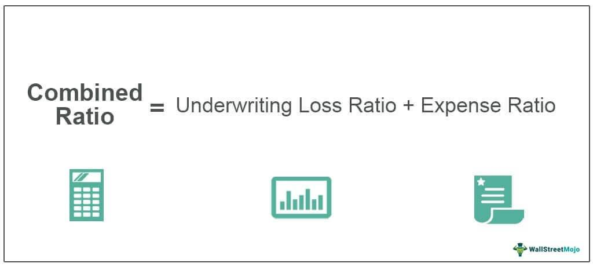

In recent years, the convergence of insurance analysis and financial markets has gained substantial importance. This intersection is primarily due to the need for comprehensive risk management and efficient capital allocation in increasingly complex economic environments. A critical metric in this landscape is the combined ratio, which insurance companies use to gauge their profitability. The combined ratio is defined mathematically as:

$$
\text{Combined Ratio} = \frac{\text{Incurred Losses} + \text{Expenses}}{\text{Earned Premiums}}
$$



This ratio is essential for both insurance companies and investors as it indicates whether a company is making profits on its underwriting activities. A combined ratio less than 100% signifies that the company is operating at a profit, while a combined ratio exceeding 100% indicates losses.

Parallel to the significance of the combined ratio, the rise of algorithmic trading has revolutionized financial markets. Algorithmic trading leverages computer algorithms to execute trades based on pre-set criteria, enhancing the speed and efficiency of transaction processes. For stakeholders in the insurance sector, understanding the combined ratio's role is now crucial, as algorithmic trading introduces new dimensions to financial analysis and investment strategies.

This article discusses how insurance metrics, like the combined ratio, integrate with broader financial analysis frameworks, and examines the influence of algorithmic trading in the context of insurance investments. It is vital for investors and insurance companies to grasp these dynamics to navigate effectively the evolving landscape of financial markets and to harness opportunities presented by technological advancements.

## Table of Contents

## Understanding the Combined Ratio

The combined ratio is a fundamental metric in assessing the profitability of insurance companies. It is defined as the ratio of incurred losses and expenses to earned premiums, offering a quantitative gauge of an insurer's underwriting performance. Mathematically, the combined ratio is expressed as:

$$
\text{Combined Ratio} = \left(\frac{\text{Incurred Losses} + \text{Expenses}}{\text{Earned Premiums}}\right) \times 100
$$

When the combined ratio is below 100%, the insurance company benefits from underwriting profits, as it is spending less on claims and expenses than it earns from premiums. Conversely, a combined ratio above 100% indicates underwriting losses, suggesting that the company is paying out more in claims and expenses than it collects in premiums.

The combined ratio is composed of two primary elements: the loss ratio and the expense ratio. The loss ratio is calculated by dividing the incurred losses by the earned premiums. It reflects the efficiency of the company in managing claims and directly impacts the profitability of the underwriting operations. The formula for the loss ratio is:

$$
\text{Loss Ratio} = \left(\frac{\text{Incurred Losses}}{\text{Earned Premiums}}\right) \times 100
$$

The expense ratio, on the other hand, is calculated by dividing the incurred expenses by the earned premiums. It measures the insurer's operational efficiency, indicating how well the company manages its administrative and selling expenses relative to the premiums collected. The formula for the expense ratio is:

$$
\text{Expense Ratio} = \left(\frac{\text{Expenses}}{\text{Earned Premiums}}\right) \times 100
$$

Both ratios provide valuable insights into different facets of the insurance business. The loss ratio informs stakeholders about the risk management and claim processes, while the expense ratio highlights the operational cost-effectiveness. Together, these components of the combined ratio serve as critical tools for stakeholders in determining an insurance company's overall operational efficiency and financial health. Understanding the intricacies of the combined ratio enables investors, regulators, and company executives to make informed decisions regarding the company's performance and strategic direction.

## Role of Combined Ratio in Financial Analysis

The combined ratio is a critical metric used by investors and analysts to assess the financial health of an insurance firm. It provides insights into how effectively an insurance company manages its costs relative to the premiums it earns. This metric is calculated by the formula:

$$
\text{Combined Ratio} = \frac{\text{Incurred Losses} + \text{Expenses}}{\text{Earned Premiums}} \times 100\%
$$

A combined ratio below 100% indicates that the company is generating underwriting profits, while a ratio above 100% suggests that the firm is experiencing losses on its underwriting activities. In essence, the combined ratio is a reflection of an insurance company's operational efficiency and profitability.

Investors and analysts often perform comparative analyses of the combined ratios across the insurance industry to benchmark an individual firm's performance against its peers. By examining these ratios, stakeholders can identify which companies are managing their costs effectively and achieving superior risk assessment strategies. Companies that exhibit consistent combined ratios below the industry average are generally considered to exhibit robust cost management practices, which are crucial indicators of an adeptly managed firm.

The combined ratio is rarely used in isolation. Investors typically pair it with other financial metrics such as the return on equity (ROE) and the expense ratio to form a holistic view of a company's financial standing. This multifaceted approach allows investors and analysts to make well-informed decisions when contemplating investments in insurance stocks or bonds, thus optimizing their investment strategies to align with market dynamics.

Overall, the combined ratio is an invaluable tool in the financial analysis of insurance firms. Its ability to condense complex cost management and revenue generation activities into a single, interpretable value makes it indispensable for stakeholders seeking to evaluate and compare the financial performance of insurance companies accurately.

## Implications of Algorithmic Trading in Insurance Investments

Algorithmic trading has significantly reshaped financial markets and introduced notable changes in the insurance sector. This transformation is largely attributed to the ability of algorithms to process and analyze enormous datasets rapidly, facilitating the detection of patterns and opportunities that may not be evident to human traders. Advanced algorithms can scrutinize historical and real-time data, providing insights that enhance decision-making processes.

In insurance, [algorithmic trading](/wiki/algorithmic-trading) has also revolutionized risk assessment and premium pricing by accurately predicting future claims. By leveraging comprehensive data analysis, algorithms can model potential risks more precisely, allowing insurers to adjust premiums in alignment with anticipated claims and market behaviors. This level of predictive accuracy aids in maintaining competitive yet profitable pricing strategies.

Automated trading systems further enhance insurer and investor strategies by incorporating insurance-specific metrics such as the combined ratio into real-time investment decision-making. For instance, Python scripts can be programmed to continuously evaluate financial indicators like the combined ratio:

```python
def calculate_combined_ratio(losses, expenses, earned_premiums):
    return (losses + expenses) / earned_premiums

combined_ratio = calculate_combined_ratio(losses=500, expenses=200, earned_premiums=1000)
```

The use of such metrics allows trading systems to swiftly adjust investment strategies based on current market conditions and company performance, ensuring that investors can maximize returns while managing risks effectively.

The technological edge provided by algorithmic trading offers investors a distinct advantage in capitalizing on opportunities within insurance-related assets. It enables them to respond quickly to market shifts and operational changes within the insurance companies, fostering a more dynamic and responsive investment environment. As technology continues to evolve, algorithmic trading is expected to offer even more sophisticated means of evaluating insurance investments, driving further innovation and efficiency in the industry.

## Challenges and Future Directions

While algorithmic trading enhances efficiency in insurance investments, it is not without challenges. One primary concern is the potential for increased market [volatility](/wiki/volatility-trading-strategies). Algorithms operate at high speeds, executing large volumes of transactions in fractions of a second. This can exacerbate market fluctuations, particularly in reaction to real-time data changes, leading to situations like flash crashes. Furthermore, the reliance on AI algorithms introduces complexities; these systems are opaque and can behave unpredictably if not meticulously designed and monitored, potentially resulting in unanticipated consequences.

The integration of [artificial intelligence](/wiki/ai-artificial-intelligence) into the insurance sector also necessitates careful consideration of ethical and regulatory compliance frameworks. As AI systems manage sensitive data and contribute to decision-making processes, ensuring these technologies operate within legal and moral boundaries is critical. Regulatory bodies must establish guidelines to oversee algorithmic trading practices, protecting market integrity and consumer interests.

Technology's rapid evolution demands that insurance companies swiftly adapt to leverage data analytics in refining underwriting and claims management. Advanced analytics provide insights into customer behavior and risk patterns, facilitating more accurate predictions and better risk management. This adaptation not only enhances operational efficiency but also supports strategic decision-making in pricing and offering insurance products.

Looking forward, the potential for AI-driven innovation in insurance is vast. Personalized insurance products tailored to individual risk profiles could become more prevalent, thanks to enhanced data processing capabilities. Such personalization demands greater transparency in risk assessment, giving consumers clearer insights into how their data is used and affecting their premiums.

Continuous advancements in algorithmic trading strategies will likely spur further optimization in insurance investment vehicles. This involves refining models to capture minimal market inefficiencies and employing sophisticated techniques such as [machine learning](/wiki/machine-learning) to enhance prediction accuracy. Investors and insurance firms must remain agile, embracing technological advancements while balancing risk management to stay competitive in the evolving marketplace. As this domain progresses, fostering an environment where technological growth aligns with ethical standards and consumer interests will be crucial.

## Conclusion

The combined ratio remains an indispensable metric in assessing the performance of insurance companies, serving as a benchmark for profitability by comparing incurred losses and expenses to earned premiums. Its significance is further enhanced when considered alongside the advancements in algorithmic trading. This synergy introduces new dimensions to financial analysis and investment strategies, as algorithmic models leverage the combined ratio among other metrics to identify optimal investment opportunities. 

As the financial landscape continues to evolve, the integration of sophisticated trading algorithms is expected to bring increased efficiency and precision to markets. These advancements enable rapid data analysis, allowing for timely and informed decision-making processes, which can lead to better-managed portfolios and maximized returns on insurance-related investments.

Despite the benefits, stakeholders must exercise vigilance in adapting to these technological advancements. The rapid pace of innovation requires continuous adaptation and learning to maintain a competitive advantage in the market. The ability to balance technological progress with effective risk management is crucial. This involves understanding the potential pitfalls of algorithmic trading, such as market volatility and ethical concerns, and ensuring compliance with regulatory frameworks.

Looking ahead, the intersection of insurance metrics and algorithmic trading holds promise for further innovation. Stakeholders who effectively integrate emerging technologies while managing risks are likely to navigate the insurance investment landscape successfully. As the industry marches forward, striking this balance will be key to harnessing the full potential of technological advancements in insurance investments.

## References & Further Reading

[1]: ["The Mathematics of Insurance"](https://www.taylorfrancis.com/books/mono/10.1201/b17291/actuarial-models-vladimir-rotar) by Annamaria Olivia

[2]: Warren, G. "Insurance Industry Analysis and Combined Ratios", Insurance Journal. Retrieved from [insurancejournal.com](https://www.insurancejournal.com/topics/combined-ratios/)

[3]: ["Algorithmic Trading: Winning Strategies and Their Rationale"](https://www.wiley.com/en-us/Algorithmic+Trading%3A+Winning+Strategies+and+Their+Rationale-p-9781118460146) by Ernest P. Chan

[4]: ["The Handbook of Insurance"](https://link.springer.com/book/10.1007/978-1-4614-0155-1) edited by Georges Dionne

[5]: ["Risk Management and Insurance"](https://onlinelibrary.wiley.com/journal/15406296) by Scott E. Harrington and Gregory R. Niehaus