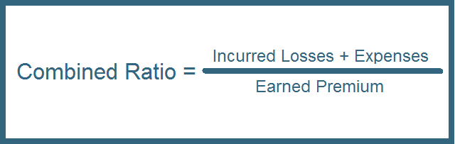

## Table of Contents

## What is the Combined Ratio in insurance?

The Combined Ratio in insurance is a way to measure how well an insurance company is doing financially. It shows the total amount of money an insurer spends on claims and expenses compared to the money it earns from premiums. If the combined ratio is less than 100%, the insurer is making a profit from its underwriting activities because it's spending less on claims and expenses than it's earning. If it's over 100%, the insurer is losing money because it's spending more than it's earning.

To calculate the Combined Ratio, you add two other ratios together: the Loss Ratio and the Expense Ratio. The Loss Ratio is the percentage of premiums that the insurer pays out in claims. The Expense Ratio is the percentage of premiums that the insurer uses to cover its operating costs, like salaries and office expenses. By adding these two ratios, you get the Combined Ratio, which gives a clear picture of the insurer's overall financial health from its core business activities.

## How is the Combined Ratio calculated?

The Combined Ratio is a way to see if an insurance company is making or losing money from its main business. It's calculated by adding two smaller ratios together: the Loss Ratio and the Expense Ratio. The Loss Ratio shows what part of the money from premiums is used to pay for claims. For example, if an insurer pays out $60 in claims for every $100 in premiums, the Loss Ratio is 60%. The Expense Ratio tells us what part of the premiums is spent on running the business, like paying salaries or rent. If an insurer spends $30 out of every $100 in premiums on expenses, the Expense Ratio is 30%.

To find the Combined Ratio, you just add these two ratios. Using our example, if the Loss Ratio is 60% and the Expense Ratio is 30%, the Combined Ratio would be 60% + 30% = 90%. A Combined Ratio below 100% means the insurer is making money from its main business because it's spending less on claims and expenses than it's [earning](/wiki/earning-announcement) from premiums. If the Combined Ratio is over 100%, the insurer is losing money because it's spending more than it's earning. So, a lower Combined Ratio is better for the insurance company's financial health.

## What are the components of the Combined Ratio?

The Combined Ratio in insurance has two main parts: the Loss Ratio and the Expense Ratio. The Loss Ratio shows how much of the money from premiums goes towards paying claims. For example, if an insurer pays out $70 in claims for every $100 in premiums, the Loss Ratio is 70%. This ratio helps show how much of the premium money is used to cover losses.

The other part is the Expense Ratio, which tells us how much of the premiums are used for running the business. This includes things like salaries, office rent, and other costs. If an insurer spends $25 out of every $100 in premiums on expenses, the Expense Ratio is 25%. When you add the Loss Ratio and the Expense Ratio together, you get the Combined Ratio. If the Loss Ratio is 70% and the Expense Ratio is 25%, the Combined Ratio would be 95%. A Combined Ratio below 100% means the insurer is making money from its main business, while a ratio above 100% means it's losing money.

## Why is the Combined Ratio important for insurance companies?

The Combined Ratio is really important for insurance companies because it shows if they are making or losing money from their main business. It tells them how much they are spending on claims and running the business compared to the money they get from premiums. If the Combined Ratio is less than 100%, the company is making money because they are spending less than they are earning. But if it's more than 100%, they are losing money because they are spending more than they are earning.

Insurance companies use the Combined Ratio to see how well they are doing and to make smart decisions. If the ratio is high, they might need to find ways to cut costs or raise premiums. If it's low, they might be doing well but should keep an eye on things to make sure they stay profitable. This ratio helps them plan for the future and keep their business healthy.

## How does the Combined Ratio differ from the Operating Ratio?

The Combined Ratio and the Operating Ratio are both important for insurance companies, but they show different things. The Combined Ratio looks at how much money an insurer spends on claims and expenses compared to the money they get from premiums. It only focuses on the core business of insurance, like paying claims and running the office. If the Combined Ratio is below 100%, the insurer is making money from its main business.

The Operating Ratio, on the other hand, gives a broader view of the insurer's financial health. It includes all the money the insurer makes and spends, not just from premiums and claims. This means it also considers other income and expenses, like investment income or other business activities. The Operating Ratio helps show if the insurer is profitable overall, not just from its core insurance business. Both ratios are useful, but they tell different stories about the insurer's financial situation.

## What is considered a good Combined Ratio?

A good Combined Ratio for an insurance company is generally considered to be below 100%. This means the company is making more money from premiums than it is spending on claims and expenses. For example, if the Combined Ratio is 95%, the insurer is earning $100 in premiums but only spending $95 on claims and expenses, so it's making a profit of $5 for every $100 in premiums.

Different types of insurance might have different benchmarks for what's considered a good Combined Ratio. For property and casualty insurance, a Combined Ratio in the low 90s is often seen as good. For health insurance, the target might be a bit higher, around the mid-90s. It's important for insurance companies to keep their Combined Ratio as low as possible while still providing good service to their customers.

## How can an insurance company improve its Combined Ratio?

An insurance company can improve its Combined Ratio by looking at both the Loss Ratio and the Expense Ratio. To lower the Loss Ratio, the company can be more careful about the risks it takes on. This means they can use better ways to figure out who to insure and how much to charge them. They can also try to stop fraud and find ways to lower the cost of claims. For example, if they help people fix their cars faster and cheaper, they spend less money on claims.

To lower the Expense Ratio, the company can look at how it runs its business. They can find ways to cut costs, like using computers to do more work instead of hiring more people, or finding cheaper places to have offices. They can also work on making their processes smoother so they spend less time and money on each customer. By focusing on both these areas, the insurance company can make its Combined Ratio better and be more profitable.

## What are the impacts of underwriting and loss adjustment expenses on the Combined Ratio?

Underwriting expenses are the costs an insurance company has when deciding if they should insure someone and how much to charge them. These costs include things like salaries for the people who do this work, the cost of checking someone's background, and other office expenses. When these underwriting expenses go up, the Expense Ratio part of the Combined Ratio also goes up. This makes the whole Combined Ratio higher, which means the insurance company might be making less money from its main business.

Loss adjustment expenses are the costs of dealing with claims after something bad happens. These costs include paying people to check if a claim is real, helping to fix what's broken, and other costs to handle the claim. If these loss adjustment expenses go up, they add to the Loss Ratio part of the Combined Ratio. A higher Loss Ratio means the insurance company is spending more of its premium money on claims, which makes the Combined Ratio higher. So, if either underwriting or loss adjustment expenses go up, it can make the Combined Ratio worse and affect the insurance company's profits.

## How do reinsurance agreements affect the Combined Ratio?

Reinsurance agreements can help improve an insurance company's Combined Ratio. When an insurance company buys reinsurance, it shares some of its risk with another company. This means if there are big claims, the reinsurer will help pay for them. By doing this, the insurance company can lower its Loss Ratio because it's not paying out as much money on claims. A lower Loss Ratio leads to a better Combined Ratio, which means the insurance company is making more money from its main business.

However, reinsurance also comes with its own costs. The insurance company has to pay the reinsurer for taking on part of the risk. These costs are part of the Expense Ratio. If the cost of reinsurance is high, it can make the Expense Ratio go up, which could make the Combined Ratio worse. So, the insurance company needs to balance the benefits of lower claims costs with the costs of the reinsurance itself to see if it really helps improve the Combined Ratio.

## What are the limitations of using the Combined Ratio as a performance metric?

The Combined Ratio is a good way to see how well an insurance company is doing with its main business, but it has some limits. It doesn't look at other ways the company can make money, like from investments. If an insurance company makes a lot of money from investments, it might still be doing well even if its Combined Ratio is over 100%. The Combined Ratio just focuses on premiums, claims, and expenses, so it might not give the full picture of the company's financial health.

Another problem is that the Combined Ratio can be affected by things the company can't control, like big natural disasters or economic changes. If there's a big hurricane, the company might have to pay out a lot of money for claims, which makes the Combined Ratio go up. But this doesn't mean the company is doing a bad job; it's just dealing with a tough situation. Also, the Combined Ratio can be different for different types of insurance, so what's a good ratio for one type might not be good for another. This makes it hard to compare insurance companies that offer different kinds of insurance.

## How does the Combined Ratio correlate with profitability in the insurance industry?

The Combined Ratio is a big number that tells us if an insurance company is making or losing money from its main job of selling insurance. If the Combined Ratio is less than 100%, it means the company is spending less on claims and running the business than it's getting from premiums. This is good because it means the company is making money from its main job. For example, if the Combined Ratio is 95%, the company is making $5 for every $100 in premiums after paying for claims and expenses. A lower Combined Ratio is better because it means the company is more profitable from selling insurance.

But the Combined Ratio doesn't tell the whole story about how profitable the insurance company is overall. It only looks at the money from premiums and doesn't include other ways the company can make money, like from investments. So, even if the Combined Ratio is over 100%, the company might still be doing well if it's making a lot of money from other places. Also, things like big storms or economic changes can make the Combined Ratio go up, but that doesn't always mean the company is doing a bad job. It just means they had to pay out more for claims because of things they couldn't control.

## Can you explain advanced statistical methods used to forecast the Combined Ratio?

To forecast the Combined Ratio, insurance companies use advanced statistical methods like regression analysis. Regression analysis helps them see how different things, like the number of claims or the cost of running the business, affect the Combined Ratio. They collect a lot of data over time and use this data to make a model. This model can then predict what the Combined Ratio might be in the future based on what's happening now. For example, if they see that the number of claims is going up, they can use the model to guess how much that will make the Combined Ratio go up.

Another method they use is time series analysis. This method looks at how the Combined Ratio changes over time and tries to find patterns. For example, they might see that the Combined Ratio goes up every year in the summer because of more car accidents. By understanding these patterns, they can make better guesses about what the Combined Ratio will be in the future. Time series analysis can also help them see if there are any big changes coming, like a new law that might affect how much they have to pay for claims. By using these advanced methods, insurance companies can plan better and try to keep their Combined Ratio low.

## What is the Combined Ratio and How is it Understood?

The combined ratio is a fundamental metric in assessing the profitability of insurance companies. It is defined as the ratio of incurred losses and expenses to earned premiums, offering a quantitative gauge of an insurer's underwriting performance. Mathematically, the combined ratio is expressed as:

$$
\text{Combined Ratio} = \left(\frac{\text{Incurred Losses} + \text{Expenses}}{\text{Earned Premiums}}\right) \times 100
$$

When the combined ratio is below 100%, the insurance company benefits from underwriting profits, as it is spending less on claims and expenses than it earns from premiums. Conversely, a combined ratio above 100% indicates underwriting losses, suggesting that the company is paying out more in claims and expenses than it collects in premiums.

The combined ratio is composed of two primary elements: the loss ratio and the expense ratio. The loss ratio is calculated by dividing the incurred losses by the earned premiums. It reflects the efficiency of the company in managing claims and directly impacts the profitability of the underwriting operations. The formula for the loss ratio is:

$$
\text{Loss Ratio} = \left(\frac{\text{Incurred Losses}}{\text{Earned Premiums}}\right) \times 100
$$

The expense ratio, on the other hand, is calculated by dividing the incurred expenses by the earned premiums. It measures the insurer's operational efficiency, indicating how well the company manages its administrative and selling expenses relative to the premiums collected. The formula for the expense ratio is:

$$
\text{Expense Ratio} = \left(\frac{\text{Expenses}}{\text{Earned Premiums}}\right) \times 100
$$

Both ratios provide valuable insights into different facets of the insurance business. The loss ratio informs stakeholders about the risk management and claim processes, while the expense ratio highlights the operational cost-effectiveness. Together, these components of the combined ratio serve as critical tools for stakeholders in determining an insurance company's overall operational efficiency and financial health. Understanding the intricacies of the combined ratio enables investors, regulators, and company executives to make informed decisions regarding the company's performance and strategic direction.

## What is the role of the combined ratio in financial analysis?

The combined ratio is a critical metric used by investors and analysts to assess the financial health of an insurance firm. It provides insights into how effectively an insurance company manages its costs relative to the premiums it earns. This metric is calculated by the formula:

$$
\text{Combined Ratio} = \frac{\text{Incurred Losses} + \text{Expenses}}{\text{Earned Premiums}} \times 100\%
$$

A combined ratio below 100% indicates that the company is generating underwriting profits, while a ratio above 100% suggests that the firm is experiencing losses on its underwriting activities. In essence, the combined ratio is a reflection of an insurance company's operational efficiency and profitability.

Investors and analysts often perform comparative analyses of the combined ratios across the insurance industry to benchmark an individual firm's performance against its peers. By examining these ratios, stakeholders can identify which companies are managing their costs effectively and achieving superior risk assessment strategies. Companies that exhibit consistent combined ratios below the industry average are generally considered to exhibit robust cost management practices, which are crucial indicators of an adeptly managed firm.

The combined ratio is rarely used in isolation. Investors typically pair it with other financial metrics such as the return on equity (ROE) and the expense ratio to form a holistic view of a company's financial standing. This multifaceted approach allows investors and analysts to make well-informed decisions when contemplating investments in insurance stocks or bonds, thus optimizing their investment strategies to align with market dynamics.

Overall, the combined ratio is an invaluable tool in the financial analysis of insurance firms. Its ability to condense complex cost management and revenue generation activities into a single, interpretable value makes it indispensable for stakeholders seeking to evaluate and compare the financial performance of insurance companies accurately.

## References & Further Reading

[1]: ["The Mathematics of Insurance"](https://www.taylorfrancis.com/books/mono/10.1201/b17291/actuarial-models-vladimir-rotar) by Annamaria Olivia

[2]: Warren, G. "Insurance Industry Analysis and Combined Ratios", Insurance Journal. Retrieved from [insurancejournal.com](https://www.insurancejournal.com/topics/combined-ratios/)

[3]: ["Algorithmic Trading: Winning Strategies and Their Rationale"](https://www.wiley.com/en-us/Algorithmic+Trading%3A+Winning+Strategies+and+Their+Rationale-p-9781118460146) by Ernest P. Chan

[4]: ["The Handbook of Insurance"](https://link.springer.com/book/10.1007/978-1-4614-0155-1) edited by Georges Dionne

[5]: ["Risk Management and Insurance"](https://onlinelibrary.wiley.com/journal/15406296) by Scott E. Harrington and Gregory R. Niehaus