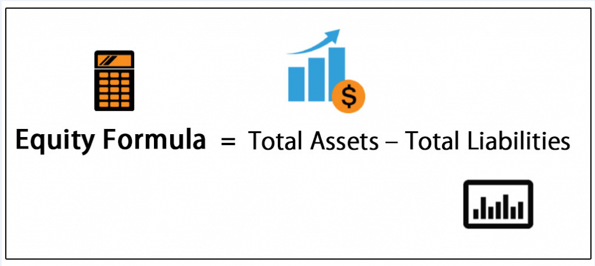

Understanding the concept of company equity is crucial for investors and analysts, as it serves as a fundamental metric in evaluating a company's financial health. Essentially, equity represents the residual value for shareholders after liabilities are subtracted from assets. This core principle underpins the assessment of a company's net worth, providing a clear picture of its financial stability and performance potential. By subtracting the total liabilities from the total assets, stakeholders can ascertain the equity of a company, offering insights into its ability to meet obligations and generate shareholder value.

Equity plays a significant role in both financial analysis and algorithmic trading. In financial analysis, it assists in appraising a company's economic strength and assists in making informed investment decisions. Equity analysis, when combined with other financial ratios and performance indicators, provides a comprehensive view of management efficacy and long-term viability. Understanding these dynamics helps analysts forecast the company's growth potential and stability, thereby guiding strategic investment choices.



In the domain of algorithmic trading, equity is integral to developing trading strategies and decision-making processes. Quantitative models, leveraging equity data, can be employed to identify trading opportunities and enhance returns while mitigating risks. The interplay of equity analysis with advanced computing tools allows for the automation of trades based on systematic analysis, optimizing outcomes in high-frequency and large-volume trading environments.

This article uncovers how equity analysis impacts trading strategies and explores the tools for precise equity calculations. As financial technology advances, these instruments continue to evolve, refining the scope and accuracy of equity evaluation. Understanding and leveraging these tools is essential for achieving success in modern financial markets.

## Table of Contents

## What is Company Equity?

Company equity, often referred to as shareholders' equity, represents the residual interest that the owners of a company have in its assets after all liabilities have been settled. It is a fundamental metric for gauging the financial health of a business, as it indicates the net value that would be returned to shareholders if the company were to be liquidated. 

A positive equity figure suggests that a company's total assets exceed its total liabilities, which is generally perceived as a sign of financial stability and sound management. In such a scenario, the company is considered solvent and capable of meeting its obligations, providing a margin of safety to investors. 

Conversely, negative equity arises when a company's liabilities surpass its assets, reflecting potential financial distress. This situation can trigger concerns regarding the company's ability to continue operations, repay its debts, or attract new investors. Negative equity is often a red flag for stakeholders, suggesting the need for immediate strategic changes or restructuring.

Equity's relevance extends beyond mere accounting; it is integral to effective financial analysis and decision-making processes. Through equity analysis, stakeholders can assess a company's current financial position, evaluate growth potential, and make informed investment decisions. A comprehensive understanding of company equity lays the groundwork for further financial examinations, such as calculating financial ratios and conducting profitability analysis.

## Calculating Company Equity

The calculation of company equity is a fundamental aspect of financial analysis, and it is typically defined using a straightforward formula: 

$$
\text{Equity} = \text{Total Assets} - \text{Total Liabilities}
$$

This equation serves as the basis for understanding a company's net worth by balancing its current assets, such as cash and inventories, against both short-term and long-term liabilities. Current assets are those expected to be converted into cash within a year, while non-current (or long-term) assets include items like property, plant, and equipment, which provide value over a longer time frame. Liabilities, on the other hand, encompass obligations the company must fulfill, from loans and bonds to supplier payments.

The primary source for obtaining the data necessary for this calculation is the company's balance sheet, a key component of its financial statements. The balance sheet succinctly lays out the total assets and total liabilities, allowing for a precise computation of equity. However, when analyzing private companies, which are not required to publish their financial statements, gaining access to this data might be more challenging. Nonetheless, the calculation method remains consistent irrespective of the company’s public or private status.

Calculating equity is not merely an academic exercise; it is an essential first step in [fundamental analysis](/wiki/fundamental-analysis). The result indicates not only the company’s financial health but is also pivotal for developing effective trading strategies. In practice, traders and analysts might employ programming languages such as Python to automate this calculation, particularly when handling large datasets or multiple companies. For instance:

```python
def calculate_equity(assets, liabilities):
    equity = assets - liabilities
    return equity

# Example
total_assets = 500000  # Example total assets
total_liabilities = 300000  # Example total liabilities

company_equity = calculate_equity(total_assets, total_liabilities)
print(f"Company Equity: ${company_equity}")
```

Equity calculations provide a comprehensive view of a company’s net financial standing, laying the groundwork for more advanced financial assessments and strategic decision-making processes.

## Importance of Equity in Financial Analysis

Equity serves as a fundamental indicator of a company's financial health and performance. By reflecting the residual value available to shareholders after settling all liabilities, equity provides a comprehensive assessment of an organization's stability and growth prospects. Positive equity indicates that a company's assets exceed its liabilities, suggesting financial soundness and the capacity for expansion. In contrast, negative equity may signal financial distress, potentially deterring investors due to increased insolvency risk. 

One of the main tools used to analyze equity is the Return on Equity (ROE) ratio, which offers insights into how effectively management is utilizing the company's equity to generate profits. The ROE formula is as follows:

$$
\text{ROE} = \frac{\text{Net Income}}{\text{Shareholders' Equity}}
$$

This ratio helps investors and analysts evaluate the effectiveness of management in generating returns for shareholders. A higher ROE indicates efficient use of equity capital, suggesting robust management practices and a potentially attractive investment.

Understanding company equity is essential for making informed long-term investment decisions. It aids in assessing risk by providing a clear picture of financial stability, allowing investors to gauge the likelihood of a company's growth or decline. Furthermore, equity analysis assists in evaluating the sufficiency of a company’s capital structure and its ability to withstand economic fluctuations.

Incorporating equity analysis into investment strategies ensures a comprehensive evaluation of potential investment targets, supporting the balancing of portfolios to maximize returns and minimize risk exposure. Thus, a thorough understanding and interpretation of equity metrics are indispensable for enhancing decision-making in financial analysis and investment management.

## Equity in Algorithmic Trading

Algorithmic trading utilizes automated systems to execute trades based on predefined criteria, leveraging computer algorithms to make swift and accurate trading decisions. Equity is a critical [factor](/wiki/factor-investing) in shaping these strategies, significantly influencing the decision-making processes inherent in [algorithmic trading](/wiki/algorithmic-trading).

Quantitative models are central to this approach, analyzing equity data to pinpoint trading opportunities. These models rigorously evaluate various equity metrics, such as book value, market capitalization, and shareholder equity ratios, to assess a company's financial health and performance potential. For instance, by calculating the Return on Equity (ROE), investors gain insights into how effectively a company is using its equity base to generate profits. The formula for ROE is $\text{ROE} = \frac{\text{Net Income}}{\text{Shareholder's Equity}}$.

Sophisticated algorithms extend this analysis by integrating equity ratios and overall financial health metrics to reduce risks and improve returns. These algorithms often incorporate [machine learning](/wiki/machine-learning) techniques to refine their predictive capabilities, adjusting strategies dynamically in response to market changes. By evaluating both historical and real-time equity data, these systems can forecast market trends and identify lucrative trading opportunities.

One area where equity-backed algorithms excel is in high-frequency trading ([HFT](/wiki/high-frequency-trading-strategies)) and large-[volume](/wiki/volume-trading-strategy) trade strategies. The need for rapid decision-making and execution in HFT demands a robust analysis of equity to ensure transactions are both profitable and timely. Such algorithms typically involve deploying complex statistical and mathematical models to achieve precision and efficiency in trade execution.

In conclusion, incorporating equity analysis into algorithmic trading strategies enhances the ability to navigate financial markets effectively, maximizing returns while mitigating risks. These equity-focused algorithms provide traders with an edge in the fast-paced world of automated trading.

## Tools and Techniques for Equity Analysis

Equity analysis is a multifaceted process that integrates both fundamental and technical analysis techniques to evaluate a company's financial health and investment potential. It necessitates the use of a variety of tools and methods, each contributing to a comprehensive understanding of the company's equity status.

### Fundamental Analysis Tools

At its core, equity analysis relies heavily on fundamental tools such as financial statements, balance sheets, and key financial ratios. The balance sheet provides a snapshot of a company's assets, liabilities, and equity at a particular point in time, facilitating the calculation of equity through the formula:

$$
\text{Equity} = \text{Total Assets} - \text{Total Liabilities}
$$

Financial ratios, such as the Return on Equity (ROE), offer insights into how effectively a company is using its equity to generate profits. These ratios are pivotal in comparing the financial performance of similar companies within an industry.

### Technological Advancements

The adoption of cutting-edge technologies, such as Artificial Intelligence (AI) and Machine Learning (ML), is reshaping the landscape of equity analysis. These technologies enhance the accuracy and efficiency of data analysis by uncovering patterns and trends that might be imperceptible through traditional methods. AI algorithms can analyze vast datasets quickly, identify outlier events, and predict future performance based on historical data, thereby providing a more nuanced analysis of equity.

### Data Interpretation and Visualization Programs

Software programs like Horizon Finance play a critical role in simplifying data interpretation and visualization for equity analysis. These platforms offer tools that help analysts consolidate data from diverse sources, create visual dashboards, and generate comprehensive reports. By providing an intuitive interface for data handling, these programs make equity analysis more accessible and actionable.

### Integrated Analysis Approaches

Combining multiple analysis tools provides a more robust view of a company's equity status. An integrated approach might involve using both fundamental and technical analysis techniques to gain insights. For instance, while fundamental analysis focuses on the intrinsic value of the company, technical analysis examines price movements and trading volumes to identify potential market entry or [exit](/wiki/exit-strategy) points.

By utilizing a blend of traditional analysis methods and advanced technological tools, analysts can gain a holistic understanding of company equity, which is essential for making informed investment decisions and developing effective trading strategies.

## Conclusion

Company equity is integral to financial analysis and trading operations. It provides a vital indicator of a company’s financial standing and is essential for both individual and institutional investors aiming to optimize their investment portfolio. Having a robust comprehension of equity allows investors to make well-informed decisions that maximize returns while minimizing associated risks. This understanding is essential not only for the evaluation of a company’s current financial health but also for predicting future performance trends.

Equity serves as a critical benchmark across various financial strategies, from fundamental analysis to algorithmic trading. In traditional financial analysis, equity metrics such as the equity ratio and return on equity (ROE) provide crucial insights into a company's operational efficiency and profitability. In algorithmic trading, real-time equity data is continuously analyzed to inform automated trading strategies, enabling traders to exploit market opportunities with precision.

As financial technology advances, the tools available for equity analysis become increasingly sophisticated. Contemporary platforms use [artificial intelligence](/wiki/ai-artificial-intelligence) and machine learning to offer enhanced accuracy and predictive capabilities in equity analysis. These technological solutions enable a more nuanced understanding of market trends and company performance, thereby supporting more efficient investment strategies.

In today’s fast-paced financial markets, staying informed and efficiently utilizing the latest analytical tools are imperative for success. Investors and analysts who leverage advanced tools for equity analysis gain a competitive edge, aiding them in making strategic investment decisions and maintaining a resilient financial posture. Thus, company equity remains a cornerstone of financial analysis and a keystone for current and future trading endeavors.

## References & Further Reading

[1]: ["Valuation: Measuring and Managing the Value of Companies"](https://www.mckinsey.com/capabilities/strategy-and-corporate-finance/our-insights/valuation-measuring-and-managing-the-value-of-companies) by McKinsey & Company Inc.

[2]: ["Financial Statement Analysis and Security Valuation"](https://www.amazon.com/Financial-Statement-Analysis-Security-Valuation/dp/0073379662) by Stephen Penman

[3]: Damodaran, A. (2012). ["Investment Valuation: Tools and Techniques for Determining the Value of Any Asset."](https://pages.stern.nyu.edu/~adamodar/New_Home_Page/Inv3ed.htm) Wiley.

[4]: ["Principles of Corporate Finance"](https://www.mheducation.com/highered/product/Principles-of-Corporate-Finance-Brealey.html) by Richard Brealey, Stewart Myers, and Franklin Allen

[5]: ["Financial Markets and Corporate Strategy"](https://www.amazon.com/Financial-Markets-Corporate-Strategy-Grinblatt/dp/0072294337) by Mark Grinblatt and Sheridan Titman