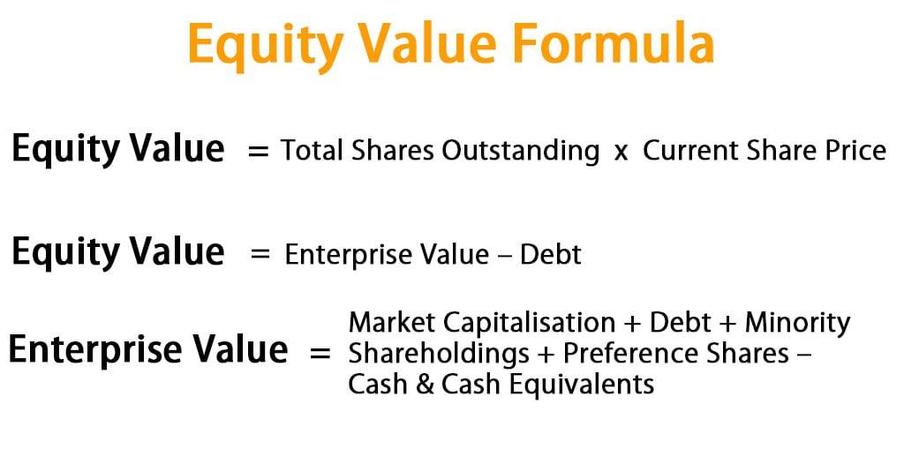

## Table of Contents

## What is company equity and why is it important?

Company equity refers to the ownership interest in a business. It represents the value of the company that belongs to its shareholders or owners after all debts and liabilities have been paid off. Equity can be in the form of stocks or shares, and it can increase or decrease based on the company's performance and financial health.

Equity is important for several reasons. First, it shows how much the business is worth to its owners. This is useful for attracting investors, who might want to buy shares in the company. If the company does well, the value of the equity can go up, which means the owners' wealth can increase. Second, equity helps the company raise money without taking on more debt. By selling shares, a company can get the funds it needs to grow or invest in new projects, without having to pay back loans with interest. This can be a healthier way to finance the business in the long run.

## How do you calculate basic company equity?

To calculate basic company equity, you start with the company's total assets. These are everything the company owns, like money, buildings, and equipment. Then, you subtract the company's total liabilities. Liabilities are what the company owes, like loans and bills. The formula is simple: Equity = Total Assets - Total Liabilities. This number tells you the net worth of the company, or what would be left if the company sold all its assets and paid off all its debts.

Understanding this basic calculation is important because it shows the financial health of the company. If the equity is a big positive number, it means the company is doing well and has more value than what it owes. If the equity is a small number or negative, it could mean the company is struggling and owes more than it owns. This information is useful for owners, investors, and anyone interested in the company's financial situation.

## What are the key components of shareholders' equity?

Shareholders' equity is made up of a few main parts. The first part is called "contributed capital." This is the money that shareholders put into the company by buying its stocks or shares. When people buy shares, they are giving money to the company, which then uses that money to grow or run its business. The second part is "retained earnings." These are the profits that the company makes but doesn't give back to shareholders as dividends. Instead, the company keeps these earnings to reinvest in the business or save for future use.

Another part of shareholders' equity can be "other comprehensive income." This includes gains and losses that aren't shown in the regular income statement, like changes in the value of certain investments or foreign currency translations. These items can affect the company's equity but aren't part of the day-to-day profit and loss. Together, these components show how much the company is worth to its shareholders, reflecting both the money put in by investors and the profits the company has made over time.

## Can you explain the difference between book value and market value of equity?

Book value of equity is what a company is worth according to its financial statements. It's calculated by taking the total assets of the company and subtracting its total liabilities. This number shows what would be left if the company sold everything it owns and paid off all its debts. Book value is important because it gives a snapshot of the company's net worth based on historical costs and accounting rules. It's a useful measure for investors who want to know the underlying value of a company, but it doesn't always reflect what the company is actually worth in the real world.

Market value of equity, on the other hand, is what people are willing to pay for the company's stock at any given time. It's determined by how much investors think the company is worth, which can be influenced by things like future growth prospects, market conditions, and overall investor sentiment. The market value is found by multiplying the current stock price by the total number of shares outstanding. This value can go up and down a lot, sometimes even daily, based on news, earnings reports, and other factors. While book value is more stable and based on accounting, market value can give a more dynamic picture of what the company is worth in the eyes of investors.

## How does retained earnings affect the calculation of equity?

Retained earnings are an important part of a company's equity. They are the profits that a company makes but doesn't give back to shareholders as dividends. Instead, the company keeps these earnings. When you calculate equity, you add these retained earnings to the money that shareholders have put into the company. This means that if a company makes a lot of profit and keeps it, the equity of the company goes up. This can make the company more valuable because it shows that the company is doing well and has money to grow or invest in new things.

Retained earnings can change from year to year. If a company has a good year and makes a lot of profit, the retained earnings will go up, which increases the equity. But if the company has a bad year and loses money, the retained earnings can go down, and that can lower the equity. This is why keeping track of retained earnings is important for understanding how much a company is worth. It's like a savings account for the company, showing how much money it has saved up over time, which can be used to make the business stronger or to pay for new projects.

## What role do treasury shares play in equity calculation?

Treasury shares are shares that a company has bought back from the stock market. When a company buys back its own shares, it's taking them out of the hands of the public and putting them back into the company's pocket. These shares are not considered part of the company's equity anymore. Instead, they are listed as a negative number on the equity side of the balance sheet. This is because the money used to buy back the shares reduces the total equity of the company.

When you calculate the company's equity, you start with the total assets and subtract the total liabilities, just like usual. But then, you also need to subtract the value of the treasury shares. This means that the more treasury shares a company has, the lower its equity will be. Treasury shares can be important for a company because they can be used to give to employees or sold again later if the company needs money. But for now, they make the company's equity smaller because they represent money the company spent to buy them back.

## How do stock dividends and stock splits impact equity?

Stock dividends and stock splits don't change the total equity of a company, but they do change how the equity is divided among shareholders. When a company gives out stock dividends, it's giving shareholders more shares instead of cash. The company takes some of its retained earnings and moves it to the common stock account. This doesn't change the total equity because the company is just moving money from one part of equity to another. But it does mean that shareholders have more shares, which can make the stock price go down a bit because the same value is now spread over more shares.

Stock splits work in a similar way. When a company does a stock split, it's giving shareholders more shares but making each share worth less. For example, in a 2-for-1 split, every shareholder gets two shares for every one they had before, but the price of each share is cut in half. This doesn't change the total value of the company or its equity because the company isn't giving or taking away any money. It's just dividing the same pie into more pieces. Both stock dividends and stock splits can make the stock seem more affordable and might attract more investors, but they don't change the overall equity of the company.

## What are some common adjustments made to equity in financial statements?

When companies make their financial statements, they sometimes need to make adjustments to their equity. One common adjustment is for unrealized gains or losses on investments. If a company has investments that go up or down in value but hasn't sold them yet, it might need to adjust its equity to show this change. These adjustments are usually made in the "other comprehensive income" part of the equity section. Another adjustment could be for foreign currency translations. If a company does business in different countries, it might need to change the value of its foreign earnings to the home currency, which can affect equity.

Another type of adjustment is for stock-based compensation. When a company gives its employees stock options or shares, it has to figure out how much these are worth and add that amount to its equity. This is because giving employees stock is like giving them part of the company, so it increases the total equity. Sometimes, companies also need to make adjustments for changes in accounting rules. If the rules for how to report things change, a company might need to go back and adjust its past financial statements, which can change the equity numbers. These adjustments help make sure the financial statements show a true picture of the company's worth.

## How can changes in accounting policies affect reported equity?

Changes in accounting policies can affect how a company reports its equity. When accounting rules change, companies have to follow the new rules, which can mean they need to go back and change their past financial statements. This can make the equity numbers go up or down. For example, if a new rule says that companies have to count some things as assets that they didn't before, this could make the total assets go up. Since equity is calculated as total assets minus total liabilities, a higher asset number can increase the equity.

These changes can also affect how a company shows its profits and losses, which can change the retained earnings part of equity. Retained earnings are the profits a company keeps instead of giving them to shareholders. If a new accounting rule changes how the company calculates its profits, the retained earnings might go up or down. This would change the equity because retained earnings are a big part of it. So, even though the company hasn't really changed, just following new accounting rules can make the equity numbers look different.

## What advanced methods exist for valuing company equity beyond simple formulas?

There are some advanced ways to figure out how much a company's equity is worth that go beyond just using simple math. One way is called the discounted cash flow (DCF) method. This method looks at all the money a company might make in the future and then figures out what that money is worth today. It does this by guessing how much money the company will make each year and then using a special math formula to bring those future dollars back to today's value. This can be a good way to see if a company's stock is a good deal because it thinks about what the company will do in the future, not just what it has done in the past.

Another way to value equity is by using something called the multiples method. This method compares the company to other similar companies to see if it's worth more or less. It looks at things like how much money the company makes or how much it's worth compared to other companies in the same business. For example, if other companies in the same industry are worth 10 times their yearly earnings, you might use that number to guess how much your company is worth. This can be helpful because it gives you a quick way to see if your company's stock price makes sense compared to others. Both of these methods can give you a better idea of a company's value than just using simple formulas, but they also need more guesses and can be more complicated.

## How do international financial reporting standards (IFRS) impact equity calculation?

International Financial Reporting Standards (IFRS) can change how a company figures out its equity because they set rules on how to report money and other things in financial statements. For example, IFRS might say that a company should count some things as assets that it didn't before, like certain kinds of research costs. If a company follows these new rules, its total assets might go up. Since equity is what's left after you take away the company's debts from its assets, a bigger asset number can make the equity bigger too. IFRS also has rules about how to show profits and losses, which can change the retained earnings part of equity. Retained earnings are the profits a company keeps instead of giving to shareholders, so if the way to calculate profits changes, the retained earnings can go up or down, changing the equity.

Another way IFRS can affect equity is through things like foreign currency translations. If a company does business in different countries, it has to change the value of its foreign earnings to the home currency. IFRS has rules about how to do this, and if these rules change, it can make the equity numbers go up or down. Also, IFRS might have different rules about how to count stock-based compensation, which is when a company gives its employees stock options or shares. This can increase the total equity because giving employees stock is like giving them part of the company. So, even if the company itself hasn't changed, just following new IFRS rules can make the equity numbers look different.

## What are the implications of negative equity for a company?

When a company has negative equity, it means the company owes more money than it owns. This can be a big problem because it shows that the company is not doing well financially. If a company has negative equity, it might have a hard time getting loans or attracting investors. Banks and investors want to see that a company has more value than what it owes, so negative equity can make them worried about getting their money back. This can make it harder for the company to grow or even to keep running its business.

Negative equity can also mean that the company might need to make some big changes. It might have to sell off some of its assets to pay down its debts, or it might need to find other ways to bring in more money. If the company can't fix its negative equity, it could even go bankrupt. This means the company would have to close down, and people who lent it money might not get all their money back. So, negative equity is a serious warning sign that a company needs to take action to turn things around.

## How do you calculate company equity?

The calculation of company equity is a fundamental aspect of financial analysis, and it is typically defined using a straightforward formula: 

$$
\text{Equity} = \text{Total Assets} - \text{Total Liabilities}
$$

This equation serves as the basis for understanding a company's net worth by balancing its current assets, such as cash and inventories, against both short-term and long-term liabilities. Current assets are those expected to be converted into cash within a year, while non-current (or long-term) assets include items like property, plant, and equipment, which provide value over a longer time frame. Liabilities, on the other hand, encompass obligations the company must fulfill, from loans and bonds to supplier payments.

The primary source for obtaining the data necessary for this calculation is the company's balance sheet, a key component of its financial statements. The balance sheet succinctly lays out the total assets and total liabilities, allowing for a precise computation of equity. However, when analyzing private companies, which are not required to publish their financial statements, gaining access to this data might be more challenging. Nonetheless, the calculation method remains consistent irrespective of the company’s public or private status.

Calculating equity is not merely an academic exercise; it is an essential first step in [fundamental analysis](/wiki/fundamental-analysis). The result indicates not only the company’s financial health but is also pivotal for developing effective trading strategies. In practice, traders and analysts might employ programming languages such as Python to automate this calculation, particularly when handling large datasets or multiple companies. For instance:

```python
def calculate_equity(assets, liabilities):
    equity = assets - liabilities
    return equity

# Example
total_assets = 500000  # Example total assets
total_liabilities = 300000  # Example total liabilities

company_equity = calculate_equity(total_assets, total_liabilities)
print(f"Company Equity: ${company_equity}")
```

Equity calculations provide a comprehensive view of a company’s net financial standing, laying the groundwork for more advanced financial assessments and strategic decision-making processes.

## What is the Importance of Equity in Financial Analysis?

Equity serves as a fundamental indicator of a company's financial health and performance. By reflecting the residual value available to shareholders after settling all liabilities, equity provides a comprehensive assessment of an organization's stability and growth prospects. Positive equity indicates that a company's assets exceed its liabilities, suggesting financial soundness and the capacity for expansion. In contrast, negative equity may signal financial distress, potentially deterring investors due to increased insolvency risk. 

One of the main tools used to analyze equity is the Return on Equity (ROE) ratio, which offers insights into how effectively management is utilizing the company's equity to generate profits. The ROE formula is as follows:

$$
\text{ROE} = \frac{\text{Net Income}}{\text{Shareholders' Equity}}
$$

This ratio helps investors and analysts evaluate the effectiveness of management in generating returns for shareholders. A higher ROE indicates efficient use of equity capital, suggesting robust management practices and a potentially attractive investment.

Understanding company equity is essential for making informed long-term investment decisions. It aids in assessing risk by providing a clear picture of financial stability, allowing investors to gauge the likelihood of a company's growth or decline. Furthermore, equity analysis assists in evaluating the sufficiency of a company’s capital structure and its ability to withstand economic fluctuations.

Incorporating equity analysis into investment strategies ensures a comprehensive evaluation of potential investment targets, supporting the balancing of portfolios to maximize returns and minimize risk exposure. Thus, a thorough understanding and interpretation of equity metrics are indispensable for enhancing decision-making in financial analysis and investment management.

## What are the tools and techniques for equity analysis?

Equity analysis is a multifaceted process that integrates both fundamental and technical analysis techniques to evaluate a company's financial health and investment potential. It necessitates the use of a variety of tools and methods, each contributing to a comprehensive understanding of the company's equity status.

### Fundamental Analysis Tools

At its core, equity analysis relies heavily on fundamental tools such as financial statements, balance sheets, and key financial ratios. The balance sheet provides a snapshot of a company's assets, liabilities, and equity at a particular point in time, facilitating the calculation of equity through the formula:

$$
\text{Equity} = \text{Total Assets} - \text{Total Liabilities}
$$

Financial ratios, such as the Return on Equity (ROE), offer insights into how effectively a company is using its equity to generate profits. These ratios are pivotal in comparing the financial performance of similar companies within an industry.

### Technological Advancements

The adoption of cutting-edge technologies, such as Artificial Intelligence (AI) and Machine Learning (ML), is reshaping the landscape of equity analysis. These technologies enhance the accuracy and efficiency of data analysis by uncovering patterns and trends that might be imperceptible through traditional methods. AI algorithms can analyze vast datasets quickly, identify outlier events, and predict future performance based on historical data, thereby providing a more nuanced analysis of equity.

### Data Interpretation and Visualization Programs

Software programs like Horizon Finance play a critical role in simplifying data interpretation and visualization for equity analysis. These platforms offer tools that help analysts consolidate data from diverse sources, create visual dashboards, and generate comprehensive reports. By providing an intuitive interface for data handling, these programs make equity analysis more accessible and actionable.

### Integrated Analysis Approaches

Combining multiple analysis tools provides a more robust view of a company's equity status. An integrated approach might involve using both fundamental and technical analysis techniques to gain insights. For instance, while fundamental analysis focuses on the intrinsic value of the company, technical analysis examines price movements and trading volumes to identify potential market entry or [exit](/wiki/exit-strategy) points.

By utilizing a blend of traditional analysis methods and advanced technological tools, analysts can gain a holistic understanding of company equity, which is essential for making informed investment decisions and developing effective trading strategies.

## References & Further Reading

[1]: ["Valuation: Measuring and Managing the Value of Companies"](https://www.mckinsey.com/capabilities/strategy-and-corporate-finance/our-insights/valuation-measuring-and-managing-the-value-of-companies) by McKinsey & Company Inc.

[2]: ["Financial Statement Analysis and Security Valuation"](https://www.amazon.com/Financial-Statement-Analysis-Security-Valuation/dp/0073379662) by Stephen Penman

[3]: Damodaran, A. (2012). ["Investment Valuation: Tools and Techniques for Determining the Value of Any Asset."](https://pages.stern.nyu.edu/~adamodar/New_Home_Page/Inv3ed.htm) Wiley.

[4]: ["Principles of Corporate Finance"](https://www.mheducation.com/highered/product/Principles-of-Corporate-Finance-Brealey.html) by Richard Brealey, Stewart Myers, and Franklin Allen

[5]: ["Financial Markets and Corporate Strategy"](https://www.amazon.com/Financial-Markets-Corporate-Strategy-Grinblatt/dp/0072294337) by Mark Grinblatt and Sheridan Titman