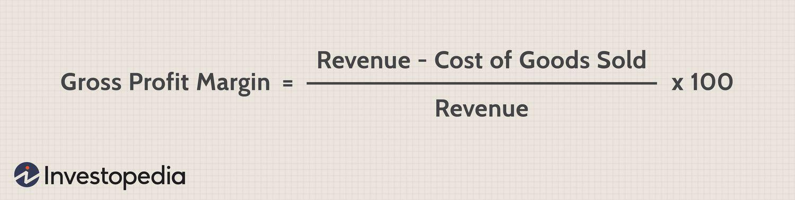

Cost accounting plays a pivotal role in financial analysis and decision-making by providing detailed insights into the costs associated with a company's operations. It allows businesses to evaluate their financial performance, streamline their operations, and make informed strategic decisions. One of the critical components of cost accounting is the analysis of direct costs, which are expenses that can be directly attributed to the production of goods or services. Understanding these costs is essential for determining a company's profitability margin.

The direct cost margin is a crucial metric for assessing a company's profitability. Calculating this margin involves subtracting direct costs from total revenues and expressing this result as a percentage of the total revenues. This percentage indicates how much of the revenue remains after covering the direct costs associated with production, offering a clear view of a company's operational efficiency.



Algorithmic trading is a method of executing orders using automated, pre-programmed trading instructions. It relies heavily on precise financial data processing to make accurate and timely trades. Within the context of algorithmic trading, understanding cost structures, such as the direct cost margin, can impact decision-making and ultimately the profitability of trading strategies.

The primary goal of this article is to explore the calculation of the direct cost margin through the lens of cost accounting, with a particular focus on its application in algorithmic trading. This exploration aims to highlight how precise cost calculations contribute to the development of effective algorithmic trading strategies and the overall improvement of profitability.

In summary, concepts such as direct cost, margin calculation, cost accounting, and algo trading are interconnected, and their combined application is vital for achieving financial success. This article will serve as a guide to understanding and implementing these concepts effectively, particularly in the rapidly evolving field of algorithmic trading.

## Table of Contents

## Understanding Direct Cost Margin

Direct costs are expenses directly attributed to the production of goods or services. These costs vary directly with the volume of output, making them essential for understanding production efficiency. Common examples include raw materials, labor, and manufacturing supplies. In contrast, indirect costs, such as rent, utilities, and administrative salaries, are not directly tied to production levels and remain relatively constant regardless of output volume.

The concept of 'margin' is crucial for evaluating a company's profitability. Margins represent the difference between sales and associated costs, providing insight into how much a company retains per dollar of revenue. Direct cost margin specifically focuses on the costs directly associated with producing goods or services. Calculating this margin helps assess the efficiency of production and informs pricing strategies.

The direct cost margin formula is expressed as:

$$
\text{Direct Cost Margin} = \left(\frac{\text{Revenue} - \text{Direct Costs}}{\text{Revenue}}\right) \times 100
$$

This formula yields a percentage that indicates the portion of revenue remaining after covering the direct costs. A higher percentage signifies a more efficient cost structure, enhancing profitability.

For example, consider a company with $500,000 in revenue and $300,000 in direct costs. The direct cost margin calculation would be:

$$
\text{Direct Cost Margin} = \left(\frac{500,000 - 300,000}{500,000}\right) \times 100 = 40\%
$$

This margin illustrates that 40% of the revenue remains after covering the direct costs, which can be allocated toward indirect costs, profit, or reinvestment into the business.

Understanding direct cost margin's impact on business decisions and resource allocation is essential. This metric aids in identifying cost-saving opportunities and optimizing resource utilization. By analyzing direct cost margins, businesses can make informed decisions on pricing strategies, resource allocation, and operational efficiency. For instance, a lower-than-expected direct cost margin might prompt a review of sourcing strategies to reduce raw material costs or enhance production processes to boost efficiency.

In summary, direct cost margin is a vital tool in financial analysis. Its calculation provides critical insights into a company's cost efficiency and profitability potential. By harnessing this information, businesses can refine their strategic objectives and enhance resource management, ultimately leading to improved financial performance.

## Role of Cost Accounting in Algorithmic Trading

Algorithmic trading, often referred to as algo trading, involves the use of computer programs to execute trades in financial markets at speeds and frequencies that are impossible for human traders. Algorithms analyze a vast array of market variables to make trading decisions based on predefined strategies. The efficiency and precision of these trades have led to an increased reliance on [algorithmic trading](/wiki/algorithmic-trading) in global markets, accounting for a substantial portion of trading [volume](/wiki/volume-trading-strategy) in major exchanges.

Cost accounting plays a pivotal role in enhancing the efficacy of algorithmic trading strategies by providing a thorough analysis of costs associated with trading. For algorithmic traders, understanding the cost implications of each trade is essential for optimizing trading models and improving profitability. Cost accounting, specifically through the lens of direct cost margin calculations, provides insights into the direct expenses that directly vary with trading volume, such as transaction fees and brokerage charges.

Accurate cost data is indispensable for making informed decisions during trade execution. For instance, by integrating sophisticated cost data, traders can fine-tune their algorithms to avoid periods of high transaction costs or adapt to fluctuating market conditions to maintain optimal profitability. Precise cost accounting allows for a detailed analysis of trading performance, enabling algorithmic traders to adjust their strategies in real-time based on cost efficiency.

The direct cost margin, a critical component of cost accounting, is calculated using the formula:

$$
\text{Direct Cost Margin} = \frac{\text{Sales Revenue} - \text{Direct Costs}}{\text{Sales Revenue}}
$$

In the context of algorithmic trading, calculating the direct cost margin provides traders with a clear picture of their profitability after accounting for direct costs. By assessing the direct cost margin, algorithmic traders can evaluate the effectiveness of their trading strategies and make necessary adjustments to enhance profitability. For instance, a higher direct cost margin indicates a more efficient trading strategy that maximizes returns relative to the incurred costs.

Furthermore, understanding the direct cost margin's impact on profitability analysis can lead to more strategic resource allocation, such as reallocating funds to trades with lower cost margins or optimizing algorithmic parameters to reduce costs. In an environment where milliseconds can define the success or failure of trades, cost accounting enables traders to balance speed with cost efficiency effectively.

As technology continues to evolve, integrating cost accounting metrics into algorithmic trading systems will likely gain further importance. By ensuring that algorithms are not just fast but also cost-effective, traders can achieve superior financial performance and maintain a competitive edge in increasingly complex financial markets.

## Steps to Calculate Direct Cost Margin in Cost Accounting

Calculating the direct cost margin in cost accounting involves several methodical steps that ensure the data's accuracy and reliability. This process allows businesses to leverage precise financial metrics to enhance decision-making, particularly in sectors like algorithmic trading where speed and precision are crucial.

### Gathering Necessary Data for Calculating Direct Costs

The initial step in determining the direct cost margin is to acquire comprehensive data related to direct costs. Direct costs are expenses that can be directly attributed to the production of specific goods or services, including raw materials, labor, and other direct expenses. To gather this data, the following steps are essential:

1. **Identify Direct Materials**: Assemble a list of all the raw materials that are directly consumed in the production of goods. This should include not only the cost of purchase but also any related freight charges and taxes.

2. **Gather Direct Labor Costs**: Calculate the wages, salaries, and benefits paid to workers directly involved in manufacturing or providing the service. It is crucial to segregate these costs from those associated with administrative or managerial roles.

3. **Include Other Direct Expenses**: Identify any other costs that can be directly tied to the production process. This could involve utilities for a manufacturing facility or depreciation of machinery used in production.

### Computing Direct Cost Margin

Once the necessary data is compiled, the direct cost margin can be calculated using the formula:

$$

\text{Direct Cost Margin} = \frac{\text{Sales Revenue} - \text{Direct Costs}}{\text{Sales Revenue}}
$$

This formula helps determine what portion of sales revenue is contributed to covering direct costs, thereby allowing businesses to assess their sales efficiency and product pricing structures. 

- **Calculate Total Sales Revenue**: Obtain the total revenue generated from the sale of goods or services over a specific period.

- **Subtract Total Direct Costs from Sales Revenue**: This will provide the remaining revenue after covering direct costs, which helps management understand the gross profit exclusively relating to production efficiency.

### Tools and Software for Calculation

Various tools and software applications can simplify these calculations:

- **Accounting Software**: Platforms like QuickBooks and SAP ERP can track expenses and revenues in real-time, allowing businesses to automate the direct cost margin calculation.

- **Spreadsheet Programs**: Software like Microsoft Excel or Google Sheets can be equipped with formulas and functions to compute direct cost margins manually. Template setups may include automated updates from financial feeds.

- **Data Analytics Tools**: More complex solutions like Tableau or Power BI can visualize and analyze direct cost data, making it easier to identify patterns and make data-driven decisions.

### Challenges and Solutions in Direct Cost Margin Calculations

While calculating the direct cost margin, businesses may face several challenges:

1. **Data Accuracy**: Inaccurate or incomplete data on direct costs can skew results. Regular audits and automated data entry systems help maintain data integrity.

2. **Changing Cost Structures**: Costs may fluctuate due to market changes or operational adjustments. Businesses should regularly update cost records and employ dynamic models to reflect current costs accurately.

3. **Allocation of Costs**: Misallocating costs, such as including indirect expenses as direct costs, can lead to incorrect margin calculations. Rigorous accounting practices and training on cost classification are essential in overcoming this.

By approaching the calculation of direct cost margins systematically and utilizing appropriate technological aids, businesses can achieve more accurate and actionable financial insights, thereby supporting better strategic decisions and improving financial performance.

## Integrating Direct Cost Margin Calculations in Algorithmic Trading Systems

Integrating direct cost margin calculations in algorithmic trading systems involves blending robust cost accounting methodologies with advanced technological algorithms, enhancing trading efficiency. This approach requires attention to best practices, practical applications, and future trends to capitalize on the full potential of algorithmic trading.

**Best Practices for Incorporating Cost Accounting Metrics**

To effectively integrate direct cost margin calculations, traders should focus on precise and timely data capture. High-frequency trading, for example, necessitates real-time processing of financial data, which improves decision-making and execution speeds. Utilizing accurate and detailed cost accounting metrics can significantly enhance the performance of these trading systems.

One fundamental practice is the regular updating and verification of cost inputs. Regularly audited data ensures that the margins calculated are reflective of the most current market conditions. Automating this process using [machine learning](/wiki/machine-learning) can minimize human error and increase the reliability of data inputs.

Additionally, incorporating condition-based triggers into algorithms can help maintain optimized strategies. For instance, traders can design algorithms that adjust their parameters based on the real-time calculation of direct cost margins, thereby allowing for responsive shifts in strategy to meet profit targets or cut losses.

**Examples of Using Direct Cost Margin Calculations**

Traders have adopted various strategies where direct cost margin calculations play a pivotal role. For instance, in [arbitrage](/wiki/arbitrage) trading, calculating the direct cost margin swiftly allows traders to determine the feasibility of exploiting price differentials between markets. By ensuring that direct costs, such as transaction fees, do not exceed potential profits, traders can make informed decisions quickly.

Consider the example of a simplified Python script where cost margin is calculated:

```python
def calculate_direct_cost_margin(selling_price, direct_costs):
    return (selling_price - direct_costs) / selling_price * 100

# Example usage
selling_price = 150.00
direct_costs = 120.00

margin = calculate_direct_cost_margin(selling_price, direct_costs)
print(f"Direct Cost Margin: {margin:.2f}%")
```

This straightforward calculation helps traders rapidly assess profit margins, thus refining their trading actions.

**Synergy Between Financial Analysis and Technology**

The integration of financial analysis into algorithmic trading systems fosters a synergy that drives enhanced trade outcomes. Technologies such as big data analytics and [artificial intelligence](/wiki/ai-artificial-intelligence) empower traders to process vast amounts of financial data efficiently. These technologies transform raw data into actionable insights, ensuring strategies remain adaptable to ever-changing market dynamics.

The algorithmic systems can also be integrated with blockchain technology to ensure transparency and security in the trading process, further elevating trust in the calculated margins.

**Future of Cost Accounting in Algorithmic Trading**

Looking ahead, the future of cost accounting in algorithmic trading points towards increasingly sophisticated models, driven by advancements in artificial intelligence and machine learning. These technologies will enable more intuitive cost estimation and dynamic margin calculations, allowing for finer control over trading strategies.

Emerging trends also suggest that cost accounting measures will become more predictive, utilizing past data to anticipate future cost fluctuations. This anticipatory approach can help traders preemptively adjust their strategies to maintain profitability even amidst unforeseen market changes.

As cost accounting and technology continue to converge, the precision in financial analysis will play a crucial role in setting the pace for innovative algorithmic trading solutions. Thus, staying abreast with these developments will be paramount for traders aiming to maintain a competitive edge.

## Conclusion

The direct cost margin is a critical metric in cost accounting and a pivotal component in assessing the profitability of businesses, especially in sectors like algorithmic trading where precision is vital. By isolating direct costs—expenses that can be directly attributed to the production of goods or services—from indirect costs, businesses can better understand their cost structures and make informed decisions to enhance profitability.

In algorithmic trading, the accuracy of financial calculations, such as the computation of direct cost margins, can significantly impact trade strategies and outcomes. Traders rely on precise data analytics to optimize their models, ensuring that cost considerations are integrated into trading decisions to improve overall performance.

Accurate financial calculations are fundamental to business success. They enable organizations to allocate resources efficiently, reduce unnecessary expenditures, and increase profitability. This principle holds true across various industries, where the correct interpretation of financial data fosters strategic planning and competitive advantage.

Readers are encouraged to apply these principles within their respective fields. Whether in financial markets, manufacturing, or service industries, understanding and leveraging direct cost margins can drive better decision-making and innovation. Exploring advanced financial analysis techniques, such as predictive analytics and machine learning, can further refine these applications and open new avenues for improving business practices.

For those interested in deepening their understanding of financial analysis, pursuing resources that cover cost accounting, financial modeling, and data analytics is a worthy endeavor. By enhancing their skills in these areas, professionals can contribute significantly to their organizations and position themselves at the forefront of their industries.

## References & Further Reading

[1]: Bergstra, J., Bardenet, R., Bengio, Y., & Kégl, B. (2011). ["Algorithms for Hyper-Parameter Optimization."](https://papers.nips.cc/paper/4443-algorithms-for-hyper-parameter-optimization) Advances in Neural Information Processing Systems 24.

[2]: ["Advances in Financial Machine Learning"](https://www.amazon.com/Advances-Financial-Machine-Learning-Marcos/dp/1119482089) by Marcos Lopez de Prado.

[3]: ["Evidence-Based Technical Analysis: Applying the Scientific Method and Statistical Inference to Trading Signals"](https://www.amazon.com/Evidence-Based-Technical-Analysis-Scientific-Statistical/dp/0470008741) by David Aronson.

[4]: ["Machine Learning for Algorithmic Trading: Predictive Models to Extract Signals from Market and Alternative Data for Systematic Trading Strategies with Python"](https://github.com/stefan-jansen/machine-learning-for-trading) by Stefan Jansen.

[5]: ["Quantitative Trading: How to Build Your Own Algorithmic Trading Business"](https://www.amazon.com/Quantitative-Trading-Build-Algorithmic-Business/dp/1119800064) by Ernest P. Chan.